# REPOMAP — AkatZumaTool
> 生成时间：2026-08-13  |  版本：增量更新 — 咖喱棒冷却音效与尺寸配置 / Excalibur cooldown audio and size config | Minecraft 1.20.1 Forge 47.2.16

## 项目概览
基于 Minecraft Forge 1.20.1 的自定义模组，实现电磁炮蓄力发射、自动追踪飞剑、环绕光束等玩法的同时，构建了一套完整的自定义渲染管线：包含 MRT（多渲染目标）FBO、GPU Compute Shader 粒子系统、多尺度 Ping-Pong 高斯 Bloom、无实体闪电队列及最终全屏合成。技术栈：Java 17 + LWJGL/OpenGL + GLSL + SpongePowered Mixin 0.8.5。

## 目录结构
```
src/main/java/com/z227/akatzumatool/
├── AkatZumaTool.java              # @Mod 主入口，注册物品和音效
├── common/                         # 工具类
│   ├── EntityUtil.java             # 实体白名单与移动锁定工具
│   ├── AutoTrackingTargetValidator.java # 自动追踪客户端/服务端目标校验
│   ├── ClientWhitelistCache.java   # 客户端实体伤害白名单缓存
│   ├── MathUtil.java               # 视图矩阵、客户端时间
│   ├── ModEnchantmentUtil.java     # 魔法弓自定义附魔书列表工具
│   ├── ParticleTemplate.java       # 粒子模板工具
│   ├── PlayerUtil.java             # 玩家饱食度扣除工具
│   ├── ServerSkillCooldowns.java   # 服务端技能冷却工具
│   ├── ServerKeyChargeTracker.java # 服务端按键蓄力计时与同步工具
│   ├── VertexUtil.java             # 顶点缓冲区写入
│   ├── GLBuffers/                  # 自管 VAO/VBO 与实例化 VBO 工具
│   │   ├── Loader.java
│   │   ├── RawModel.java
│   │   ├── VAOLayout.java
│   │   ├── VAOBindingHelper.java
│   │   ├── QuadVAOUtil.java
│   │   └── instancing/
│   │       ├── InstanceLayout.java
│   │       ├── InstanceVBO.java
│   │       └── InstanceDataWriter.java
│   └── render/
│       ├── BeamRender.java         # 光束 billboard 几何
│       └── TrailRibbonRenderer.java# 拖尾 ribbon 渲染器
├── config/
│   ├── ConfigFile.java             # Forge 注解配置
│   ├── ExExcaliburConfig.java      # EX 咖喱棒射程、分叉和伤害配置
│   ├── MagicBowConfig.java         # 魔法弓配置
│   └── TridentPlusConfig.java      # 天雷战戟配置
├── enchantment/
│   ├── StarJudgementEnchantment.java# 星辰裁决附魔
│   ├── AutoShootEnchantment.java    # 自动射击附魔
│   └── AutoTrackingEnchantment.java # 自动追踪附魔
├── effect/sparkling/                # 闪闪果实能力、同步与客户端视觉状态
│   ├── SparklingFruitEffect.java
│   ├── SparklingFruitFlightState.java # 临时飞行能力和服务端加速会话
│   ├── SparklingFruitFlightParticles.java # 金黄色 GPU 飞行拖尾
│   ├── SparklingFruitOutlineSync.java
│   └── client/
│       ├── SparklingFruitFlightClientState.java # 活动玩家和历史位置缓存
│       └── SparklingFruitFlightClientHandler.java # 飞行状态客户端应用入口
├── entity/                         # 实体定义
│   ├── FlySwordEntity.java         # 飞剑实体
│   ├── FlySwordEntityModel.java    # 飞剑 3D 模型
│   ├── FlySwordEntityRender.java   # 飞剑渲染器
│   ├── Vec3Util.java               # 贝塞尔曲线工具
│   ├── bow/                        # 魔法弓箭与同步粒子实体
│   │   ├── MagicArrowEntity.java
│   │   ├── MagicArrowRenderer.java
│   │   ├── MagicBowParticleEffects.java
│   │   ├── MagicBowParticleEffectEntity.java
│   │   └── MagicBowParticleEffectRenderer.java
│   ├── sword/                      # 飞剑剑气、次元斩与拔刀斩实体/空渲染器
│   │   ├── SwordAuraEntity.java
│   │   ├── SwordAuraVisualConfig.java
│   │   ├── SwordAuraRenderer.java
│   │   ├── BattoSlashEntity.java
│   │   ├── BattoSlashParticleEffects.java
│   │   ├── BattoSlashRenderer.java
│   │   ├── ExcaliburSwordWaveEntity.java
│   │   ├── ExcaliburSwordWaveEffects.java
│   │   ├── ExcaliburEndShockwaveEffects.java
│   │   └── ExcaliburSwordWaveRenderer.java
│   └── coin/                       # 硬币相关实体
│       ├── ChargeInfo.java         # 单个玩家蓄力快照
│       ├── CoinChargeTracker.java  # 蓄力状态管理器
│       ├── CoinBeamClientEffects.java# 客户端光束特效
│       ├── RailgunBeamEntity.java  # 电磁炮光束实体
│       ├── ColorfulCoinEntity.java # 彩色硬币强光束实体
│       ├── RailgunBeamEntityRender.java
│       └── ColorfulCoinEntityRender.java
├── event/                          # 事件处理器
│   ├── EntityTypeRegister.java     # 实体类型注册表
│   ├── EnchantmentRegister.java    # 自定义附魔注册表
│   ├── ForgeEvent.java             # Forge 事件（部分禁用）
│   ├── ForgeGameEvent.java         # 铁砧修复 + 白名单构建事件
│   ├── HeavenlyThunderChargeServerEvent.java # 天雷蓄力服务端清理与追踪补发
│   ├── SparklingFruitEventHandler.java # 闪闪果实服务端能力与飞行生命周期
│   ├── LootModifierRegister.java   # 全局战利品修饰器注册
│   ├── ModEvent.java               # 模组生命周期事件
│   ├── ModEventClient.java         # 客户端渲染器、额外模型与物品谓词注册
│   ├── PlayerJoinHandler.java      # 玩家登录时同步客户端白名单
│   ├── RenderLevelEvent.java       # 渲染调度入口
│   ├── VillagerTradeEvent.java     # 图书管理员附魔书交易
│   ├── client/
│   │   ├── AutoTrackingClientHandler.java # 自动追踪客户端锁定与屏幕空间描边提交
│   │   ├── ChargeLightningClientRegistry.java # 客户端蓄力视觉注册表
│   │   ├── ClientKeyChargeRegistry.java # 玩家按键蓄力同步视觉注册表
│   │   ├── DimensionSlashKeyHandler.java   # V/B 键注册
│   │   ├── DimensionSlashKeyInputHandler.java # V/B 输入、天雷蓄力与客户端冷却
│   │   ├── KeyChargeHandler.java       # 通用按键蓄力状态工具
│   │   ├── SparklingFruitClientHandler.java # Ctrl 飞行、Alt 瞬移与描边输入
│   │   └── SwordAuraClientEvent.java       # 左键命中实体时客户端剑气音效
│   └── render/
│       ├── RenderTypeEvent.java    # Core Shader 注册
│       └── TextureEvent.java       # 后处理初始化 + Atlas
├── item/                           # 物品定义
│   ├── AkatZumaCreativeTab.java    # 创造模式标签页
│   ├── FlySwordItem.java           # 飞剑物品
│   ├── FlySwordPlusItem.java       # 真·飞剑物品
│   ├── CoinItem.java               # 电磁炮硬币
│   ├── ColorfulCoinItem.java       # 彩色硬币
│   ├── MagicBowItem.java           # 魔法弓
│   ├── TridentPlusItem.java        # 天雷战戟物品与蓄力姿态
│   ├── TridentPlusItemRenderer.java# 天雷战戟 BEWLR 与第一人称蓄力变换
│   ├── BeamCrossTestItem.java      # 环绕光束测试物品
│   ├── FlySwordBakedModel.java     # 飞剑双重模型
│   ├── FlySwordHeldItemRenderer.java # 手持飞剑后处理提交渲染器
│   └── testitem/
│       └── testitem.java           # 测试物品，右键方块生成视觉预览
├── linkMod/
│   └── touhouLittleMaid/           # 女仆模组联动
│       ├── TouhouLittleMaid.java   # @LittleMaidExtension 扩展入口
│       └── task/
│           └── MaidRangedAttackTask.java # 女仆远程武器攻击任务
├── mixin/                          # Mixin 注入
│   ├── MagicBowMovementMixin.java   # 魔法弓移动恢复与按键蓄力减速
│   ├── SparklingFruitPlayerModelMixin.java # 闪闪果实满速横飞四肢定格
│   └── WindowResizeMixin.java      # 窗口大小变化重建 FBO
├── network/
│   ├── NetworkRegister.java        # 网络通道与消息注册
│   ├── AutoTrackingShootC2SPacket.java # 自动追踪射击请求 C2S
│   ├── DimensionSlashCastC2SPacket.java # 次元斩 C2S 请求
│   ├── HeavenlyThunderCastC2SPacket.java # 天雷满蓄力释放 C2S
│   ├── HeavenlyThunderCastResultS2CPacket.java # 天雷释放结果与冷却同步 S2C
│   ├── HeavenlyThunderChargeStartC2SPacket.java # 天雷开始蓄力 C2S
│   ├── HeavenlyThunderChargeStopC2SPacket.java # 天雷停止蓄力 C2S
│   ├── HeavenlyThunderChargeSyncS2CPacket.java # 天雷蓄力动作同步 S2C
│   ├── SparklingFlightInputC2SPacket.java # 闪闪果实加速开关 C2S
│   ├── SparklingFlightStateS2CPacket.java # 闪闪果实加速状态 S2C
│   ├── SummonFlySwordC2SPacket.java # B 键召唤飞剑 C2S 请求
│   ├── SwordAuraCastC2SPacket.java # 飞剑空挥剑气 C2S 请求
│   └── WhitelistSyncS2CPacket.java # 服务端白名单同步 S2C
├── loot/
│   └── AddMagicBowEnchantedBookModifier.java # 钓鱼宝藏追加魔法弓附魔书
└── render/                         # 渲染系统
    ├── bloom/
    │   ├── BloomDownsampleShader.java # Bloom source 预过滤/回叠重采样 Shader
    │   ├── BloomRender.java        # 1/2 近景 + 1/4 远景多尺度 Bloom
    │   └── BloomShader.java        # Bloom 单向模糊与范围 Shader
    ├── finalRender/
    │   ├── PostProcessing.java     # 后处理总入口
    │   ├── ScreenDarkeningEffect.java # 通用场景暗化 pass
    │   ├── FinalRender.java        # 最终渲染调度器
    │   ├── FrameBufferUtil.java    # FBO 拷贝工具
    │   ├── bloomQueue/
    │   │   ├── RailgunBeamQueue.java
    │   │   ├── ColorfulCoinQueue.java
    │   │   ├── StarJudgementCircleQueue.java
    │   │   ├── SwordAuraQueue.java
    │   │   ├── SwordAuraInstancedRenderer.java
    │   │   ├── SwordAuraObjModel.java
    │   │   ├── CoinLightningQueue.java  # 无实体闪电队列
    │   │   ├── ShockwaveQueue.java      # 独立新冲击波队列
    │   │   ├── CircleShockwaveQueue.java# 法阵冲击波队列
    │   │   ├── FlySwordHeldModelState.java # 手持飞剑模型状态
    │   │   ├── FlySwordHeldModelQueue.java # 手持飞剑透明模型重放队列
    │   │   ├── GoldenSpiralEffectQueue.java # 金色三噪声螺旋光效队列
    │   │   └── SmokeParticleQueue.java     # 无实体实例化烟雾粒子队列
    │   ├── task/                           # 无实体后处理任务与队列适配器
    │   ├── outline/
    │   │   ├── ScreenOutlineQueue.java  # 屏幕空间描边任务队列与 CA2 mask 写入
    │   │   ├── ScreenOutlineCapturedBatch.java # 按 RenderType mode 保存捕获顶点批次
    │   │   ├── ScreenOutlineRender.java # CA2 mask 全屏扩边并写 CA0/CA1
    │   │   ├── ScreenOutlineShader.java # screen_outline post shader 管理
    │   │   ├── ScreenOutlineStyle.java  # 普通/火焰描边样式默认值
    │   │   ├── ScreenOutlineTask.java   # 本帧描边任务
    │   │   └── ScreenOutlineMaskWriter.java # 无实体 mask 写入接口
    │   └── queue/
    │       ├── EntityQueue.java    # 渲染队列基类
    │       └── FlySwordQueue.java  # 飞剑拖尾队列
    ├── frameBuffer/
    │   ├── FBO.java                # OpenGL FBO 封装（支持MRT）
    │   ├── FBORender.java          # (空壳)
    │   ├── GlStateSnapshot.java    # GL 状态快照
    │   ├── ShaderProgram.java      # Shader 基类（ResourceLocation）
    │   └── fbos/
    │       └── MainFBORender.java  # 主 FBO 渲染器
    ├── gpu/
    │   ├── GPUParticle.java        # GPU 粒子数据结构
    │   ├── GPUParticleSystem.java  # GPU 粒子系统（SSBO+Compute）
    │   ├── GPUShader.java          # GPU Shader 管理
    │   ├── GPUParticleRenderShader.java # GPU 粒子渲染 Shader 管理
    │   ├── ParticleEmitTask.java   # CPU 侧发射任务 Builder
    │   ├── ParticleSystem.java     # 粒子系统管理层
    │   ├── ShaderProgram.java      # Shader 基类（文件路径）
    │   └── material/               # GPU 粒子材质与渲染批次定义
    │       ├── ParticleMaterial.java
    │       ├── ParticleMaterialKey.java
    │       ├── ParticleMaterialRegistry.java
    │       └── ParticleRenderPipeline.java
    ├── renderType/
    │   ├── CoinRenderType/
    │   │   ├── CoinBeamRenderType.java
    │   │   ├── CoinBeamShader.java
    │   │   ├── CoinLightningRenderType.java
    │   │   ├── CoinLightningShader.java
    │   │   └── CoinLightningVertexFormat.java
    │   ├── ShockwaveType/
    │   │   ├── ShockwaveRenderType.java
    │   │   └── ShockwaveShader.java
    │   ├── CircleShockwaveType/
    │   │   ├── CircleShockwaveRenderType.java
    │   │   └── CircleShockwaveShader.java
    │   ├── TrailRibbonType/
    │   │   ├── TrailRibbonRenderType.java
    │   │   └── TrailRibbonShader.java
    │   ├── StarJudgementCircleType/
    │   │   ├── StarJudgementCircleRenderType.java
    │   │   └── StarJudgementCircleShader.java
    │   ├── SwordAuraType/
    │   │   └── SwordAuraShader.java
    │   ├── FlySwordType/
    │   │   ├── FlySwordHeldShader.java
    │   │   └── FlySwordHeldRenderType.java
    │   ├── GoldenSpiralType/
    │   │   ├── GoldenSpiralShader.java
    │   │   └── GoldenSpiralRenderType.java
    │   ├── ScreenOutlineType/
    │   │   ├── OutlineMaskRenderType.java
    │   │   ├── OutlineCapturedMaskRenderType.java
    │   │   ├── OutlineMaskShader.java
    │   │   └── OutlineCapturedMaskShader.java
    │   └── test/
    │       └── RibbonTrailLayerPlayer.java
    ├── shader/post/
    │   ├── FinalShader.java        # 最终合成 Shader
    │   └── ScreenDarkeningShader.java # 场景暗化 Shader
    └── texture/
        ├── AkatZumaTextureAtlas.java
        └── AtlasReloadListener.java
```

## 模块索引

---

### 主入口

#### `AkatZumaTool.java`
**职责**：@Mod 注解主入口，注册所有物品/音效/实体/配置，持有全局后处理实例 POST 和异步线程池 AkatPool；包含飞剑、咖喱棒蓄力增强、发射、终点爆闪和冲击波等音效注册。

| 符号 | 类型 | 签名 | 重要性 |
|------|------|------|--------|
| `AkatZumaTool` | class | `@Mod("akatzumatool")` | ⭐ 高 |
| `MODID` | const | `"akatzumatool"` | ⭐ 高 |
| `ITEMS` | field | `DeferredRegister<Item>` | ⭐ 高 |
| `SOUNDS` | field | `DeferredRegister<SoundEvent>` | ⭐ 高 |
| `FLY_SWORD` | field | `RegistryObject<Item>` (FlySwordItem, 钻石剑+4伤害, 耐火) | 普通 |
| `FLY_SWORD_PLUS` | field | `RegistryObject<Item>` (FlySwordPlusItem, 钻石剑+6伤害, 耐火, RARE) | ⭐ 高 |
| `COIN_ITEM` | field | `RegistryObject<Item>` (CoinItem, 无耐久消耗型) | 普通 |
| `COLORFUL_COIN` | field | `RegistryObject<Item>` (ColorfulCoinItem, 耐久256, RARE) | 普通 |
| `BEAM_CROSS_TEST_ITEM` | field | `RegistryObject<Item>` (BeamCrossTestItem, EPIC) | 普通 |
| `COIN_CHARGE_COMPLETE` | field | `RegistryObject<SoundEvent>` | 普通 |
| `STAR_JUDGEMENT_SUMMON` | field | `RegistryObject<SoundEvent>` — 星辰裁决法阵展开音效 | 普通 |
| `DIMENSION_SLASH` | field | `RegistryObject<SoundEvent>` — 次元斩连续斩击音效 `slash` | 普通 |
| `DIMENSION_SLASH_END` | field | `RegistryObject<SoundEvent>` — 次元斩终结音效 `slash_end` | 普通 |
| `SWORD_AURA` | field | `RegistryObject<SoundEvent>` — 飞剑剑气音效 `sword_aura` | ⭐ 高 |
| `BATTO_SLASH` | field | `RegistryObject<SoundEvent>` — 拔刀斩客户端释放音效 `batto_skash` | 普通 |
| `CHARGING_1` / `EX_BOOM_1` / `EX` / `CALIBUR` | field | `RegistryObject<SoundEvent>` — 咖喱棒终点星星爆闪、二段冲击波、蓄力增强和发射剑气音效 | 普通 |
| `POST` | field | `PostProcessing` — 后处理总入口 | ⭐ 高 |
| `AkatPool` | field | `ExecutorService` (CachedThreadPool) — 异步线程池 | 普通 |
| `submitAkatTask(Runnable)` | method | `void` — 提交异步任务 | 普通 |

**被以下引用**：几乎所有模块（通过 `AkatZumaTool.POST` / `AkatZumaTool.AkatPool` / 物品与附魔注册对象）

---

### common — 工具类

#### `common/MathUtil.java`
**职责**：从 Minecraft Camera 构造视图矩阵，计算客户端运行秒数（shader 与 CPU 同步使用）。

| 符号 | 类型 | 签名 | 重要性 |
|------|------|------|--------|
| `createViewMatrix(Camera)` | method | `Matrix4f` — 先旋转 X/Y，再平移 -cameraPos | ⭐ 高 |
| `getClientTime(float partialTick)` | method | `float` — 客户端运行秒数 | ⭐ 高 |

**被以下引用**：`PostProcessing`, `CoinLightningQueue`, `GPUParticleSystem`

#### `common/VertexUtil.java`
**职责**：顶点缓冲区写入辅助，支持矩阵变换/颜色/UV2 多种重载。

| 符号 | 类型 | 签名 | 重要性 |
|------|------|------|--------|
| `putVertexUV2(ByteBuffer, Matrix4f, Vec3, float, float)` | method | `void` — 带 UV2 的顶点 | 普通 |
| `putVertex(VertexConsumer, ...)` | method | `void` — 带颜色的顶点（两种重载） | 普通 |

#### `common/ParticleTemplate.java`
**职责**：通用 GPU 粒子模板工具，提供三角形全连接、渐进线和 GPU 径向批量地面扩散模板，供魔法弓流星落点、箭落地、星辰裁决光束扩散和最终爆炸复用。

| 符号 | 类型 | 签名 | 重要性 |
|------|------|------|--------|
| `emitTriangleFullConnect(Vec3, float, int, int, float, float, float, float, float, RandomSource)` | method | `void` — 双向连接三角形三个顶点 | ⭐ 高 |
| `emitGroundDiffusion(Vec3, float, int, float, float, int, int, RandomSource)` | method | `void` — 每层圆环只提交一个 GPU 径向扩散任务，批量生成向外炸开的地面扩散粒子 | ⭐ 高 |
| `emitProgressiveLineIncremental(...)` | method | `void` — 渐进线增量发射器，保留给其他效果使用 | 普通 |

#### `common/PlayerUtil.java`
**职责**：玩家相关通用工具；当前负责在运行时安全扣除饱食度，供真·飞剑次元斩复用。

| 符号 | 类型 | 签名 | 重要性 |
|------|------|------|--------|
| `deductFood(Entity, int)` | method | `void` — 若实体为玩家则按数值扣除饱食度 | ⭐ 高 |
| `deductFoodByMaxRatio(Entity, float)` | method | `void` — 若实体为玩家则按最大饱食度比例扣除 | 普通 |

**被以下引用**：`FlySwordItem`

#### `common/ServerSkillCooldowns.java`
**职责**：服务端技能防刷冷却工具，按技能 key 和玩家 UUID 保存冷却结束时间，不使用原版物品冷却，供拔刀斩、召唤飞剑、次元斩、天雷和咖喱棒 C2S 包复用，并支持断线/关服清理静态冷却。

| 符号 | 类型 | 签名 | 重要性 |
|------|------|------|--------|
| `BATTO_SLASH` / `SUMMON_FLY_SWORD` / `DIMENSION_SLASH` / `HEAVENLY_THUNDER` / `EXCALIBUR` | const | `String` — 技能服务端冷却 key | ⭐ 高 |
| `COOLDOWNS` | field | `Map<String, Map<UUID, Long>>` — 服务端技能冷却表 | ⭐ 高 |
| `isCoolingDown(ServerPlayer, String)` | method | `boolean` — 判断指定技能是否仍在服务端冷却中 | ⭐ 高 |
| `getRemainingTicks(ServerPlayer, String)` | method | `int` — 读取剩余服务端冷却 tick | 普通 |
| `setCooldown(ServerPlayer, String, int)` | method | `void` — 写入服务端冷却结束时间 | ⭐ 高 |
| `clearPlayer(ServerPlayer)` / `clearAll()` | method | `void` — 清理指定玩家或全部服务端冷却 | 普通 |
| `tryStartCooldown(ServerPlayer, String, int)` | method | `boolean` — 无冷却时写入冷却并返回 true | 普通 |
| `serverCooldownTicks(int)` | method | `int` — 客户端冷却减 20 tick 得到服务端冷却 | ⭐ 高 |

**被以下引用**：`BattoSlashCastC2SPacket`, `SummonFlySwordC2SPacket`, `DimensionSlashCastC2SPacket`, `HeavenlyThunderCastC2SPacket`, `ServerExcaliburChargeTracker`, `HeavenlyThunderChargeServerEvent`

#### `common/render/BeamRender.java`
**职责**：光束 billboard 几何生成器，计算面向相机的双面四边形，支持展开/淡出动画及核心+外圈双层结构。

| 符号 | 类型 | 签名 | 重要性 |
|------|------|------|--------|
| `BeamStyle` | inner class | 光束样式参数（宽度、透明度、bloom强度、三环色） | ⭐ 高 |
| `NORMAL` | const | `BeamStyle` — 蓝白光束 (核心0.96/0.98/1.0, 宽0.32) | 普通 |
| `COLORFUL` | const | `BeamStyle` — 黄红强光束 (核心1.0/0.92/0.35, 宽1.22) | 普通 |
| `STAR_JUDGEMENT` | const | `BeamStyle` — 星辰裁决蓝白冲天光束 | 普通 |
| `STAR_JUDGEMENT_FINAL` | const | `BeamStyle` — 星辰裁决最终落下的紫蓝粗光束 | 普通 |
| `writeBeam(VertexConsumer, RailgunBeamEntity/ColorfulCoinEntity, Camera, float, BeamStyle)` | method | `void` | ⭐ 高 |
| `writeBeamSegment(VertexConsumer, Vec3, Vec3, int, int, Camera, float, BeamStyle)` | method | `void` — 非光束实体复用任意线段 billboard 光束 | ⭐ 高 |
| `writeBeamData(...)` | method | `void` — 核心几何生成（展开/淡出 + 双层四边形） | 普通 |
|
ormalFrom(Vec3, Vec3)` | method | `Vec3` — 稳定法线计算 | 普通 |

**对外依赖**：`MathUtil`, `RenderState` (内部类)
**被以下引用**：`RailgunBeamQueue`, `ColorfulCoinQueue`, `StarJudgementCircleQueue`

#### `common/render/TrailRibbonRenderer.java`
**职责**：飞剑拖尾 ribbon 渲染器，将位置点序列膨胀为面向相机的带状网格。

| 符号 | 类型 | 签名 | 重要性 |
|------|------|------|--------|
| `HALF_WIDTH` | const | `0.15f` | 普通 |
| `render(List<Vec3>, VertexConsumer, Matrix4f, Vec3, Vec3)` | method | `void` — 遍历相邻点对生成四边形 | ⭐ 高 |
| `RibbonPoint` | record | `(Vec3 left, Vec3 right, float t)` | 普通 |

**被以下引用**：`FlySwordEntityRender`

#### `common/GLBuffers/VAOLayout.java`
**职责**：描述静态 VAO 顶点属性和可选 EBO 索引数据，供 `Loader.loadToVAO(...)` 创建自管 VAO。

#### `common/GLBuffers/Loader.java`
**职责**：创建并清理自管 VAO/VBO/EBO，提供通用 `VAOLayout` 驱动加载和旧实例化辅助接口。

#### `common/GLBuffers/RawModel.java`
**职责**：简单 VAO 数据容器，保存 `vaoID` 和 `vertexCount`。

#### `common/GLBuffers/instancing/InstanceLayout.java`
**职责**：描述每条实例数据的 float 跨度、attribute location、size 和 offset，并做基础边界校验。

| 符号 | 类型 | 签名 | 重要性 |
|------|------|------|--------|
| `InstanceLayout` | class | `create(int).attr(int, int, int)` | ⭐ 高 |
| `AttrEntry` | inner class | `location/size/offset` | 普通 |

#### `common/GLBuffers/instancing/InstanceVBO.java`
**职责**：管理实例 VBO 的创建、attribute 绑定、每帧数据上传、启用/禁用和清理，当前被剑气实例化渲染复用。

| 符号 | 类型 | 签名 | 重要性 |
|------|------|------|--------|
| `InstanceVBO` | class | `InstanceVBO(InstanceLayout, int)` | ⭐ 高 |
| `attachTo(int)` | method | `void` — 将实例 attribute 绑定到目标 VAO | ⭐ 高 |
| `update(FloatBuffer, int)` / `update(float[], int)` | method | `void` — 上传本帧有效实例数据 | ⭐ 高 |
| `enable(int...)` / `disable(int...)` | method | `void` — 控制基础 attribute 和实例 attribute | 普通 |

#### `common/GLBuffers/instancing/InstanceDataWriter.java`
**职责**：通用实例数据写入辅助，提供 `mat4`、`vec3`、`vec4` 和单 float 写入方法。

---

### config — 配置系统

#### `config/ConfigFile.java`
**职责**：Forge 注解式配置，自动生成 `config/Akatzumatool/akatzumatool.toml`，集中管理飞剑、硬币、闪闪果实、魔法弓和实体伤害白名单配置。

| 符号 | 类型 | 签名 | 重要性 |
|------|------|------|--------|
| `canBreakBlock()` | method | `boolean` (默认 true) — 彩色硬币是否破坏方块 | ⭐ 高 |
| `damagePlayers()` | method | `boolean` (默认 false) — 硬币光束是否伤玩家 | ⭐ 高 |
| `flySwordAttackDamage()` / `flySwordSearchRange()` | method | 飞剑伤害和索敌范围配置 | ⭐ 高 |
| `flySwordAuraDamage()` / `flySwordAuraSpeed()` / `flySwordAuraLifeTicks()` / `flySwordAuraHitRadius()` | method | 飞剑剑气伤害、速度、生命周期和命中半径配置 | ⭐ 高 |
| `flySwordDimensionSlashCooldown()` / `flySwordDimensionSlashSmallDamage()` / `flySwordDimensionSlashFinalDamage()` | method | 次元斩客户端冷却、小伤害、终结伤害配置 | ⭐ 高 |
| `flySwordBattoSlashDamage()` / `flySwordBattoSlashRadius()` / `flySwordBattoSlashChargeTicks()` | method | 拔刀斩伤害、范围和蓄力 tick 配置 | ⭐ 高 |
| `coinBeamDamage()` / `coinMaxRange()` | method | 普通硬币伤害和射程配置 | ⭐ 高 |
| `colorfulCoinBeamDamage()` / `colorfulCoinMaxRange()` | method | 彩色硬币伤害和射程配置 | ⭐ 高 |
| `colorfulCoinFullChargeTime()` | method | 彩色硬币基础蓄力时间 | ⭐ 高 |
| `colorfulCoinQuickChargeEnabled()` / `colorfulCoinQuickChargeReduction()` | method | 快速装填蓄力缩减配置 | ⭐ 高 |
| `sparklingFruitFlightBoostMaxSpeed()` / `sparklingFruitFlightBoostAccelerationTicks()` | method | 闪闪果实 Ctrl 飞行最大速度和加速时间配置 | ⭐ 高 |
| `entityDamageWhitelist()` / `entityDamageWhitelistMap()` | method | 实体伤害白名单配置与缓存 | ⭐ 高 |

**被以下引用**：`FlySwordEntity`, `SwordAuraEntity`, `CoinItem`, `ColorfulCoinItem`, `MagicArrowEntity`, `MagicBowParticleEffectEntity`, `RailgunBeamEntity`, `ColorfulCoinEntity`, `ForgeGameEvent`, `EntityUtil`

#### `config/MagicBowConfig.java`
**职责**：注册并读取魔法弓玩法配置，包括蓄力、箭物理、配置化箭本体伤害、落地清理、强蓄力、星辰裁决最终伤害、轰炸期每 tick 范围伤害、箭落地扩散伤害和历史流星周期伤害兼容配置；粒子视觉参数改由魔法弓相关类静态字段保存。

| 符号 | 类型 | 签名 | 重要性 |
|------|------|------|--------|
| `MagicBowConfig` | class | static config accessors | ⭐ 高 |
| `register(ForgeConfigSpec.Builder)` | method | `void` — 注册 `setting.magicBow` 配置段 | ⭐ 高 |
| `groundedDiscardTicks()` | method | `int` — 魔法箭落地后自动移除等待 tick 数 | 普通 |
|
ormalArrowDamage()` / `strongArrowDamage()` / `superArrowDamage()` / `arrowDamage(int)` | method | `double` — 普通、强蓄力、星辰裁决箭本体基础伤害配置，发射时再叠加附魔加成 | ⭐ 高 |
| `strongSnareDurationTicks()` / `superSnareDurationTicks()` | method | `int` — 强蓄力/星辰裁决束缚时长 | ⭐ 高 |
| `superFinalStrikeDelayTicks()` / `superFinalStrikeDamage()` / `superFinalStrikeRadius()` | method | 星辰裁决最终粗光束范围伤害参数，默认 155 tick 延迟、200 伤害和 8 半径；轰炸期范围伤害共用半径，不影响法阵和轰炸渲染半径 | ⭐ 高 |
| `superBombardmentTickDamage()` | method | `float` — 星辰裁决轰炸期对缓存怪物每 tick 造成的伤害，默认 5.0 | ⭐ 高 |
| `meteorStrikeIntervalTicks()` / `meteorStrikeDamage()` | method | 历史流星周期伤害参数，强蓄力流星关闭后暂作兼容保留 | 普通 |
| `arrowLandingSplashDamage()` / `arrowLandingSplashRadius()` | method | 魔法箭落地扩散怪物伤害参数 | 普通 |

---

### enchantment — 附魔系统

#### `enchantment/StarJudgementEnchantment.java`
**职责**：星辰裁决附魔定义，仅允许魔法弓获得星辰裁决触发资格。

| 符号 | 类型 | 签名 | 重要性 |
|------|------|------|--------|
| `StarJudgementEnchantment` | class | `extends Enchantment` | ⭐ 高 |
| `getMaxLevel()` | method | `int = 1` | 普通 |
| `canEnchant(ItemStack)` | method | `boolean` — 仅允许 `AkatZumaTool.MAGIC_BOW` | ⭐ 高 |

#### `enchantment/AutoShootEnchantment.java`
**职责**：自动射击附魔定义，仅允许魔法弓获得满蓄自动射击和连续蓄力能力。

| 符号 | 类型 | 签名 | 重要性 |
|------|------|------|--------|
| `AutoShootEnchantment` | class | `extends Enchantment` | ⭐ 高 |
| `getMaxLevel()` | method | `int = 1` | 普通 |
| `canEnchant(ItemStack)` | method | `boolean` — 仅允许 `AkatZumaTool.MAGIC_BOW` | ⭐ 高 |

#### `common/EntityUtil.java`
**职责**：实体伤害白名单工具类，根据 `ForgeRegistries.ENTITY_TYPES` 的注册名判断实体是否允许被光束伤害。

| 符号 | 类型 | 签名 | 重要性 |
|------|------|------|--------|
| `isInDamageWhitelist(EntityType<?>)` | method | `boolean` — 白名单为空时允许全部，否则按实体类型 ID 判断 | ⭐ 高 |

---

### entity — 实体系统

#### `entity/FlySwordEntity.java`
**职责**：自动追踪飞行的剑实体（继承 Mob），实现 FOLLOW→MOVING→WAIT→BACK 五状态机，支持多剑布阵排列。

| 符号 | 类型 | 签名 | 重要性 |
|------|------|------|--------|
| `FlySwordEntity` | class | `extends Mob` | ⭐ 高 |
| `MoveState` | enum | `FOLLOW(0), LIFTOFF(1), MOVING(2), ATTACK(3), WAIT(4), BACK(5)` | ⭐ 高 |
| `master` / `masterUUID` | field | `Entity` / `UUID` — 召唤者 | 普通 |
| `ID` | field | `int` — 第几把剑，决定排列位置 | 普通 |
| `prePosList` | field | `LinkedList<Vec3>` — 客户端位置历史（最多6帧） | 普通 |
| `attackDamage` | field | `int = 2` — 每次伤害 | 普通 |
| `searchRange` | field | `int = 16` — 搜索范围 | 普通 |
| `tick()` | method | `void` — 客户端记录位置，服务端执行状态机 | ⭐ 高 |
| `findTarget()` | method | `void` — 搜索怪物并进入 MOVING | 普通 |
| `moveToEntity()` | method | `void` — 移至目标并造成伤害 | 普通 |
| `waitState()` | method | `void` — 重新搜索/返回 | 普通 |
| `backToPlayer()` | method | `void` — 回归跟随 | 普通 |
| `calcSpawnPos(Vec3, Vec3)` | method | `Vec3` — 多剑布阵位置计算 | 普通 |

**对外依赖**：`AkatZumaTool`
**被以下引用**：`FlySwordEntityRender`, `FlySwordModel`, `FlySwordItem`

#### `entity/FlySwordEntityModel.java`
**职责**：飞剑 3D Blockbench 模型定义（32x32 纹理，含 blade/grip/decorate 三部分共 31 个 cube）。

| 符号 | 类型 | 签名 | 重要性 |
|------|------|------|--------|
| `FlySword_Model` | const | `ModelLayerLocation` | 普通 |
| `createBodyLayer()` | method | `MeshDefinition` — 完整 3D 几何体定义 | ⭐ 高 |

#### `entity/FlySwordEntityRender.java`
**职责**：飞剑实体渲染器，渲染 3D 模型（非 FOLLOW 状态旋转 90°），移动状态下直接提交 `POST.add` 飞剑拖尾任务并调用 TrailRibbonRenderer 绘制拖尾。

| 符号 | 类型 | 签名 | 重要性 |
|------|------|------|--------|
| `render(FlySwordEntity, float, float, PoseStack, MultiBufferSource, int)` | method | `void` — 移动状态下提交飞剑拖尾任务并渲染飞剑本体 | ⭐ 高 |
| `renderTrail(FlySwordEntity, PoseStack, MultiBufferSource, float, int)` | method (static) | `void` — 拖尾渲染 | ⭐ 高 |

**对外依赖**：`TrailRibbonRenderer`, `AkatZumaTextureAtlas`

#### `entity/Vec3Util.java`
**职责**：二次贝塞尔曲线计算工具。

| 符号 | 类型 | 签名 | 重要性 |
|------|------|------|--------|
| `calculateBezierCurve(Vec3, Vec3, Vec3)` | method | `List<Vec3>` — 0.05步长20个点 | 普通 |

---

### entity.bow — 魔法弓实体系统

#### `entity/bow/MagicArrowEntity.java`
**职责**：魔法弓射出的箭实体，缓存配置化速度/重力补偿/落地清理时间，使用静态拖尾间隔在客户端沿飞行段补点生成本地 GPU 拖尾，命中方块时客户端本地播放扩散并由服务端直接结算落地范围伤害，命中实体时同步箭飞行方向给粒子效果实体，并让星辰裁决束缚至少覆盖法阵结束。

| 符号 | 类型 | 签名 | 重要性 |
|------|------|------|--------|
| `MagicArrowEntity` | class | `extends Arrow` | ⭐ 高 |
| `TRAIL_INTERVAL_TICKS` | const | `int = 1` — 魔法箭客户端拖尾刷新间隔 | 普通 |
| `CHARGE_TYPE` | synced field | `int` — 普通/强蓄力/星辰裁决类型 | ⭐ 高 |
| `tick()` | method | `void` — 低下坠补偿 + 落地后按配置自动清理 + 客户端按静态间隔补点生成箭拖尾粒子 | ⭐ 高 |
| `tickGroundedDiscard()` | method | `void` — 魔法箭落地后独立计时并按 `groundedDiscardTicks` 移除 | 普通 |
| `onHitEntity(EntityHitResult)` / `onHitBlock(BlockHitResult)` | method | `void` — 实体命中触发控制器；方块命中不再创建效果实体，客户端本地扩散、服务端直接结算落地伤害 | ⭐ 高 |
| `spawnArrowLandingDiffusion(Vec3, Vec3)` / `applyArrowLandingSplashDamage(Vec3)` / `canDamageLandingSplash(Entity)` | method | `void/boolean` — 箭落地方块后的客户端扩散、服务端一次范围伤害和怪物过滤 | ⭐ 高 |
| `spawnTrailEffects(Vec3, Vec3)` | method | `void` — 客户端沿箭飞行线段补点并调用统一拖尾 helper 生成连续 GPU 粒子 | 普通 |
| `ensureTrailColors()` | method | `void` — 每支箭只随机一次拖尾渐变色并缓存 | 普通 |
| `createTrailRandom(int)` | method | `RandomSource` — 按箭 UUID、实体 id、tick 和补点序号生成稳定随机源 | 普通 |

#### `entity/bow/MagicBowParticleEffects.java`
**职责**：魔法弓客户端粒子 helper，统一拖尾渐变色表、方向扰动和旧版拖尾 GPU 粒子发射参数。

| 符号 | 类型 | 签名 | 重要性 |
|------|------|------|--------|
| `MagicBowParticleEffects` | class | `final class` | ⭐ 高 |
| `GRADIENT_COLOR_MAP` / `DEFAULT_GRADIENT_COLORS` | field | `HashMap<Integer, int[]>` / `int[]` — 魔法弓粒子共用渐变色表与兜底色 | ⭐ 高 |
| `randomGradientColors(RandomSource)` | method | `int[]` — 从渐变色表随机取一组开始色和结束色 | ⭐ 高 |
| `jitterTrailDirection(Vec3, RandomSource)` | method | `Vec3` — 给拖尾基础方向加入轻微扰动 | 普通 |
| `spawnTrail(Vec3, Vec3, int, RandomSource, int[])` | method | `void` — 使用旧版拖尾参数提交 GPU 粒子任务 | ⭐ 高 |

#### `entity/bow/MagicBowParticleEffectEntity.java`
**职责**：魔法弓短生命周期同步粒子实体，强蓄力只保留束缚和命中时地面三角形，三角形寿命按束缚时长加长一倍；星辰裁决作为轰炸控制器，客户端用虚拟流星头复用箭拖尾生成多角度斜向流星，法阵和轰炸渲染使用固定视觉半径，流星起点压在法阵高度内并固定在天空法阵内圆环上，较小下落角度让落点更靠近中心，统一调用 ParticleTemplate 扩散模板，星辰裁决负责开场/落下光束路径随机扩散、一次生成且寿命翻倍的地面交叉三角形、轰炸期每 tick 范围伤害、最终粗光束粒子和配置范围伤害。

| 符号 | 类型 | 签名 | 重要性 |
|------|------|------|--------|
| `MagicBowParticleEffectEntity` | class | `extends Entity` | ⭐ 高 |
| `STAR_JUDGEMENT_VISUAL_RENDER_DISTANCE` / `STAR_JUDGEMENT_FIXED_VISUAL_RADIUS` / `STAR_JUDGEMENT_VISUAL_HEIGHT` / `STAR_JUDGEMENT_VISUAL_CULL_RADIUS` | const | `double/float` — 星辰裁决法阵可见距离、固定视觉半径、天空高度和 culling 半径 | 普通 |
| `METEOR_FALL_DURATION_TICKS` / `METEOR_TRAIL_POINTS_PER_BLOCK` | const | `int/float` — 虚拟流星头 14 tick 下落时间和箭拖尾补点密度 | ⭐ 高 |
| `STRONG_METEOR_COUNT` / `SUPER_METEOR_COUNT` | const | `int` — 强蓄力历史流星数量已停用，星辰裁决保留多颗虚拟流星 | 普通 |
| `STAR_JUDGEMENT_TOTAL_DURATION_TICKS` / `STAR_JUDGEMENT_MIN_FINAL_STRIKE_DELAY_TICKS` / `STAR_JUDGEMENT_FINAL_BEAM_DURATION_TICKS` | const | `int` — 星辰裁决 180 tick 法阵总时长、150 tick 最终伤害最小延迟和 8 tick 粗光束下落时长 | ⭐ 高 |
| `STAR_JUDGEMENT_DAMAGE_SCAN_INTERVAL_TICKS` / `STAR_JUDGEMENT_BEAM_PATH_DIFFUSION_COUNT` | const | `int` — 轰炸期范围目标缓存刷新间隔和光束路径扩散采样数量 | 普通 |
| `NORMAL_EXPLOSION_BURST` / `STRONG_EXPLOSION_BURST` / `SUPER_EXPLOSION_BURST` | const | `int` — 命中爆炸粒子静态数量 | 普通 |
| `STRONG_GROUND_RING_BURST` / `SUPER_GROUND_RING_BURST` / `GROUND_RING_RADIUS` | const | 地面扩散环静态参数 | 普通 |
| `SNARE_REFRESH_INTERVAL_TICKS` / `SNARE_VISUAL_FADE_SECONDS` | const | 束缚环刷新和淡出静态参数 | 普通 |
| `EFFECT_TRAIL/IMPACT/METEOR` | const | `int` — 粒子效果类型 | ⭐ 高 |
| `CHARGE_NORMAL/STRONG/SUPER` | const | `int` — 蓄力类型 | ⭐ 高 |
| `SNARE_DURATION_TICKS` | synced field | `int` — 本次实际束缚持续时间，用于对齐服务端锁定和客户端粒子 | ⭐ 高 |
| `setEffectData(int, int, Vec3, Entity, Entity)` | method | `void` — 初始化同步粒子实体数据 | ⭐ 高 |
| `setEffectData(int, int, Vec3, Entity, Entity, Vec3)` | method | `void` — 初始化同步粒子实体数据并附带拖尾或命中方向 | 普通 |
| `randomGradientColors(RandomSource)` | method | `int[]` — 委托 `MagicBowParticleEffects` 读取共用随机渐变色 | 普通 |
| `tickMeteorLines(int)` | method | `void` — 星辰裁决更新客户端虚拟流星头并用箭拖尾 helper 补点，强蓄力不调用 | ⭐ 高 |
| `getMeteorStartTick(int, int)` / `getMeteorStart(int, int)` / `getMeteorEnd(int, int)` | method | `int/Vec3` — 按稳定随机种子计算单颗流星时序、起点和落点；星辰裁决起点低于法阵高度并固定在法阵内圆环上，落点散布收窄 | 普通 |
| `getStarJudgementMeteorBaseDirection(int)` | method | `Vec3` — 星辰裁决 6 个较小主轰炸角度轮换 | 普通 |
| `getStarJudgementMeteorVisualRadius()` / `getStarJudgementMeteorStartInnerRadius()` / `clampHorizontalInsideStarJudgementCircle(Vec3, double)` | method | `double/Vec3` — 读取星辰裁决固定轰炸视觉半径、内圆起点半径和水平夹取 | 普通 |
| `spawnMeteorArrowTrail(...)` / `spawnMeteorLandingEffects(...)` / `spawnMeteorLandingExplosion(...)` | method | `void` — 复用箭拖尾，落点同时播放放大的圆形扩散和专用小爆炸 | ⭐ 高 |
| `getSnareEmitterDurationSeconds()` | method | `float` — 按剩余束缚 tick 裁剪束缚环发射器持续时间 | 普通 |
| `spawnTrail` / `spawnExplosion` / `spawnImpactExplosionAt` / `spawnGroundRing` / `spawnSnare` | method | 客户端 GPU 粒子发射，命中爆炸拆分为专用模板，地面扩散委托 `ParticleTemplate.emitGroundDiffusion` | ⭐ 高 |
| `getTrailDirection(RandomSource)` | method | `Vec3` — 读取同步拖尾基础方向 | 普通 |
| `getEffectDirection(RandomSource)` | method | `Vec3` — 读取同步命中方向用于敌人身后溅射 | 普通 |
| `spawnGroundTriangle(RandomSource, int)` / `emitContinuousLine(...)` | method | `void` — 强蓄力命中时生成固定三角形包围怪物，寿命按本次束缚时长加长一倍 | ⭐ 高 |
| `spawnFallingChains(...)` / `spawnContinuousChain(...)` | method | `void` — 从目标上方向敌人持续发射加粗锁链粒子 | ⭐ 高 |
| `isChainActiveTick(int)` / `getChainWaveCount(int)` | method | `boolean/int` — 判断锁链是否仍在发射，驱动地面三角形持续刷新 | 普通 |
| `isSnareVisualActiveTick(int)` | method | `boolean` — 判断束缚粒子是否仍需刷新显示 | 普通 |
| `spawnChainGroundImpact(RandomSource, Vec3, int)` | method | `void` — 锁链命中位置生成范围更大的随机渐变扩散粒子 | 普通 |
| `spawnStarJudgementOpeningDiffusions(RandomSource)` / `emitRandomBeamDiffusions(...)` | method | `void` — 星辰裁决开场脚下超大扩散，并沿升天/落下光束路径随机生成扩散 | ⭐ 高 |
| `spawnStarJudgementGroundTriangles(RandomSource)` | method | `void` — 星辰裁决地面两个交叉三角形，只在开场生成一次，寿命覆盖法阵结束后加长一倍 | ⭐ 高 |
| `tickStarJudgementFinalStrike(RandomSource)` / `spawnFinalJudgementExplosionBurst(RandomSource, Vec3)` | method | `void` — 最终粗光束落下路径扩散，落地播放专用大爆炸 | ⭐ 高 |
| `applyArrowLandingSplashDamage()` / `canDamageLandingSplash(Entity)` | method | `void/boolean` — 箭落地方块后对小范围怪物造成一次伤害 | 普通 |
| `applyStarJudgementBombardmentDamage()` / `refreshStarJudgementBombardmentTargets(ServerLevel)` | method | `void` — 轰炸期每秒缓存范围怪物，每 tick 对缓存目标造成伤害 | ⭐ 高 |
| `playStarJudgementSummonSound()` | method | `void` — 星辰裁决法阵展开第 1 tick 在地面中心播放服务端同步音效 | 普通 |
| `tickStarJudgementSnare(RandomSource)` | method | `void` — 星辰裁决客户端刷新束缚环 | 普通 |
| `isStarJudgementVisual()` | method | `boolean` — 判断是否为 `EFFECT_METEOR + CHARGE_SUPER` 的星辰裁决视觉实体 | ⭐ 高 |
| `isStarJudgementVisualInRange(Vec3)` | method | `boolean` — 根据相机位置限制 128 格内提交法阵 bloom | 普通 |
| `getBoundingBoxForCulling()` | method | `AABB` — 星辰裁决使用覆盖天空法阵的大包围盒 | 普通 |
| `getStarJudgementVisualCenter()` / `getStarJudgementTargetHeight()` | method | `Vec3/float` — 向 bloom 队列暴露目标中心和高度 | 普通 |
| `getStarJudgementDurationTicks()` / `getStarJudgementStrikeDelayTicks()` / `getStarJudgementRadius()` / `getStarJudgementVisualRadius()` | method | `int/int/float` — 向 shader 队列暴露时间轴、服务端伤害半径和固定视觉半径 | 普通 |
| `lockSnaredTarget(Entity)` | method | `void` — 服务端持续清除束缚目标水平击退并压回命中锚点 | ⭐ 高 |
| `applyStarJudgementAreaDamage()` | method | `void` — 星辰裁决最终配置范围魔法伤害 | ⭐ 高 |

#### `entity/bow/MagicArrowRenderer.java`
**职责**：魔法箭客户端渲染器。

#### `entity/bow/MagicBowParticleEffectRenderer.java`
**职责**：魔法弓粒子同步实体渲染器；普通效果仍无模型渲染，星辰裁决实体会提交到 bloom 法阵队列。

---

### entity.sword — 飞剑剑气实体系统

#### `entity/sword/SwordAuraEntity.java`
**职责**：飞剑左键释放的剑气实体，服务端沿玩家准心方向移动，用上一帧到下一帧的 swept AABB 造成可重复 tick 命中伤害；速度由配置 `swordAuraSpeed` 叠加静态倍率 `SPEED_SCALE` 控制，并通过 `LIFE_SCALE` 计算有效生命周期以保持射程基本不变；也支持 testitem 生成的静态预览模式，不移动、不伤害并自动清理。

| 符号 | 类型 | 签名 | 重要性 |
|------|------|------|--------|
| `SwordAuraEntity` | class | `extends Entity` | ⭐ 高 |
| `SPEED_SCALE` | static field | `double` — 剑气实体移动速度倍率，最终速度为 `flySwordAuraSpeed() * SPEED_SCALE` | 普通 |
| `DIR_X/Y/Z` / `AGE` / `DAMAGE` / `ROLL` / `VISUAL_SEED` / `PREVIEW_STATIC` | synced field | 飞行方向、生命周期、伤害、视觉旋转、随机种子和静态预览标记 | ⭐ 高 |
| `setAuraData(Player, Vec3, Vec3, float)` | method | `void` — 初始化发射者、准心方向、伤害、roll 和 seed | ⭐ 高 |
| `setPreviewAuraData(Player, Vec3, Vec3)` | method | `void` — 初始化静态预览剑气，伤害为 0 且固定在生成位置 | 普通 |
| `tick()` | method | `void` — 普通剑气服务端移动/伤害/生命周期；静态预览只计时清理 | ⭐ 高 |
| `damageAlongSegment(Vec3, Vec3)` | method | `void` — 使用 swept AABB 检测移动线段命中 | ⭐ 高 |
| `canTryDamage(LivingEntity)` / `hurtTarget(LivingEntity)` | method | `boolean/void` — 白名单过滤和归属伤害 | ⭐ 高 |
| `getAimDirection(Vec3, Player)` | method | `Vec3` — 按准心确定飞行方向，不再做水平/垂直随机偏转 | 普通 |
| `getAuraDirection()` / `getAuraSide(Vec3)` / `getAgeProgress(float)` / `getEffectiveLifeTicks()` / `getRollRadians()` / `getVisualSeed()` / `isPreviewStatic()` | method | 渲染队列读取接口和加速后的有效生命周期 | 普通 |

#### `entity/sword/SwordAuraVisualConfig.java`
**职责**：飞剑剑气 OBJ 模型视觉、shader、静态预览寿命和 roll 静态调参，避免服务端实体直接引用客户端渲染队列；渲染相关参数不再写入 `ConfigFile`。

| 符号 | 类型 | 签名 | 重要性 |
|------|------|------|--------|
| `SwordAuraVisualConfig` | class | 静态视觉配置容器 | 普通 |
| `PREVIEW_LIFE_TICKS` | static field | `int` — testitem 静态预览剑气自动清理时间 | 普通 |
| `OBJ_BASE_SCALE` / `OBJ_START_SCALE` / `OBJ_END_SCALE` | static field | `double` — OBJ 基础缩放和生命周期增长范围 | 普通 |
| `OBJ_SIDE_OFFSET` / `OBJ_UP_OFFSET` / `OBJ_FORWARD_OFFSET` / `OBJ_FORWARD_SIGN` | static field | `double` — OBJ 局部位置偏移和前后方向符号，`OBJ_FORWARD_SIGN=-1` 修正模型发射方向反向 | 普通 |
| `OBJ_YAW_DEGREES` / `OBJ_PITCH_DEGREES` / `OBJ_ROLL_DEGREES` | static field | `double` — OBJ 局部朝向修正 | 普通 |
| `OBJ_ALPHA` / `BLOOM_STRENGTH_SCALE` | static field | `double` — OBJ 透明度和单实例 bloom 倍率 | 普通 |
| `REVEAL_COMPLETE_PROGRESS` | static field | `double` — 从左到右划出显现比例 | 普通 |
| `LIFE_SCALE` | static field | `double` — 普通剑气有效生命周期倍率，配合 `SPEED_SCALE` 保持射程 | 普通 |
| `MAX_ROLL_DEGREES` | static field | `double = 360` — 视觉旋转角静态调参 | 普通 |
| `TRAIL_BACK_OFFSET` / `TRAIL_SIDE_OFFSET` / `TRAIL_SIDE_DIRECTION_SCALE` | static field | `double` — 四道 GPU 拖尾粒子的后向偏移、横向分布宽度和侧向扩散强度，用于减少第一人称中心遮挡 | 普通 |
| `TRAIL_SIDE_RATE` | static field | `int` — 拖尾粒子发射密度 | 普通 |

#### `entity/sword/SwordAuraRenderer.java`
**职责**：飞剑剑气空实体渲染器，不直接绘制模型，只把实体提交给 `PostProcessing.addBloomTask(...)`。

| 符号 | 类型 | 签名 | 重要性 |
|------|------|------|--------|
| `render(SwordAuraEntity, ...)` | method | `void` — 提交剑气到 bloom 队列 | ⭐ 高 |

---

### entity.coin — 硬币实体系统

#### `entity/coin/ChargeInfo.java`
**职责**：单个玩家的蓄力快照（startTick, fullChargeTime, progress 0.0~1.0, charging, fullyCharged）。

| 符号 | 类型 | 签名 | 重要性 |
|------|------|------|--------|
| `ChargeInfo` | class | `(int startTick, int fullChargeTime)` | 普通 |
| `update(int)` | method | `void` — 按本次蓄力时长更新进度 | 普通 |
| `stop()` | method | `float` — 停止蓄力返回进度 | 普通 |
| `getProgress()` | method | `float` | 普通 |
| `isFullyCharged()` | method | `boolean` | 普通 |

#### `entity/coin/CoinChargeTracker.java`
**职责**：蓄力状态管理器（静态工具类），按 `(UUID, clientSide)` 复合 key 隔离客户端/服务端蓄力状态，并支持为每次蓄力单独保存满蓄力时长。

| 符号 | 类型 | 签名 | 重要性 |
|------|------|------|--------|
| `DEFAULT_FULL_CHARGE_TIME` | const | `int = 50` tick（2.5秒） | ⭐ 高 |
| `MIN_LAUNCH_THRESHOLD` | const | `float = 0.2f`（20%最小发射阈值） | ⭐ 高 |
| `startCharge(Player, int)` | method (static) | `void` | ⭐ 高 |
| `startCharge(Player, int, int)` | method (static) | `void` — 指定本次蓄力时长 | ⭐ 高 |
| `updateCharge(Player, int)` | method (static) | `void` | ⭐ 高 |
| `stopCharge(Player)` | method (static) | `float` — 返回进度，未蓄力返回 -1 | ⭐ 高 |
| `getProgress(Player)` | method (static) | `float` | 普通 |
| `isCharging(Player)` | method (static) | `boolean` | 普通 |
| `isFullyCharged(Player)` | method (static) | `boolean` | 普通 |
| `canLaunch(Player)` | method (static) | `boolean` | 普通 |
| `clearAll()` | method (static) | `void` | 普通 |
| `ChargeKey` | record | `(UUID playerId, boolean clientSide)` | 普通 |

**被以下引用**：`CoinItem`, `ColorfulCoinItem`, `RenderLevelEvent`

#### `entity/coin/CoinBeamClientEffects.java`
**职责**：客户端光束特效触发器，光束首次渲染时触发闪电（MODE_BURST）和消散粒子（96-128个）。

| 符号 | 类型 | 签名 | 重要性 |
|------|------|------|--------|
| `triggerOnce(Entity, float)` | method (static) | `void` — 每个实体只触发一次（缓存80tick） | ⭐ 高 |

#### `entity/coin/RailgunBeamEntity.java`
**职责**：电磁炮光束实体（纯数据容器），age==1 时执行一次穿透伤害检测（AABB clip + ray-box + 实体伤害白名单），age>20 时 discard。

| 符号 | 类型 | 签名 | 重要性 |
|------|------|------|--------|
| `RailgunBeamEntity` | class | `extends Entity` | ⭐ 高 |
| `LIFETIME` | const | `int = 20` tick | 普通 |
| `setBeamData(Vec3, Vec3, UUID, float)` | method | `void` | ⭐ 高 |
| `getOrigin(float)` / `getEndpoint(float)` | method | `Vec3` | ⭐ 高 |
| `performHitDetection()` | method | `void` — 穿透伤害 + 玩家伤害开关 + 实体伤害白名单 | ⭐ 高 |

#### `entity/coin/ColorfulCoinEntity.java`
**职责**：彩色硬币强光束实体，age==1 破坏光束路径方块（2.0胶囊体距离）+ 穿透伤害（AABB inflate 2.5 + 实体伤害白名单），同步原始光束段并允许环绕光束关闭玩家眼位命中修正。女仆射击时可通过 `setBreakBlocksEnabled(false)` 禁用方块破坏。

| 符号 | 类型 | 签名 | 重要性 |
|------|------|------|--------|
| `ColorfulCoinEntity` | class | `extends Entity` | ⭐ 高 |
| `setBeamData(Vec3, Vec3, UUID, float)` | method | `void` — 同步原始 origin/endpoint，实体位置单独前移 | ⭐ 高 |
| `setUseOwnerEyeHitOrigin(boolean)` | method | `void` — 控制伤害检测是否使用玩家眼位修正 | 普通 |
| `setBreakBlocksEnabled(boolean)` | method | `void` — 禁用方块破坏（女仆任务使用） | 普通 |
| `setOwnerUUID(UUID)` | method | `void` — 覆盖伤害归属 UUID（女仆任务使用） | 普通 |
| `breakBlocks()` | method | `void` | ⭐ 高 |
| `damageEntities()` | method | `void` | ⭐ 高 |

---

### event — 事件处理

#### `event/EntityTypeRegister.java`
**职责**：实体类型注册表（FLY_SWORD_ENTITY, RAILGUN_BEAM_ENTITY, COLORFUL_COIN_ENTITY, MAGIC_ARROW_ENTITY, MAGIC_BOW_PARTICLE_EFFECT_ENTITY, SWORD_AURA_ENTITY）。

| 符号 | 类型 | 签名 | 重要性 |
|------|------|------|--------|
| `FLY_SWORD_ENTITY` | field | `RegistryObject<EntityType<FlySwordEntity>>` (0.3x1.5) | ⭐ 高 |
| `RAILGUN_BEAM_ENTITY` | field | `RegistryObject<EntityType<RailgunBeamEntity>>` (0.1x0.1) | ⭐ 高 |
| `COLORFUL_COIN_ENTITY` | field | `RegistryObject<EntityType<ColorfulCoinEntity>>` (0.1x0.1) | ⭐ 高 |
| `SWORD_AURA_ENTITY` | field | `RegistryObject<EntityType<SwordAuraEntity>>` (0.8x0.4, tracking 8, updateInterval 1) | ⭐ 高 |

#### `event/EnchantmentRegister.java`
**职责**：自定义附魔注册表，注册星辰裁决和自动射击附魔并挂载到模组事件总线。

| 符号 | 类型 | 签名 | 重要性 |
|------|------|------|--------|
| `ENCHANTMENTS` | field | `DeferredRegister<Enchantment>` | ⭐ 高 |
| `STAR_JUDGEMENT` | field | `RegistryObject<Enchantment>` (`star_judgement`) | ⭐ 高 |
| `AUTO_SHOOT` | field | `RegistryObject<Enchantment>` (`auto_shoot`) | ⭐ 高 |
| `register(IEventBus)` | method | `void` — 注册附魔 DeferredRegister | 普通 |

#### `event/RenderLevelEvent.java`
**职责**：渲染调度入口。AFTER_ENTITIES 阶段只消费右键蓄力注册表提交蓄力闪电，AFTER_LEVEL 阶段提交自动追踪 screen outline 并执行完整后处理。

| 符号 | 类型 | 签名 | 重要性 |
|------|------|------|--------|
| `onRenderLevel(RenderLevelStageEvent)` | method (static) | `void` — 渲染阶段事件处理，AFTER_ENTITIES 提交蓄力闪电，AFTER_LEVEL 每帧提交自动追踪描边后执行后处理 | ⭐ 高 |
| `queueChargingLightning(RenderLevelStageEvent)` | method (static) | `void` — 遍历 ChargeLightningClientRegistry 活跃状态提交硬币/BeamCross 蓄力闪电 | ⭐ 高 |

#### `event/client/ChargeLightningClientRegistry.java`
**职责**：客户端蓄力视觉状态注册表，右键开始/结束时维护活跃玩家集合，避免 `RenderLevelEvent` 每帧遍历所有玩家。

| 符号 | 类型 | 签名 | 重要性 |
|------|------|------|--------|
| `ChargeLightningClientRegistry` | class | `class ChargeLightningClientRegistry` | ⭐ 高 |
| `startCoin(Player, boolean)` | method (static) | `void` — 注册普通/彩色硬币蓄力视觉状态 | ⭐ 高 |
| `startBeamCross(Player)` | method (static) | `void` — 注册 BeamCross 蓄力视觉状态 | 普通 |
| `stop(Player)` / `stop(UUID)` | method (static) | `void` — 移除玩家蓄力视觉状态 | 普通 |
| `activeCharges()` | method (static) | `Collection<ChargeVisualState>` — 返回活跃蓄力视觉状态 | ⭐ 高 |
| `cleanup(Level)` / `clearAll()` | method (static) | `void` — 清理离线/死亡/空世界状态 | 普通 |
| `ChargeVisualType` | enum | `COIN / COLORFUL_COIN / BEAM_CROSS` | 普通 |
| `ChargeVisualState` | record | `(UUID playerId, ChargeVisualType type, boolean colorful)` | 普通 |

#### `event/ModEvent.java`
**职责**：模组生命周期事件（注册模型层、实体渲染器、飞剑属性、额外模型、替换 BakeModel）。

#### `event/ModEventClient.java`
**职责**：客户端模组事件处理器，注册实体渲染器、额外模型、飞剑/真·飞剑 BakedModel 替换，并为魔法弓注册原版弓风格的 `pull` / `pulling` 物品模型谓词。

| 符号 | 类型 | 签名 | 重要性 |
|------|------|------|--------|
| `onClientEvent(FMLClientSetupEvent)` | method (static) | `void` — 注册飞剑、硬币光束、魔法箭、魔法弓粒子和飞剑剑气实体渲染器，并调用魔法弓谓词注册 | ⭐ 高 |
| `registerMagicBowUsePredicates()` | method (static) | `void` — 注册 `pull` / `pulling`，驱动物品模型 overrides 切换拉弓阶段 | ⭐ 高 |
| `onRegisterAdditional(ModelEvent.RegisterAdditional)` | method (static) | `void` — 注册普通飞剑与真·飞剑额外 3D 模型 | 普通 |
| `onModelBake(ModelEvent.ModifyBakingResult)` | method (static) | `void` — 替换普通飞剑与真·飞剑的 GUI/手持双模型 | ⭐ 高 |
| `onModelBake(ModelEvent.ModifyBakingResult)` | method (static) | `void` — 替换飞剑物品 BakedModel | 普通 |

#### `event/ForgeGameEvent.java`
**职责**：运行期 Forge 事件处理器，包含魔法弓快速装填 IV/V 铁砧合成、彩色硬币铁砧修复和 `ServerStartedEvent` 白名单构建；当 `damagePlayers=false` 时把 `minecraft:player` 加入运行时白名单缓存。

| 符号 | 类型 | 签名 | 重要性 |
|------|------|------|--------|
| `MAGIC_BOW_MAX_QUICK_CHARGE_LEVEL` | const | `int = 5` — 魔法弓快速装填合成上限 | ⭐ 高 |
| `onAnvilUpdate(AnvilUpdateEvent)` | method (static) | `void` — 魔法弓快速装填合成或彩币金锭修复 | ⭐ 高 |
| `tryApplyMagicBowQuickCharge(AnvilUpdateEvent, ItemStack, ItemStack)` | method (static) | `boolean` — 仅对魔法弓扩展快速装填铁砧合成到 V | ⭐ 高 |
| `onServerStarted(ServerStartedEvent)` | method (static) | `void` — 构建实体伤害白名单，并按 damagePlayers 追加玩家 | 普通 |

#### `event/ForgeEvent.java`
**职责**：Forge 事件处理器，处理飞剑空挥/左键方块剑气触发，在客户端本地播放剑气音效，并在每 tick 刷新通用移动锁定。

| 符号 | 类型 | 签名 | 重要性 |
|------|------|------|--------|
| `onLeftClickEmpty(PlayerInteractEvent.LeftClickEmpty)` | method (static) | `void` — 左键空挥时播放本地音效并发剑气 C2S 包 | ⭐ 高 |
| `onLeftClickBlock(PlayerInteractEvent.LeftClickBlock)` | method (static) | `void` — 左键方块时客户端播音效、服务端生剑气 | ⭐ 高 |
| `playSwordAuraSound(Player)` | method (static) | `void` — 客户端本地播放 `sword_aura` 音效 | ⭐ 高 |
| `onLivingTick(LivingEvent.LivingTickEvent)` | method (static) | `void` — 刷新通用移动锁定 | ⭐ 高 |

#### `event/render/RenderTypeEvent.java`
**职责**：RegisterShadersEvent — 注册 TrailRibbonShader、CoinBeamShader、CoinLightningShader、ShockwaveShader、StarJudgementCircleShader、SwordAuraShader、FlySwordHeldShader 等 Core Shader。

#### `event/render/TextureEvent.java`
**职责**：客户端初始化 PostProcessing 实例 + AkatZumaTextureAtlas 创建与重载监听。

---

### item — 物品系统

#### `item/AkatZumaCreativeTab.java`
**职责**：创造模式物品栏标签页；当前展示普通飞剑、真·飞剑、硬币、彩色硬币、测试光束和魔法弓。

#### `item/FlySwordItem.java`
**职责**：飞剑物品基础能力承载类；保留左键剑气和 B 键召唤/关闭飞剑公共逻辑，右键行为已清空；只有真·飞剑可走次元斩服务端入口。

| 符号 | 类型 | 签名 | 重要性 |
|------|------|------|--------|
| `use(Level, Player, InteractionHand)` | method | `InteractionResultHolder<ItemStack>` — 右键逻辑清空，回退父类 | 普通 |
| `initializeClient(Consumer<IClientItemExtensions>)` | method | `void` — 客户端绑定 FlySwordHeldItemRenderer，手持时提交透明模型后处理 | ⭐ 高 |
| `onItemUseFirst(ItemStack, UseOnContext)` | method | `InteractionResult` — 右键方块逻辑清空，回退父类 | 普通 |
| `hurtEnemy(ItemStack, LivingEntity, LivingEntity)` | method | `boolean` — 左键命中实体时释放飞剑剑气 | ⭐ 高 |
| `spawnFlySword(Level, Player, int)` | method (static) | `void` — 服务端按指定数量生成飞剑实体 | ⭐ 高 |
| `getOwnedFlySwords(ServerLevel, Player)` | method (static) | `List<FlySwordEntity>` — 收集当前玩家已召唤的飞剑实体 | 普通 |
| `closeOwnedFlySwords(Player)` | method (static) | `boolean` — 关闭当前玩家已召唤的全部飞剑 | 普通 |
| `toggleFlySwords(Player)` | method (static) | `boolean` — B 键切换飞剑状态：已有飞剑则关闭，没有飞剑则召唤 2/5 把 | ⭐ 高 |
| `trySummonFlySwords(Player)` | method (static) | `boolean` — 兼容旧入口，转调飞剑召唤/关闭切换逻辑，成功后返回 true 供服务端写冷却 | ⭐ 高 |
| `trySpawnSwordAura(Player)` | method (static) | `void` — 服务端统一生成飞剑剑气 | ⭐ 高 |
| `trySpawnDimensionSlash(Player)` | method (static) | `boolean` — 仅真·飞剑可释放次元斩并扣 2 点饱食度，成功后返回 true 供服务端写冷却 | ⭐ 高 |
| `isHoldingAnyFlySword(Player)` | method (static) | `boolean` — 判断是否持有任意飞剑 | ⭐ 高 |
| `isHoldingFlySwordPlus(Player)` | method (static) | `boolean` — 判断是否持有真·飞剑 | ⭐ 高 |

#### `item/FlySwordPlusItem.java`
**职责**：真·飞剑物品；继承普通飞剑的全部基础能力，额外提供“可使用次元斩”提示和右键蓄力释放拔刀斩。

| 符号 | 类型 | 签名 | 重要性 |
|------|------|------|--------|
| `FlySwordPlusItem` | class | `extends FlySwordItem` | ⭐ 高 |
| `use(Level, Player, InteractionHand)` | method | `InteractionResultHolder<ItemStack>` — 客户端检查拔刀斩冷却并开始蓄力 | ⭐ 高 |
| `onUseTick(Level, LivingEntity, ItemStack, int)` | method | `void` — 满配置蓄力 tick 后客户端自动发拔刀斩请求包并写入冷却 | ⭐ 高 |
| `releaseUsing(ItemStack, Level, LivingEntity, int)` | method | `void` — 保留空实现，松开右键不触发拔刀斩 | 普通 |
| `getBattoSlashChargeTicks()` | method | `int` — 读取拔刀斩配置蓄力 tick | 普通 |
| `appendHoverText(ItemStack, Level, List<Component>, TooltipFlag)` | method | `void` — 追加真·飞剑专属 tooltip | 普通 |
| `trySpawnBattoSlash(Player)` | method (static) | `boolean` — 服务端统一校验并生成 `BattoSlashEntity`，成功后扣除玩家 2 点饱食度并返回 true 供服务端写冷却 | ⭐ 高 |

#### `item/CoinItem.java`
**职责**：电磁炮硬币蓄力武器，物品创建时缓存配置字段（默认伤害20、射程50），右键蓄力→松开发射 RailgunBeamEntity。

| 符号 | 类型 | 签名 | 重要性 |
|------|------|------|--------|
| `use(Level, Player, InteractionHand)` | method | `InteractionResultHolder<ItemStack>` — 开始蓄力 | ⭐ 高 |
| `onUseTick(Level, LivingEntity, ItemStack, int)` | method | `void` — 更新蓄力 + 满蓄力粒子 | ⭐ 高 |
| `inventoryTick(ItemStack, Level, Entity, int, boolean)` | method | `void` — 切换物品或停止使用时清理蓄力状态 | 普通 |
| `releaseUsing(ItemStack, Level, LivingEntity, int)` | method | `void` — 停止蓄力，创建光束实体 | ⭐ 高 |
| `getBeamHandOrigin(Player, Vec3, Vec3)` | method (static) | `Vec3` — 手部发射点（前0.35+侧0.38+下0.32） | ⭐ 高 |
| `getChargeEffectHandOrigin(Player, Vec3, Vec3)` | method (static) | `Vec3` — 蓄力闪电特效原点（比光束左偏0.15） | ⭐ 高 |
| `emitFullChargeParticles(Player, boolean)` | method (static) | `void` — 18组 GPU 粒子向手部汇聚 | 普通 |

**对外依赖**：`CoinChargeTracker`, `RailgunBeamEntity`, `ParticleEmitTask`
**被以下引用**：`ColorfulCoinItem`, `BeamCrossTestItem`, `FinalRender`, `RenderLevelEvent`, `ChargeLightningClientRegistry`, `ChargeLightningClientRegistry`

#### `item/ColorfulCoinItem.java`
**职责**：彩色硬币蓄力武器，配置加载后缓存配置字段（默认伤害40、射程60、蓄力50tick），支持附魔台/铁砧常用附魔，快速装填缩短蓄力，力量提高光束伤害，发射后扣1耐久。

| 符号 | 类型 | 签名 | 重要性 |
|------|------|------|--------|
| `releaseUsing(ItemStack, Level, LivingEntity, int)` | method | `void` — 创建 ColorfulCoinEntity | ⭐ 高 |
| `getBeamDamage(ItemStack, float)` | method | `float` — 计算力量附魔加成后的光束伤害 | 普通 |
| `isEnchantable(ItemStack)` | method | `boolean` — 允许进入附魔台 | 普通 |
| `canApplyAtEnchantingTable(ItemStack, Enchantment)` | method | `boolean` — 允许快速装填、耐久、经验修补、力量 | 普通 |
| `isValidRepairItem(ItemStack, ItemStack)` | method | `boolean` — 金锭修复 | 普通 |


#### `item/MagicBowItem.java`
**职责**：魔法弓物品，支持配置化蓄力、配置化箭本体基础伤害、快速装填百分比减免、自动射击附魔、满蓄暴击和原版弓附魔写入，并发射带普通/强蓄力/星辰裁决蓄力类型的 MagicArrowEntity。

| 符号 | 类型 | 签名 | 重要性 |
|------|------|------|--------|
| `MagicBowItem` | class | `extends BowItem` | ⭐ 高 |
| `loadConfigValues()` | method | `void` — 缓存魔法弓蓄力与概率配置 | ⭐ 高 |
| `onUseTick(Level, LivingEntity, ItemStack, int)` | method | `void` — 仅在自动射击附魔存在且满蓄时触发连射 | ⭐ 高 |
| `releaseUsing(ItemStack, Level, LivingEntity, int)` | method | `void` — 松开右键发射魔法箭 | ⭐ 高 |
| `shootMagicArrow(Level, Player, ItemStack, boolean)` | method | `boolean` — 服务端统一发射入口，设置蓄力类型、基础伤害、暴击和原版弓附魔 | ⭐ 高 |
| `tryShoot(Level, Player, ItemStack, boolean)` | method | `boolean` — 兼容旧调用，转发到 `shootMagicArrow` | 普通 |
| `beginCharge(ItemStack, Player)` | method | `void` — 随机判定普通/强蓄力/星辰裁决，星辰裁决必须有附魔才可触发 | ⭐ 高 |
| `getChargeUseTicks(ItemStack, Player, int)` | method | `int` — 按本轮开始 tick 计算蓄力时间，避免自动连射沿用上一轮计时 | ⭐ 高 |
| `hasAutoShoot(ItemStack)` | method | `boolean` — 检查自动射击附魔 | 普通 |
| `applyVanillaBowEnchantments(ItemStack, MagicArrowEntity)` | method | `void` — 写入力量、冲击、火矢效果 | ⭐ 高 |
| `canApplyAtEnchantingTable(ItemStack, Enchantment)` | method | `boolean` — 允许快速装填、星辰裁决和自动射击附魔 | 普通 |

#### `item/BeamCrossTestItem.java`
**职责**：超强蓄力测试物品（独立蓄力系统），两阶段特效（5秒粒子 + 7秒粒子+闪电），当前只释放水平前向主光束，额外环绕光束队列暂时注释保留。

| 符号 | 类型 | 签名 | 重要性 |
|------|------|------|--------|
| `renderChargeEffects(Player, float)` | method (static) | `void` — 蓄力特效（4档速度粒子+闪电，分两阶段） | ⭐ 高 |
| `releaseUsing(ItemStack, Level, LivingEntity, int)` | method | `void` — 释放主光束 | ⭐ 高 |
| `launchColorfulBeamSequence(ServerLevel, Player)` | method | `void` — 以水平前向生成主光束 | 普通 |
| `processReleaseQueue(Level, Player)` | method (static) | `void` — 额外环绕光束队列逻辑，当前入口已注释 | 普通 |

**对外依赖**：`CoinItem`, `ColorfulCoinEntity`, `ParticleEmitTask`

#### `item/testitem/testitem.java`
**职责**：测试物品；右键方块当前在客户端提交高 200、宽 10 的 DIRECTED_LIGHT_EFFECT 定向长光柱预览，并保留 RISING_SHOCKWAVE、STAR_TEXTURE、EX 剑气、GPU 光效、法阵和冲击波测试方法。

| 符号 | 类型 | 签名 | 重要性 |
|------|------|------|--------|
| `use(Level, Player, InteractionHand)` | method | `InteractionResultHolder<ItemStack>` — 服务端在玩家周围生成多圈天雷战戟落雷 | 普通 |
| `onItemUseFirst(ItemStack, UseOnContext)` | method | `InteractionResult` — 右键方块时提交新 GPU 粒子综合预览 | ⭐ 高 |
| `spawnStaticBattoSlashPreview(UseOnContext)` | method | `InteractionResult` — 创建不伤害目标、长时间停留的拔刀斩预览实体 | ⭐ 高 |
| `addTopDownLightning(BlockPos)` | method | `void` — 从方块上方向下提交一条测试 PATH 闪电 | 普通 |
| `addTestShockwavePreview(Level, BlockPos)` | method | `void` — 右键方块提交冲击波预览入口 | ⭐ 高 |
| `submitTestShockwave(Level, Vec3)` | method | `void` — 复用无实体闪电圆环队列提交单个测试冲击波 | 普通 |
| `addTestGoldenSpiralEffectPreview(Level, UseOnContext)` | method | `void` — 右键方块提交金色三噪声向上螺旋光效 | ⭐ 高 |
| `addTestMagicCircleEnergyParticle(UseOnContext)` | method | `void` — 在点击方块顶面提交单个 10 秒、7.50 格的 MAGIC_CIRCLE_ENERGY 水平法阵 | ⭐ 高 |
| `addTestShockwaveMagicCircleParticle(UseOnContext)` | method | `void` — 在点击方块顶面调用正式发射方法提交白金色冲击波法阵 | ⭐ 高 |
| `addTestExSwordWaveParticle(UseOnContext)` | method | `void` — 提交单个 10 秒 EX 剑气，按玩家水平朝向构造世界竖直平面并测试三段尺寸 | ⭐ 高 |
| `addTestStarTextureParticle(UseOnContext)` | method | `void` — 提交单个 ai_star 星星贴图粒子，测试 R 通道透明、相机朝向和 rotationSpeed 自旋 | ⭐ 高 |
| `addTestRisingShockwaveParticle(UseOnContext)` | method | `void` — 提交单个上窄下宽 RISING_SHOCKWAVE 圆台粒子，测试 t_fx_tile_0016、1-Fresnel、UV 平铺和流动加速 | ⭐ 高 |
| `addTestDirectedLightColumnParticle(UseOnContext)` | method | `void` — 在点击方块上方提交高 200、宽 10 的 DIRECTED_LIGHT_EFFECT 竖直长光柱，测试长粒子几何、端帽和遮罩 | ⭐ 高 |
| `addTestGpuParticleFeaturePreview(Level, UseOnContext)` | method | `void` — 默认提交随机运动 SDF 粒子预览，保留 LIGHT_EFFECT 和反向光效测试入口 | ⭐ 高 |
| `addTestTurbulentRiseParticles(Vec3)` | method | `void` — 提交蓝紫、粉色、青绿色三层噪声流场上升 SDF 星形粒子 | 普通 |
| `addTestRandomMovingParticles(Vec3)` | method | `void` — 提交主方向向上、XZ 平面持续随机游走的 SDF 粒子 | 普通 |
| `emitParticle(BlockPos)` | method | `void` — 保留原有 GPU 粒子测试发射方法 | 普通 |

#### `item/FlySwordBakedModel.java`
**职责**：飞剑双重模型系统；GUI 直接返回 2D 贴图模型并稳定委托其光照元数据，非 GUI 使用 3D Blockbench 模型并返回自定义 renderer，避免跨显示上下文的模型状态影响物品栏亮度。

| 符号 | 类型 | 签名 | 重要性 |
|------|------|------|--------|
| `FlySwordBakedModel` | class | `implements BakedModel` | ⭐ 高 |
| `applyTransform(ItemDisplayContext, PoseStack, boolean)` | method | `BakedModel` — GUI 返回真实 2D 模型；非 GUI 应用 3D display transform 后保留包装器供自定义 renderer 接管 | ⭐ 高 |
| `getQuads(...)` | method | `List<BakedQuad>` — 稳定委托 GUI 模型，非 GUI 由自定义 renderer 接管 | 普通 |
| `isCustomRenderer()` | method | `boolean` — 第一/第三人称手持及展示框飞剑时启用 FlySwordHeldItemRenderer | ⭐ 高 |

#### `item/FlySwordHeldItemRenderer.java`
**职责**：玩家手持或展示框飞剑 item 的 BEWLR；不直接绘制原版不透明模型，只收集 displayContext、3D baked model 和真实 model-view 矩阵提交到后处理 bloom 队列。

| 符号 | 类型 | 签名 | 重要性 |
|------|------|------|--------|
| `FlySwordHeldItemRenderer` | class | `extends BlockEntityWithoutLevelRenderer` | ⭐ 高 |
| `prepareRenderContext(BakedModel)` | method (static) | `void` — 由 FlySwordBakedModel 写入当前 3D 手持模型 | ⭐ 高 |
| `shouldUseHeldPostRenderer(ItemDisplayContext)` | method (static) | `boolean` — 除 `GUI` 外的显示上下文均进入透明后处理 | ⭐ 高 |
| `renderByItem(ItemStack, ItemDisplayContext, PoseStack, MultiBufferSource, int, int)` | method | `void` — 第三人称放大后提交矩阵、模型、真飞剑标记和稳定双噪声参数 | ⭐ 高 |

---

### linkMod.touhouLittleMaid — 女仆模组联动

#### `linkMod/touhouLittleMaid/TouhouLittleMaid.java`
**职责**：`@LittleMaidExtension` 注解的扩展入口类，实现 `ILittleMaid` 接口，在 `addMaidTask(TaskManager)` 中注册硬币远程攻击任务。

| 符号 | 类型 | 签名 | 重要性 |
|------|------|------|--------|
| `TouhouLittleMaid` | class | `@LittleMaidExtension implements ILittleMaid` | ⭐ 高 |
| `addMaidTask(TaskManager)` | method | `void` — 注册 MaidRangedAttackTask | ⭐ 高 |

**对外依赖**：`MaidRangedAttackTask`, `touhoulittlemaid` (api)
**被以下引用**：Touhou Little Maid Mod (通过 EXTENSIONS 自动发现)

#### `linkMod/touhouLittleMaid/task/MaidRangedAttackTask.java`
**职责**：女仆远程武器攻击任务，实现 `IRangedAttackTask` 接口。同时支持普通硬币、彩色硬币和魔法弓（彩色优先，其次魔法弓），从女仆背包搜索武器，硬币发射光束，魔法弓发射满蓄 MagicArrowEntity。

| 符号 | 类型 | 签名 | 重要性 |
|------|------|------|--------|
| `MaidRangedAttackTask` | class | `implements IRangedAttackTask` | ⭐ 高 |
| `UID` | const | `ResourceLocation("akatzumatool:ranged_attack")` | ⭐ 高 |
| `isWeapon(EntityMaid, ItemStack)` | method | `boolean` — 判断是否硬币、彩币或魔法弓 | ⭐ 高 |
| `isEnable(EntityMaid)` | method | `boolean` — 检查背包或主手是否有远程武器 | ⭐ 高 |
| `performRangedAttack(EntityMaid, LivingEntity, float)` | method | `void` — 魔法弓生成魔法箭，否则保留硬币光束 | ⭐ 高 |
| `createBrainTasks(EntityMaid)` | method | `List<Pair>` — 远程攻击 AI 行为 | 普通 |
| `shootMagicBow(EntityMaid, LivingEntity, ItemStack)` | method (static) | `void` — 女仆生成满蓄魔法箭 | ⭐ 高 |
| `rollMagicBowChargeType(EntityMaid, ItemStack)` | method (static) | `int` — 复用魔法弓强蓄力/星辰裁决概率 | 普通 |
| `applyVanillaBowEnchantments(ItemStack, MagicArrowEntity)` | method (static) | `void` — 女仆魔法弓写入力量、冲击、火矢 | 普通 |
| `EquipRangedWeaponBehavior` | inner class | `extends Behavior<EntityMaid>` — 彩币、魔法弓、硬币优先级装备 | ⭐ 高 |

**对外依赖**：`AkatZumaTool` (COIN_ITEM/COLORFUL_COIN/MAGIC_BOW), `ConfigFile`, `MagicBowConfig`, `MagicArrowEntity`, `MagicBowParticleEffectEntity`, `RailgunBeamEntity`, `ColorfulCoinEntity`, `EnchantmentRegister`, `EntityTypeRegister`
**被以下引用**：`TouhouLittleMaid`

---

### network — 网络通道

#### `network/NetworkRegister.java`
**职责**：注册模组自定义网络通道、C2S/S2C 消息及发送工具，包括技能请求、蓄力动作、闪闪果实状态和白名单同步。

| 符号 | 类型 | 签名 | 重要性 |
|------|------|------|--------|
| `CHANNEL` | field | `SimpleChannel` (`akatzumatool:main`) | 普通 |
| `init()` | method | `void` — 注册全部 PLAY_TO_SERVER / PLAY_TO_CLIENT 消息 | ⭐ 高 |
| `sendToServer(Object)` | method | `void` — 发送消息到服务端 | 普通 |
| `sendToPlayer(Object, ServerPlayer)` / `sendToTrackingEntityAndSelf(Object, Entity)` | method | 指定玩家或追踪实体状态同步 | ⭐ 高 |

####
etwork/SwordAuraCastC2SPacket.java`
**职责**：飞剑左键空挥时客户端发送到服务端的空包，服务端重新校验玩家手持飞剑后生成剑气。

| 符号 | 类型 | 签名 | 重要性 |
|------|------|------|--------|
| `encode(FriendlyByteBuf)` | method | `void` — 空包体编码 | 普通 |
| `handle(Supplier<NetworkEvent.Context>)` | method | `void` — 服务端处理并调用 `FlySwordItem.trySpawnSwordAura` | ⭐ 高 |

---

### mixin — Mixin 注入

#### `mixin/MagicBowMovementMixin.java`
**职责**：客户端 Mixin 注入 `LocalPlayer.aiStep` 中 `AbstractClientPlayer.aiStep` 调用之前，玩家正在使用魔法弓时恢复原版使用物品造成的 0.2 倍移动输入减速。

| 符号 | 类型 | 签名 | 重要性 |
|------|------|------|--------|
| `MagicBowMovementMixin` | class | `@Mixin(LocalPlayer.class)` | ⭐ 高 |
| `akatzumatool$restoreMagicBowMovementInput(CallbackInfo)` | method | `void` (@Inject before AbstractClientPlayer.aiStep) — 移动逻辑读取输入前把魔法弓输入乘回 5 | ⭐ 高 |

#### `mixin/SparklingFruitPlayerModelMixin.java`
**职责**：客户端 Mixin 注入 `PlayerModel.setupAnim` 的 TAIL 阶段，在闪闪果实满速横飞时覆盖玩家四肢旋转，锁定为类似鞘翅飞行的稳定收束姿态。

| 符号 | 类型 | 签名 | 重要性 |
|------|------|------|--------|
| `SparklingFruitPlayerModelMixin` | class | `@Mixin(PlayerModel.class)` | ⭐ 高 |
| `akatzumatool$lockSparklingFruitFlightLimbs(...)` | method | `void` (@Inject at TAIL) — 横飞状态下定格身体、手臂和腿部旋转 | ⭐ 高 |

#### `mixin/WindowResizeMixin.java`
**职责**：Mixin 注入 `Window.onFramebufferResize`，窗口变化时调用 `POST.onFramebufferResize()` 重建所有 FBO。

| 符号 | 类型 | 签名 | 重要性 |
|------|------|------|--------|
| `onFramebufferResize(long, int, int)` | method | `void` (@Inject at RETURN) | ⭐ 高 |

---

### render — 渲染系统

---

#### render.finalRender（后处理核心）

##### `render/finalRender/PostProcessing.java`
**职责**：后处理总入口，维护完整渲染管线：备份MC画面→写入模组效果（CA0+CA1 MRT）→Bloom模糊→最终合成→恢复GL状态；无实体效果新增统一 `submit(PostRenderTask)`，`buildBuffer` 按 task queue phase 调度。

| 符号 | 类型 | 签名 | 重要性 |
|------|------|------|--------|
| `PostProcessing` | class | 持有 FinalRender, BloomRender, MainFBORender, mcFBO, ParticleSystem | ⭐ 高 |
| `doPostProcessing()` | method | `void` — 完整后处理流程 | ⭐ 高 |
| `shouldRender()` | method | `boolean` — 判断新任务、活跃粒子、活跃闪电是否需要继续后处理 | 普通 |
| `buildBuffer(RenderTarget)` | method | `void` — 构造 `PostRenderTaskRenderContext`，按 task queue phase / entity phase 写入 CA0+CA1 MRT，再渲染 GPU 粒子 | ⭐ 高 |
| `onFramebufferResize(int, int)` | method | `void` — 窗口变化重建 FBO | ⭐ 高 |
| `add(Entity, PoseStack)` | method | `void` — 将实体加入渲染队列 | ⭐ 高 |
| `addParticle(ParticleEmitTask)` | method | `void` — 异步提交 GPU 粒子任务 | ⭐ 高 |
| `addScreenDarkening(float, int, int, int)` | method | `void` — 提交通用场景暗化请求，多个请求由 `ScreenDarkeningEffect` 取最大强度 | ⭐ 高 |
| `addBloomTask(Entity, PoseStack)` | method | `void` — 光束加入 bloom 队列 | ⭐ 高 |
| `submit(PostRenderTask)` | method | `void` — 统一提交无实体后处理任务并标记需要后处理 | ⭐ 高 |
| `addLightningStartToEnd(Vec3, Vec3, ...)` | method | `void` — 起点到终点闪电 | 普通 |
| `addShockwave(Vec3, Vec3, float, float, float, float, float, float, long, float)` | method | `void` — 独立冲击波提交入口 | 普通 |
| `addCircleShockwave(Vec3, Vec3, float, float, float, float, float, float, long, float)` | method | `void` — 法阵冲击波提交入口 | 普通 |
| `addChargingLightning(Player, float, float, boolean)` | method | `void` — 玩家蓄力闪电 | 普通 |
| `submitFlySwordHeldModel(ItemDisplayContext, BakedModel, Matrix4f, boolean, long)` | method | `void` — 接收 item renderer 阶段提交的手持飞剑模型矩阵并标记需要后处理 | ⭐ 高 |
| `getParticleFrameDeltaSeconds()` | method | `float` — 获取并钳制帧时间，供 GPU 粒子和剑气 bloom 动画共用 | 普通 |

**对外依赖**：`FinalRender`, `BloomRender`, `MainFBORender`, `FBO`, `GlStateSnapshot`, `ParticleSystem`, `MathUtil`
**被以下引用**：`AkatZumaTool`, `RenderLevelEvent`, `WindowResizeMixin`, `CoinItem`, `BeamCrossTestItem`

##### `render/finalRender/FinalRender.java`
**职责**：最终渲染调度器，管理实体 bloom/phase 注册表、无实体 `PostRenderTaskQueue` 注册表、active phase 队列、描边队列和最终全屏合成。

| 符号 | 类型 | 签名 | 重要性 |
|------|------|------|--------|
| `FinalRender<T extends Entity>` | class | 持有实体队列注册表、无实体任务队列注册表、phase 队列、fboBuffer 和 FinalShader | ⭐ 高 |
| `render(int, int, int)` | method | `void` — 全屏合成（mcTexture + mainTexture + bloomTexture） | ⭐ 高 |
| `addToBloomBuffer(Camera, float, Matrix4f, float)` | method | `void` — 写入 bloom 队列到 CA0+CA1 (MRT)，并向队列传入帧时间 | ⭐ 高 |
| `addBloomQueue(Entity, PoseStack, Matrix4f)` | method | `void` — 统一提交飞剑拖尾、光束、剑气和常显 bloom 实体到注册队列 | ⭐ 高 |
| `submit(PostRenderTask)` | method | `void` — 按 `PostRenderQueueType` 把无实体任务分发到注册队列 | ⭐ 高 |
| `hasTaskQueuesByPhase(PostRenderPhase)` / `renderTaskQueuesByPhase(...)` | method | `boolean/void` — 按 phase 检测并渲染无实体任务队列 | ⭐ 高 |
| `hasActiveEffects()` | method | `boolean` — 汇报闪电等跨帧效果是否仍需渲染 | 普通 |
| `addLightningStartToEnd(Vec3, Vec3, ...)` | method | `void` — MODE_PATH 闪电 | 普通 |
| `addPersistentLightningStartToEnd(Vec3, Vec3, ...)` | method | `void` — MODE_BURST 闪电 | 普通 |
| `addShockwave(Vec3, Vec3, float, float, float, float, float, float, long, float)` | method | `void` — 提交独立 billboard 冲击波 | 普通 |
| `hasShockwaveQueue()` / `renderShockwaveQueue(Camera, float, Matrix4f)` | method | `boolean/void` — 独立冲击波队列检测与渲染 | 普通 |
| `addCircleShockwave(...)` / `hasCircleShockwaveQueue()` / `renderCircleShockwaveQueue(...)` | method | `void/boolean/void` — 法阵冲击波提交、检测与渲染 | 普通 |
| `addChargingLightning(Player, float, float, boolean)` | method | `void` — 玩家蓄力闪电 | 普通 |
| `submitFlySwordHeldModel(...)` / `hasFlySwordHeldModelQueue()` / `renderFlySwordHeldModelQueue(float, int, int, int)` | method | `void/boolean/void` — 手持飞剑透明模型提交、检测并以 mcFBO 场景纹理进行 MRT 重放 | ⭐ 高 |

##### `render/finalRender/FrameBufferUtil.java`
**职责**：FBO 拷贝工具（颜色+深度拷贝、仅深度拷贝、MRT 多附件拷贝）。

##### `render/finalRender/task/*.java`
**职责**：无实体后处理任务抽象与队列适配层，把闪电、冲击波、烟雾、手持模型等任务按 `PostRenderQueueType` 分发到现有 Queue，并通过 `PostRenderTaskRenderContext` 统一传入相机、帧时间、MRT buffer 和场景纹理。

| 符号 | 类型 | 签名 | 重要性 |
|------|------|------|--------|
| `PostRenderTask` | interface | `queueType(): PostRenderQueueType` | ⭐ 高 |
| `PostRenderTaskQueue<T>` | interface | `add(T)` / `hasActive()` / `render(PostRenderTaskRenderContext)` / `clear()` | ⭐ 高 |
| `PostRenderTaskRenderContext` | class | 后处理 task queue 渲染帧上下文 | ⭐ 高 |
| `LightningTask` / `ShockwaveTask` / `SmokeParticleTask` | class | 无实体闪电、冲击波、烟雾提交参数对象 | ⭐ 高 |
| `LightningPostQueue` / `ShockwavePostQueue` / `SmokeParticlePostQueue` | class | 适配现有具体 Queue 的 task queue adapter | ⭐ 高 |
| `FlySwordHeldModelTask` | class | 手持飞剑透明模型重放任务 | 普通 |
#### render.finalRender.queue / bloomQueue（渲染队列）

##### `render/finalRender/queue/EntityQueue.java`
**职责**：实体渲染队列抽象基类（泛型 `<T extends Entity>`），维护实体列表 List，并提供兼容旧队列的带帧时间渲染入口。

##### `render/finalRender/queue/FlySwordQueue.java`
**职责**：飞剑拖尾渲染队列，调用 `FlySwordEntityRender.renderTrail()` 使用 TrailRibbonRenderType + Atlas 纹理。

##### `render/finalRender/bloomQueue/RailgunBeamQueue.java`
**职责**：普通硬币光束 bloom 队列，使用 `BeamRender.NORMAL` 样式（蓝白色）写入 CA0+CA1。

##### `render/finalRender/bloomQueue/ColorfulCoinQueue.java`
**职责**：彩色硬币光束 bloom 队列，使用 `BeamRender.COLORFUL` 样式（黄红色）写入 CA0+CA1。

##### `render/finalRender/bloomQueue/StarJudgementCircleQueue.java`
**职责**：星辰裁决 bloom 队列，以 `MagicBowParticleEffectEntity` 为输入，复用 `BeamRender.STAR_JUDGEMENT` 渲染开场冲天光束，使用 `BeamRender.STAR_JUDGEMENT_FINAL` 渲染最终落下的紫蓝粗光束，并用固定视觉半径、多层低顶点四边形 + `star_judgement_circle` shader 渲染加速生成、抬高到 24 格的紫蓝八芒星天空法阵。

| 符号 | 类型 | 签名 | 重要性 |
|------|------|------|--------|
| `StarJudgementCircleQueue` | class | `extends EntityQueue<MagicBowParticleEffectEntity>` | ⭐ 高 |
| `MIN_CIRCLE_RADIUS` / `MAX_CIRCLE_RADIUS` | const | `float` — 星辰裁决固定法阵半径保护范围 | 普通 |
| `CIRCLE_HEIGHT` | const | `float = 24.0` — 天空法阵高度 | 普通 |
| `CORE_LAYER` / `MAIN_LAYER` / `OUTER_LAYER` / `SIDE_LAYER` | const | `float` — 核心八芒星层、主环层、外符文层、侧面辉光层编号 | 普通 |
| `render(MultiBufferSource.BufferSource, Camera, float, Matrix4f)` | method | `void` — 遍历星辰裁决实体并分别渲染光束和法阵 | ⭐ 高 |
| `renderBeam(...)` | method | `void` — 写入冲天光束，开场阶段展开淡出，并调度最终落下粗光束 | 普通 |
| `renderFinalStrikeBeam(...)` | method | `void` — 最终裁决前后沿天空法阵到落点渲染紫蓝粗光束 | 普通 |
| `renderCircle(...)` | method | `void` — 按法阵阶段进度和固定视觉半径写入核心层、主环层、外符文层和侧面辉光四边形 | ⭐ 高 |
| `writeHorizontalCircleQuad(...)` / `writeSideGlowQuad(...)` | method | `void` — 低顶点法阵几何 | 普通 |
| `getRadiusScaledBloomStrength(float)` | method | `float` — 半径越大 bloom 越低，避免范围翻倍后过曝 | 普通 |

##### `render/finalRender/bloomQueue/SwordAuraQueue.java`
**职责**：飞剑剑气 bloom 队列，设置剑气 shader uniform，先提交 `BufferSource` 延迟批次，再调用 `SwordAuraInstancedRenderer` 以静态 OBJ mesh + 单实例 VBO 绘制所有剑气；普通移动剑气会额外按 roll 后的局部方向提交四道均匀分布的 GPU 后向拖尾粒子。

| 符号 | 类型 | 签名 | 重要性 |
|------|------|------|--------|
| `SwordAuraQueue` | class | `extends EntityQueue<SwordAuraEntity>` | ⭐ 高 |
| `render(MultiBufferSource.BufferSource, Camera, float, Matrix4f, float)` | method | `void` — 累计帧时间，设置 shader uniform，flush 延迟批次后调用实例化 renderer 并提交拖尾粒子 | ⭐ 高 |
| `buildAuraBasis(SwordAuraEntity, float, float)` | method | `AuraBasis` — 根据位置、飞行方向、roll 和增长比例构造 OBJ 世界坐标基向量 | ⭐ 高 |
| `getRevealProgress(SwordAuraEntity, float)` | method | `float` — 计算 0 到 1 的划出显现进度 | 普通 |
| `emitTrailParticles(...)` / `emitTrailGroupAtSide(...)` / `emitTrailGroup(...)` | method | `void` — 按剑气 roll 后的局部方向提交四道均匀分布的 GPU 粒子拖尾，并按视觉种子使用随机粒子形状 | 普通 |
| `getAuraSprite()` / `getGradientSprite()` / `getBlueGradientSprite()` | method | `TextureAtlasSprite` — 读取 `sword1`、`multi_gradient` 和 `blue_gradient` sprite | 普通 |
| `getRolledSide(Vec3, float)` | method | `Vec3` — 按实体 roll 旋转剑气平面 | 普通 |
| `cleanUp()` | method | `void` — 释放剑气实例化 GL 资源 | 普通 |

##### `render/finalRender/bloomQueue/SwordAuraInstancedRenderer.java`
**职责**：把 Forge baked OBJ 转成静态三角形 VAO，为每个剑气写入一条实例数据，并直接执行 `glDrawArraysInstanced` 写入当前 MRT FBO 的 CA0/CA1。

| 符号 | 类型 | 签名 | 重要性 |
|------|------|------|--------|
| `SwordAuraInstancedRenderer` | class | 持有静态 mesh VAO/VBO 和 `InstanceVBO` | ⭐ 高 |
| `ensureMesh(BakedModel, TextureAtlasSprite)` | method | `boolean` — 确保 baked model 已转换成静态 VAO | ⭐ 高 |
| `buildMesh(BakedModel, TextureAtlasSprite)` | method | `void` — baked quads 转三角形 mesh | ⭐ 高 |
| `writeAuraInstance(FloatBuffer, SwordAuraEntity, SwordAuraQueue, float)` | method | `boolean` — 写入 model 矩阵、渐变选择、reveal、bloomStrength、alpha | ⭐ 高 |
| `drawInstanced(int)` | method | `void` — 绑定图集、补写 `ProjMat`/`Sampler0`、绑定 shader/VAO 后执行实例化 draw | ⭐ 高 |
| `cleanup()` / `cleanupMesh()` | method | `void` — 清理实例 VBO 和静态 mesh GL 资源 | 普通 |

##### `render/finalRender/bloomQueue/SwordAuraObjModel.java`
**职责**：注册并缓存 Forge OBJ loader 烘焙后的飞剑剑气模型。

| 符号 | 类型 | 签名 | 重要性 |
|------|------|------|--------|
| `SwordAuraObjModel` | class | OBJ baked model 缓存 | ⭐ 高 |
| `MODEL_LOCATION` / `STANDALONE_MODEL_LOCATION` | static field | `ResourceLocation/ModelResourceLocation` — 剑气 OBJ 模型键 | 普通 |
| `registerAdditional(ModelEvent.RegisterAdditional)` | method | `void` — 注册额外 OBJ 模型 | ⭐ 高 |
| `onModelBake(ModelEvent.ModifyBakingResult)` | method | `void` — 缓存 bake 后的 `BakedModel` | ⭐ 高 |
| `getModel()` / `isLoaded()` | method | `BakedModel/boolean` — 读取缓存模型 | 普通 |

##### `render/finalRender/bloomQueue/CoinLightningQueue.java`
**职责**：无实体闪电队列，支持 PATH/BURST/RING 三类闪电、grow/hold/fade 生命周期、路径 billboard 四边形和地面圆环条带，并批量写入单 atlas sprite 材质。

| 符号 | 类型 | 签名 | 重要性 |
|------|------|------|--------|
| `CoinLightningQueue` | class | 无实体闪电队列 | ⭐ 高 |
| `addPath(Vec3, Vec3, float/三段时间, float, long, ...)` | method | `void` — 路径闪电，支持从头到尾显现和保持 | ⭐ 高 |
| `addBurst(Vec3, Vec3, float/三段时间, float, long, ...)` | method | `void` — 多分支整段闪电 | ⭐ 高 |
| `addRing(Vec3, Vec3, float, float, float, float, float, float, long, ...)` | method | `void` — 地面圆形扩散闪电 | ⭐ 高 |
| `addChargingLightning(Player, float, float, boolean)` | method | `void` — 玩家蓄力闪电生成入口 | ⭐ 高 |
| `render(MultiBufferSource.BufferSource, Camera, float, Matrix4f)` | method | `void` — 所有闪电合并为一次 endBatch | ⭐ 高 |
| `LightningData` | inner class | 闪电渲染快照（start, end, seed, mode, lifetime 等） | 普通 |
| `LightningStyle` | inner class | 闪电颜色样式（coreR/G/B + bloomR/G/B） | 普通 |

##### `render/finalRender/bloomQueue/ShockwaveQueue.java`
**职责**：独立无实体冲击波队列，使用 `trail_2` atlas sprite 和 camera-facing 4x4 billboard 网格渲染 UE5 风格径向冲击波，不影响现有闪电 RING 队列。

| 符号 | 类型 | 签名 | 重要性 |
|------|------|------|--------|
| `ShockwaveQueue` | class | 独立冲击波队列 | ⭐ 高 |
| `add(Vec3, Vec3, float, float, float, float, float, float, long, float)` | method | `void` — 提交中心点、半径、生命周期和 alpha | ⭐ 高 |
| `render(MultiBufferSource.BufferSource, Camera, float, Matrix4f)` | method | `void` — 批量渲染全部 camera-facing 4x4 billboard 网格冲击波 | ⭐ 高 |
| `writeShockwaveBillboard(VertexConsumer, ShockwaveData, Vec3, float)` | method | `void` — 根据相机构造始终面向摄像机的 4x4 quad 网格 | ⭐ 高 |
| `billboardPoint(Vec3, Vec3, Vec3, float, float)` | method | `Vec3` — 将局部 UV 映射到 billboard 世界空间顶点 | 普通 |
| `ShockwaveData` | inner class | 冲击波渲染快照（center, radius, lifetime, alpha 等） | 普通 |

##### `render/finalRender/bloomQueue/CircleShockwaveQueue.java`
**职责**：法阵冲击波队列，完整复制新冲击波 camera-facing 4x4 billboard 网格和 `trail_2` 径向材质链路，但使用独立 shader、RenderType、颜色与可见窗口参数，供后续法阵展开/爆发使用。

| 符号 | 类型 | 签名 | 重要性 |
|------|------|------|--------|
| `CircleShockwaveQueue` | class | 法阵冲击波队列 | ⭐ 高 |
| `add(Vec3, Vec3, float, float, float, float, float, float, long, float)` | method | `void` — 提交中心点、半径、生命周期和 alpha | ⭐ 高 |
| `render(MultiBufferSource.BufferSource, Camera, float, Matrix4f)` | method | `void` — 批量渲染全部 camera-facing 4x4 billboard 网格法阵冲击波 | ⭐ 高 |
| `writeCircleShockwaveBillboard(VertexConsumer, CircleShockwaveData, Vec3, float)` | method | `void` — 根据相机构造始终面向摄像机的 4x4 quad 网格 | ⭐ 高 |
| `CircleShockwaveData` | inner class | 法阵冲击波渲染快照（center, normal, radius, lifetime, alpha 等） | 普通 |

##### `render/finalRender/bloomQueue/FlySwordHeldModelState.java`
**职责**：保存一次玩家手持飞剑 item renderer 阶段提交的 displayContext、3D baked model、model-view 矩阵、真飞剑标记和提交 tick。

##### `render/finalRender/bloomQueue/FlySwordHeldModelQueue.java`
**职责**：缓存手持飞剑透明模型状态，在后处理 MRT FBO 中重放带几何法线的 baked quads；CA0 输出增强像素偏移的菲尼尔折射，CA1 输出沿模型局部 Y 轴连续渐变的 Bloom source。

| 符号 | 类型 | 签名 | 重要性 |
|------|------|------|--------|
| `FlySwordHeldModelQueue` | class | 手持飞剑透明模型后处理队列 | ⭐ 高 |
| `submit(ItemDisplayContext, BakedModel, Matrix4f, boolean, long, FlySwordFlowParams)` | method | `void` — 收集手中飞剑模型、真实手持矩阵与稳定噪声参数 | ⭐ 高 |
| `render(MultiBufferSource.BufferSource, float, int, int, int)` | method | `void` — 写入场景纹理、sprite UV、菲尼尔、渐变起止颜色与稳定双噪声参数后重放全部手持飞剑模型 | ⭐ 高 |
| `cacheQuad(BakedQuad)` | method | `CachedFlySwordQuad` — 解析并缓存位置、UV 和几何面法线 | 普通 |
| `writeModel(VertexConsumer, CachedFlySwordModel)` | method | `void` — 写入缓存 baked model 顶点，Color.rgb 预留且 Color.a 传递透明度 | ⭐ 高 |

##### `render/finalRender/bloomQueue/GoldenSpiralEffectQueue.java`
**职责**：金色三噪声螺旋光效队列，生成从地面向上升起的连续 camera-facing ribbon；Java 侧预计算中心线和共享左右边界修复 segment 断层，片元阶段使用 t_fx_tile_0012、fx_noise015 和 tile_0137_moon 三张 atlas 噪声做 UV 扰动、向上流动、能量遮罩和圆形柔边。

| 符号 | 类型 | 签名 | 重要性 |
|------|------|------|--------|
| `GoldenSpiralEffectQueue` | class | 无实体金色三噪声螺旋光效队列 | ⭐ 高 |
| `add(Vec3, long)` | method | `void` — 提交光效底部中心和随机种子 | ⭐ 高 |
| `render(MultiBufferSource.BufferSource, Camera, float, Matrix4f)` | method | `void` — 批量渲染 active 螺旋 ribbon 并写 CA0/CA1 MRT | ⭐ 高 |
| `writeSpiralRibbon(VertexConsumer, GoldenSpiralEffectData, Vec3, float)` | method | `void` — 预计算中心点与共享左右边界后生成连续向上螺旋 ribbon 四边形段 | ⭐ 高 |
| `sampleTangent(Vec3[], int)` | method | `Vec3` — 使用中心差分计算采样点切线，平滑 camera-facing 宽度方向 | 普通 |
| `GoldenSpiralEffectData` | inner class | 光效渲染快照（center, seed, spawnTime, height, radius, turns, width, lifeTime） | 普通 |

---

##### `render/finalRender/ScreenDarkeningEffect.java`
**职责**：通用屏幕暗化管理器，保存多个暗化请求并按客户端世界 tick 推进生命周期；每帧取最大暗化强度，使用临时 `darkenedSceneFBO` 只压暗 `mcFBO` 场景拷贝，避免读写同一纹理且不影响后续 mainFBO 粒子和 bloom。

| 符号 | 类型 | 签名 | 重要性 |
|------|------|------|--------|
| `ScreenDarkeningEffect` | class | 持有 `ScreenDarkeningShader`、请求列表和暗化临时 FBO | ⭐ 高 |
| `add(float, int, int, int)` | method | `void` — 新增暗化请求，强度 clamp 后进入队列 | ⭐ 高 |
| `renderIfNeeded(FBO, RawModel)` | method | `int` — 有可见暗化时执行一次全屏 pass 并返回暗化场景纹理 ID | ⭐ 高 |
| `resolveCurrentStrength()` / `tickRequests(int)` / `resolveElapsedTicks()` | method | `float/void/int` — 多请求取最大强度并按游戏 tick 推进生命周期 | 普通 |

---

#### render.bloom（Bloom 后处理）

##### `render/bloom/BloomRender.java`
**职责**：先将全分辨率 Bloom source 预过滤到 1/2 近景 Bloom，执行近景 Ping-Pong 高斯模糊后再生成 1/4 远景 Bloom，远景 blur 完成后加法回叠到近景结果并返回最终纹理 ID；中间全屏覆盖 pass 使用 no-clear 绑定减少多余 glClear。

| 符号 | 类型 | 签名 | 重要性 |
|------|------|------|--------|
| `BloomRender` | class | 持有 BloomShader、BloomDownsampleShader、半分辨率 blurFboA / blurFboB 与四分之一分辨率 farBlurFboA / farBlurFboB | ⭐ 高 |
| `render(int, RawModel, int)` | method | `int` — 生成 1/2 近景 blur 和 1/4 远景 blur，并把远景 Bloom 加法回叠后返回结果纹理 | ⭐ 高 |
| `downsampleTo(int, FBO, RawModel)` / `blurPasses(int, FBO, FBO, int, float, RawModel)` / `addTextureToNearBloom(int, RawModel)` | method | `void/int` — Bloom 重采样和 Ping-Pong 模糊使用 no-clear 全屏覆盖写入，远景回叠使用加法混合 | 普通 |
| `setBlurRadius(float)` | method | `void` — 设置半分辨率 Bloom 采样半径倍率 | 普通 |
| `setFarIterations(int)` / `setFarBlurRadius(float)` | method | `void` — 设置 1/4 远景 Bloom 模糊迭代次数和采样半径倍率 | 普通 |
| `getBloomWidth(int)` / `getBloomHeight(int)` / `getFarBloomWidth(int)` / `getFarBloomHeight(int)` | method | `int` — 按 0.5 或 0.25 比例向上取整计算 Bloom 尺寸 | 普通 |
| `resize(int, int)` | method | `void` — 窗口调整时重建近景和远景 Bloom FBO | 普通 |

##### `render/bloom/BloomShader.java`
**职责**：高斯模糊单向 Shader 封装（5-tap 权重：0.227, 0.195, 0.122, 0.054, 0.016），并传入可调 `BlurRadius`。

##### `render/bloom/BloomDownsampleShader.java`
**职责**：绑定输入 Bloom 纹理，执行中心权重 0.5、四邻域各 0.125 的 5-tap 预过滤重采样，供 source 降采样和远景 Bloom 回叠共用。

---

#### render.renderType（自定义 RenderType）

##### `render/renderType/CoinRenderType/CoinBeamRenderType.java`
**职责**：光束 RenderType（POSITION_COLOR_TEX, 加法混合, NO_CULL, BufferSize 4096）。

##### `render/renderType/CoinRenderType/CoinBeamShader.java`
**职责**：光束 Core Shader 管理，uniform 缓存（EffectParams, RenderFlags, uView, BeamCoreColor 等）。

##### `render/renderType/CoinRenderType/CoinLightningRenderType.java`
**职责**：闪电 RenderType（自定义 CoinLightningVertexFormat, 加法混合）。

##### `render/renderType/CoinRenderType/CoinLightningShader.java`
**职责**：闪电 Core Shader 管理，缓存 EffectParams、RenderFlags、PannerParams、LightningSpriteUV、uView，并绑定单 atlas sampler `Sampler0`。

##### `render/renderType/CoinRenderType/CoinLightningVertexFormat.java`
**职责**：闪电专用顶点格式（Position + UV0 + Color + BloomColor→UV2）。

##### `render/renderType/ShockwaveType/ShockwaveRenderType.java`
**职责**：独立冲击波 RenderType，复用 CoinLightningVertexFormat，使用 AkatZuma 自定义图集、加法混合、NO_CULL 和 QUADS。

##### `render/renderType/ShockwaveType/ShockwaveShader.java`
**职责**：独立冲击波 Core Shader 管理，缓存 EffectParams、TintParams、ShockwaveSpriteUV、uView，并绑定单 atlas sampler `Sampler0`。

##### `render/renderType/CircleShockwaveType/CircleShockwaveRenderType.java`
**职责**：法阵冲击波 RenderType，复用 CoinLightningVertexFormat，使用 AkatZuma 自定义图集、加法混合、NO_CULL 和 QUADS，RenderType 名称与普通冲击波分离。

##### `render/renderType/CircleShockwaveType/CircleShockwaveShader.java`
**职责**：法阵冲击波 Core Shader 管理，资源位于 `shaders/core/magic_circle/circle_shockwave.*`，缓存 EffectParams、TintParams、RadialParams、UvAnimParams、ShapeParams、RevealParams、ShockwaveSpriteUV 和 uView。

##### `render/renderType/TrailRibbonType/TrailRibbonRenderType.java`
**职责**：飞剑拖尾 RenderType（POSITION_COLOR_TEX, 加法混合, 自定义 Atlas 纹理集）。

##### `render/renderType/TrailRibbonType/TrailRibbonShader.java`
**职责**：拖尾 Core Shader 管理，uniform 缓存（spriteUV0, gameTime）。

##### `render/renderType/StarJudgementCircleType/StarJudgementCircleRenderType.java`
**职责**：星辰裁决法阵 RenderType（POSITION_COLOR_TEX, 加法混合, NO_TEXTURE, NO_CULL, COLOR_WRITE），通过 MRT 写入可见颜色和 bloom source。

##### `render/renderType/StarJudgementCircleType/StarJudgementCircleShader.java`
**职责**：星辰裁决法阵 Core Shader 管理，uniform 缓存（EffectParams, StrikeParams, uView）；片段 shader 负责多层遮罩、中心八芒星、紫蓝色调和分层 bloom 输出。

##### `render/renderType/SwordAuraType/SwordAuraShader.java`
**职责**：飞剑剑气实例化 Core Shader 管理，基础格式为 `POSITION_TEX`，实例 attribute 由 `SwordAuraInstancedRenderer` 手动绑定；缓存 `GlobalParams`、`SwordSpriteUV`、`GradientSpriteUV`、`BlueGradientSpriteUV`、`uView` 和直接 GL 绘制需要手动写入的 `ProjMat`。

##### `render/renderType/FlySwordType/FlySwordHeldRenderType.java`
**职责**：手持飞剑透明模型 RenderType，使用 `POSITION_TEX_COLOR_NORMAL` 和 `MultiTextureStateShard`；自定义图集绑定槽位 0 供 `Sampler0` 采样三张飞剑噪声，场景颜色绑定槽位 1 供 `Sampler1` 折射采样；使用普通 alpha 混合、LEQUAL 深度测试、关闭背面剔除，并写入 MRT 颜色附件。

##### `render/renderType/FlySwordType/FlySwordHeldShader.java`
**职责**：手持飞剑透明模型 Core Shader 管理，缓存模型局部 UV 基准、三张噪声 sprite UV、菲尼尔、场景尺寸、长度渐变起止颜色和每物品栈稳定流速；渐变范围、亮度范围及 `1.5~6.0` 像素折射范围直接由 GLSL 常量控制，不新增对应 Uniform。

##### `render/renderType/GoldenSpiralType/GoldenSpiralRenderType.java`
**职责**：金色螺旋光效 RenderType，使用 `POSITION_TEX_COLOR`、AkatZumaTool 自定义图集、普通 alpha 混合、LEQUAL 深度测试、NO_CULL 和 QUADS。

##### `render/renderType/GoldenSpiralType/GoldenSpiralShader.java`
**职责**：金色螺旋光效 Core Shader 管理，缓存三张噪声 sprite UV、噪声平铺/流动、金黄色颜色、圆形 mask、高度淡化、噪声阈值和 view 矩阵，并绑定单 atlas sampler `Sampler0`。

---

#### render.shader.post（后处理 Shader）

##### `render/shader/post/FinalShader.java`
**职责**：最终合成 Shader（3 输入 1 输出：colourTexture unit0 + mainTexture unit1 + bloomTexture unit2），合成公式 `mainColor.rgb + mcColor.rgb * (1 - mainColor.a) + bloomColor`。

| 符号 | 类型 | 签名 | 重要性 |
|------|------|------|--------|
| `FinalShader` | class | `extends ShaderProgram` | ⭐ 高 |

---

##### `render/shader/post/ScreenDarkeningShader.java`
**职责**：通用屏幕暗化 Shader 管理类，绑定 `screen_darken.vsh/.fsh`，把场景纹理和 `DarkenStrength` 写入全屏暗化 pass。

| 符号 | 类型 | 签名 | 重要性 |
|------|------|------|--------|
| `ScreenDarkeningShader` | class | `extends ShaderProgram` | ⭐ 高 |
| `loadUniforms(float)` | method | `void` — 绑定 SceneTexture=0 并写入暗化强度 | 普通 |

---

#### render.frameBuffer（帧缓冲系统）

##### `render/frameBuffer/FBO.java`
**职责**：OpenGL FBO 封装，支持 MRT（N 个 GL_COLOR_ATTACHMENTi）、深度缓冲（NONE/TEXTURE/RENDER_BUFFER）。

| 符号 | 类型 | 签名 | 重要性 |
|------|------|------|--------|
| `FBO` | class | 封装 OpenGL Framebuffer Object | ⭐ 高 |
| `DEPTH_TEXTURE` / `DEPTH_RENDER_BUFFER` / `NONE` | const | `int` — 深度缓冲类型 | 普通 |
| `bindFrameBuffer()` | method | `void` — 绑定并清除 | ⭐ 高 |
| `unbindFrameBuffer(int)` | method | `void` — 解绑回指定 FBO | ⭐ 高 |
| `configureDrawBuffers()` | method | `void` — 设置 MRT 输出目标 | ⭐ 高 |
| `resize(int, int)` | method | `void` | 普通 |
| `getColourTexture(int)` | method | `int` — 获取第 i 个颜色附着纹理 | 普通 |

##### `render/frameBuffer/GlStateSnapshot.java`
**职责**：保存/恢复 OpenGL 状态快照（FBO绑定、视口、VAO、Shader、深度、混合、纹理绑定x5、面剔除、颜色掩码、剪刀测试）。

##### `render/frameBuffer/ShaderProgram.java` (frameBuffer包)
**职责**：Shader 程序基类（使用 ResourceLocation 从 Minecraft ResourceManager 加载）。

##### `render/frameBuffer/fbos/MainFBORender.java`
**职责**：主 FBO 渲染器（双颜色附着 CA0+CA1）。

---

#### render.gpu（GPU 粒子系统）

##### `render/gpu/GPUParticle.java`
**职责**：GPU 粒子数据结构（64 字节 std140 布局，8 个 vec4：position, velocity, startColor, endColor, render, motion, origin, extra）。

##### `render/gpu/GPUParticleSystem.java`
**职责**：GPU 粒子系统核心，管理 Particle SSBO (binding 0) + EmitJob SSBO (binding 1) + 材质 SSBO (binding 2) + ActiveIndex SSBO (binding 3) + ActiveCount SSBO (binding 4) + DrawArraysIndirectCommand Buffer，Dispatch Compute Shader 后按 active Render Pipeline 的 GPU indirect command 分批渲染；支持 SDF、LIGHT_EFFECT、定向 LIGHT_EFFECT、水平法阵、世界竖直 EX 剑气、STAR_TEXTURE 星星贴图和 RISING_SHOCKWAVE 上升冲击波七个批次。

| 符号 | 类型 | 签名 | 重要性 |
|------|------|------|--------|
| `GPUParticleSystem` | class | MAX_PARTICLES=150000, LOCAL_SIZE=256, MAX_EMIT_JOBS=768；Particle/EmitJob 扩展为 52 floats，支持三段颜色、三段尺寸、速度曲线和多种运动模式，Compute 阶段按材质 pipeline 写 active index | ⭐ 高 |
| `MAX_PARTICLES` | const | `int = 150000` | ⭐ 高 |
| `beginEmitJobs()` | method | `void` — 重置发射器计数 | 普通 |
| `addEmitJob(ParticleEmitTask, int)` | method | `void` — 按固定 13 个 vec4 helper 序列化发射任务、写入材质 ID 与 LIGHT_EFFECT mask 参数，并维护 activePipelineTimeLeft | 普通 |
| `updateAndRender(float, Matrix4f, Camera)` | method | `void` — 清空 ActiveCount、Dispatch Compute、复制 activeCounts 到 indirect command instanceCount，并按七个 GPU 粒子 pipeline 执行 `glDrawArraysIndirect` | ⭐ 高 |
| `resetActiveCounts()` / `updateIndirectCommandsFromActiveCounts()` / `drawPipelineIndirect(int)` | method | `void/void/void` — 管理 GPU active count 到 indirect draw 的无 CPU readback 流程 | 普通 |
| `renderSdfPipeline(...)` / `renderLightEffectPipeline(...)` / `renderDirectedLightEffectPipeline(...)` / `renderMagicCircleEnergyPipeline(...)` / `renderExSwordWavePipeline(...)` / `renderStarTexturePipeline(...)` / `renderRisingShockwavePipeline(...)` | method | `void` — 分别绘制 SDF、billboard 三噪声光效、世界空间定向三噪声光效、水平法阵、世界竖直 EX 剑气、ai_star 贴图星星粒子和程序化圆台上升冲击波；上升冲击波批次额外传入相机世界坐标用于水平 Fresnel | 普通 |

##### `render/gpu/GPUShader.java`
**职责**：GPU Shader 管理（Compute: uDeltaTime/uMaxParticles/uEmitJobCount/uTime/uRenderPipelineCount；SDF Render: uProjection/uView/uTime/uRenderPipelineId/uMaxParticles）。

##### `render/gpu/GPUParticleRenderShader.java`
**职责**：GPU 粒子渲染 Shader 封装，供非默认 Render Pipeline 设置投影、视图、时间、pipeline id、active index 容量、atlas sampler 和可选相机世界坐标。

##### `render/gpu/ParticleEmitTask.java`
**职责**：CPU 侧粒子发射任务 Builder（Fluent API），支持 burst+rate 双模式发射、随机形状、三段颜色、出生/mid/结束三段尺寸、LIGHT_EFFECT 发射器级圆形 mask、贴图粒子自旋速度、速度曲线、方向平面随机、噪声流场上升、上升冲击波材质参数和 `.material(...)` 材质选择。

| 符号 | 类型 | 签名 | 重要性 |
|------|------|------|--------|
| `ParticleEmitTask` | class | Fluent Builder（新增 .startSize().midSize().endSize().midSizeTime().sizeOverLife()，其余位置、运动、颜色、材质和发射接口保持兼容） | ⭐ 高 |
| `startSize(...)` / `midSize(...)` / `endSize(...)` / `midSizeTime(...)` / `sizeOverLife(...)` | method | `ParticleEmitTask` — 配置出生、中间、结束三段尺寸和独立中间时间点 | ⭐ 高 |
| `fixedSizeScale()` | method | `ParticleEmitTask` — 关闭 GPU 出生随机尺寸倍率，严格使用三段调用值 | 普通 |
| `rotationSpeed(float)` | method | `ParticleEmitTask` — 设置 STAR_TEXTURE 等 billboard 粒子生命周期内的屏幕空间自旋速度 | 普通 |
| `lightEffectMask(...)` / `lightEffectMaskRadius(...)` / `lightEffectMaskSoftness(...)` | method | `ParticleEmitTask` — 按发射器配置 LIGHT_EFFECT 最终圆形遮罩半径和柔边 | ⭐ 高 |
| `risingShockwave(...)` / `risingShockwavePower(...)` / `risingShockwaveDissolve(...)` / `risingShockwaveUv(...)` | method | `ParticleEmitTask` — 配置上升冲击波 1-Fresnel power、纹理 RGBA 溶解 power、UV X/Y 平铺和流动速度 | ⭐ 高 |
| `SHAPE_CIRCLE(11)` / `SHAPE_HEART(12)` / `SHAPE_TRIANGLE(2)` / `SHAPE_SQUARE(3)` / `SHAPE_STAR(4)` | const | `int` — 形状常量 | 普通 |
| `MOTION_BALLISTIC(0)` / `MOTION_CIRCULAR(1)` / `MOTION_RADIAL_DIFFUSION(2)` / `MOTION_DIRECTION_PLANE_RANDOM(4)` / `MOTION_TURBULENT_RISE(5)` / `MOTION_ARC_DIRECTION(6)` | const | `int` — 弹道、圆形/螺旋、径向扩散、方向平面随机、噪声流场上升和弧面方向运动类型 | 普通 |
| `ORBIT_SPAWN_FIXED/RANDOM/RANGE/DISTRIBUTED` | const | `int` — 圆形模式粒子圆周出生点模式 | 普通 |
| `material(ParticleMaterialKey)` / `materialId()` | method | `ParticleEmitTask/int` — 设置并读取粒子材质 ID | 普通 |
| `arcDirection(float, float, float, float)` | method | `ParticleEmitTask` — 切到 `MOTION_ARC_DIRECTION`，配置光柱长度、劈落秒数、保留秒数和淡出秒数 | ⭐ 高 |
| `consumeEmitCount(float)` | method | `int` — 返回本帧应发射的粒子数 | 普通 |
| `isDead()` | method | `boolean` — duration 到期且 burst 已发射 | 普通 |

##### `render/gpu/ParticleSystem.java`
**职责**：粒子系统管理层（CPU 调度），异步处理 pendingEmitters → 消费 emit count → 调用 GPUParticleSystem，并向 PostProcessing 汇报粒子是否仍需跨帧渲染。

| 符号 | 类型 | 签名 | 重要性 |
|------|------|------|--------|
| `ParticleSystem` | class | 维护 pendingEmitters, emitters, activeParticleTimeLeft | ⭐ 高 |
| `updateAndRender(float, Matrix4f, Camera)` | method | `void` — 消费发射任务并更新/渲染 GPU 粒子 | ⭐ 高 |
| `hasActiveParticles()` | method | `boolean` — 是否仍有待发射、持续发射或存活粒子 | 普通 |

##### `render/gpu/ShaderProgram.java` (gpu包)
**职责**：Shader 程序基类（使用文件路径字符串加载），区别于 frameBuffer 包的 ShaderProgram。

##### `render/gpu/material/ParticleMaterialKey.java`
**职责**：GPU 粒子材质枚举，当前包含 `DEFAULT_SDF`、`LIGHT_EFFECT`、`DIRECTED_LIGHT_EFFECT`、`MAGIC_CIRCLE_ENERGY`、`SHOCKWAVE_MAGIC_CIRCLE`、`EX_SWORD_WAVE`、`STAR_TEXTURE` 和 `RISING_SHOCKWAVE`。

##### `render/gpu/material/ParticleMaterial.java`
**职责**：GPU 粒子材质 CPU 配置，保存材质 ID、Render Pipeline、主贴图、噪声贴图、顶部消散贴图、噪声参数和 Bloom 参数。

##### `render/gpu/material/ParticleMaterialRegistry.java`
**职责**：GPU 粒子材质注册表，负责材质 key 到 ID 映射、按 ID 查询 pipeline、7 个 vec4 材质 SSBO 上传和 atlas reload dirty 标记；保留按 ID 排列的数组并新增 `EnumMap` 进行 key 查找。

##### `render/gpu/material/ParticleRenderPipeline.java`
**职责**：GPU 粒子 Render Pipeline 常量表，定义 `SDF_BASIC`、`LIGHT_EFFECT`、`DIRECTED_LIGHT_EFFECT`、`MAGIC_CIRCLE_ENERGY`、`EX_SWORD_WAVE`、`STAR_TEXTURE`、`RISING_SHOCKWAVE` 与当前 pipeline 数量。

---

#### render.texture（纹理系统）

##### `render/texture/AkatZumaTextureAtlas.java`
**职责**：自定义纹理图集管理（包含拖尾、光效、闪电、法阵、EX 剑气、`ai_star` 星星贴图及 `t_fx_tile_0016` 上升冲击波资源；EX 剑气使用按文件名命名的 `ex_wave1`、`ex_wave2`、`noise_054`）。

| `applyLinearFilter(boolean)` | method | `void` — 在 atlas 上传后统一设置整个图集的线性放大、mipmap 缩小、Repeat 包裹和最高 4x 各向异性过滤 | 普通 |

##### `render/texture/AtlasReloadListener.java`
**职责**：资源重载监听器，重载时重新加载 Atlas 纹理（mipLevel=4），上传后统一应用整个 atlas 的线性/三线性/各向异性过滤，并标记 GPU 粒子材质表需要重新上传 sprite UV。

---

## 调用关系图（核心链路）

### 1. 硬币蓄力发射完整链路

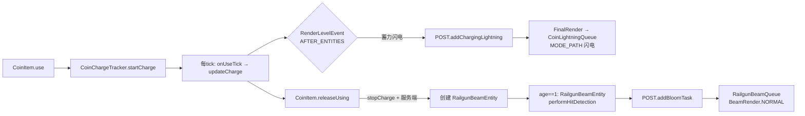

### 2. 后处理渲染管线

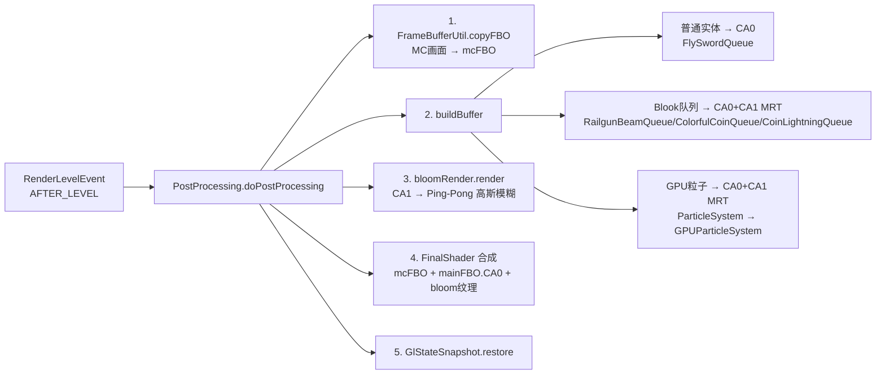

### 3. GPU 粒子系统

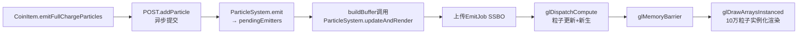

### 4. 飞剑状态机与渲染

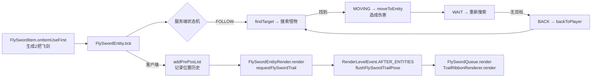

### 5. BeamCrossTestItem 主光束释放

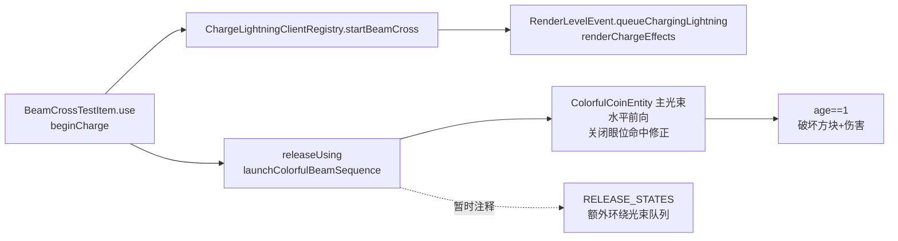

### 6. 女仆远程武器攻击链路

```mermaid
flowchart LR
    A[TouhouLittleMaid<br/>@LittleMaidExtension] -->|addMaidTask| B[MaidRangedAttackTask]
    B -->|AI Behavior| C[女仆背包扫描]
    C -->|彩币 > 魔法弓 > 硬币| D{武器类型?}
    D -->|ColorfulCoinItem| E[创建 ColorfulCoinEntity<br/>禁用方块破坏<br/>覆盖 ownerUUID]
    D -->|MagicBowItem| K[创建 MagicArrowEntity<br/>满蓄暴击<br/>写入弓附魔]
    D -->|CoinItem| F[创建 RailgunBeamEntity<br/>设置 ownerUUID]
    E --> G[age==1: 伤害检测]
    F --> G
    K --> L[MagicArrowEntity.onHitEntity<br/>触发魔法弓命中效果]
    G -->|女仆有主人| H[playerAttack(owner)<br/>击杀归属主人]
    G -->|女仆无主人| I[magic 伤害<br/>无归属]
    E --> J[客户端渲染<br/>CoinBeamClientEffects + Bloom]
    F --> J
    L --> M[客户端粒子效果<br/>普通/强蓄力/星辰裁决]
```

---

## 高重要性符号汇总

| 符号 | 类型 | 所在文件 |
|------|------|----------|
| `AkatZumaTool.MODID` | const | AkatZumaTool.java |
| `AkatZumaTool.ITEMS` | field | AkatZumaTool.java |
| `AkatZumaTool.SOUNDS` | field | AkatZumaTool.java |
| `AkatZumaTool.POST` | field | AkatZumaTool.java |
| `AkatZumaTool.FLY_SWORD_PLUS` | field | AkatZumaTool.java |
| `AkatZumaTool.SWORD_AURA` | field | AkatZumaTool.java |
| `MathUtil.createViewMatrix(Camera)` | method | common/MathUtil.java |
| `MathUtil.getClientTime(float)` | method | common/MathUtil.java |
| `PlayerUtil.deductFood(Entity, int)` | method | common/PlayerUtil.java |
| `BeamStyle` (NORMAL/COLORFUL/STAR_JUDGEMENT/STAR_JUDGEMENT_FINAL) | inner class | common/render/BeamRender.java |
| `BeamRender.writeBeam(...)` | method | common/render/BeamRender.java |
| `BeamRender.writeBeamSegment(...)` | method | common/render/BeamRender.java |
| `TrailRibbonRenderer.render(...)` | method | common/render/TrailRibbonRenderer.java |
| `ConfigFile.canBreakBlock` / `damagePlayers` | field | config/ConfigFile.java |
| `ConfigFile.flySwordAuraDamage()` / `flySwordAuraSpeed()` / `flySwordAuraLifeTicks()` / `flySwordAuraHitRadius()` | method | config/ConfigFile.java |
| `MagicBowConfig` (玩法配置 getters) | class | config/MagicBowConfig.java |
| `FlySwordEntity` / `MoveState` | class/enum | entity/FlySwordEntity.java |
| `FlySwordEntityRender.render(...)` / `renderTrail(...)` | method | entity/FlySwordEntityRender.java |
| `SwordAuraEntity` (setAuraData / setPreviewAuraData / getAimDirection / tick / damageAlongSegment / hurtTarget) | class | entity/sword/SwordAuraEntity.java |
| `SwordAuraRenderer.render(...)` | method | entity/sword/SwordAuraRenderer.java |
| `MagicArrowEntity` (tick / onHitEntity / onHitBlock) | class | entity/bow/MagicArrowEntity.java |
| `ParticleTemplate.emitGroundDiffusion(...)` / `ParticleTemplate.emitTriangleFullConnect(...)` | method | common/ParticleTemplate.java |
| `MagicBowParticleEffects` (randomGradientColors / spawnTrail) | class | entity/bow/MagicBowParticleEffects.java |
| `MagicBowParticleEffectEntity` (tickMeteorLines / spawnMeteorArrowTrail / getStarJudgementMeteorBaseDirection / emitRandomBeamDiffusions / applyStarJudgementBombardmentDamage / playStarJudgementSummonSound / tickStarJudgementFinalStrike / isStarJudgementVisual) | class | entity/bow/MagicBowParticleEffectEntity.java |
| `StarJudgementCircleQueue` (render / renderBeam / renderFinalStrikeBeam / renderCircle) | class | render/finalRender/bloomQueue/StarJudgementCircleQueue.java |
| `StarJudgementEnchantment` | class | enchantment/StarJudgementEnchantment.java |
| `AutoShootEnchantment` | class | enchantment/AutoShootEnchantment.java |
| `EnchantmentRegister.STAR_JUDGEMENT` | field | event/EnchantmentRegister.java |
| `EnchantmentRegister.AUTO_SHOOT` | field | event/EnchantmentRegister.java |
| `CoinChargeTracker` (全部 static 方法) | class | entity/coin/CoinChargeTracker.java |
| `CoinBeamClientEffects.triggerOnce(...)` | method | entity/coin/CoinBeamClientEffects.java |
| `RailgunBeamEntity` (setBeamData / performHitDetection) | class | entity/coin/RailgunBeamEntity.java |
| `ColorfulCoinEntity` (breakBlocks / damageEntities / setBreakBlocksEnabled / setOwnerUUID) | class | entity/coin/ColorfulCoinEntity.java |
| `EntityTypeRegister` (FLY_SWORD / RAILGUN_BEAM / COLORFUL_COIN / SWORD_AURA) | field | event/EntityTypeRegister.java |
| `ForgeEvent.onLeftClickEmpty(...)` / `onLeftClickBlock(...)` / `playSwordAuraSound(...)` | method | event/ForgeEvent.java |
| `ModEventClient.registerMagicBowUsePredicates()` | method | event/ModEventClient.java |
| `RenderLevelEvent.queueChargingLightning(...)` | method | event/RenderLevelEvent.java |
| `ChargeLightningClientRegistry` (startCoin / activeCharges / cleanup) | class | event/client/ChargeLightningClientRegistry.java |
| `CoinItem` (use / releaseUsing / getBeamHandOrigin / getChargeEffectHandOrigin) | class | item/CoinItem.java |
| `ColorfulCoinItem.releaseUsing(...)` | method | item/ColorfulCoinItem.java |
| `MagicBowItem.shootMagicArrow(...)` | method | item/MagicBowItem.java |
| `FlySwordItem.trySummonFlySwords(Player)` / `trySpawnSwordAura(Player)` / `trySpawnDimensionSlash(Player)` | method | item/FlySwordItem.java |
| `FlySwordItem.isHoldingAnyFlySword(Player)` / `isHoldingFlySwordPlus(Player)` | method | item/FlySwordItem.java |
| `FlySwordPlusItem` | class | item/FlySwordPlusItem.java |
| `DimensionSlashKeyHandler.DIMENSION_SLASH_KEY` / `SUMMON_FLY_SWORD_KEY` | field | event/client/DimensionSlashKeyHandler.java |
| `DimensionSlashKeyInputHandler.onKeyInput(...)` | method | event/client/DimensionSlashKeyInputHandler.java |
| `SwordAuraClientEvent.onInteractionKeyMappingTriggered(...)` | method | event/client/SwordAuraClientEvent.java |
| `SummonFlySwordC2SPacket.handle(...)` | method | network/SummonFlySwordC2SPacket.java |
| `testitem.spawnStaticBattoSlashPreview(UseOnContext)` | method | item/testitem/testitem.java |
| `MagicBowMovementMixin.akatzumatool$restoreMagicBowMovementInput(...)` | method | mixin/MagicBowMovementMixin.java |
| `SparklingFruitPlayerModelMixin.akatzumatool$lockSparklingFruitFlightLimbs(...)` | method | mixin/SparklingFruitPlayerModelMixin.java |
| `BeamCrossTestItem` (renderChargeEffects / releaseUsing) | class | item/BeamCrossTestItem.java |
| `WindowResizeMixin.onFramebufferResize` | method | mixin/WindowResizeMixin.java |
| `PostProcessing` (doPostProcessing / buildBuffer / add / addBloomTask / addParticle / getParticleFrameDeltaSeconds) | class | render/finalRender/PostProcessing.java |
| `FinalRender` (queueRegistrations / activeQueuesByPhase / render / addBloomQueue / addToBloomBuffer) | class | render/finalRender/FinalRender.java |
| `CoinLightningQueue` (addPath / addBurst / render) | class | render/finalRender/bloomQueue/CoinLightningQueue.java |
| `SwordAuraQueue` (render / buildAuraBasis / getRevealProgress / emitTrailParticles / emitTrailGroup / getRolledSide) | class | render/finalRender/bloomQueue/SwordAuraQueue.java |
| `SwordAuraInstancedRenderer` (ensureMesh / buildMesh / writeAuraInstance / drawInstanced) | class | render/finalRender/bloomQueue/SwordAuraInstancedRenderer.java |
| `SwordAuraObjModel` (registerAdditional / onModelBake / getModel) | class | render/finalRender/bloomQueue/SwordAuraObjModel.java |
| `SwordAuraShader` | class | render/renderType/SwordAuraType |
| `BloomRender.render(...)` | method | render/bloom/BloomRender.java |
| `FinalShader` | class | render/shader/post/FinalShader.java |
| `FBO` (bindFrameBuffer / unbindFrameBuffer / configureDrawBuffers) | class | render/frameBuffer/FBO.java |
| `GPUParticleSystem` (MAX_PARTICLES / updateAndRender) | class | render/gpu/GPUParticleSystem.java |
| `ParticleEmitTask` | class | render/gpu/ParticleEmitTask.java |
| `TouhouLittleMaid` / `addMaidTask(TaskManager)` | class/method | linkMod/touhouLittleMaid/TouhouLittleMaid.java |
| `MaidRangedAttackTask` (UID / isWeapon / isEnable / performRangedAttack / shootMagicBow / EquipRangedWeaponBehavior) | class | linkMod/touhouLittleMaid/task/MaidRangedAttackTask.java |

---

## 增量更新 — 飞剑次元斩领域

#### `common/EntityUtil.java`
**新增职责**：在实体伤害白名单工具基础上，新增通用移动锁定能力；使用运行时 `Map<UUID, MovementLockData>` 保存锁定锚点和过期时间，供次元斩和后续技能复用。

| 符号 | 类型 | 签名 | 重要性 |
|------|------|------|--------|
| `lockMovement(LivingEntity, int)` | method | `void` — 按实体当前位置锁定移动 | ⭐ 高 |
| `lockMovement(LivingEntity, int, Vec3)` | method | `void` — 按指定锚点锁定移动 | ⭐ 高 |
| `isMovementLocked(LivingEntity)` | method | `boolean` | 普通 |
| `tickMovementLock(LivingEntity)` | method | `void` — 清零速度、停止寻路、拉回锚点、到期清理 | ⭐ 高 |
| `clearMovementLock(LivingEntity)` | method | `void` | 普通 |

#### `common/CameraShakeUtil.java`
**职责**：通用客户端相机抖动工具，支持世界范围抖动、本地抖动和先保持后淡出的持续抖动，通过 `ViewportEvent.ComputeCameraAngles` 应用。

| 符号 | 类型 | 签名 | 重要性 |
|------|------|------|--------|
| `addShake(Vec3, float, int, float)` | method | `void` — 添加范围相机抖动 | ⭐ 高 |
| `addShake(float, float)` | method | `void` — 添加本地相机抖动 | 普通 |
| `addSustainedShake(Vec3, float, int, int, float)` / `addSustainedShake(int, int, float)` | method | `void` — 添加先保持完整强度再淡出的范围/本地抖动 | ⭐ 高 |
| `sample(Vec3, float)` | method | `Sample` — 采样 pitch/yaw/roll 偏移 | ⭐ 高 |
| `apply(ViewportEvent.ComputeCameraAngles)` | method | `void` — 应用相机抖动 | ⭐ 高 |
| `PITCH_FREQUENCY` / `YAW_FREQUENCY` / `ROLL_FREQUENCY` | field | `float` — 通用相机抖动频率，数值越大抖动越快 | 普通 |
| `tickOncePerGameTick()` | method | `void` — 渲染事件中按游戏 tick 推进抖动生命周期，避免按帧过快消耗 | 普通 |

#### `entity/sword/DimensionSlashConfig.java`
**职责**：次元斩静态调参容器，保存领域半径、冷却、视频节奏生命周期、伤害、实体斩击数量和速度、圆环粒子密度和大小、bloom、镜头抖动、蓝紫领域、屏幕直线感 Voronoi 透明暗边碎片、灰化对比、分块快速下落、终结节奏和收尾碎屑参数。

#### `entity/sword/DimensionSlashDomainEntity.java`
**职责**：次元斩领域主控实体；按阶段冻结 15 格范围内生物、刷新移动锁定、召唤连续斩击实体、造成终结伤害并播放 `slash_end` 音效。

| 符号 | 类型 | 签名 | 重要性 |
|------|------|------|--------|
| `create(Player)` | method | `DimensionSlashDomainEntity` | ⭐ 高 |
| `refreshMovementLocks()` | method | `void` | ⭐ 高 |
| `tryStartStrikeEntity()` | method | `void` | ⭐ 高 |
| `tryFinalHit()` | method | `void` | ⭐ 高 |
| `getDomainTargets()` | method | `List<LivingEntity>` | 普通 |

#### `entity/sword/DimensionSlashStrikeEntity.java`
**职责**：次元斩连续斩击实体；按更短间隔对范围内目标造成多次小伤害，客户端由 bloom 队列绘制白蓝光刃；`slash` 音效只在领域开始时播放一次。

| 符号 | 类型 | 签名 | 重要性 |
|------|------|------|--------|
| `create(DimensionSlashDomainEntity)` | method | `DimensionSlashStrikeEntity` | ⭐ 高 |
| `trySmallHit()` | method | `void` | ⭐ 高 |
| `getStrikeTargets()` | method | `List<LivingEntity>` | 普通 |

#### `entity/sword/DimensionSlashClientEffects.java`
**职责**：次元斩客户端非粒子类效果触发，目前负责终结阶段范围内本地相机抖动。

#### `entity/sword/DimensionSlashParticleEffects.java`
**职责**：次元斩客户端领域粒子和终结碎屑触发；展开阶段按 tick 提交更快到达 15 格的圆形粒子环，稳定阶段使用更大尺寸的蓝色 `ParticleEmitTask.orbit(...)` 持续水平边缘旋转。

| 符号 | 类型 | 签名 | 重要性 |
|------|------|------|--------|
| `emitFinalDebrisIfNeeded(DimensionSlashDomainEntity)` | method | `void` — 终结破碎阶段生成贴地棕色碎屑 | 普通 |

#### `entity/sword/ExcaliburChargeParticleEffects.java`
**职责**：咖喱棒 C 键蓄力客户端 GPU 粒子入口；每 2 tick 刷新 SDF 与 LIGHT_EFFECT 各内外两组短时弹道发射器，在玩家身边补充静止大型光效，并生成缓慢上升的小型 SDF 氛围；定时在脚下生成基础能量法阵，增强阶段 tick 由 `ExExcaliburConfig.enhancedStartTick()` 控制，首次进入增强阶段播放 `ex` 音效，并额外叠加 trail_2 冲击波法阵和脚下双材质径向爆发；释放阶段不再提交能量光柱。

| 符号 | 类型 | 签名 | 重要性 |
|------|------|------|--------|
| `emitChargeParticles(ExcaliburChargeEntity, Vec3, Vec3)` | method | `void` — 按实体 tick 防重，使用身体中心调度持续倒锥并使用脚下锚点调度法阵和一次性爆发；释放后停止蓄力粒子 | ⭐ 高 |
| `getEnhancedStartTick()` / `playEnhancedChargeSoundIfNeeded(...)` | method | `int/void` — 读取配置增强阶段 tick，并在增强阶段首次出现时本地播放 `ex` 音效 | 普通 |
| `emitSdfContinuous(Vec3, RandomSource, boolean)` / `emitLightContinuous(...)` | method | `void` — 分别提交 SDF 和 LIGHT_EFFECT 内外两层短时发射器 | ⭐ 高 |
| `emitSdfGroup(...)` / `emitLightGroup(...)` | method | `void` — 按 rate、spread 和生命周期创建弹道持续粒子组，并让 SDF/LIGHT_EFFECT 共用基础或增强阶段固定速度 | 普通 |
| `emitAmbientSdfAroundPlayer(Vec3, RandomSource, boolean)` | method | `void` — 在玩家周围约 10 格圆盘内提交低速噪声上升 SDF 氛围粒子 | 普通 |
| `emitLargeLightAroundPlayer(Vec3, boolean)` | method | `void` — 持续提交玩家身边固定尺寸、零速度的大型 LIGHT_EFFECT | 普通 |
| `emitMagicCircleEnergy(Vec3, boolean)` | method | `void` — 在脚下提交单个零速度法阵，基础/增强阶段分别使用 7.50/10.50 格基准直径 | ⭐ 高 |
| `emitShockwaveMagicCircle(Vec3)` | method | `void` — 使用独立生命周期、14 格尺寸、零速度和白金色参数提交 trail_2 冲击波法阵 | ⭐ 高 |
| `emitTenTickBurst(Vec3, RandomSource)` | method | `void` — 第 10 tick 同时提交两种材质的径向爆发 | ⭐ 高 |
| `BASE_CHARGE_RISE_*` / `ENHANCED_CHARGE_RISE_*` | static field | SDF/LIGHT_EFFECT 共用的基础或增强阶段固定起始速度、结束速度和速度曲线 | 普通 |
| `BASE_*` / `ENHANCED_*` / `TEN_TICK_*` / `MAGIC_CIRCLE_ENERGY_*` | static field | 基础/增强持续粒子、倒锥、脚下临界爆发和重复基础能量法阵静态参数 | 普通 |

#### `event/ForgeEvent.java`
**职责**：飞剑左键空挥/左键方块事件入口；在客户端本地播放剑气音效，并在服务端触发剑气实体生成；同时继续承担移动锁定 tick 刷新。

| 符号 | 类型 | 签名 | 重要性 |
|------|------|------|--------|
| `onLeftClickEmpty(PlayerInteractEvent.LeftClickEmpty)` | method | `void` — 左键空挥时播放本地音效并发剑气请求包 | ⭐ 高 |
| `onLeftClickBlock(PlayerInteractEvent.LeftClickBlock)` | method | `void` — 左键方块时客户端播音效、服务端生剑气 | ⭐ 高 |
| `playSwordAuraSound(Player)` | method | `void` — 纯客户端本地播放 `sword_aura` | ⭐ 高 |
| `onLivingTick(LivingEvent.LivingTickEvent)` | method | `void` — 刷新通用移动锁定 | ⭐ 高 |

#### `event/client/DimensionSlashKeyHandler.java`
**职责**：注册飞剑相关客户端按键，当前包含 `V` 次元斩和 `B` 召唤飞剑。

| 符号 | 类型 | 签名 | 重要性 |
|------|------|------|--------|
| `DIMENSION_SLASH_KEY` | field | `KeyMapping` — 默认 `V` | ⭐ 高 |
| `SUMMON_FLY_SWORD_KEY` | field | `KeyMapping` — 默认 `B` | ⭐ 高 |
| `registerKeyMappings(RegisterKeyMappingsEvent)` | method | `void` | ⭐ 高 |

#### `event/client/DimensionSlashKeyInputHandler.java`
**职责**：处理 `V/B` 键客户端输入、天雷按键蓄力和本地冷却；天雷完整冷却改由服务端释放结果回包确认后写入，并在断线/切换世界时清理静态冷却。

| 符号 | 类型 | 签名 | 重要性 |
|------|------|------|--------|
| `onKeyInput(InputEvent.Key)` | method | `void` — 处理次元斩/召唤飞剑按键、冷却和发包 | ⭐ 高 |
| `COOLDOWNS` / `lastLevel` | field | `Map<SkillCooldownType, Map<UUID, Long>> / Object` — 客户端技能冷却表和世界切换哨兵 | ⭐ 高 |
| `onClientTick(TickEvent.ClientTickEvent)` / `onClientLoggingOut(ClientPlayerNetworkEvent.LoggingOut)` | method | `void` — 维护天雷蓄力并清理旧世界冷却状态 | ⭐ 高 |
| `applyHeavenlyThunderCastResult(boolean, int, boolean)` | method | `void` — 按服务端天雷释放结果写入冷却或提示饱食度不足 | ⭐ 高 |
| `getRemainingCooldownTicks(Minecraft, SkillCooldownType)` | method | `int` | 普通 |
| `sendCooldownMessage(Minecraft, int/Component, int)` | method | `void` — 发送纯客户端冷却提示 | 普通 |
| `setCooldown(Minecraft, SkillCooldownType, int)` / `clearClientSkillState()` | method | `void` — 写入指定 tick 冷却或清理客户端静态状态 | 普通 |

#### `event/client/SwordAuraClientEvent.java`
**职责**：监听左键命中实体时的客户端攻击键事件，在命中非 MISS 目标时补充本地飞剑剑气音效。

| 符号 | 类型 | 签名 | 重要性 |
|------|------|------|--------|
| `onInteractionKeyMappingTriggered(InputEvent.InteractionKeyMappingTriggered)` | method | `void` | ⭐ 高 |

####
etwork/DimensionSlashCastC2SPacket.java`
**职责**：客户端按 `V` 请求服务端释放次元斩；服务端先检查 `ServerSkillCooldowns.DIMENSION_SLASH`，成功调用 `FlySwordItem.trySpawnDimensionSlash(Player)` 后写入配置冷却减 20 tick 的服务端冷却。

#### `network/SummonFlySwordC2SPacket.java`
**职责**：客户端按 `B` 请求服务端切换飞剑召唤/关闭状态；服务端先检查 `ServerSkillCooldowns.SUMMON_FLY_SWORD`，成功调用 `FlySwordItem.trySummonFlySwords(Player)` 后继续写入 180 tick 服务端冷却。

| 符号 | 类型 | 签名 | 重要性 |
|------|------|------|--------|
| `handle(Supplier<NetworkEvent.Context>)` | method | `void` — 服务端处理 B 键召唤/关闭飞剑请求 | ⭐ 高 |

#### `render/finalRender/DimensionSlashScreenEffect.java`
**职责**：保存当前帧次元斩蓝色重影、色散、暗角、领域壁、屏幕 Voronoi 透明扭曲碎片错位、径向模糊和高对比强度；碎片推进值不截断到 1，供最终合成 shader 在收尾阶段继续计算下落。

#### `render/finalRender/bloomQueue/DimensionSlashStrikeQueue.java`
**职责**：使用 `RenderType + VertexConsumer` 绘制连续白蓝色细斩击，不走实例化；每个斩击实体按 age 快速生成更密集的多道 bloom 光刃，光刃出现后保留并在终结前统一淡出。

#### `render/renderType/DimensionSlashType/DimensionSlashStrikeRenderType.java`
**职责**：次元斩斩击 RenderType，使用 `POSITION_COLOR_TEX`、`QUADS`、加法混合、`LEQUAL_DEPTH_TEST`、`NO_CULL`。

#### `render/renderType/DimensionSlashType/DimensionSlashStrikeShader.java`
**职责**：次元斩斩击 Core Shader 管理，缓存 `EffectParams` 与 `uView`。

**核心链路**：

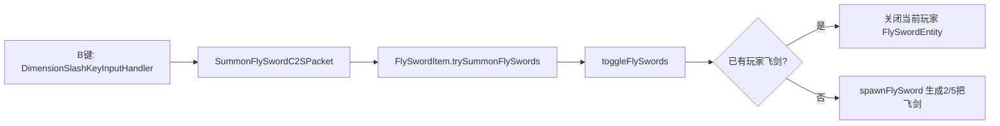

---

## 增量更新 — 飞剑真·飞剑 / B键召唤 / 客户端冷却

#### `common/PlayerUtil.java`
**新增职责**：提供飞剑系统复用的玩家饱食度扣除工具，统一处理“先判断是不是玩家”再扣除。

#### `item/FlySwordItem.java`
**新增职责**：公共飞剑能力入口从“右键召回/重置”改为“左键剑气 + B 键召唤”；次元斩服务端释放现在只允许真·飞剑，并在成功释放后扣 2 点饱食度。

#### `item/FlySwordPlusItem.java`
**新增职责**：新增真·飞剑物品，继承普通飞剑基础能力，仅作为次元斩的合法持有物。

#### `event/client/DimensionSlashKeyHandler.java` 与 `DimensionSlashKeyInputHandler.java`
**新增职责**：飞剑输入从单 `V` 键扩展为 `V/B` 双键；客户端本地维护次元斩与召唤飞剑冷却，冷却中仅显示本地消息。

#### `event/client/SwordAuraClientEvent.java`
**新增职责**：补足左键命中实体时的本地剑气音效，让空挥、打方块、打实体三种左键路径都能在客户端听到 `sword_aura`。

####
etwork/SummonFlySwordC2SPacket.java`
**新增职责**：B 键召唤飞剑请求包，和 `DimensionSlashCastC2SPacket` 分离；当前服务端额外接入 `ServerSkillCooldowns.SUMMON_FLY_SWORD` 防刷冷却。

#### `AkatZumaTool.java` / `NetworkRegister.java` / `ModEventClient.java`
**新增职责**：注册真·飞剑物品、`sword_aura` 音效、召唤飞剑网络包，以及真·飞剑 3D 模型替换。

**核心链路**：

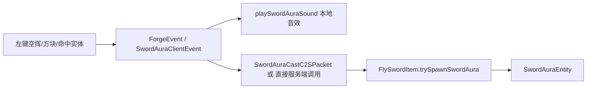

---

## 增量更新 — 真·飞剑右键拔刀斩

#### `entity/sword/BattoSlashEntity.java`
**新增职责**：真·飞剑右键蓄力后生成的服务端拔刀斩实体；同步生命周期、视觉随机种子和水平朝向；第 1 tick 按配置范围和配置伤害对上下 3 格内非白名单目标结算一次伤害；普通视觉生命周期保持 40 tick，预览模式停在消散前；客户端由 `VISUAL_SEED` 派生固定随机倾斜角并防重提交出场粒子。

| 符号 | 类型 | 签名 | 重要性 |
|------|------|------|--------|
| `create(Player)` | method | `BattoSlashEntity` — 记录释放者 UUID、视觉种子和水平朝向 | ⭐ 高 |
| `createPreview(Level, Player, Vec3, Vec3)` | method | `BattoSlashEntity` — 创建 testitem 长时间预览拔刀斩 | ⭐ 高 |
| `tick()` | method | `void` — 普通模式第 1 tick 伤害，预览模式只保留显示并按不同生命周期清理 | ⭐ 高 |
| `doDamage()` | method | `void` — 按配置范围和配置伤害做一次性范围伤害结算 | ⭐ 高 |
| `canDamageTarget(LivingEntity)` | method | `boolean` — 跳过释放者、超高低目标和实体白名单 | 普通 |
| `hurtTarget(LivingEntity, float)` | method | `void` — 优先使用释放者 `playerAttack` 归属伤害 | 普通 |
| `getDamageRadius()` / `getDamageAmount()` | method | `double/float` — 读取拔刀斩配置范围和伤害 | 普通 |
| `getForward()` / `getProgress(float)` / `getLifeTicks()` / `isPreviewStatic()` | method | `Vec3/float/int/boolean` — 客户端读取朝向、时间轴和预览状态 | 普通 |
| `getTiltAngle()` | method | `float` — 由 `VISUAL_SEED` 派生 -15°~+15° 固定随机倾斜角 | 普通 |
| `getTiltedSide()` / `getTiltedUp()` | method | `Vec3` — 取得倾斜后的横向与竖向基向量 | ⭐ 高 |

#### `entity/sword/BattoSlashRenderer.java`
**新增职责**：拔刀斩空渲染器，负责把 `BattoSlashEntity` 提交到后处理 bloom 队列，并在首次渲染时触发拔刀斩出场粒子。

#### `entity/sword/BattoSlashParticleEffects.java`
**新增职责**：拔刀斩出场 GPU 粒子效果；按实际渲染记录拟合出的约 25 格半径三行半圆弧采样，使用随机形状、紫蓝渐变和约 2 秒向上弹道运动，且复用实体倾斜后的 `side/up/forward` 基向量保证粒子贴合刀光。

| 符号 | 类型 | 签名 | 重要性 |
|------|------|------|--------|
| `SAMPLE_COUNT` / `PARTICLE_ARC_RADIUS` | field | `int/double` — 每行半圆弧采样点数量 56 和粒子半圆半径 25.0D | 普通 |
| `ROW_FORWARD_OFFSETS` | field | `double[]` — 半圆弧前后加两行后的三行前后偏移 | 普通 |
| `emitAppearanceParticles(BattoSlashEntity, float)` | method | `void` — 拔刀斩首次渲染时沿倾斜三行半圆弧提交出场粒子并写防重标记 | ⭐ 高 |
| `emitOneBurst(Vec3, Vec3, Vec3, RandomSource)` | method | `void` — 单个采样点提交存活约 2 秒的紫蓝渐变随机形状粒子 burst | 普通 |

####
etwork/BattoSlashCastC2SPacket.java`
**新增职责**：客户端右键蓄力满 1 秒后请求服务端释放拔刀斩；服务端先检查 `ServerSkillCooldowns.BATTO_SLASH`，成功调用 `FlySwordPlusItem.trySpawnBattoSlash(Player)` 后写入 80 tick 服务端冷却。

#### `render/finalRender/bloomQueue/BattoSlashQueue.java`
**新增职责**：复用 `SwordAuraObjModel` 的 baked quad 数据，使用 `RenderType + VertexConsumer` 把拔刀斩刀光写入 CA0/CA1；当前把 `sword1.obj` 原始坐标做基础缩放，用前方偏移保证刀光位于玩家面前，并在局部坐标中翻转 forward 修正 OBJ 朝向；水平视觉范围临时放大 10 倍；渲染时使用实体倾斜后的 `side/up` 基向量；绑定 daoguang 主纹理、TexB 和 mask，shader 中复用 radial mask 完成轻量 UV 扰动、透明遮罩、生命周期显现和噪声消散。

| 符号 | 类型 | 签名 | 重要性 |
|------|------|------|--------|
| `OBJ_BASE_SCALE` / `OBJ_CENTER_X` / `OBJ_CENTER_Y` / `OBJ_CENTER_Z` | field | `double` — 将 `sword1.obj` 原始大坐标归一化并居中到实体附近 | ⭐ 高 |
| `FRONT_OFFSET` / `HEIGHT_OFFSET` | field | `double` — 控制拔刀斩整体出现在释放者前方和高度，当前 `HEIGHT_OFFSET=0.65D` | ⭐ 高 |
| `VISUAL_RANGE_SCALE` | field | `double` — 拔刀斩视觉水平范围调试倍率，当前 10 倍 | 普通 |
| `NOISE_STRENGTH` / `MATERIAL_INTENSITY` | field | `float` — daoguang UV 扰动和自发光强度参数 | 普通 |
| `render(MultiBufferSource.BufferSource, Camera, float, Matrix4f)` | method | `void` — 设置拔刀斩 shader uniform、图集和场景纹理后批量写入顶点 | ⭐ 高 |
| `renderSlash(...)` | method | `void` — 按实体进度决定是否写入当前拔刀斩 | ⭐ 高 |
| `writeModelQuad(...)` | method | `void` — 读取 baked quad 并转换到随机倾斜后的拔刀斩世界坐标 | ⭐ 高 |
| `buildBattoSlashLocal(float, float, float)` | method | `Vec3` — 直接使用 OBJ X/Z 作为水平弧面，Y 作为薄竖向厚度，并翻转局部 forward 修正模型正面方向 | ⭐ 高 |
| `writeVertex(...)` | method | `void` — 把生命周期进度编码到顶点颜色 R 通道 | 普通 |

#### `render/renderType/BattoSlashType/BattoSlashRenderType.java`
**新增职责**：拔刀斩 RenderType，使用 `POSITION_COLOR_TEX`、`QUADS`、`LEQUAL_DEPTH_TEST`、`NO_CULL` 和普通 alpha 透明混合，并显式绑定 `AkatZumaTextureAtlas.AKATZUMA_TOOL_ATLAS_LOCATION`，避免 `Sampler0` 落到 Minecraft block atlas。

#### `render/renderType/BattoSlashType/BattoSlashShader.java`
**新增职责**：拔刀斩 Core Shader 管理；缓存 `MaterialParams`、`PannerParams`、`MainSpriteUV`、`TexBSpriteUV`、`MaskSpriteUV`、`uView`，并只绑定自定义 atlas `Sampler0`，不再保留独立噪声 sprite 和折射采样参数。

#### `event/EntityTypeRegister.java` / `event/ModEventClient.java` / `event/render/RenderTypeEvent.java`
**新增职责**：补充 `BATTO_SLASH` 实体注册、`BattoSlashRenderer` 客户端 renderer 注册，以及 `BattoSlashShader` Core Shader 注册。

**核心链路**：

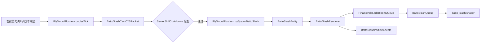

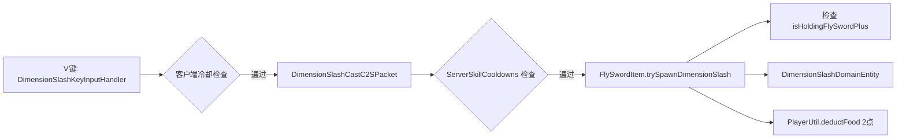

---

## 增量更新 — 飞剑跟随防抖与随机回攻 / 剑气 VAO 状态修复
#### `entity/FlySwordEntity.java`
**新增职责**：在飞剑改为普通 `Entity` 后，服务端继续按“目标点 + 每 tick 最大步长”推进移动，同时补充跟随编队时的防过冲速度分段、单怪物命中后的随机飞出回攻，以及客户端短插值目标缓存与逐 tick 逼近逻辑，在不重新引入生命值属性体系的前提下恢复更稳定的飞剑手感。
| 符号 | 类型 | 签名 | 重要性 |
|------|------|------|--------|
| `CLIENT_LERP_STEPS` | field | `int` | ★ 高 |
| `CLIENT_TELEPORT_DISTANCE` | field | `double` | 普通 |
| `FOLLOW_RETURN_SPEED` / `FOLLOW_SETTLE_SPEED` | field | `double` | ★ 高 |
| `FOLLOW_FAST_DISTANCE` / `FOLLOW_STOP_DISTANCE` | field | `double` | 普通 |
| `TELEPORT_BACK_DISTANCE` | field | `double` | 普通 |
| `POST_HIT_RANDOM_MOVE_TICKS` / `POST_HIT_RANDOM_UP_SCALE` / `POST_HIT_RANDOM_YAW_DEGREES` | field | `int` / `double` / `double` | 普通 |
| `clientLerpX` / `clientLerpY` / `clientLerpZ` | field | `double` | 普通 |
| `clientLerpYRot` / `clientLerpXRot` | field | `float` | 普通 |
| `clientLerpSteps` | field | `int` | 普通 |
| `attackYOffset` | field | `double` | 普通 |
| `hasHitCurrentTarget` | field | `boolean` | 普通 |
| `postHitRandomMoveTicks` | field | `int` | 普通 |
| `postHitRandomDirection` | field | `Vec3` | 普通 |
| `tickClientLerp()` | method | `void` — 客户端按最近一次同步目标推进短插值 | ★ 高 |
| `getFollowSpeed(double)` | method | `double` — 按与编队点的距离切换回归或贴合速度 | 普通 |
| `followPlayer()` | method | `void` — 按编队目标点平滑回到主人身后，近距离停稳，过远时直接拉回 | ★ 高 |
| `calcSpawnOffset(Vec3)` | method | `Vec3` — 只负责计算编队偏移，不再混用位移量 | 普通 |
| `moveToEntity()` | method | `void` — 向目标按最大步长推进，命中后沿当前前进方向小角度偏转飞出再回到索敌流程 | ★ 高 |
| `moveToVec3(Vec3)` | method | `void` | 普通 |
| `moveTowardClamped(Vec3, double, double)` | method | `void` — 跟随玩家时使用的防过冲移动 | ★ 高 |
| `moveToward(Vec3, double)` | method | `void` — 通用限速移动方法 | ★ 高 |
| `createPostHitRandomDirection()` | method | `Vec3` — 基于当前前进方向生成小角度偏转的飞出方向 | 普通 |
| `lerpTo(double, double, double, float, float, int, boolean)` | method | `void` — 客户端收到服务端位置包后缓存目标或直接落点 | ★ 高 |

#### `event/EntityTypeRegister.java`
**新增职责**：为飞剑实体显式设置更高的位置同步频率和追踪范围，让客户端短插值有更细的服务端位置样本可用。
| 符号 | 类型 | 签名 | 重要性 |
|------|------|------|--------|
| `FLY_SWORD_ENTITY` | field | `EntityType.Builder...clientTrackingRange(16).updateInterval(1)` | ★ 高 |

#### `render/finalRender/bloomQueue/SwordAuraInstancedRenderer.java`
**新增职责**：隔离剑气实例化绘制与 Minecraft `RenderType` 批处理之间的 OpenGL 状态边界，显式绑定并恢复 VAO、Program、Texture、混合和深度状态，降低 `Array object is not active` 报错概率。
| 符号 | 类型 | 签名 | 重要性 |
|------|------|------|--------|
| `drawInstanced(int)` | method | `void` — 保存并恢复 VAO / Program / Texture / Blend / Depth / Cull 状态后执行实例化绘制 | ★ 高 |

#### `render/finalRender/PostProcessing.java`
**新增职责**：在 bloom 队列绘制和 GPU 粒子绘制之间补充一次阶段边界状态归零，减少同帧多种渲染路径之间的 GL 状态串扰。
| 符号 | 类型 | 签名 | 重要性 |
|------|------|------|--------|
| `buildBuffer(RenderTarget)` | method | `void` — 在 `addToBloomBuffer(...)` 之后执行 `glUseProgram(0)` 与 `glBindVertexArray(0)` | ★ 高 |

**核心链路**：
```mermaid
flowchart LR
    A[服务端 FlySwordEntity.followPlayer] --> B[getFollowSpeed]
    B --> C[moveTowardClamped]
    C --> D[updateInterval(1) 发送位置同步]
    D --> E[客户端 FlySwordEntity.lerpTo]
    E --> F[tickClientLerp]
    G[FlySwordEntity.moveToEntity] --> H[findAndHurtTarget]
    H --> I[createPostHitRandomDirection]
    I --> J[postHitRandomMoveTicks 定向偏转飞出]
    K[SwordAuraInstancedRenderer.drawInstanced] --> L[保存当前 GL 状态]
    L --> M[绑定 sword aura VAO 并绘制]
    M --> N[恢复 VAO / Program / Texture / Blend / Depth]
    N --> O[PostProcessing.buildBuffer 阶段归零]
```

---

## 增量更新 — 魔法弓自动追踪附魔与附魔书获取

#### `enchantment/AutoTrackingEnchantment.java`
**新增职责**：魔法弓专属自动追踪附魔，最大等级 1；仅允许附加到 `AkatZumaTool.MAGIC_BOW`。

#### `common/AutoTrackingTargetValidator.java`
**新增职责**：统一客户端锁定预览和服务端射击请求的目标合法性校验，按存活、自身排除、白名单、距离、角度和视线判断目标是否可锁定。

| 符号 | 类型 | 签名 | 重要性 |
|------|------|------|--------|
| `isValidClientTarget(Player, Entity)` | method | `boolean` — 客户端锁定目标校验 | ⭐ 高 |
| `isValidServerTarget(Player, Entity)` | method | `boolean` — 服务端射击目标校验 | ⭐ 高 |
| `isInLockCone(Player, LivingEntity)` | method | `boolean` — 自动追踪距离/角度/视线判断 | ⭐ 高 |
| `aimScore(Player, LivingEntity)` | method | `double` — 准心角度评分 | 普通 |

#### `common/ClientWhitelistCache.java`
**新增职责**：保存服务端同步给客户端的实体伤害白名单，供自动追踪锁定目标时跳过白名单实体。

#### `common/ModEnchantmentUtil.java`
**新增职责**：集中维护魔法弓自定义附魔书列表，供钓鱼战利品修饰器和村民交易复用。

#### `event/client/AutoTrackingClientHandler.java`
**新增职责**：客户端拉魔法弓时扫描准心附近合法目标；tick 只维护锁定目标 ID，渲染帧由 `RenderLevelEvent` 调用 `submitLockedTargetOutline` 提交本地 screen outline 任务；不再写 `setGlowingTag` 和 scoreboard 队伍；松开右键或自动射击满蓄时发送 `AutoTrackingShootC2SPacket`。

| 符号 | 类型 | 签名 | 重要性 |
|------|------|------|--------|
| `onClientTick(TickEvent.ClientTickEvent)` | method | `void` — 每 tick 更新锁定目标 ID | ⭐ 高 |
| `requestShoot(boolean)` | method | `void` — 客户端发送一次自动追踪射击请求 | ⭐ 高 |
| `requestAutoShootIfReady(Player, ItemStack, int)` | method | `void` — 自动射击满蓄时节流发包 | ⭐ 高 |
| `findBestTarget(ClientLevel, LocalPlayer)` | method | `int` — 按准心角度和距离选择目标 | ⭐ 高 |
| `setLockedTarget(int)` | method | `void` — 只更新客户端锁定目标 ID | ⭐ 高 |
| `submitLockedTargetOutline(ClientLevel)` | method | `void` — 把锁定目标提交到 `PostProcessing.addScreenOutline` | ⭐ 高 |

####
etwork/AutoTrackingShootC2SPacket.java`
**新增职责**：客户端请求服务端按当前锁定目标发射一次魔法箭；服务端即时校验目标，通过则传给 `MagicBowItem.shootMagicArrow(..., LivingEntity)`，失败则按原准心方向射击；不缓存目标、不做持续制导。

####
etwork/WhitelistSyncS2CPacket.java`
**新增职责**：服务端把生效后的实体伤害白名单同步给客户端，客户端写入 `ClientWhitelistCache`。

#### `item/MagicBowItem.java`
**新增职责**：允许自动追踪附魔；新增带 `LivingEntity trackingTarget` 的发射重载；客户端有自动追踪附魔时通过 C2S 包接管释放和自动射击请求，服务端旧路径跳过同一次自动追踪发射以防双发。

#### `config/MagicBowConfig.java`
**新增职责**：新增 `magicBow.autoTracking.maxLockAngle`、`maxLockRange`、`requireLineOfSight` 三个配置项，并提供默认值安全读取方法；当前 `maxLockAngle` 默认值为 `30.0D`。

#### `loot/AddMagicBowEnchantedBookModifier.java` 与 `event/LootModifierRegister.java`
**新增职责**：通过 Forge Global Loot Modifier 给 `minecraft:gameplay/fishing/treasure` 追加随机魔法弓自定义附魔书，包含星辰裁决、自动射击、自动追踪。

#### `event/VillagerTradeEvent.java`
**新增职责**：给图书管理员 5 级交易追加随机魔法弓自定义附魔书。

#### `event/ForgeGameEvent.java` / `event/ModEvent.java` / `event/PlayerJoinHandler.java`
**新增职责**：提取服务端实体伤害白名单重建逻辑；配置刷新时广播白名单；玩家登录时同步白名单；玩家退出时清理自动追踪防重复标记。

#### `NetworkRegister.java` / `AkatZumaTool.java`
**新增职责**：注册 `AutoTrackingShootC2SPacket`、`WhitelistSyncS2CPacket` 和全局战利品修饰器注册器。

**核心链路**：

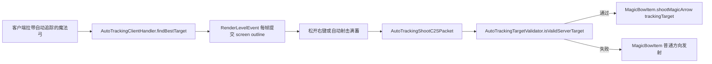

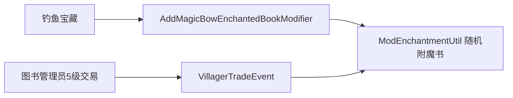

---

## 增量更新 — 魔法弓自动追踪屏幕空间描边

#### `render/frameBuffer/FBO.java`
**新增职责**：在原 MRT FBO 封装上补充指定颜色附件的 draw buffer 切换、单附件清空、按附件清空绑定和尺寸读取；`mainFBO.CA2` 只在有描边任务时清空和写入。

| 符号 | 类型 | 签名 | 重要性 |
|------|------|------|--------|
| `bindFrameBuffer(boolean, int...)` | method | `void` — 绑定 FBO 并只清空指定 color attachment，可选择是否清深度 | ⭐ 高 |
| `setDrawBuffer(int)` / `setDrawBuffers(int...)` | method | `void` — 显式切换单输出或 MRT 输出附件 | ⭐ 高 |
| `clearColorAttachment(int, float, float, float, float)` | method | `void` — 单独清空指定 attachment | ⭐ 高 |
| `getWidth()` / `getHeight()` | method | `int` — 提供后处理屏幕采样尺寸 | 普通 |

#### `render/frameBuffer/fbos/MainFBORender.java`
**新增职责**：主后处理 FBO 从 2 个 color attachment 扩展到 3 个：`CA0=visible`、`CA1=bloom source`、`CA2=outline mask/type`。

#### `render/finalRender/PostProcessing.java`
**新增职责**：新增 `addScreenOutline(Entity, ScreenOutlineStyle)` 和 `addScreenOutline(ScreenOutlineMaskWriter, ScreenOutlineStyle)`；`buildBuffer` 在普通效果、bloom 队列和 GPU 粒子后，仅当存在描边任务时拷贝深度、清空 CA2、写 mask 并执行一次 `screen_outline` 全屏扩边，随后复用现有 bloom blur。

| 符号 | 类型 | 签名 | 重要性 |
|------|------|------|--------|
| `addScreenOutline(Entity, ScreenOutlineStyle)` | method | `void` — 实体描边入口 | ⭐ 高 |
| `addScreenOutline(ScreenOutlineMaskWriter, ScreenOutlineStyle)` | method | `void` — 无实体描边入口 | ⭐ 高 |
| `buildBuffer(RenderTarget)` | method | `void` — 描边任务存在时调度 CA2 mask 和 screen outline pass | ⭐ 高 |

#### `render/finalRender/FinalRender.java`
**新增职责**：持有 `ScreenOutlineQueue`，提供实体/无实体 screen outline 提交、查询和清空接口，并让 `hasActiveEffects()` 识别本帧描边任务。

#### `render/finalRender/outline/ScreenOutlineStyle.java`
**新增职责**：定义普通红色描边和火焰描边预留样式；所有 mask、颜色、采样、深度字段都有默认值。

#### `render/finalRender/outline/ScreenOutlineTask.java`
**新增职责**：保存本帧实体描边或无实体 mask writer 描边任务；默认实体、writer、style、visibleOnly 均有安全值。

#### `render/finalRender/outline/ScreenOutlineQueue.java`
**新增职责**：维护当前帧 CA2 mask 任务；当前实体描边第一版使用实体 AABB 写入纯色 mask，后续可替换为模型级 writer；提供 `writeAxisAlignedBox(...)` 给无实体效果复用。

#### `render/finalRender/outline/ScreenOutlineRender.java`
**新增职责**：读取 `mainFBO.CA2`，执行一次全屏屏幕空间扩边，把可见描边写入 `CA0`，把 bloom 源写入 `CA1`。

#### `render/finalRender/outline/ScreenOutlineShader.java`
**新增职责**：管理 `screen_outline.vsh/fsh` 的 post shader uniforms，包括屏幕尺寸、普通描边样式和火焰描边样式。

#### `render/renderType/ScreenOutlineType/OutlineMaskRenderType.java`
**新增职责**：定义 CA2 mask 写入用 RenderType，使用 `POSITION_COLOR`、`QUADS`、`LEQUAL_DEPTH_TEST`、`NO_CULL` 和纯颜色输出。

#### `render/renderType/ScreenOutlineType/OutlineMaskShader.java`
**新增职责**：注册并缓存 `outline_mask` core shader 的 `uView` uniform，供 mask pass 使用。

#### `render/renderType/ScreenOutlineType/OutlineCapturedMaskRenderType.java`
**新增职责**：定义捕获顶点专用 CA2 mask RenderType，保留 `POSITION_COLOR`、`QUADS` 和 `ProjMat` 直投影路径，不再使用 `uView`。

#### `render/renderType/ScreenOutlineType/OutlineCapturedMaskShader.java`
**新增职责**：管理捕获顶点专用 `outline_captured_mask` core shader，只缓存 shader 实例，不再维护 `uView`。

#### `event/render/RenderTypeEvent.java`
**新增职责**：注册 `OutlineMaskShader`。

**核心链路**：

```mermaid
flowchart LR
    A[RenderLevelEvent AFTER_LEVEL] --> B[AutoTrackingClientHandler.submitLockedTargetOutline]
    B --> C[PostProcessing.addScreenOutline]
    C --> D[FinalRender.screenOutlineQueue]
    D --> E[PostProcessing.buildBuffer 有任务时清 CA2]
    E --> F[ScreenOutlineQueue.renderMask 写 CA2.R]
    F --> G[ScreenOutlineRender 采样 CA2 扩边]
    G --> H[CA0 可见描边 + CA1 bloom source]
    H --> I[BloomRender + FinalShader 合成]
```

---

## 增量更新 — 自动追踪顶点捕获描边与弹道优化

#### `mixin/EntityRenderDispatcherMixin.java`
**更新职责**：在 `EntityRenderDispatcher.render(...)` 调用具体实体 renderer 前通过 `@Inject` 额外执行一次只捕获顶点的目标实体渲染，保留高精确模型轮廓，同时不替换原版调用点。

| 符号 | 类型 | 签名 | 重要性 |
|------|------|------|--------|
| `getRenderer(E)` | shadow method | `EntityRenderer<? super E>` | ⭐ 高 |
| `akatzumatool$captureOutlineVertices(...)` | inject method | `@Inject before EntityRenderer.render(...)` | ⭐ 高 |

#### `render/finalRender/outline/ScreenOutlineCaptureBufferSource.java`
**保留职责**：旧的转发+复制 `MultiBufferSource` 包装器，当前高精确描边主路径改用 `ScreenOutlineCaptureOnlyBufferSource`，该类保留供后续需要转发捕获的路径复用。

| 符号 | 类型 | 签名 | 重要性 |
|------|------|------|--------|
| `getBuffer(RenderType)` | method | `VertexConsumer` — 返回转发+复制的顶点 consumer | ⭐ 高 |

#### `render/finalRender/outline/ScreenOutlineCaptureVertexConsumer.java`
**保留职责**：旧的转发+复制 `VertexConsumer`；当前高精确描边主路径改用 `ScreenOutlineCaptureOnlyVertexConsumer` 只记录顶点，不向原画面写入。

| 符号 | 类型 | 签名 | 重要性 |
|------|------|------|--------|
| `vertex(double, double, double)` | method | `VertexConsumer` — 复制顶点并转发原始写入 | ⭐ 高 |
| `vertex(Matrix4f, float, float, float)` | method | `VertexConsumer` — 使用原版一致的位置变换后走统一复制入口 | ⭐ 高 |

#### `render/finalRender/outline/ScreenOutlineCapturedVertex.java`
**新增职责**：保存单个捕获顶点的世界空间 `x/y/z`。

#### `render/finalRender/outline/ScreenOutlineCapturedMaskBuffer.java`
**新增职责**：保存单个实体本帧捕获到的顶点列表，提供清空、追加和只读访问。

| 符号 | 类型 | 签名 | 重要性 |
|------|------|------|--------|
| `vertices` | field | `List<ScreenOutlineCapturedVertex>` | ⭐ 高 |
| `addVertex(double, double, double)` | method | `void` | ⭐ 高 |
| `clear()` | method | `void` | 普通 |

#### `render/finalRender/outline/ScreenOutlineTargetMaskStore.java`
**新增职责**：使用 `Map<Integer, ScreenOutlineCapturedMaskBuffer>` 按实体 ID 管理多个描边目标的捕获顶点；锁定目标切换时清理旧目标，mask pass 消费后清理当前目标。

| 符号 | 类型 | 签名 | 重要性 |
|------|------|------|--------|
| `BUFFERS` | field | `Map<Integer, ScreenOutlineCapturedMaskBuffer>` | ⭐ 高 |
| `beginCapture(int)` | method | `ScreenOutlineCapturedMaskBuffer` | ⭐ 高 |
| `get(int)` | method | `ScreenOutlineCapturedMaskBuffer` | ⭐ 高 |
| `clear(int)` | method | `void` | 普通 |

#### `render/finalRender/outline/ScreenOutlineQueue.java`
**更新职责**：实体描边 mask 写入从 AABB 优先改为捕获顶点优先；捕获失败、顶点不足或特殊实体不输出常规四边形时继续回退 AABB。

| 符号 | 类型 | 签名 | 重要性 |
|------|------|------|--------|
| `renderMask(...)` | method | `void` — 优先调用捕获顶点写入 CA2 | ⭐ 高 |
| `writeCapturedEntityMask(...)` | method | `boolean` — 将捕获顶点按四边形重放到 CA2 | ⭐ 高 |

#### `event/client/AutoTrackingClientHandler.java`
**更新职责**：锁定目标 ID 变化时清理旧目标捕获缓存，避免目标切换时出现旧轮廓残留。

#### `item/MagicBowItem.java`
**更新职责**：自动追踪发射时为魔法箭写入 `autoTrackingShot` 标记，并将自动追踪箭速度提高到原发射速度的 `1.35` 倍、散布降到 `0.05F`。

#### `entity/bow/MagicArrowEntity.java`
**更新职责**：新增 `autoTrackingShot` 默认 false 字段和存档读写；自动追踪箭飞行时使用 `gravityCompensation * 1.5D`，让弹道更直。

#### `src/main/resources/akatzumatool.mixins.json`
**更新职责**：注册 `EntityRenderDispatcherMixin` 客户端 Mixin。

**核心链路**：

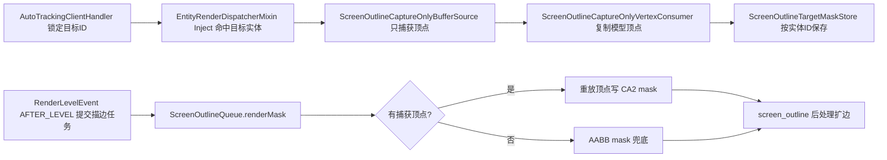

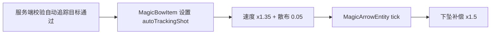

## Shader 文件索引

| 文件 | 类型 | 说明 |
|------|------|------|
| `shaders/core/coin_beam.vsh` / `.fsh` / `.json` | Core Shader | 光束 MRT 输出（CA0可见 + CA1 Bloom），含辉光/噪声/闪烁/淡出 |
| `shaders/core/coin_lightning.vsh` / `.fsh` / `.json` | Core Shader | 闪电 MRT 输出，unpackBloomColor 解包 bloom 色；主闪电 sprite 采样按 atlas 尺寸半 texel 内缩，降低线性过滤采到图集 padding 或相邻 texel 的风险 |
| `shaders/core/sword_aura.vsh` / `.fsh` / `.json` | Core Shader | 飞剑剑气实例化 MRT 输出，接收静态 mesh 的局部坐标/UV 与每实例 model/visual attribute，单实例同时输出可见色与 bloom |
| `shaders/core/dimension_slash_strike.vsh` / `.fsh` / `.json` | Core Shader | 次元斩连续白蓝斩击 MRT 输出，配合 `RenderType + VertexConsumer` 写入 CA0 和 CA1 bloom |
| `shaders/core/batto_slash.vsh` / `.fsh` / `.json` | Core Shader | 拔刀斩 MRT 输出，使用 daoguang 双管线材质，`revealU` 反转显现方向，`revealDuration=0.10` 配合 40 tick 生命周期保持快速出现，并复用 `MaskSpriteUV` 做 UV 扰动和后半段 dissolve 消散；当前 `dissolveProgress=smoothstep(0.50, 0.78, progress)`，不缩短生命周期但让后半段消散更早完成；已移除 `NoiseSpriteUV`、`SceneSampler` 和 `ScreenSize` |
| `shaders/core/outline_mask.vsh` / `.fsh` / `.json` | Core Shader | 屏幕空间描边 CA2 mask 写入，使用 `uView + ProjMat` 把世界空间几何输出为纯色 mask |
| `shaders/core/outline_captured_mask.vsh` / `.fsh` / `.json` | Core Shader | 捕获顶点专用 CA2 mask 写入，只用 `ProjMat` 直投影 view-space 顶点 |
| `shaders/core/trail_ribbon_shader.vsh` / `.fsh` / `.json` | Core Shader | 飞剑拖尾着色 |
| `shaders/post/final_shader.vsh` / `.fsh` | Post Shader | 最终合成（mc + main + bloom 三纹理），并支持次元斩蓝紫领域径向重影、色散、边缘暗角与领域壁、更小且边缘更直的多层 Voronoi 杂乱碎片、透明暗边、先抖动后分块下落、径向拉伸和更强灰白高对比 |
| `shaders/post/bloom_blur.vsh` / `.fsh` | Post Shader | 半分辨率 Bloom 单向高斯模糊（5-tap：0.227, 0.195, 0.122, 0.054, 0.016），`BlurRadius` 控制采样范围 |
| `shaders/post/bloom_downsample.vsh` / `.fsh` | Post Shader | 全分辨率 Bloom source 的中心加权 5-tap 预过滤降采样，输出半分辨率纹理 |
| `shaders/post/screen_outline.vsh` / `.fsh` | Post Shader | 采样 `mainFBO.CA2` 的 R/G 通道做普通/火焰描边扩边，并输出 CA0 可见描边和 CA1 bloom source |
| `shaders/gpu/gpushader.comp` | Compute Shader | 粒子物理更新 + 新粒子生成（SSBO binding 0/1）；支持圆形、径向扩散、方向平面随机、噪声流场上升运动、速度曲线、材质 pipeline active index 写入 |
| `shaders/gpu/gpushader.vsh` / `.fsh` / `particle_light_effect.*` / `particle_magic_circle_energy.*` / `particle_ex_sword_wave.*` / `particle_star_texture.*` / `particle_rising_shockwave.*` | GPU Shader | GPU 粒子实例化渲染；支持 SDF 三段颜色、LIGHT_EFFECT 发射器级圆形 mask 与顶部消散、双纹理径向法阵，由发射器核心色生成高亮层的世界竖直 EX 剑气，R 通道透明度的相机朝向星星贴图粒子，以及使用世界水平 Fresnel 和 `vLocalUv.y` 顶部淡化的 t_fx_tile_0016 程序化圆台上升冲击波 |

---

*此文件按 docs/repomap.md 提示词格式生成，提交到仓库根目录供团队成员和 AI 直接使用。*
---

## 增量更新 — 后处理 mainFBO 主深度同步修复

#### `render/finalRender/PostProcessing.java`
**更新职责**：`buildBuffer(RenderTarget)` 在每帧写入模组效果前先将 Minecraft 主 RenderTarget 深度同步到 `mainFBO`，再以 `clearDepth=false` 绑定并清理 `CA0 / CA1`，避免光影下光束和雷电因 mainFBO 深度异常被深度测试挡掉。

| 符号 | 类型 | 签名 | 重要性 |
|------|------|------|--------|
| `buildBuffer(RenderTarget)` | method | `void` — 同步主深度并写入 CA0/CA1/CA2 后处理效果 | ⭐ 高 |

#### `render/frameBuffer/FBO.java`
**更新职责**：深度清理路径显式调用 `GL11.glClearDepth(1.0D)`，避免光影包残留 clear depth 状态影响 FBO 深度清理。

#### `docUse/post-processing-depth-sync-usage.md`
**新增职责**：记录光影下后处理 mainFBO 主深度同步修复的原因、代码位置和验证方式。

**核心链路**：
```mermaid
flowchart LR
    A[PostProcessing.buildBuffer] --> B[FrameBufferUtil.copyFBODepth]
    B --> C[mainFBO.bindFrameBuffer(false, 0, 1)]
    C --> D[CA0 可见效果]
    C --> E[CA1 bloom source]
    C --> F[CA2 描边 mask]
```

## 增量更新 — 拔刀斩常显与高精确描边 Inject 捕获

### 变更概览

本次更新基于 `master` 新建 `0.0.4` 分支完成，目标是让拔刀斩本体不受场景深度测试遮挡，同时将自动追踪高精确描边的实体顶点捕获从 `@Redirect` 改为低侵入 `@Inject`。描边仍保留高精确模型顶点，不切换到 AABB 作为主路径。

#### `render/renderType/BattoSlashType/BattoSlashRenderType.java`
**更新职责**：拔刀斩 RenderType 继续使用自定义 atlas、`batto_slash` core shader 和普通 alpha 混合，但深度状态从 `LEQUAL_DEPTH_TEST` 改为 `NO_DEPTH_TEST`，保证刀光始终写入 `mainFBO.CA0 / CA1`。

| 符号 | 类型 | 签名 | 重要性 |
|------|------|------|--------|
| `RENDER_TYPE` | field | `RenderType` — 拔刀斩常显 RenderType | ⭐ 高 |
| `getRenderType` | method | `RenderType getRenderType()` | ⭐ 高 |

#### `mixin/EntityRenderDispatcherMixin.java`
**更新职责**：不再通过 `@Redirect` 替换原版 `EntityRenderer.render(...)` 调用；改为 `@Inject` 到该调用前，对当前自动追踪锁定目标额外执行一次只捕获顶点的 renderer 调用，降低和其他渲染类模组冲突的概率。

| 符号 | 类型 | 签名 | 重要性 |
|------|------|------|--------|
| `getRenderer` | shadow method | `<E extends Entity> EntityRenderer<? super E> getRenderer(E entity)` | ⭐ 高 |
| `akatzumatool$captureOutlineVertices` | inject method | `void (...)` | ⭐ 高 |

#### `render/finalRender/outline/ScreenOutlineCaptureOnlyBufferSource.java`
**新增职责**：只捕获顶点的 `MultiBufferSource`，在额外实体渲染时为任意 `RenderType` 返回 `ScreenOutlineCaptureOnlyVertexConsumer`，不向原始画面写入顶点。

| 符号 | 类型 | 签名 | 重要性 |
|------|------|------|--------|
| `ScreenOutlineCaptureOnlyBufferSource` | class | `class ScreenOutlineCaptureOnlyBufferSource implements MultiBufferSource` | ⭐ 高 |
| `getBuffer` | method | `VertexConsumer getBuffer(RenderType renderType)` | ⭐ 高 |

#### `render/finalRender/outline/ScreenOutlineCaptureOnlyVertexConsumer.java`
**新增职责**：只记录实体模型顶点到 `ScreenOutlineCapturedMaskBuffer`，矩阵顶点通过 `Matrix4f.transformPosition(...)` 保持与原版模型变换一致，所有颜色、UV、法线写入均作为 no-op 返回自身。

| 符号 | 类型 | 签名 | 重要性 |
|------|------|------|--------|
| `ScreenOutlineCaptureOnlyVertexConsumer` | class | `class ScreenOutlineCaptureOnlyVertexConsumer implements VertexConsumer` | ⭐ 高 |
| `vertex` | method | `VertexConsumer vertex(double x, double y, double z)` | ⭐ 高 |
| `vertex` | method | `VertexConsumer vertex(Matrix4f matrix, float x, float y, float z)` | ⭐ 高 |

#### `docUse/batto-slash-visible-outline-inject-usage.md`
**新增职责**：记录拔刀斩常显、描边 Inject 高精确捕获的使用方式、代码位置和验证步骤。

#### `docUse/magic-bow-auto-tracking-usage.md`
**更新职责**：同步自动追踪屏幕空间描边文档，将旧 `@Redirect + 转发捕获` 描述更新为 `@Inject + 只捕获额外渲染`。

### 更新后的核心调用链

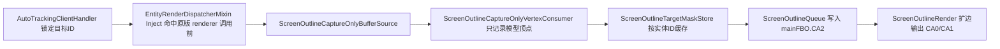

### 注意事项

- 拔刀斩 `NO_DEPTH_TEST` 是表现型常显效果，遮挡物后也能看到刀光。
- 自动追踪描边仍优先使用捕获模型顶点，AABB 只作为特殊实体无顶点时的 fallback。
- `@Inject` 路径会对锁定目标额外执行一次 renderer，但使用只捕获 buffer，不会重复绘制实体本体。

## 增量更新 — 后处理 Phase 分组与 GL 状态管理

### 变更概览

本次更新按 `docs/sword/8-8.md` 的推荐方案执行第一阶段核心改造：新增后处理 phase 分类，让需要深度测试的 bloom 队列和不需要深度测试的常显队列分开渲染；新增轻量 `PostRenderContext` 作为后处理内部 GL 状态入口；拔刀斩归入常显世界空间阶段，避免被主场景深度遮挡。

#### `render/finalRender/PostRenderPhase.java`
**新增职责**：定义后处理队列渲染阶段，供 `EntityQueue` 和 `PostProcessing` 统一表达 GL 状态需求。

| 符号 | 类型 | 签名 | 重要性 |
|------|------|------|--------|
| `PostRenderPhase` | enum | `DEPTH_TESTED_WORLD, ALWAYS_VISIBLE_WORLD, SCREEN_MASK, SCREEN_SPACE` | ⭐ 高 |

#### `render/finalRender/PostRenderContext.java`
**新增职责**：缓存后处理内部常用 GL 状态，集中处理 FBO 绑定、draw buffer、深度状态和 RenderType / 自管 VAO 阶段边界 reset。

| 符号 | 类型 | 签名 | 重要性 |
|------|------|------|--------|
| `bindFrameBuffer` | method | `void bindFrameBuffer(FBO fbo, boolean clearDepth, int... colorAttachmentsToClear)` | ⭐ 高 |
| `bindMinecraftFrameBuffer` | method | `void bindMinecraftFrameBuffer(FBO currentFbo, RenderTarget renderTarget)` | ⭐ 高 |
| `setDrawBuffer` | method | `void setDrawBuffer(FBO fbo, int attachment)` | 普通 |
| `setDrawBuffers` | method | `void setDrawBuffers(FBO fbo, int... attachments)` | ⭐ 高 |
| `clearColorAttachment` | method | `void clearColorAttachment(FBO fbo, int attachment, float red, float green, float blue, float alpha)` | 普通 |
| `setDepthState` | method | `void setDepthState(boolean depthTest, boolean depthMask, int newDepthFunc)` | ⭐ 高 |
| `resetForMinecraftBufferSource` | method | `void resetForMinecraftBufferSource()` | ⭐ 高 |

#### `render/finalRender/queue/EntityQueue.java`
**更新职责**：新增默认 phase，普通实体/bloom 队列默认属于 `DEPTH_TESTED_WORLD`。

| 符号 | 类型 | 签名 | 重要性 |
|------|------|------|--------|
| `getPhase` | method | `PostRenderPhase getPhase()` | ⭐ 高 |

#### `render/finalRender/bloomQueue/BattoSlashQueue.java`
**更新职责**：覆盖 `getPhase()` 返回 `ALWAYS_VISIBLE_WORLD`，拔刀斩在关闭深度测试的常显阶段渲染。

| 符号 | 类型 | 签名 | 重要性 |
|------|------|------|--------|
| `getPhase` | method | `PostRenderPhase getPhase()` | ⭐ 高 |

#### `render/finalRender/FinalRender.java`
**更新职责**：新增无实体闪电队列渲染入口和按 phase 渲染 bloom 队列入口，原 `addToBloomBuffer` 保留为兼容封装。

| 符号 | 类型 | 签名 | 重要性 |
|------|------|------|--------|
| `renderLightningQueue` | method | `void renderLightningQueue(Camera camera, float partialTick, Matrix4f viewMatrix)` | 普通 |
| `renderBloomQueuesByPhase` | method | `void renderBloomQueuesByPhase(PostRenderPhase phase, Camera camera, float partialTick, Matrix4f viewMatrix, float frameDeltaSeconds)` | ⭐ 高 |

#### `render/finalRender/PostProcessing.java`
**更新职责**：`buildBuffer` 按 phase 分段设置深度状态：先渲染需要主场景深度的世界空间效果，再渲染 GPU 粒子，最后关闭深度测试渲染拔刀斩常显队列；描边分支不再重复绑定 `mainFBO`。

| 符号 | 类型 | 签名 | 重要性 |
|------|------|------|--------|
| `postRenderContext` | field | `PostRenderContext` | ⭐ 高 |
| `buildBuffer` | method | `void buildBuffer(RenderTarget renderTarget)` | ⭐ 高 |

#### `docUse/post-processing-phase-state-usage.md`
**新增职责**：记录后处理 phase 分组、拔刀斩常显阶段、代码位置和验证方式。

### 核心调用链

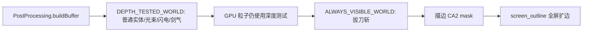

### 注意事项

- `PostRenderContext` 当前是第一阶段轻量接入，还没有完全接管 atlas 绑定、fullscreen pass 和所有自管 VAO 状态。
- `RenderType` 的 `TextureStateShard` 暂时保留，避免破坏 Minecraft 批处理纹理绑定语义。
- 新增常显 bloom 效果时优先覆盖 `EntityQueue.getPhase()`，不要在队列内部随意抢全局深度状态。
---

## 增量更新 — 后处理队列空跳过与描边三角化 / Post-processing empty queue skip and outline triangulation

#### `render/finalRender/FinalRender.java`
**更新职责**：实体 bloom/phase 队列改为 class 注册表和 active phase 索引；新增 phase 队列空判断和闪电队列空判断，供 `PostProcessing.buildBuffer` 在设置 GL 状态前短路空阶段。

| 符号 | 类型 | 签名 | 重要性 |
|------|------|------|--------|
| `hasLightningQueue` | method | `boolean hasLightningQueue()` | 普通 |
| `hasBloomQueuesByPhase` | method | `boolean hasBloomQueuesByPhase(PostRenderPhase phase)` | ⭐ 高 |
| `renderBloomQueuesByPhase` | method | `void renderBloomQueuesByPhase(PostRenderPhase phase, Camera camera, float partialTick, Matrix4f viewMatrix, float frameDeltaSeconds)` | ⭐ 高 |

#### `render/finalRender/PostProcessing.java`
**更新职责**：`buildBuffer(RenderTarget)` 保留 `frameDelta` 每帧计算，但根据深度 phase 队列、GPU 粒子、常显 phase 队列是否为空跳过对应渲染阶段；移除飞剑拖尾专用的普通 `CA0` 单附件阶段。

| 符号 | 类型 | 签名 | 重要性 |
|------|------|------|--------|
| `buildBuffer` | method | `void buildBuffer(RenderTarget renderTarget)` — 按队列空状态短路 phase 渲染 | ⭐ 高 |

#### `render/finalRender/outline/ScreenOutlineCapturedBatch.java`
**新增职责**：保存单个 `RenderType.mode()` 对应的捕获顶点批次，避免不同 primitive mode 或不同 RenderType 的顶点混在一起。

| 符号 | 类型 | 签名 | 重要性 |
|------|------|------|--------|
| `ScreenOutlineCapturedBatch` | class | `class ScreenOutlineCapturedBatch` | ⭐ 高 |
| `mode` | field | `VertexFormat.Mode` | ⭐ 高 |
| `addVertex` | method | `void addVertex(double x, double y, double z)` | 普通 |
| `getVertices` | method | `List<ScreenOutlineCapturedVertex> getVertices()` | 普通 |

#### `render/finalRender/outline/ScreenOutlineCapturedMaskBuffer.java`
**更新职责**：从单一 flat 顶点列表改为保存多个 `ScreenOutlineCapturedBatch`，每个批次保留原始 primitive mode。

| 符号 | 类型 | 签名 | 重要性 |
|------|------|------|--------|
| `batches` | field | `List<ScreenOutlineCapturedBatch>` | ⭐ 高 |
| `beginBatch` | method | `ScreenOutlineCapturedBatch beginBatch(VertexFormat.Mode mode)` | ⭐ 高 |
| `getBatches` | method | `List<ScreenOutlineCapturedBatch> getBatches()` | 普通 |

#### `render/finalRender/outline/ScreenOutlineCaptureOnlyBufferSource.java`
**更新职责**：`getBuffer(RenderType)` 根据原始 `RenderType.mode()` 创建独立捕获批次，再返回只捕获顶点的 consumer。

#### `render/finalRender/outline/ScreenOutlineCaptureBufferSource.java`
**更新职责**：包装原始 `MultiBufferSource` 时同样按 `RenderType.mode()` 创建独立捕获批次，保留兼容的转发捕获路径。

#### `render/finalRender/outline/ScreenOutlineCaptureOnlyVertexConsumer.java`
**更新职责**：把捕获顶点写入当前 `ScreenOutlineCapturedBatch`，不再直接写入全局 flat buffer。

#### `render/finalRender/outline/ScreenOutlineCaptureVertexConsumer.java`
**更新职责**：转发原始实体顶点的同时，把捕获顶点写入当前 `ScreenOutlineCapturedBatch`。

#### `render/finalRender/outline/ScreenOutlineQueue.java`
**更新职责**：捕获实体 mask 重放改为遍历 batch，并按 `QUADS`、`TRIANGLES`、`TRIANGLE_STRIP`、`TRIANGLE_FAN` 统一三角化写入 CA2；不再保留 captured QUADS RenderType 兼容路径。

| 符号 | 类型 | 签名 | 重要性 |
|------|------|------|--------|
| `writeCapturedEntityMask` | method | `boolean writeCapturedEntityMask(VertexConsumer consumer, Entity entity, ScreenOutlineStyle style)` — 遍历捕获批次并三角化 | ⭐ 高 |
| `writeCapturedBatchAsTriangles` | method | `boolean writeCapturedBatchAsTriangles(VertexConsumer consumer, ScreenOutlineCapturedBatch batch, float red, float green, float blue, float alpha)` | ⭐ 高 |
| `writeQuadBatchAsTriangles` | method | `boolean writeQuadBatchAsTriangles(...)` | 普通 |
| `writeTriangleBatch` | method | `boolean writeTriangleBatch(...)` | 普通 |
| `writeTriangleStripBatch` | method | `boolean writeTriangleStripBatch(...)` | 普通 |
| `writeTriangleFanBatch` | method | `boolean writeTriangleFanBatch(...)` | 普通 |
| `writeTriangle` | method | `void writeTriangle(VertexConsumer consumer, ScreenOutlineCapturedVertex v0, ScreenOutlineCapturedVertex v1, ScreenOutlineCapturedVertex v2, float red, float green, float blue, float alpha)` | 普通 |

#### `render/renderType/ScreenOutlineType/OutlineCapturedMaskRenderType.java`
**更新职责**：捕获实体 mask RenderType 从 `VertexFormat.Mode.QUADS` 改为 `VertexFormat.Mode.TRIANGLES`，只接收三角化后的捕获几何。

#### `docUse/post-processing-empty-queue-outline-triangulation-usage.md`
**新增职责**：记录本次飞剑拖尾迁移、空队列短路和描边三角化的使用方式、代码位置与验证步骤。
---

## 增量更新 — 后处理 VAO 恢复与深度阶段合并 / Post-processing VAO restore and depth phase merge

#### `render/finalRender/PostRenderContext.java`
**更新职责**：缓存当前帧 Minecraft / RenderType 上传路径使用的 VAO，切回 `RenderType + VertexConsumer` 阶段前恢复 active VAO，避免 `Array object is not active`。

| 符号 | 类型 | 签名 | 重要性 |
|------|------|------|--------|
| `minecraftVao` | field | `int` — 当前帧 Minecraft VAO | ⭐ 高 |
| `beginFrame` | method | `void beginFrame(int minecraftVao)` — 记录当前帧 MC VAO | ⭐ 高 |
| `prepareMinecraftBufferSource` | method | `void prepareMinecraftBufferSource()` — 恢复 RenderType 批处理需要的 shader/VAO 状态 | ⭐ 高 |
| `resetForMinecraftBufferSource` | method | `void resetForMinecraftBufferSource()` — 兼容旧入口，内部恢复 MC VAO | 普通 |

#### `render/finalRender/PostProcessing.java`
**更新职责**：`doPostProcessing()` 在保存快照后把 `snapshot.prevVao` 写入 `PostRenderContext`；`buildBuffer(RenderTarget)` 将深度 phase 队列和 GPU 粒子合并到同一深度测试阶段，并在拔刀斩常显 phase、描边 mask 阶段前恢复 MC VAO。

| 符号 | 类型 | 签名 | 重要性 |
|------|------|------|--------|
| `doPostProcessing` | method | `void doPostProcessing()` — 保存 GL 快照后初始化当前帧 MC VAO | ⭐ 高 |
| `buildBuffer` | method | `void buildBuffer(RenderTarget renderTarget)` — 合并深度阶段并在 RenderType 阶段前恢复 VAO | ⭐ 高 |

#### `docUse/post-processing-vao-depth-phase-fix-usage.md`
**新增职责**：记录本次 VAO 恢复、拔刀斩 Array object 报错修复和深度阶段合并的代码位置、流程与验证方式。
---

## 增量更新 — FinalRender 队列注册与 active phase 索引 / FinalRender queue registry and active phase index

#### `render/finalRender/FinalRender.java`
**更新职责**：移除旧 `BloomQueueMap`/`EntityType` 入队路径，改用 `queueRegistrations` 按实体 class 查找队列，并用 `activeQueuesByPhase` 记录本帧实际有内容的 phase 队列。

| 符号 | 类型 | 签名 | 重要性 |
|------|------|------|--------|
| `queueRegistrations` | field | `Map<Class<? extends Entity>, EntityQueueRegistration<? extends Entity>>` | ⭐ 高 |
| `queuesByPhase` | field | `Map<PostRenderPhase, List<EntityQueue<? extends Entity>>>` | 普通 |
| `activeQueuesByPhase` | field | `Map<PostRenderPhase, List<EntityQueue<? extends Entity>>>` | ⭐ 高 |
| `activeTaskQueuesByPhase` | field | `Map<PostRenderPhase, List<PostRenderTaskQueue<? extends PostRenderTask>>>` — 当前活跃无实体任务队列 | ⭐ 高 |
| `activeTaskQueueSet` | field | `Set<PostRenderTaskQueue<? extends PostRenderTask>>` — 按对象身份去重 active task queue | ⭐ 高 |
| `registerQueue` | method | `<E extends Entity> void registerQueue(Class<E>, EntityQueue<E>, Predicate<E>, QueueAddAction<E>)` | ⭐ 高 |
| `registerTaskQueue` | method | `<Q extends PostRenderTask> void registerTaskQueue(PostRenderTaskQueue<Q> queue)` — 注册时检查重复 QueueType | ⭐ 高 |
| `markTaskQueueActive` | method | `void markTaskQueueActive(PostRenderTaskQueue<? extends PostRenderTask> queue)` | ⭐ 高 |
| `findRegistration` | method | `EntityQueueRegistration<? extends Entity> findRegistration(Entity entity)` | 普通 |
| `addBloomQueue` | method | `void addBloomQueue(T entity, PoseStack pose, Matrix4f modelViewMatrix)` | ⭐ 高 |
| `requestFlySwordTrail` | method | `void requestFlySwordTrail(FlySwordEntity entity)` — 记录 renderer 阶段发现的移动飞剑 | ⭐ 高 |
| `flushFlySwordTrails` | method | `void flushFlySwordTrails(Matrix4f modelMatrix)` — 使用 AFTER_ENTITIES 矩阵提交飞剑拖尾 | ⭐ 高 |
| `markActive` | method | `void markActive(EntityQueue<? extends Entity> queue)` | ⭐ 高 |
| `hasBloomQueuesByPhase` | method | `boolean hasBloomQueuesByPhase(PostRenderPhase phase)` — O(1) 查询 active queue | ⭐ 高 |
| `hasTaskQueuesByPhase` | method | `boolean hasTaskQueuesByPhase(PostRenderPhase phase)` — O(1) 查询 active task queue | ⭐ 高 |
| `compactActiveTaskQueues` | method | `void compactActiveTaskQueues(PostRenderPhase phase)` — 渲染后保留跨帧 active task queue | ⭐ 高 |
| `renderBloomQueuesByPhase` | method | `void renderBloomQueuesByPhase(PostRenderPhase phase, Camera camera, float partialTick, Matrix4f viewMatrix, float frameDeltaSeconds)` — 只遍历本帧 active queue | ⭐ 高 |
| `cleanUp` | method | `void cleanUp()` — 循环 taskQueueRegistrations 清理无实体队列，特殊 GPU 资源单独释放 | ⭐ 高 |

#### `render/finalRender/queue/EntityQueue.java`
**更新职责**：新增 `activeInFrame` 标记，避免同一队列同一帧重复加入 active phase 列表。

| 符号 | 类型 | 签名 | 重要性 |
|------|------|------|--------|
| `activeInFrame` | field | `boolean` | ⭐ 高 |

#### `render/finalRender/queue/EntityQueueRegistration.java`
**新增职责**：保存实体 class、目标队列、过滤条件和入队动作，替代 `FinalRender.addBloomQueue` 中的长类型判断。

| 符号 | 类型 | 签名 | 重要性 |
|------|------|------|--------|
| `EntityQueueRegistration<T extends Entity>` | class | `class EntityQueueRegistration<T extends Entity>` | ⭐ 高 |
| `tryAdd` | method | `boolean tryAdd(Entity entity, PoseStack pose, Matrix4f modelViewMatrix)` | ⭐ 高 |

#### `render/finalRender/queue/QueueAddAction.java`
**新增职责**：为通用实体队列注册项提供带 `PoseStack` 和 `modelViewMatrix` 的自定义入队动作；飞剑拖尾已改为独立 pending/flush 链路，不再通过这里更新矩阵。

| 符号 | 类型 | 签名 | 重要性 |
|------|------|------|--------|
| `QueueAddAction<T extends Entity>` | interface | `void add(EntityQueue<T> queue, T entity, PoseStack pose, Matrix4f modelViewMatrix)` | ⭐ 高 |

#### `render/finalRender/PostProcessing.java`
**更新职责**：`add(Entity, PoseStack)` 不再调用旧 `addQueue`，统一转入 `FinalRender.addBloomQueue(...)`；飞剑拖尾通过 `requestFlySwordTrail(...)` 记录 pending，并在 `flushFlySwordTrailPose(...)` 中使用 AFTER_ENTITIES 阶段 `PoseStack` 入队。
---

## 增量更新 — 实体描边透明剔除 / Entity outline transparent alpha discard

#### `render/finalRender/outline/ScreenOutlineQueue.java`
**更新职责**：实体描边 mask 写入优先走原版式 textured outline 路径，使用 `RenderType.outline()` 保留实体原纹理 alpha discard；不支持时回退捕获顶点，再失败回退 AABB。

| 符号 | 类型 | 签名 | 重要性 |
|------|------|------|--------|
| `renderMask` | method | `void renderMask(MultiBufferSource.BufferSource fboBuffer, Camera camera, float partialTick, Matrix4f viewMatrix)` | ⭐ 高 |
| `renderTexturedEntityMask` | method | `boolean renderTexturedEntityMask(Entity entity, Camera camera, float partialTick, ScreenOutlineStyle style)` | ⭐ 高 |

#### `render/finalRender/outline/ScreenOutlineTexturedBufferSource.java`
**新增职责**：只输出原版 outline 的 CA2 包装 RenderType，丢弃实体原始颜色写入，让 `rendertype_outline` 采样原纹理并剔除 alpha 为 0 的像素。

| 符号 | 类型 | 签名 | 重要性 |
|------|------|------|--------|
| `ScreenOutlineTexturedBufferSource` | class | `class ScreenOutlineTexturedBufferSource implements MultiBufferSource` | ⭐ 高 |
| `getBuffer` | method | `VertexConsumer getBuffer(RenderType renderType)` | ⭐ 高 |
| `endBatch` | method | `void endBatch()` | 普通 |
| `hasOutline` | method | `boolean hasOutline()` | 普通 |


#### `render/finalRender/outline/ScreenOutlineCa2RenderType.java`
**新增职责**：包装原版 `RenderType.outline()`，复用原版 outline shader/纹理/alpha discard，同时把 `OUTLINE_TARGET` 输出重定向回当前 `mainFBO.CA2`。

| 符号 | 类型 | 签名 | 重要性 |
|------|------|------|--------|
| `ScreenOutlineCa2RenderType` | class | `class ScreenOutlineCa2RenderType extends RenderType` | ⭐ 高 |
| `wrap` | method | `RenderType wrap(RenderType delegate)` | ⭐ 高 |
| `Ca2State` | class | `class Ca2State` | ⭐ 高 |
#### `render/finalRender/outline/ScreenOutlineTexturedVertexConsumer.java`
**新增职责**：保留实体原始 UV，覆盖顶点颜色为当前描边 mask 颜色，使原版 outline shader 能按原纹理 alpha discard。

| 符号 | 类型 | 签名 | 重要性 |
|------|------|------|--------|
| `ScreenOutlineTexturedVertexConsumer` | class | `class ScreenOutlineTexturedVertexConsumer implements VertexConsumer` | ⭐ 高 |
| `color` | method | `VertexConsumer color(int red, int green, int blue, int alpha)` | ⭐ 高 |
| `uv` | method | `VertexConsumer uv(float u, float v)` | 普通 |

#### `render/finalRender/outline/ScreenOutlineDiscardVertexConsumer.java`
**新增职责**：丢弃不支持 outline 的 RenderType 顶点，避免原始实体颜色污染 CA2。

| 符号 | 类型 | 签名 | 重要性 |
|------|------|------|--------|
| `ScreenOutlineDiscardVertexConsumer` | class | `class ScreenOutlineDiscardVertexConsumer implements VertexConsumer` | 普通 |
| `INSTANCE` | field | `ScreenOutlineDiscardVertexConsumer` | 普通 |

#### `docUse/实体描边透明剔除使用说明.md`
**新增职责**：记录本次原版式透明剔除描边路径、fallback 逻辑、代码位置和验证方式。
---

## 增量更新 — 描边坐标空间稳定修复 / Outline coordinate stability fix

#### `render/finalRender/outline/ScreenOutlineQueue.java`
**更新职责**：暂停原版 textured outline 作为实体描边主路径，默认回到 captured fallback / AABB fallback，避免后处理 `ModelViewMat` 与 camera-relative 坐标不一致导致描边跟随鼠标移动。

| 符号 | 类型 | 签名 | 重要性 |
|------|------|------|--------|
| `TEXTURED_ENTITY_MASK_ENABLED` | field | `boolean` — textured outline 主路径开关，默认关闭 | ⭐ 高 |
| `renderMask` | method | `void renderMask(MultiBufferSource.BufferSource fboBuffer, Camera camera, float partialTick, Matrix4f viewMatrix)` — 仅开关开启时尝试 textured outline，否则走 fallback | ⭐ 高 |
| `renderTexturedEntityMask` | method | `boolean renderTexturedEntityMask(Entity entity, Camera camera, float partialTick, ScreenOutlineStyle style)` — 开关关闭时直接返回 false | 普通 |

#### `docUse/描边跟随鼠标修复使用说明.md`
**新增职责**：记录本次暂停 textured outline 主路径、恢复 captured/AABB fallback 和验证鼠标移动漂移的方式。
---

## 增量更新 — 捕获描边透明剔除 / Captured outline transparent alpha discard

#### `render/finalRender/outline/ScreenOutlineQueue.java`
**更新职责**：captured fallback 重放阶段支持按批次使用原纹理 alpha discard；带纹理和 UV 的批次写入 textured captured mask，其他批次继续纯色 fallback。

| 符号 | 类型 | 签名 | 重要性 |
|------|------|------|--------|
| `writeCapturedEntityMask` | method | `boolean writeCapturedEntityMask(MultiBufferSource.BufferSource fboBuffer, Entity entity, ScreenOutlineStyle style)` | ⭐ 高 |
| `writeCapturedBatchAsTexturedTriangles` | method | `boolean writeCapturedBatchAsTexturedTriangles(VertexConsumer consumer, ScreenOutlineCapturedBatch batch, float red, float green, float blue, float alpha)` | ⭐ 高 |
| `writeTexturedVertex` | method | `void writeTexturedVertex(VertexConsumer consumer, ScreenOutlineCapturedVertex vertex, float red, float green, float blue, float alpha)` | 普通 |

#### `render/finalRender/outline/ScreenOutlineCapturedBatch.java`
**更新职责**：捕获批次新增原 RenderType 主纹理和 UV 可用标记，用于判断是否能走 textured captured mask。

#### `render/finalRender/outline/ScreenOutlineCapturedVertex.java`
**更新职责**：捕获顶点新增 `u/v/hasUv`，保留原实体纹理坐标。

#### `render/finalRender/outline/ScreenOutlineCaptureOnlyBufferSource.java`
**更新职责**：创建捕获批次时解析原 RenderType 主纹理。

#### `render/finalRender/outline/ScreenOutlineCaptureOnlyVertexConsumer.java`
**更新职责**：捕获实体 renderer 输出的 view-space position 和 UV，延迟到 `endVertex()` 写入批次。

#### `render/finalRender/outline/ScreenOutlineRenderTypeTextureResolver.java`
**新增职责**：通过 RenderType / RenderStateShard accessor 解析实体原 RenderType 的主纹理。

#### `render/renderType/ScreenOutlineType/OutlineCapturedTexturedMaskRenderType.java`
**新增职责**：定义带原纹理采样的 captured CA2 mask RenderType，使用 `POSITION_TEX_COLOR` 和 triangles。

#### `render/renderType/ScreenOutlineType/OutlineCapturedTexturedMaskShader.java`
**新增职责**：注册带 UV 的 captured mask core shader。

#### `mixin/RenderTypeCompositeRenderTypeAccessor.java`
**新增职责**：读取 `RenderType.CompositeRenderType` 的内部 `state`。

#### `mixin/RenderTypeCompositeStateAccessor.java`
**新增职责**：读取 `RenderType.CompositeState` 的 `textureState`。

#### `mixin/RenderStateShardEmptyTextureAccessor.java`
**新增职责**：调用 `EmptyTextureStateShard.cutoutTexture()` 获取主纹理。

#### `resources/assets/akatzumatool/shaders/core/outline_captured_textured_mask.*`
**新增职责**：view-space captured 顶点只乘 `ProjMat`，fragment shader 采样原纹理并 discard alpha 为 0 的像素。

#### `docUse/捕获描边透明剔除使用说明.md`
**新增职责**：记录 captured 路径透明剔除的执行流程、代码位置和验证方式。
---

## 增量更新 — 闪闪果实强化食物与火焰描边 Buff / Sparkling Fruit enhanced food and fire outline buff

#### `AkatZumaTool.java`
**更新职责**：新增 `SPARKLING_FRUIT` 物品注册，并注册 `EffectRegister` 的自定义 MobEffect 注册器。

| 符号 | 类型 | 签名 | 重要性 |
|------|------|------|--------|
| `SPARKLING_FRUIT` | field | `RegistryObject<Item>` — 闪闪果实强化食物 | ⭐ 高 |

#### `item/SparklingFruitItem.java`
**新增职责**：强化版金苹果食物，饥饿值补满，给予生命恢复 V 30 秒、伤害吸收 V 30 秒，并在食用完成后给任意 `LivingEntity` 添加 30 秒闪闪果实 Buff。

| 符号 | 类型 | 签名 | 重要性 |
|------|------|------|--------|
| `SparklingFruitItem` | class | `class SparklingFruitItem extends Item` | ⭐ 高 |
| `DEFAULT_BUFF_DURATION` | const | `int = 20 * 30` | 普通 |
| `SPARKLING_FRUIT_FOOD` | field | `FoodProperties` — 强化食物属性 | ⭐ 高 |
| `finishUsingItem` | method | `ItemStack finishUsingItem(ItemStack stack, Level level, LivingEntity entity)` | ⭐ 高 |

#### `effect/SparklingFruitEffect.java`
**新增职责**：闪闪果实 Buff 标记类，具体能力由事件、网络包和 Mixin 实现。

#### `event/EffectRegister.java`
**新增职责**：注册 `SPARKLING_FRUIT_EFFECT` 自定义 MobEffect。

| 符号 | 类型 | 签名 | 重要性 |
|------|------|------|--------|
| `EFFECTS` | field | `DeferredRegister<MobEffect>` | ⭐ 高 |
| `SPARKLING_FRUIT_EFFECT` | field | `RegistryObject<MobEffect>` | ⭐ 高 |
| `register` | method | `void register(IEventBus bus)` | ⭐ 高 |

#### `event/SparklingFruitEventHandler.java`
**新增职责**：实现闪闪果实 Buff 的服务端效果：除 `/kill` 外取消伤害并播放音效、取消击退、清火、入水移除 Buff、玩家飞行维持与恢复。

| 符号 | 类型 | 签名 | 重要性 |
|------|------|------|--------|
| `onLivingAttack` | method | `void onLivingAttack(LivingAttackEvent event)` | ⭐ 高 |
| `onLivingKnockBack` | method | `void onLivingKnockBack(LivingKnockBackEvent event)` | 普通 |
| `onLivingTick` | method | `void onLivingTick(LivingEvent.LivingTickEvent event)` | ⭐ 高 |
| `hasSparklingFruitEffect` | method | `boolean hasSparklingFruitEffect(LivingEntity entity)` | 普通 |

#### `common/SparklingFruitFlightState.java`
**新增职责**：记录玩家进入闪闪果实 Buff 前的飞行能力，Buff 结束、入水或退出时恢复/清理。

#### `event/client/SparklingFruitClientHandler.java`
**新增职责**：客户端检测 Ctrl 并发送加速 C2S 包；每帧把拥有闪闪果实 Buff 的可见实体提交到 `ScreenOutlineStyle.FIRE_ORANGE` 火焰描边；为实体渲染捕获阶段提供 Buff 目标判断。

| 符号 | 类型 | 签名 | 重要性 |
|------|------|------|--------|
| `onClientTick` | method | `void onClientTick(TickEvent.ClientTickEvent event)` | ⭐ 高 |
| `submitSparklingFruitFireOutlines` | method | `void submitSparklingFruitFireOutlines(ClientLevel level)` | ⭐ 高 |
| `shouldCaptureSparklingFruitOutline` | method | `boolean shouldCaptureSparklingFruitOutline(Entity entity)` | ⭐ 高 |

####
etwork/SparklingBoostC2SPacket.java`
**新增职责**：客户端请求闪闪果实 Ctrl 加速，服务端校验 Buff 和短冷却后按玩家视线方向叠加速度。

| 符号 | 类型 | 签名 | 重要性 |
|------|------|------|--------|
| `BOOST_STRENGTH` | const | `double = 0.65D` | 普通 |
| `handle` | method | `void handle(Supplier<NetworkEvent.Context> contextSupplier)` | ⭐ 高 |
| `canBoostNow` | method | `boolean canBoostNow(ServerPlayer player)` | 普通 |

#### `mixin/SparklingFruitWebMixin.java`
**新增职责**：拦截 `Entity.makeStuckInBlock(BlockState, Vec3)`，拥有闪闪果实 Buff 且方块为蜘蛛网时取消速度乘法，实现蜘蛛网减速免疫。

#### `mixin/EntityRenderDispatcherMixin.java`
**更新职责**：自动追踪目标之外，也会对拥有闪闪果实 Buff 的实体执行只捕获顶点的 renderer 调用，让火焰描边优先走 captured mask 和透明剔除路径。

#### `RenderLevelEvent.java`
**更新职责**：在 `AFTER_LEVEL` 阶段、后处理执行前提交闪闪果实火焰描边目标。

####
etwork/NetworkRegister.java`
**更新职责**：注册 `SparklingBoostC2SPacket` C2S 网络包。

#### `docUse/sparkling-fruit-usage.md`
**新增职责**：记录闪闪果实使用方式、代码位置和验证建议。
---

## 增量更新 — 闪闪果实音效与安全瞬移 / Sparkling Fruit sounds and safe blink

#### `config/ConfigFile.java`
**更新职责**：新增 `sparklingFruit` 配置分组，提供 Buff 持续时间、飞行速度、Ctrl 瞬移距离和 Ctrl 冷却读取入口。

| 符号 | 类型 | 签名 | 重要性 |
|------|------|------|--------|
| `SPARKLING_FRUIT_BUFF_DURATION_TICKS` | field | `IntValue` — 闪闪果实 Buff 持续 tick | ⭐ 高 |
| `SPARKLING_FRUIT_FLIGHT_SPEED` | field | `DoubleValue` — Buff 期间飞行速度 | 普通 |
| `SPARKLING_FRUIT_CTRL_TELEPORT_DISTANCE` | field | `DoubleValue` — Ctrl 单次瞬移距离 | ⭐ 高 |
| `SPARKLING_FRUIT_CTRL_COOLDOWN_TICKS` | field | `IntValue` — Ctrl 瞬移冷却 | 普通 |

#### `AkatZumaTool.java`
**更新职责**：`SPARKLING_FRUIT` 物品注册改为运行时读取配置的构造方式，并新增 `sparkling_1`、`sparkling_2` 两个音效注册。

#### `item/SparklingFruitItem.java`
**更新职责**：食用完成时从 `ConfigFile` 读取 Buff 持续时间，添加 Buff 后在服务端播放 `SPARKLING_1`。

#### `common/SparklingFruitFlightState.java`
**更新职责**：飞行状态快照新增 `flyingSpeed`，Buff 期间写入配置飞行速度，恢复时还原原始飞行速度。

#### `event/client/SparklingFruitClientHandler.java`
**更新职责**：Ctrl 处理从按住周期发包改为按下边沿触发一次瞬移请求，客户端冷却读取配置。

####
etwork/SparklingBoostC2SPacket.java`
**更新职责**：原速度叠加逻辑改为服务端安全瞬移。服务端校验 Buff 和冷却后沿玩家视线方向搜索安全目标点，成功时 teleport 并播放 `SPARKLING_2`。

| 符号 | 类型 | 签名 | 重要性 |
|------|------|------|--------|
| `tryTeleport` | method | `boolean tryTeleport(ServerPlayer)` — 执行安全瞬移和音效 | ⭐ 高 |
| `findSafeTeleportTarget` | method | `Vec3 findSafeTeleportTarget(ServerPlayer, double)` — 沿视线回退搜索目标点 | ⭐ 高 |
| `isSafeTeleportPosition` | method | `boolean isSafeTeleportPosition(ServerPlayer, Vec3)` — 校验碰撞箱、液体和危险方块 | ⭐ 高 |
| `isHazardBlock` | method | `boolean isHazardBlock(BlockState)` — 判断火焰/岩浆/接触伤害方块 | 普通 |

#### `event/SparklingFruitEventHandler.java`
**更新职责**：取消所有被闪闪果实免疫伤害时的音效播放，并在 Buff 期间移除 `MobEffects.DARKNESS`。

#### 资源与文档
**更新职责**：`sounds.json`、中英文 lang 注册 `sparkling_1`/`sparkling_2` 字幕；新增 `textures/mob_effect/sparkling_fruit_effect.png` 复用物品图标；`docUse/sparkling-fruit-usage.md` 记录配置、安全瞬移、音效和验证方式。
---

## 增量更新 — 闪闪果实 Alt 瞬移与描边 mask 稳定 / Sparkling Fruit Alt blink and outline mask stability

#### `event/client/SparklingFruitClientHandler.java`
**更新职责**：闪闪果实瞬移输入从 Ctrl 改为左右 Alt，输入状态字段改为 `lastTeleportKeyDown`，客户端冷却字段改为 `teleportCooldown`。

#### `config/ConfigFile.java`
**更新职责**：闪闪果实瞬移配置从 Ctrl 命名改为输入无关命名，保留当前默认瞬移距离 `16.0D` 和飞行速度上限 `5.0D`。

| 符号 | 类型 | 签名 | 重要性 |
|------|------|------|--------|
| `SPARKLING_FRUIT_TELEPORT_DISTANCE` | field | `DoubleValue` — Alt 瞬移距离配置 | ⭐ 高 |
| `SPARKLING_FRUIT_TELEPORT_COOLDOWN_TICKS` | field | `IntValue` — Alt 瞬移冷却配置 | 普通 |
| `sparklingFruitTeleportDistance` | method | `double` — 读取瞬移距离 | ⭐ 高 |
| `sparklingFruitTeleportCooldownTicks` | method | `int` — 读取瞬移冷却 | 普通 |

####
etwork/SparklingBoostC2SPacket.java`
**更新职责**：安全瞬移包读取新的输入无关配置 getter，注释同步为 Alt 朝向安全瞬移。

#### `render/finalRender/outline/ScreenOutlineQueue.java`
**更新职责**：实体描边 mask 优先恢复原版式 textured outline 路径，复用原纹理、UV、alpha discard 和 RenderType 状态；captured/AABB 路径保留为 fallback。

#### `render/finalRender/outline/ScreenOutlineTargetMaskStore.java`
**更新职责**：新增捕获帧号，捕获缓存改为每帧首次捕获清空，同一帧重复捕获追加，避免局部 layer 覆盖完整实体 mask。

#### `render/finalRender/outline/ScreenOutlineCapturedMaskBuffer.java`
**更新职责**：新增 `frameId`，并提供 `getOrCreateBatch` 复用同 mode/texture 批次，减少同帧重复捕获时的 batch 抖动。

#### `event/RenderLevelEvent.java`
**更新职责**：在 `AFTER_LEVEL` 阶段后处理结束后推进描边捕获帧号，保证下一帧首次捕获会清理旧数据。

#### `docUse/sparkling-fruit-usage.md`
**更新职责**：更新 Alt 安全瞬移、输入无关配置项和火焰描边 mask 稳定策略说明。
---

## 增量更新 — 原版式 outline 矩阵修复 / Vanilla-style outline matrix fix

#### `render/finalRender/outline/ScreenOutlineQueue.java`
**更新职责**：原版式 textured outline 写 CA2 mask 前临时恢复原版实体渲染使用的相机旋转 `ModelView PoseStack`，使 camera-relative 实体坐标和 outline shader 的 `ModelViewMat` 匹配，避免火焰描边随鼠标视角移动。

| 符号 | 类型 | 签名 | 重要性 |
|------|------|------|--------|
| `pushEntityModelView` | method | `void pushEntityModelView(Camera camera)` — push 当前 ModelView PoseStack 并设置相机旋转矩阵 | ⭐ 高 |
| `popEntityModelView` | method | `void popEntityModelView()` — pop 并恢复进入 outline 重绘前的 ModelView PoseStack | ⭐ 高 |
| `renderTexturedEntityMask` | method | `boolean renderTexturedEntityMask(Entity, Camera, float, ScreenOutlineStyle)` — 在 push/pop 保护内重绘原版式 outline mask | ⭐ 高 |

#### `docUse/sparkling-fruit-usage.md`
**更新职责**：补充火焰描边 mask 现在会在原版式 outline 重绘前恢复相机旋转矩阵，并新增“只移动鼠标不漂移”的验证建议。
---

## 增量更新 — 原版式 outline 矩阵快照修复 / Vanilla-style outline matrix snapshot fix

#### `render/finalRender/outline/ScreenOutlineEntityRenderState.java`
**更新职责**：新增实体原版渲染入口矩阵快照，保存 dispatcher 入参、PoseStack 顶层矩阵、ModelViewMat、ProjectionMat、frameId 和实体平移标记。

| 符号 | 类型 | 签名 | 重要性 |
|------|------|------|--------|
| `ScreenOutlineEntityRenderState` | class | `ScreenOutlineEntityRenderState(...)` — 复制原版实体渲染状态矩阵 | ⭐ 高 |
| `isCurrentFrame` | method | `boolean isCurrentFrame(int)` — 判断快照是否属于当前捕获帧 | 普通 |

#### `mixin/EntityRenderDispatcherMixin.java`
**更新职责**：在目标实体原版 renderer 调用前复制 `PoseStack`、`ModelViewMat`、`ProjectionMat` 和 dispatcher 入参，供后处理原版式 outline 重绘复用。

#### `render/finalRender/outline/ScreenOutlineTargetMaskStore.java`
**更新职责**：新增 `RENDER_STATES` 快照缓存，按实体 ID 保存并按 frameId 丢弃过期快照；`clear`/`clearAll` 同步清理顶点缓存和矩阵快照。

| 符号 | 类型 | 签名 | 重要性 |
|------|------|------|--------|
| `putRenderState` | method | `void putRenderState(int, ScreenOutlineEntityRenderState)` — 保存实体矩阵快照 | ⭐ 高 |
| `getRenderState` | method | `ScreenOutlineEntityRenderState getRenderState(int)` — 读取当前帧快照 | ⭐ 高 |

#### `render/finalRender/outline/ScreenOutlineQueue.java`
**更新职责**：原版式 textured outline 重绘优先使用 Mixin 捕获到的 `ModelViewMat` 与 dispatcher `x/y/z/yaw/partialTick`，无快照时才回退相机旋转矩阵，减少火焰描边随鼠标视角漂移。

#### `docUse/sparkling-fruit-usage.md`
**更新职责**：更新火焰描边 mask 稳定性说明，记录原版渲染矩阵快照优先、相机旋转矩阵 fallback 的策略。
---

## 增量更新 — captured textured mask 颜色完整性修复 / Captured textured mask color completeness fix

#### `render/finalRender/outline/ScreenOutlineQueue.java`
**更新职责**：关闭后处理阶段原版式 textured outline 重绘，实体 mask 主路径改回 captured textured mask；`renderMask` 直接消费捕获批次，失败后才走 AABB fallback。

| 符号 | 类型 | 签名 | 重要性 |
|------|------|------|--------|
| `TEXTURED_ENTITY_MASK_ENABLED` | field | `boolean` — 原版式 outline 重绘开关，当前固定关闭 | ⭐ 高 |
| `writeCapturedEntityMask` | method | `boolean writeCapturedEntityMask(BufferSource, Entity, ScreenOutlineStyle)` — captured textured mask 主写入路径 | ⭐ 高 |

#### `mixin/EntityRenderDispatcherMixin.java`
**更新职责**：移除原版矩阵快照实验代码，仅保留实体原版渲染阶段的 captured 顶点/UV/纹理捕获。

#### `render/finalRender/outline/ScreenOutlineTargetMaskStore.java`
**更新职责**：移除 `RENDER_STATES` 矩阵快照缓存，只维护 captured mask batch 缓存和 frameId 清理逻辑。

#### `render/renderType/ScreenOutlineType/OutlineCapturedTexturedMaskRenderType.java`
**更新职责**：captured textured mask 写 CA2 时关闭深度测试、保留 `NO_CULL` 和 `COLOR_WRITE`，避免主场景 depth/cull 状态造成玩家 mask 颜色不全。

#### `render/renderType/ScreenOutlineType/OutlineCapturedMaskRenderType.java`
**更新职责**：纯色 captured mask 同步关闭深度测试，保证 fallback triangles mask 不被场景深度裁掉。

#### `docUse/sparkling-fruit-usage.md`
**更新职责**：更新火焰描边说明为 captured textured mask 主路径，并记录 RenderDoc 排查重点：纹理绑定、alpha discard、primitive 展开和 batch flush。
---

## 增量更新 — captured mask 深度状态回退测试 / Captured mask depth state revert test

#### `render/renderType/ScreenOutlineType/OutlineCapturedTexturedMaskRenderType.java`
**更新职责**：captured textured mask 写 CA2 的深度状态从 `NO_DEPTH_TEST` 恢复为 `LEQUAL_DEPTH_TEST`，保留 `NO_CULL` 和 `COLOR_WRITE`，用于对照测试 mask 颜色不全是否由深度状态引起。

#### `render/renderType/ScreenOutlineType/OutlineCapturedMaskRenderType.java`
**更新职责**：纯色 captured mask 同步恢复 `LEQUAL_DEPTH_TEST`，保持和 textured captured mask 一致的深度测试策略。

#### `docUse/sparkling-fruit-usage.md`
**更新职责**：更新火焰描边 mask 状态说明，记录当前 captured mask 使用 `LEQUAL_DEPTH_TEST + NO_CULL + COLOR_WRITE` 进行对照测试。
---

## 增量更新 — 描边捕获逻辑回退 / Revert outline capture logic

#### `render/finalRender/outline/ScreenOutlineQueue.java`
**更新职责**：恢复到首次 mask 修复前的描边队列逻辑，保留默认关闭的原版式 textured outline 分支，实体 mask 仍先尝试 captured mask，失败后走 AABB fallback。

#### `render/finalRender/outline/ScreenOutlineCaptureBufferSource.java`
**更新职责**：恢复普通捕获 buffer 的 batch 创建方式，不再按 RenderType 纹理复用 batch。

#### `render/finalRender/outline/ScreenOutlineCaptureOnlyBufferSource.java`
**更新职责**：恢复只捕获 buffer 的 batch 创建方式，每次 `getBuffer` 直接创建新 batch，避免同帧重复捕获被合并成双份玩家。

#### `render/finalRender/outline/ScreenOutlineCapturedMaskBuffer.java`
**更新职责**：移除 frameId 与 `getOrCreateBatch` 实验逻辑，恢复简单 batch 列表。

#### `render/finalRender/outline/ScreenOutlineTargetMaskStore.java`
**更新职责**：恢复 `beginCapture` 每次清空目标实体缓存的策略，移除 frameId 生命周期管理。

#### `event/RenderLevelEvent.java`
**更新职责**：移除 `ScreenOutlineTargetMaskStore.beginFrame()` 调用，避免引用已回退的 frameId API。

#### `docUse/sparkling-fruit-usage.md`
**更新职责**：记录当前回退策略和 RenderDoc 验证重点：玩家 captured 顶点数应从 `2028` 回到约 `1014`。

#### `docs/huangyuan/1-3-2fix.md`
**更新职责**：新增描边代码回退方案，说明以 `212637e` 为描边基线，选择性恢复 outline/captured mask 相关文件。
---

## 增量更新 — 第一人称自身火焰描边过滤 / First-person self fire outline filter

#### `event/client/SparklingFruitClientHandler.java`
**更新职责**：闪闪果实火焰描边提交和实体渲染捕获判断新增第一人称本地玩家过滤；第一人称隐藏自己的火焰描边，第三人称自己和其他带 Buff 实体仍保留火焰描边。

| 符号 | 类型 | 签名 | 重要性 |
|------|------|------|--------|
| `shouldSkipFirstPersonLocalPlayerOutline` | method | `boolean shouldSkipFirstPersonLocalPlayerOutline(Entity entity)` — 判断是否跳过第一人称本地玩家自己的火焰描边 | 普通 |

#### `docUse/sparkling-fruit-usage.md`
**更新职责**：补充第一人称自身火焰描边过滤行为和验证建议。
---

## 增量更新 — 闪闪果实能力调整与描边清理 / Sparkling Fruit ability update and outline cleanup

#### config/ConfigFile.java
**更新职责**：闪闪果实配置删除 flightSpeed，新增 speedAmplifier 与 jumpAmplifier，Alt 瞬移距离和客户端冷却配置保留。

| 符号 | 类型 | 签名 | 重要性 |
|------|------|------|--------|
| sparklingFruitSpeedAmplifier | method | int sparklingFruitSpeedAmplifier() | 普通 |
| sparklingFruitJumpAmplifier | method | int sparklingFruitJumpAmplifier() | 普通 |

#### effect/sparkling/SparklingFruitEffect.java
**移动职责**：闪闪果实 MobEffect 标记类移动到 effect/sparkling 包。

#### effect/sparkling/SparklingFruitTeleportParticles.java
**新增职责**：客户端使用本模组 GPU 粒子系统在瞬移原位置按玩家身高提交多个 ParticleEmitTask burst。

#### item/SparklingFruitItem.java
**更新职责**：食用闪闪果实时除原有强化金苹果效果和闪闪果实 Buff 外，给玩家添加速度和跳跃提升效果，持续时间读取配置。

#### event/SparklingFruitEventHandler.java
**更新职责**：移除玩家飞行维持与恢复逻辑；Buff 期间保留无敌、击退取消、清火、抗黑暗和入水取消，入水时同步移除速度与跳跃效果。

#### network/SparklingBoostC2SPacket.java
**更新职责**：Alt 安全瞬移成功后向客户端发送瞬移原位置 GPU 粒子通知；服务端冷却改为配置冷却减 1 tick，最低 1 tick。

#### network/SparklingTeleportParticlesS2CPacket.java
**新增职责**：服务端瞬移成功后发送原位置、玩家高度和宽度，客户端收到后本地触发 SparklingFruitTeleportParticles。

#### network/NetworkRegister.java
**更新职责**：注册 SparklingTeleportParticlesS2CPacket PLAY_TO_CLIENT 消息。

#### render/finalRender/outline/ScreenOutlineQueue.java
**更新职责**：删除原版式 textured outline 重绘分支，实体 mask 只保留 captured mask 主路径和 AABB fallback。

#### 删除文件 / Removed files
- common/SparklingFruitFlightState.java
- effect/SparklingFruitEffect.java
- render/finalRender/outline/ScreenOutlineTexturedBufferSource.java
- render/finalRender/outline/ScreenOutlineTexturedVertexConsumer.java
- render/finalRender/outline/ScreenOutlineDiscardVertexConsumer.java

#### docUse 更新
**更新职责**：sparkling-fruit-usage、描边跟随鼠标修复使用说明、实体描边透明剔除使用说明同步当前实现。

---

## 增量更新 — 闪闪果实客户端粒子安全调用与五级 Buff / Sparkling Fruit client particle safety and level V buffs

#### config/ConfigFile.java
**更新职责**：闪闪果实 speedAmplifier 与 jumpAmplifier 默认值和最小值改为 4，对应原版显示速度 V 和跳跃提升 V。

#### network/SparklingTeleportParticlesS2CPacket.java
**更新职责**：客户端粒子通知包不再直接引用粒子实现类，改为通过客户端 handler 在 Dist.CLIENT 下触发，避免 Forge safeRunWhenOn unsafe referent 检查报错。

#### effect/sparkling/client/SparklingTeleportParticlesClientHandler.java
**新增职责**：客户端专用转发入口，收到 S2C 粒子通知后调用 SparklingFruitTeleportParticles 生成本地 GPU 粒子。

#### docUse/sparkling-fruit-usage.md
**更新职责**：同步速度 V、跳跃提升 V 默认配置和验证说明。
## 增量更新 — 闪闪果实路径拖尾与噪声火焰描边 / Sparkling Fruit trail particles and noise fire outline

- `src/main/java/com/z227/akatzumatool/network/SparklingTeleportParticlesS2CPacket.java`：瞬移粒子 S2C 包新增目标点坐标，同步旧位置、新位置和玩家尺寸给客户端。
- `src/main/java/com/z227/akatzumatool/network/SparklingBoostC2SPacket.java`：瞬移成功后发送包含目标点的粒子通知。
- `src/main/java/com/z227/akatzumatool/effect/sparkling/SparklingFruitTeleportParticles.java`：保留原位置玩家身高 burst，新增从新位置往旧位置的短寿命 GPU 路径拖尾 burst。
- `src/main/java/com/z227/akatzumatool/render/finalRender/outline/ScreenOutlineRender.java`、`ScreenOutlineShader.java`、`screen_outline.fsh`：火焰描边后处理绑定自定义 atlas，并使用 `fx_noise015` G 通道扰动 `multi_gradient` 生成火焰颜色和 bloom。
- `src/main/java/com/z227/akatzumatool/render/texture/AkatZumaTextureAtlas.java`：新增按文件名命名的 `fx_noise015` atlas 纹理常量，复用已有 `multi_gradient`。
- `docUse/sparkling-fruit-usage.md`：更新瞬移路径拖尾、火焰描边材质和验证建议。
## 增量更新 — 闪闪果实持续拖尾与火焰 Mask 扰动 / Sparkling Fruit continuous trail and fire mask dissolve

- `src/main/java/com/z227/akatzumatool/effect/sparkling/SparklingFruitTeleportParticles.java`：路径拖尾由一次性 burst 改为参考魔法弓的短持续 GPU 发射器，降低路径点数量以控制持续发射粒子量。
- `src/main/java/com/z227/akatzumatool/render/renderType/ScreenOutlineType/OutlineCapturedFireTexturedMaskShader.java`：新增火焰 captured textured mask shader 管理类，写入时间、噪声 atlas UV，并绑定 `fx_noise015` 所在自定义 atlas。
- `src/main/java/com/z227/akatzumatool/render/renderType/ScreenOutlineType/OutlineCapturedFireTexturedMaskRenderType.java`：新增火焰 captured textured mask RenderType，复用实体原纹理 alpha 剔除并走 fire mask shader。
- `src/main/java/com/z227/akatzumatool/render/finalRender/outline/ScreenOutlineQueue.java`：根据 `ScreenOutlineStyle.usesFireChannel()` 将火焰 textured captured batch 分流到 fire mask RenderType，普通描边继续走原 textured mask。
- `src/main/resources/assets/akatzumatool/shaders/core/outline_captured_fire_textured_mask.*`：新增火焰 mask shader 资源，在 CA2.G 写入阶段使用 `fx_noise015` 对 mask 强度做噪声消散。
- `src/main/resources/assets/akatzumatool/shaders/post/screen_outline.fsh`：后处理阶段去掉火焰颜色强红色乘法，改为 `multi_gradient` 主色加轻 tint。
- `src/main/java/com/z227/akatzumatool/event/render/RenderTypeEvent.java`：注册新增火焰 captured textured mask shader。
- `docUse/sparkling-fruit-usage.md`、`docUse/捕获描边透明剔除使用说明.md`：更新短持续拖尾、火焰 mask 扰动、captured textured fire 分支和验证建议。
## 增量更新 — 火焰 Mask 多纹理绑定修复 / Fire mask multi-texture binding fix

- `src/main/java/com/z227/akatzumatool/render/renderType/ScreenOutlineType/OutlineCapturedFireTexturedMaskRenderType.java`：fire captured mask RenderType 改用 `RenderStateShard.MultiTextureStateShard`，同时绑定实体原纹理和 AkatZuma 自定义 atlas，确保 shader 的 `Sampler1` 有资源。
- `src/main/java/com/z227/akatzumatool/render/renderType/ScreenOutlineType/OutlineCapturedFireTexturedMaskShader.java`：`prepareDefault` 只写火焰参数和 `fx_noise015` atlas UV，不再手动 `setSampler("Sampler1", atlasId)`。
- `docUse/sparkling-fruit-usage.md`、`docUse/捕获描边透明剔除使用说明.md`：补充 RenderDoc 验证点，要求 fire captured mask 的 `Sampler1` 绑定到 AkatZuma 自定义 atlas，不再为 `No Resource`。
## 增量更新 — 火焰 Mask 上流与 UV 扰动 / Fire mask upward flow and UV distortion

- `src/main/resources/assets/akatzumatool/shaders/core/outline_captured_fire_textured_mask.fsh`：火焰噪声 panner 改为向上流动，新增 `distortedUv`，实体原纹理 alpha 与 dissolve 改用扰动后的 UV 计算，并强制 fire mask 只写 CA2.G。
- `src/main/resources/assets/akatzumatool/shaders/core/outline_captured_fire_textured_mask.json`：新增 `FireUvParams`、`FireFlowParams`、`FireShapeParams`，方便调试 UV 平铺、扰动强度、流速、view-space 混合和 discard 阈值。
- `src/main/java/com/z227/akatzumatool/render/renderType/ScreenOutlineType/OutlineCapturedFireTexturedMaskShader.java`：缓存并写入新增 fire mask 调试 uniform，默认值集中在 `prepareDefault`。
- `docUse/sparkling-fruit-usage.md`、`docUse/捕获描边透明剔除使用说明.md`：补充火焰向上流动、`distortedUv` 和调试参数说明。
## 增量更新 — 火焰 Mask 纯净化与边缘调制 / Fire mask purity and edge modulation

- `src/main/resources/assets/akatzumatool/shaders/core/outline_captured_fire_textured_mask.fsh`：fire captured mask 不再把 dissolve 噪声写入 CA2.G，改为只用噪声扰动实体 alpha 采样 UV，并输出纯净 G 通道 mask，避免玩家身体内部噪声被识别成描边。
- `src/main/java/com/z227/akatzumatool/render/renderType/ScreenOutlineType/OutlineCapturedFireTexturedMaskShader.java`、`outline_captured_fire_textured_mask.json`：默认 `FireUvParams.zw` 提高到 `0.070/0.050`，方便验证更明显的 UV 扰动。
- `src/main/resources/assets/akatzumatool/shaders/post/screen_outline.fsh`：新增 `sampleFireFlicker`，只在后处理阶段调制 fire edge 输出强度和火焰调色板，不污染 CA2 输入 mask。
- `docUse/sparkling-fruit-usage.md`、`docUse/捕获描边透明剔除使用说明.md`：同步说明 CA2.G 纯净 mask、后处理火焰边缘调制和 RenderDoc 验证点。
## 增量更新 — 火焰 Mask 沿法线膨胀 / Fire mask normal inflation

- `src/main/java/com/z227/akatzumatool/render/finalRender/outline/ScreenOutlineCapturedVertex.java`、`ScreenOutlineCapturedBatch.java`、`ScreenOutlineCaptureOnlyVertexConsumer.java`：捕获实体顶点时同步保存 view-space 法线，供火焰 mask 顶点膨胀使用。
- `src/main/java/com/z227/akatzumatool/render/finalRender/outline/ScreenOutlineQueue.java`：火焰 captured textured batch 改走 `POSITION_TEX_COLOR_NORMAL` 写入路径，普通 textured mask 路径保持不变。
- `src/main/java/com/z227/akatzumatool/render/renderType/ScreenOutlineType/OutlineCapturedFireTexturedMaskShader.java`、`OutlineCapturedFireTexturedMaskRenderType.java`：fire mask shader/RenderType 改用 `DefaultVertexFormat.POSITION_TEX_COLOR_NORMAL`，新增 `FireInflateParams` 调试 uniform。
- `src/main/resources/assets/akatzumatool/shaders/core/outline_captured_fire_textured_mask.vsh`、`.json`：顶点 shader 沿捕获法线轻微膨胀并叠加波动，shader JSON 新增 `Normal` attribute 和 `FireInflateParams` 默认值。
- `docUse/sparkling-fruit-usage.md`、`docUse/捕获描边透明剔除使用说明.md`：同步火焰 mask 捕获法线和沿法线膨胀说明。
## 增量更新 — Fire v2 顶点扰动与后处理材质 / Fire v2 vertex distortion and post material

- src/main/resources/assets/akatzumatool/shaders/core/outline_captured_fire_textured_mask.vsh：在原有法线膨胀后新增 FireVertexDistortParams，使用实体原 UV 采样 fx_noise015 并沿法线/向上方向扰动顶点，让 CA2.G 外轮廓真正产生火焰形变。
- src/main/resources/assets/akatzumatool/shaders/core/outline_captured_fire_textured_mask.fsh：保持片元阶段纯净 fire mask，只用噪声扰动实体原纹理 alpha 采样，不把 Fire v2 combined 或噪声灰度写入 CA2.G。
- src/main/resources/assets/akatzumatool/shaders/core/outline_captured_fire_textured_mask.json：新增 FireVertexDistortParams 默认值，继续保留 Sampler1 供顶点/片元阶段采样 AkatZuma atlas。
- src/main/java/com/z227/akatzumatool/render/renderType/ScreenOutlineType/OutlineCapturedFireTexturedMaskShader.java：缓存并写入 FireVertexDistortParams，默认值集中在 prepareDefault，方便后续调试顶点扰动强度。
- src/main/resources/assets/akatzumatool/shaders/post/screen_outline.fsh、src/main/java/com/z227/akatzumatool/render/finalRender/outline/ScreenOutlineShader.java：后处理改用 Fire v2 的 combined、masked opacity、cellnoise_a 噪声和 yellow_gradient 颜色/bloom；后处理只负责边缘材质，不再承担实体外形扰动。
- docUse/sparkling-fruit-usage.md、docUse/捕获描边透明剔除使用说明.md：同步 Fire v2 mask 顶点扰动、后处理材质职责和 RenderDoc 验证点。
## 增量更新 — Miao UE5 风格径向深度描边 / Miao UE5-style radial depth outline

- `src/main/java/com/z227/akatzumatool/render/finalRender/miaoOutline/`：新增独立 Miao 描边包，包含实体描边任务、捕获顶点缓存、捕获专用 `BufferSource/VertexConsumer`、`MiaoOutlineQueue`、`MiaoOutlineRender` 和 `MiaoOutlineShader`；职责为写入 `CA2.R/G` 并执行径向深度后处理。
- `src/main/java/com/z227/akatzumatool/render/renderType/MiaoOutlineType/`：新增独立 Miao RenderType 包，注册 `MiaoOutlineDepthMaskShader` 和 `MiaoOutlineDepthMaskRenderType`，用于采样实体原纹理 alpha 并写目标归一化 view depth mask。
- `src/main/resources/assets/akatzumatool/shaders/core/miao_outline_depth_mask.*`：新增 Miao depth mask core shader，`CA2.R` 写归一化 view depth，`CA2.G` 写目标 mask。
- `src/main/resources/assets/akatzumatool/shaders/post/miao_outline.*`：新增 Miao 后处理 shader，采样 `CA2.R/G` 和 `fx_noise015`，通过径向深度差与 mask edge 输出 `CA0/CA1`。
- `src/main/java/com/z227/akatzumatool/render/finalRender/FinalRender.java`：实体 `addScreenOutline` 入口转接到 `MiaoOutlineQueue`，旧 `ScreenOutlineQueue` 仅保留兼容无实体 writer 入口。
- `src/main/java/com/z227/akatzumatool/render/finalRender/PostProcessing.java`：描边分支改为 Miao depth mask pass + Miao post pass，不再调用旧 `ScreenOutlineRender`。
- `src/main/java/com/z227/akatzumatool/mixin/EntityRenderDispatcherMixin.java`：目标实体原版渲染阶段捕获改为写入 Miao 捕获缓存。
- `src/main/java/com/z227/akatzumatool/event/render/RenderTypeEvent.java`：注册 `MiaoOutlineDepthMaskShader`。
- `docs/huangyuan/2-1.md`：补充本次实施记录、RenderDoc 验证点以及与 UE5 原方案的差异说明。
## 增量更新 — Miao 描边类型与噪声控制 / Miao outline kind and noise control

- `src/main/java/com/z227/akatzumatool/render/finalRender/miaoOutline/MiaoOutlineStyle.java`：新增 `Kind` 类型，当前分为 `NORMAL` 普通自动追踪描边和 `SPARKLING_FRUIT` 闪闪果实 buff 描边；普通描边
oiseIntensity=0`，只有闪闪果实描边启用噪声扰动。
- `src/main/resources/assets/akatzumatool/shaders/post/miao_outline.fsh`：`sampleNoiseOffset` 在
oiseParams.z <= 0` 时直接返回零偏移，避免普通描边采样噪声并产生扰动。
## 增量更新 — FBO 分离颜色深度拷贝 / FBO split color and depth blit

- `src/main/java/com/z227/akatzumatool/render/finalRender/FrameBufferUtil.java`：`copyFBO` 拆分为固定 color blit 和条件 depth blit；depth 只在源 `RenderTarget` depth texture 与目标 FBO 已知深度格式兼容时复制，且不查询 framebuffer depth-stencil attachment。
- `src/main/java/com/z227/akatzumatool/render/finalRender/FrameBufferUtil.java`：`copyFBODepth` 增加格式兼容判断；新增状态恢复方法，复制后恢复 read/draw framebuffer 和 buffer。
- `src/main/java/com/z227/akatzumatool/render/frameBuffer/FBO.java`：新增 `getDepthInternalFormat`，向 blit 兼容判断暴露本模组 FBO 的深度内部格式。

## 增量更新 — FBO depth-stencil 兼容 / FBO depth-stencil compatibility

- `src/main/java/com/z227/akatzumatool/render/frameBuffer/FBO.java`：新增 `DEPTH_STENCIL_TEXTURE`、`DEPTH_STENCIL_RENDER_BUFFER` 和 packed depth-stencil 创建路径，支持按主 RenderTarget 深度纹理格式创建 `GL_DEPTH32F_STENCIL8` / `GL_DEPTH24_STENCIL8` 附件。
- `src/main/java/com/z227/akatzumatool/render/finalRender/FrameBufferUtil.java`：新增 `FboDepthSpec` 与 `chooseCompatibleDepthSpec`，根据 Minecraft 主 RenderTarget depth texture 内部格式选择本模组 FBO 深度附件，避免跨 depth-only / depth-stencil 格式 blit。
- `src/main/java/com/z227/akatzumatool/render/finalRender/PostProcessing.java`、`src/main/java/com/z227/akatzumatool/render/frameBuffer/fbos/MainFBORender.java`：初始化、窗口 resize 和逐帧渲染前同步 `mcFBO/mainFBO` 的深度附件类型，其他模组运行中重建主 FBO 后也会跟随匹配。
## 增量更新 — Miao 距离衰减与火焰渐变 / Miao distance fade and fire gradient

- `src/main/java/com/z227/akatzumatool/render/texture/AkatZumaTextureAtlas.java`：新增
oise_002_256x` atlas 纹理常量，供 Miao 火焰描边后处理采样新噪声图。
- `src/main/java/com/z227/akatzumatool/render/finalRender/miaoOutline/MiaoOutlineStyle.java`：新增普通/火焰描边距离衰减参数和火焰渐变颜色参数；普通与闪闪果实火焰描边都会按目标 depth 缩小 `outlinePixels`，普通描边仍保持
oiseIntensity=0`。
- `src/main/java/com/z227/akatzumatool/render/finalRender/miaoOutline/MiaoOutlineShader.java`：新增 `fireColorParams`、`distanceFadeParams`、`gradientSpriteUv` uniform，并将后处理 atlas sampler 统一为 `atlasTexture`。
- `src/main/java/com/z227/akatzumatool/render/finalRender/miaoOutline/MiaoOutlineRender.java`：Miao 后处理改为传入
oise_002_256x` 与 `yellow_gradient` 两个 atlas sprite UV，共用同一张 AkatZuma 自定义 atlas。
- `src/main/resources/assets/akatzumatool/shaders/post/miao_outline.fsh`：径向采样半径按 `CA2.R` 目标 depth 做距离衰减；火焰描边使用
oise_002_256x` 扰动并采样 `yellow_gradient` 生成随时间流动的颜色，普通描边不采样噪声。
- `docs/huangyuan/2-2.md`：补充本次实施记录、普通/火焰距离衰减默认值和火焰可调参数。
## 增量更新 — Miao 火焰后置扰动 / Miao fire post edge shaping

- `src/main/java/com/z227/akatzumatool/render/finalRender/miaoOutline/MiaoOutlineStyle.java`：新增 `fireEdgeNoiseStrength`、`fireEdgeCutoff`、`fireEdgeBreakup`、`fireEdgeSoftness`，用于闪闪果实火焰描边的后置边缘扰动调参。
- `src/main/java/com/z227/akatzumatool/render/finalRender/miaoOutline/MiaoOutlineShader.java`：新增 `fireEdgeParams` uniform 位置并在 `loadUniforms` 中写入火焰边缘扰动参数。
- `src/main/resources/assets/akatzumatool/shaders/post/miao_outline.fsh`：径向采样改为 `detectCleanMiaoEdge`，纯净 `CA2.R/G` 找边阶段不再叠加噪声偏移；新增 `shapeFireEdge` 在 clean edge 之后用
oise_002_256x` 调制火焰边缘明暗、断裂和柔和过渡。
- `docs/huangyuan/2-3.md`：补充实施记录、最终流程、RenderDoc 验证点和火焰后置扰动调参列表。
## 增量更新 — Miao 火焰边缘位移 / Miao fire edge warp

- `src/main/java/com/z227/akatzumatool/render/finalRender/miaoOutline/MiaoOutlineStyle.java`：新增 `fireWarpIntensity`、`fireWarpMix`、`fireWarpDirectionScale`，用于闪闪果实火焰描边的 UE5 式边缘采样位移；普通描边参数保持为 0，不启用噪声位移。
- `src/main/java/com/z227/akatzumatool/render/finalRender/miaoOutline/MiaoOutlineShader.java`：新增 `fireWarpParams` uniform，并在 `loadUniforms` 中写入火焰边缘位移参数。
- `src/main/resources/assets/akatzumatool/shaders/post/miao_outline.fsh`：把 clean edge 检测抽成 `detectMiaoEdgeWithOffset`，火焰描边额外根据
oise_002_256x` 的 GB 通道生成 `warpedEdge`，再与 `cleanEdge` 混合后执行后置断裂和颜色流动。
- `docs/huangyuan/2-4.md`：补充本次实施记录、最终流程和带 UE5 参数名对照的调参列表。
## 增量更新 — Miao 描边旧代码清理 / Miao outline cleanup

- `src/main/java/com/z227/akatzumatool/render/finalRender/miaoOutline/MiaoOutlineStyle.java`：移除旧 `ScreenOutlineStyle` 转换依赖，新增 `AUTO_TRACKING_RED`、`SPARKLING_FRUIT_FIRE` 静态样式和按 `Kind` 分发的独立参数工厂。
- `src/main/java/com/z227/akatzumatool/render/finalRender/miaoOutline/MiaoOutlineQueue.java`：新增 `groupTasksByKind`，支持普通描边、火焰描边以及后续新增类型按独立参数分组渲染。
- `src/main/java/com/z227/akatzumatool/render/finalRender/PostProcessing.java`、`FinalRender.java`：描边入口统一为 `addMiaoOutline` / `hasMiaoOutlineTasks` / `clearMiaoOutlineTasks`，每个 Miao 类型独立清理 CA2、写 depth mask 并执行后处理。
- `src/main/java/com/z227/akatzumatool/event/client/AutoTrackingClientHandler.java`、`SparklingFruitClientHandler.java`：调用方直接提交 Miao 样式，自动追踪清理改用 `MiaoOutlineTargetMaskStore`。
- `src/main/java/com/z227/akatzumatool/event/render/RenderTypeEvent.java`：移除旧 ScreenOutline shader 注册，只保留 Miao depth mask shader。
- 删除旧 `render/finalRender/outline`、`render/renderType/ScreenOutlineType`、`outline_*` shader 和 `screen_outline.*` shader 资源，描边渲染只保留 Miao 管线。
- `docs/huangyuan/2-5.md`：补充本次实施记录、Miao 类型参数策略和多类型渲染策略。

## 增量更新 — 闪闪果实火焰描边多人同步 / Sparkling Fruit outline multiplayer sync

- `src/main/java/com/z227/akatzumatool/network/SparklingFruitOutlineS2CPacket.java`：新增闪闪果实火焰描边状态 S2C 包，同步 entityId、开启状态和剩余持续时间，客户端 handle 使用局部变量避免 unsafe referent usage。
- `src/main/java/com/z227/akatzumatool/effect/sparkling/client/SparklingFruitOutlineClientState.java`：新增客户端描边状态缓存，保存 active entityId 到结束时间，只枚举同步缓存中的实体并按 tick 清理过期、消失和切世界残留。
- `src/main/java/com/z227/akatzumatool/effect/sparkling/client/SparklingFruitOutlineClientHandler.java`：新增客户端网络包应用入口，统一激活或关闭本地火焰描边缓存。
- `src/main/java/com/z227/akatzumatool/effect/sparkling/SparklingFruitOutlineSync.java`：新增服务端同步工具，向追踪实体的玩家和实体自身广播开启/关闭包，并支持 StartTracking 单玩家补发。
- `src/main/java/com/z227/akatzumatool/event/SparklingFruitEventHandler.java`：服务端维护闪闪果实 Buff 边沿状态，Buff 添加、入水取消、自然过期和 StartTracking 时同步描边状态。
- `src/main/java/com/z227/akatzumatool/event/client/SparklingFruitClientHandler.java`、`RenderLevelEvent.java`：火焰描边提交改为遍历同步缓存中的 active entityId，并使用当前渲染帧 Frustum 裁剪实体包围盒后再提交 Miao 火焰描边。
- `src/main/java/com/z227/akatzumatool/network/NetworkRegister.java`：注册 SparklingFruitOutlineS2CPacket，并新增发送到 tracking entity and self 的网络 helper。
- `docUse/sparkling-fruit-usage.md`：补充多人描边同步、缓存遍历、视锥裁剪和验证建议。

## 增量更新 — 闪闪果实重复食用刷新描边 / Sparkling Fruit outline refresh on re-eat

- `src/main/java/com/z227/akatzumatool/event/SparklingFruitEventHandler.java`：新增 `syncOutlineRefresh`，重复食用闪闪果实时即使实体已在同步集合中，也会强制发送 active 包刷新客户端描边结束时间。
- `src/main/java/com/z227/akatzumatool/item/SparklingFruitItem.java`：食用完成添加 Buff 后改用 `syncOutlineRefresh`，首次食用和重复食用都会同步当前剩余时间。
- `src/main/java/com/z227/akatzumatool/effect/sparkling/client/SparklingFruitOutlineClientState.java`：补充 active 包覆盖本地结束时间的注释，明确同一实体重复 active 可用于刷新描边持续时间。
- `docUse/sparkling-fruit-usage.md`：补充重复食用刷新火焰描边时间的说明和验证建议。

## 增量更新 — 闪电渲染队列重写 / Lightning rendering queue rewrite

- `src/main/java/com/z227/akatzumatool/render/finalRender/bloomQueue/CoinLightningQueue.java`：闪电实现集中到无实体队列，支持 PATH/BURST/RING、grow/hold/fade 生命周期、路径 billboard 四边形、地面圆环条带和玩家蓄力闪电生成。
- `src/main/java/com/z227/akatzumatool/render/finalRender/FinalRender.java`、`PostProcessing.java`：闪电相关入口保持薄转发，只提供 `addLightningStartToEnd`、`addLightningPath`、`addLightningBurst`、`addLightningRing`、`addChargingLightning`。
- `src/main/java/com/z227/akatzumatool/render/renderType/CoinRenderType/CoinLightningShader.java`、`CoinLightningRenderType.java`：闪电 RenderType 改为绑定 AkatZuma 自定义 atlas，shader 缓存主闪电 sprite UV、噪声 sprite UV 与 panner 参数。
- `src/main/resources/assets/akatzumatool/shaders/core/coin_lightning.*`：闪电 shader 使用单个 `Sampler0`，通过 `LightningSpriteUV` 采样 `lightning_256x` 主形状，通过 `NoiseSpriteUV` 采样
oise_076_256x` 的 G 通道做 UV 扰动，输出 CA0 可见层和 CA1 bloom 源。
- `src/main/java/com/z227/akatzumatool/render/texture/AkatZumaTextureAtlas.java`：新增 `LIGHTNING_TEXTURE` 和 `LIGHTNING_NOISE_TEXTURE` 常量，对应 `atlases/lightning_256x` 与 `atlases/noise_076_256x`。
- `docs/闪电/1-1.md`：同步方案为单 atlas sprite 采样，不再使用主纹理/噪声纹理双 sampler。
## 增量更新 — 闪电独立噪声扰动 / Lightning separate noise distortion

- `src/main/java/com/z227/akatzumatool/render/texture/AkatZumaTextureAtlas.java`：新增 `LIGHTNING_NOISE_TEXTURE`，主闪电继续使用透明背景 `lightning_256x`，噪声扰动改用
oise_076_256x`。
- `src/main/java/com/z227/akatzumatool/render/renderType/CoinRenderType/CoinLightningShader.java`：新增 `NoiseSpriteUV` uniform 缓存和写入入口，仍只绑定 AkatZuma 自定义 atlas 到 `Sampler0`。
- `src/main/java/com/z227/akatzumatool/render/finalRender/bloomQueue/CoinLightningQueue.java`：渲染前同时获取主闪电 sprite 和噪声 sprite，写入两套 atlas UV，并将 panner 默认值调整为 `0.10/0.30`。
- `src/main/resources/assets/akatzumatool/shaders/core/coin_lightning.*`：片元 shader 改为主纹理 clamp 采样、噪声 repeat 采样，使用
oise_076_256x` 的 G 通道扰动主纹理 UV，并用 Alpha smoothstep 避免透明背景贴图重新变成方片。
- `docs/闪电/1-4.md`：新增闪电参数调试文档，覆盖 shader 全局参数、生命周期、颜色、地面圆环和常见问题排查。
## 增量更新 — 闪电路径分段测试 / Lightning segmented path test

- `src/main/java/com/z227/akatzumatool/render/finalRender/bloomQueue/CoinLightningQueue.java`：PATH 闪电改为按世界长度和相机距离动态分段，使用固定 seed 生成首尾固定的几何折线路径，shader 噪声继续负责纹理细节扰动。
- `src/main/java/com/z227/akatzumatool/item/testitem/testitem.java`：右键方块时新增从方块上方往下的测试闪电，方便观察 PATH 分段几何、显现、保持、淡出和 bloom。
- `docs/闪电/1-4.md`：更新闪电参数调试文档，补充路径分段、距离降级、几何 jitter 和 testitem 测试闪电参数。
## 增量更新 — 闪电连续 Ribbon 条带 / Lightning continuous ribbon strip

- `src/main/java/com/z227/akatzumatool/common/render/RibbonGeometry.java`：新增通用 billboard ribbon 几何工具，将带进度的中心线转换为连续 `left/right/t` 条带节点，只负责几何计算，不绑定具体顶点格式。
- `src/main/java/com/z227/akatzumatool/render/finalRender/bloomQueue/CoinLightningQueue.java`：PATH 闪电改用 `RibbonGeometry` 生成连续条带，同一接缝点复用同一组左右顶点，避免分段 `writeBillboardQuad` 独立计算 side 造成断裂；BURST 暂时保留旧写法。
## 增量更新 — 飞剑拖尾复用 Ribbon 几何 / Fly sword trail reuses ribbon geometry

- `src/main/java/com/z227/akatzumatool/common/render/TrailRibbonRenderer.java`：飞剑拖尾保留原 `render(...)` 对外接口和顶点颜色/UV 写入方式，内部改为调用 `RibbonGeometry.buildBillboardRibbon` 生成连续条带几何。
- `src/main/java/com/z227/akatzumatool/common/render/RibbonGeometry.java`：作为闪电 PATH 和飞剑拖尾共用的中心线到 `left/right/t` 几何转换工具，减少两套 billboard ribbon 算法重复维护。

## 增量更新 — 闪电黑底亮度 Mask / Lightning black-background luminance mask

- `src/main/resources/assets/akatzumatool/shaders/core/coin_lightning.fsh`：闪电主纹理改为黑底白线 mask 语义，`lightning_256x` 只通过 RGB 亮度生成 `glowMask` 与 `coreMaskFromTexture`，不再使用 alpha/luma 混合兜底，也不让 `mainSample.rgb` 参与最终颜色；可见层颜色仅来自顶点 `Color`，bloom 颜色仅来自 `BloomColor`。
- `src/main/java/com/z227/akatzumatool/render/renderType/CoinRenderType/CoinLightningShader.java`：`setRenderFlags` 注释同步为固定黑底亮度 mask 主纹理，`RenderFlags.zw` 继续预留，不保留透明贴图模式。
- `docs/闪电/1-6-2.md`：修复方案同步为单一黑底亮度 mask 路线，不保留透明贴图模式。

## 增量更新 — 闪电 UE5 噪声 UV 公式 / Lightning UE5 noise UV formula

- `src/main/resources/assets/akatzumatool/shaders/core/coin_lightning.fsh`：噪声扰动公式改为 UE5 参考的 `TexCoord + Noise.G * strength`，移除
oiseG - 0.5` 中心化，`EffectParams.z` 继续作为 `DEFAULT_NOISE_STRENGTH` 扰动系数。
- `src/main/java/com/z227/akatzumatool/render/finalRender/bloomQueue/CoinLightningQueue.java`：`DEFAULT_NOISE_STRENGTH` 恢复为 `0.1F`，对应 UE5 中 `Noise.G * 0.1` 的默认幅度。
- `src/main/resources/assets/akatzumatool/shaders/core/coin_lightning.json`：默认 `EffectParams.z` 同步为 `0.10`。
- `docs/闪电/1-7.md`：更新噪声扰动说明，记录当前已采用 UE5 公式，并保留后续限制 V 方向扰动的调试建议。

## 增量更新 — 闪电噪声边缘保护 / Lightning noise edge protection

- `src/main/resources/assets/akatzumatool/shaders/core/coin_lightning.fsh`：在 UE5 `Noise.G * DEFAULT_NOISE_STRENGTH` 扰动基础上新增宽度边缘保护，U 方向完整扰动，V 方向按 `centerWeight = 1 - smoothstep(0.45, 1.0, abs(uv.y - 0.5) * 2)` 衰减，避免条带边缘被推到主纹理白线区域形成第二条闪电。
- `docs/闪电/1-7.md`：更新 `DEFAULT_NOISE_STRENGTH` 调试说明，记录当前采用的中心权重 V 扰动衰减方案。
## 增量更新 — 闪电 Bloom 源加宽 / Lightning widened bloom source

- `src/main/resources/assets/akatzumatool/shaders/core/coin_lightning.fsh`：闪电可见层与 Bloom 层拆分 alpha/mask，新增 `wideGlowMask`、`coreBloomMaskFromTexture` 和 `bloomAlpha`，让 CA1/FBO1 使用更宽的灰边 Bloom 源，而 CA0/FBO0 继续保持较细主体；未修改 `BloomColor` 的 UV2 打包和 HDR 颜色传递逻辑。
- `docs/闪电/1-4.md`：同步 Bloom 默认参数、宽 Bloom 源 mask 调试区间和 RenderDoc 验证建议。
## 增量更新 — 闪电 Bloom 条带内加宽 / Lightning in-ribbon bloom widening

- `src/main/resources/assets/akatzumatool/shaders/core/coin_lightning.fsh`：执行闪电 Bloom 方案 B，新增 `bloomCross` 与 `ribbonBloomMask`，让 CA1/FBO1 在现有四边形条带内部生成独立横向 Bloom 权重，不再只依赖黑底白线主纹理的灰边宽度；未引入 Bloom shell pass，也未修改后处理 blur。
- `docs/闪电/1-4.md`、`docs/闪电/1-9-1.md`：同步方案 B 实际参数和后续调试路线，明确若 FBO1 仍不够宽应进入 Bloom shell pass。
## 增量更新 — 闪电 Bloom 核心降权 / Lightning bloom core weighting reduced

- `src/main/resources/assets/akatzumatool/shaders/core/coin_lightning.fsh`：执行闪电 Bloom 主体染色降低方案 A，新增 `coreBloomAlphaWeight`、`coreBloomColorWeight`、`edgeBloomAlphaMask` 和 `edgeBloomColorMask`，降低核心白线写入 CA1/FBO1 的 alpha 与 RGB 权重，让 Bloom 主要由灰边和条带横向柔光贡献，减少最终合成时主体被 bloom 色染色。
- `docs/闪电/1-4.md`、`docs/闪电/1-9-2.md`：同步核心 Bloom 降权参数、RenderDoc 验证点和后续调参路线。


## 增量更新 — 天雷战戟 / Trident Plus

- `src/main/java/com/z227/akatzumatool/config/TridentPlusConfig.java`：新增天雷战戟独立配置类，固定耐久 `2048`，并注册近战伤害、投掷命中伤害、落点范围伤害、范围半径、普通/引雷落雷数量、引雷持续时间和伤害间隔配置。
- `src/main/java/com/z227/akatzumatool/item/TridentPlusItem.java`：新增 `TridentItem` 子类，覆盖主手属性修饰器以使用配置近战伤害，右键投掷时生成 `TridentPlusEntity`，保留原版三叉戟蓄力、耐久消耗、创造模式拾取、激流移动和音效流程。
- `src/main/java/com/z227/akatzumatool/entity/trident/TridentPlusEntity.java`：新增天雷战戟投掷实体，继承 `ThrownTrident` 并维护自己的物品栈、忠诚、foil 与落点触发状态；命中实体或方块时服务端生成一次 `TridentLightningStrikeEntity`。
- `src/main/java/com/z227/akatzumatool/entity/trident/TridentLightningStrikeEntity.java`：新增落点雷电实体，服务端处理普通一次范围伤害和引雷持续范围伤害，客户端按同步实体 tick 提交白色主体、蓝/红 bloom 的 `addLightningPath` 与 `addLightningRing` 视觉。
- `src/main/java/com/z227/akatzumatool/entity/trident/TridentPlusEntityRenderer.java`、`TridentLightningStrikeRenderer.java`：新增投掷三叉戟模型渲染器和落点雷电空渲染器。
- `src/main/java/com/z227/akatzumatool/item/TridentPlusBakedModel.java`：新增天雷战戟 GUI/手持双模型包装，复用飞剑 `BakedModel.applyTransform` 路线，为后续第一/第三人称物品效果预留入口。
- `src/main/java/com/z227/akatzumatool/AkatZumaTool.java`、`config/ConfigFile.java`、`event/EntityTypeRegister.java`、`event/ModEventClient.java`、`item/AkatZumaCreativeTab.java`：接入天雷战戟物品注册、配置注册、实体注册、客户端实体渲染器、ItemProperties throwing 谓词、额外模型烘焙和创造标签。
- `src/main/resources/assets/akatzumatool/models/item/trident_plus*.json`、`lang/zh_cn.json`：新增天雷战戟 GUI/手持模型资源和中文本地化。

## 增量更新 — 天雷战戟视觉强化 / Trident Plus visual enhancement

- `src/main/java/com/z227/akatzumatool/item/TridentPlusItem.java`：显式返回 `UseAnim.SPEAR` 和原版三叉戟长按时长，确保天雷战戟蓄力动作按三叉戟姿态播放。
- `src/main/java/com/z227/akatzumatool/entity/trident/TridentLightningStrikeEntity.java`：落点雷电改用原版闪电雷声，普通模式播放一次，引雷模式持续多次播放；普通/引雷落雷数量、雷圈频率、雷圈视觉半径和 PATH/RING 粗细同步调整。
- `src/main/java/com/z227/akatzumatool/entity/trident/TridentLightningParticleEffects.java`：新增天雷战戟 GPU 粒子工具，只提交向上爆发的随机形状 `ParticleEmitTask`，普通落点一次，引雷初始和持续期间多次小爆发，不生成地面扩散粒子。
- `src/main/java/com/z227/akatzumatool/item/testitem/testitem.java`：右键方块在原有顶部落雷测试后追加冲击波预览入口，首版复用无实体 `addLightningRing` 队列观察扩散半径、宽度、生命周期和 bloom。
- `docs/闪电/2-2.md`：同步执行方案，明确粒子使用本模组 GPU 粒子且只向上爆发。
## 增量更新 — 独立冲击波方案 / Independent shockwave plan

- `docs/闪电/4-1.md`：重写为独立新冲击波接入方案，明确它不是现有闪电落地冲击波的替代品，正式实现应新增 `ShockwaveQueue + trail_2 shader + addShockwave(...)`，避免影响 `CoinLightningQueue.addRing(...)` 的已有雷圈逻辑。
- `src/main/java/com/z227/akatzumatool/item/testitem/testitem.java`：将右键方块的地面雷圈测试整理为 `addTestShockwavePreview` 和 `submitTestShockwave`，提交单个蓝色扩散冲击波方便观察落地效果。
## 增量更新 — 独立冲击波实现 / Independent shockwave implementation

- `src/main/java/com/z227/akatzumatool/render/finalRender/bloomQueue/ShockwaveQueue.java`：新增独立无实体冲击波队列，使用 camera-facing billboard quad、`trail_2` atlas sprite 和 grow/hold/fade 生命周期渲染新冲击波。
- `src/main/java/com/z227/akatzumatool/render/renderType/ShockwaveType/ShockwaveRenderType.java`、`ShockwaveShader.java`、`src/main/resources/assets/akatzumatool/shaders/core/shockwave.*`：新增独立冲击波 RenderType 和 Core Shader，按 UE5 反推公式用 `radial + 0.823` / `radial - time` 采样 `trail_2`。
- `src/main/java/com/z227/akatzumatool/render/finalRender/PostProcessing.java`、`FinalRender.java`：新增 `addShockwave(...)`、`hasShockwaveQueue()` 和 `renderShockwaveQueue(...)`，并把冲击波接入现有深度测试 world phase。
- `src/main/java/com/z227/akatzumatool/render/texture/AkatZumaTextureAtlas.java`、`event/render/RenderTypeEvent.java`：新增 `SHOCKWAVE_TEXTURE` 和 `ShockwaveShader` 注册。
- `src/main/java/com/z227/akatzumatool/item/testitem/testitem.java`：右键方块冲击波预览从临时 `addLightningRing(...)` 切换为独立 `addShockwave(...)`。
## 增量更新 — 冲击波 4x4 Billboard 网格 / Shockwave 4x4 billboard grid

- `src/main/java/com/z227/akatzumatool/render/finalRender/bloomQueue/ShockwaveQueue.java`：冲击波 billboard 从单个 quad 改为 `BILLBOARD_GRID_SIZE = 4` 的 4x4 小四边形网格，保留完整 0..1 UV，方便后续做顶点级扰动或局部变形。
## 增量更新 — 冲击波 VectorToRadialValue / Shockwave VectorToRadialValue

- `src/main/resources/assets/akatzumatool/shaders/core/shockwave.fsh`：移除原始 `vUV` 纹理调试输出，新增 `vectorToRadialValue(vec2 uv)`，用 `atan(y, x)` 将 billboard UV 转成 0..1 环绕角度值，对齐 UE5 `VectorToRadialValue` 节点，再用 `vec2(radial + 0.823, radial - time)` 采样 `trail_2`。
- `src/main/resources/assets/akatzumatool/shaders/core/shockwave.json`、`ShockwaveShader.java`、`ShockwaveQueue.java`：`EffectParams.z` 从旧“径向半径”语义改为预留参数，避免与角度径向实现冲突；冲击波仍保留 `circleMask` 只用于 billboard 外缘裁剪。
## 增量更新 — 冲击波 v2 距离径向 / Shockwave v2 distance radial

- `src/main/resources/assets/akatzumatool/shaders/core/shockwave.fsh`：按 `docs/闪电/冲击波2.md` 将 `VectorToRadialValue` 从 `atan(y, x)` 角度径向改为 `length(uv - 0.5) * 2.0` 中心距离径向；UV 采样公式同步为 `vec2(radial * 5 + 2, radial * 5 - 0.5 * time)`，保留 `circleMask` 只用于 billboard 外缘裁剪。
- `src/main/resources/assets/akatzumatool/shaders/core/shockwave.json`、`ShockwaveShader.java`、`ShockwaveQueue.java`：`EffectParams.z` 恢复为 `radialScale`，默认 `5.0F`，用于 v2 材质的 `radial × 5` 倍率。
## 增量更新 — 冲击波径向采样调试输出 / Shockwave radial sampling debug output

- `src/main/resources/assets/akatzumatool/shaders/core/shockwave.fsh`：临时切换为径向采样调试输出，使用 `radialUv = vec2(masked + 2.0, uv.y - 0.5 * time)` 保留原始 Y 轴，只输出 `radialTex.rgb`，关闭 tint、透明度裁剪、circleMask 和 bloom，便于直接观察径向采样结果是否正确。
## 增量更新 — 冲击波径向扭曲调试输出 / Shockwave radial warp debug output

- `src/main/resources/assets/akatzumatool/shaders/core/shockwave.fsh`：按 `docs/闪电/4-2-3.md` 改为 `dir + dist` 二维径向扭曲调试输出，使用 `radialUv = uv + dir * radial * 0.18 + vec2(2.0, -0.5 * time)` 采样 `trail_2` 并只输出 `warpTex.rgb`，继续关闭 tint、circleMask、透明度裁剪和 bloom，便于和 UE 参考图对比。
## 增量更新 — 冲击波 VectorToRadialValue 极坐标 UV / Shockwave VectorToRadialValue polar UV

- `src/main/resources/assets/akatzumatool/shaders/core/shockwave.fsh`：按 `docs/闪电/4-2-4.md` 废弃临时 `dir + dist` 径向扭曲，新增 `PI`、`RADIAL_CENTER`、`RADIUS_NORMALIZE` 常量，并将 `vectorToRadialValue(...)` 改为返回 `vec2(angleN, radiusN)`；采样公式切换为 `shockUv = radialUV * radialScale + vec2(2.0, -0.5 * time)`，继续只输出贴图 RGB、关闭 alpha 裁剪和 bloom，便于验证是否对齐 UE5 VectorToRadialValue 结果。
## 增量更新 — 冲击波2材质参数还原 / Shockwave v2 material parameter restoration

- `src/main/resources/assets/akatzumatool/shaders/core/shockwave.fsh`、`shockwave.json`：新增 `RadialParams` 与 `UvAnimParams` uniform，将 UE `[5,2,0]` 拆为角度方向倍率 `5.0` 和半径方向倍率 `2.0`；`vectorToRadialValue(...)` 改为接收半径归一化参数，正式输出恢复 `TintParams.rgb + tex.rgb` 自发光、`tex.g * vColor.a` 透明度和 bloom 源，避免黑色背景纹理直接铺满。
- `src/main/java/com/z227/akatzumatool/render/renderType/ShockwaveType/ShockwaveShader.java`、`src/main/java/com/z227/akatzumatool/render/finalRender/bloomQueue/ShockwaveQueue.java`：新增 `RadialParams` / `UvAnimParams` 缓存和 setter，队列提交默认 `angleScale=5.0`、`radiusScale=2.0`、`radiusNormalize=2.0`、`uvOffsetX=2.0`、`timeSpeed=-0.5`，旧 `EffectParams.z` 改为预留径向倍率槽位。
## 增量更新 — 冲击波边缘柔化与战戟竖向冲击波 / Shockwave edge fade and trident vertical shockwave

- `src/main/resources/assets/akatzumatool/shaders/core/shockwave.fsh`、`shockwave.json`：新增 `ShapeParams` uniform，使用 `edgeMask = 1.0 - smoothstep(edgeFadeStart, edgeFadeEnd, length(uv - RADIAL_CENTER))` 乘入 `tex.g` 透明度，默认 `0.42 -> 0.50` 外缘柔化，降低冲击波扩散到 billboard 顶点边缘时的硬边感。
- `src/main/java/com/z227/akatzumatool/render/renderType/ShockwaveType/ShockwaveShader.java`、`src/main/java/com/z227/akatzumatool/render/finalRender/bloomQueue/ShockwaveQueue.java`：缓存并写入 `ShapeParams`，新增 `DEFAULT_EDGE_FADE_START`、`DEFAULT_EDGE_FADE_END`、`DEFAULT_OPACITY_SCALE`，保留当前 `DEFAULT_RADIUS_SCALE` 调参值。
- `src/main/java/com/z227/akatzumatool/entity/trident/TridentLightningStrikeEntity.java`：`submitGroundRing(...)` 在提交地面扩散雷圈后追加 `submitVerticalShockwave(...)`，用较低 alpha 的新冲击波叠加落雷命中点垂直冲击感，普通/强化分别使用 `0.22F` / `0.32F` 透明度。
## 增量更新 — 战戟竖向冲击波调参 / Trident vertical shockwave tuning

- `src/main/java/com/z227/akatzumatool/entity/trident/TridentLightningStrikeEntity.java`：扩大竖向冲击波范围，普通/强化结束半径从 `2.1F / 2.8F` 调到 `3.0F / 3.8F`；扩散时间从 `0.16F` 降到 `0.10F`、淡出从 `0.16F` 降到 `0.12F`，让冲击波播放更快；普通/强化透明度从 `0.22F / 0.32F` 降到 `0.13F / 0.20F`，用 alpha 压低颜色亮度和透明度。
## 增量更新 — 天雷战戟落雷终点与动作 / Trident Plus strike target and pose

- `src/main/java/com/z227/akatzumatool/entity/trident/TridentLightningStrikeEntity.java`：落雷终点改为实体命中位置附近，只在 xz 方向做小随机偏移且 y 不偏移；落雷起点提高到命中点上方 `280.0D`，PATH 宽度改为每道从 `0.5F` 起随机，并同步提高裁剪盒高度。
- `src/main/resources/assets/akatzumatool/models/item/trident_plus.json`、`trident_plus_3d.json`：物品模型改为继承原版三叉戟和三叉戟投掷模型，避免 `generated` / `handheld` display 让蓄力视觉偏向普通拉弓姿态。
- `docs/闪电/2-3.md`：新增本次 trident_plus 动作、落雷终点、起点高度和随机宽度调整方案。
## 增量更新 — 天雷战戟手持显示与落雷密度 / Trident Plus hand visibility and lightning density

- `src/main/resources/assets/akatzumatool/models/item/trident_plus.json`、`trident_plus_3d.json`：手持模型恢复为有 `layer0` 贴图的普通 item/handheld JSON，保留 `throwing` override，避免直接继承原版三叉戟空模型导致第一/第三人称不显示。
- `src/main/java/com/z227/akatzumatool/entity/trident/TridentLightningStrikeEntity.java`：普通和引雷单次落雷数量改为 `1-3` 条随机少量提交；落雷终点改为命中点附近更集中，y 使用落点高度，起点 xz 扩散更大以形成汇聚效果。
- `src/main/java/com/z227/akatzumatool/render/finalRender/bloomQueue/CoinLightningQueue.java`：提高 PATH 闪电最大分段和每格分段倍率，并减弱中远距离分段降级，让单条下落雷拥有更多折线顶点。
- `docs/闪电/2-4.md`：新增手持显示、落雷终点/起点偏移、单次数量和 PATH 顶点数量调整方案。

## 增量更新 — 闪电 Bloom 边缘环与随机噪声 / Lightning edge-ring bloom and random noise

- `src/main/resources/assets/akatzumatool/shaders/core/coin_lightning.fsh`、`coin_lightning.json`：执行边缘环 Bloom 方案，新增 `BloomParams` uniform，改用 `edgeOnlyMask` / `wideEdgeOnlyMask` 减少主体写入 FBO1，并让条带 Bloom alpha/RGB 权重从 uniform 获取。
- `src/main/java/com/z227/akatzumatool/render/renderType/CoinRenderType/CoinLightningShader.java`：缓存 `BloomParams` uniform 并新增写入入口。
- `src/main/java/com/z227/akatzumatool/render/texture/AkatZumaTextureAtlas.java`：新增 `LIGHTNING_NOISE_TEXTURE_ALT`，指向 `atlases/noise_092_256x` 备用噪声图。
- `src/main/java/com/z227/akatzumatool/render/finalRender/bloomQueue/CoinLightningQueue.java`：渲染时按较慢时间周期在
oise_076_256x` 与
oise_092_256x` 之间整批切换噪声；圆环最后一段 UV 避开 `1.0`，修复地面扩散雷圈闭合缺口。
- `docs/闪电/1-9-3.md`：记录方案 B、随机噪声、BloomParams 和圆环缺口修复方案。
## 增量更新 — 闪电圆环闭合补段 / Lightning ring seam overlap segment

- `src/main/java/com/z227/akatzumatool/render/finalRender/bloomQueue/CoinLightningQueue.java`：地面扩散 `RING` 在正常圆环分段后额外绘制一段从起点到下一分段的重叠四边形，配合末段 `u1 = 0` 覆盖闭合处因 shader `endFade` 产生的缺口。
## 增量更新 — 天雷战戟颜色与手持姿态 / Trident Plus colors and held pose

- `src/main/java/com/z227/akatzumatool/entity/trident/TridentLightningColorStyle.java`：新增天雷战戟闪电颜色样式枚举，集中管理蓝、红、紫、粉四种 PATH/RING 主体色和 Bloom 色，并提供强化模式随机选择入口。
- `src/main/java/com/z227/akatzumatool/entity/trident/TridentLightningStrikeEntity.java`：落雷路径和地面雷圈改用 `TridentLightningColorStyle`，移除红/蓝二选一的三元颜色逻辑，强化模式可随机出现紫色和粉色闪电。
- `src/main/java/com/z227/akatzumatool/render/finalRender/bloomQueue/CoinLightningQueue.java`：蓄力闪电颜色收拢到 `LightningStyle` 静态工厂和 `selectChargingStyle()`，彩色模式在红、紫、粉之间轮换。
- `src/main/resources/assets/akatzumatool/models/item/trident_plus_3d.json`：缩小第一人称手持战戟并向屏幕外侧调整，第三人称蓄力模型旋转改为左右手反向参数以修正方向反转。
## 增量更新 — 闪闪果实附魔物品描边修复 / Sparkling Fruit enchanted item outline fix

- `src/main/java/com/z227/akatzumatool/render/finalRender/miaoOutline/MiaoOutlineCaptureOnlyBufferSource.java`：捕获实体原版渲染顶点前先解析原 `RenderType` 纹理并调用 `MiaoOutlineRenderTypeFilter`，命中附魔 glint/foil 批次时返回丢弃 consumer，避免附魔流光整张 quad 污染 `CA2` mask。
- `src/main/java/com/z227/akatzumatool/render/finalRender/miaoOutline/MiaoOutlineRenderTypeFilter.java`：新增 Miao 描边捕获过滤器，按 `RenderType` 名称和 `enchanted_glint` / `glint` 纹理路径识别不应参与描边 mask 的附魔流光批次。
- `src/main/java/com/z227/akatzumatool/render/finalRender/miaoOutline/MiaoOutlineDiscardVertexConsumer.java`：新增共享丢弃 `VertexConsumer`，接收但不保存被过滤 RenderType 的顶点，保证实体 renderer 的正常调用流程不被中断。
- `docs/闪电/ss1-1.md`：新增闪闪果实火焰描边附魔物品四边形问题方案，说明 glint RenderType 污染 mask 的原因、推荐修复和验证点。
## 增量更新 — 战戟落雷末端与原版三叉戟模型 / Trident Plus lightning endpoint and vanilla model

- `src/main/java/com/z227/akatzumatool/render/finalRender/bloomQueue/CoinLightningQueue.java`：新增 `LIGHTNING_U_MIN / LIGHTNING_U_MAX` 和 `visiblePathU()` / `visibleRingU()`，PATH 与 RING 写顶点时将真实路径进度压缩到 shader 可见 U 区间，避免 `uv.x = 0/1` 被 `endFade` 吞掉导致落雷末端和扩散圆环出现缺口。
- `src/main/resources/assets/akatzumatool/models/item/trident_plus.json`、`trident_plus_3d.json`：战戟物品模型改为继承原版 `minecraft:item/trident` 与 `minecraft:item/trident_throwing`，不再引用 `akatzumatool:item/trident_plus` 材质，先按原版三叉戟 3D 模型路径验证手持效果。
## 增量更新 — 战戟落雷末端补偿与手持渲染修复 / Trident Plus endpoint compensation and held renderer fix

- `src/main/java/com/z227/akatzumatool/entity/trident/TridentLightningStrikeEntity.java`：下落 PATH 闪电保留真实命中点作为效果中心，但提交渲染路径时将视觉终点下压 `0.2D`，让落雷末端略微扎进地面以减少离地缺口感。
- `src/main/java/com/z227/akatzumatool/render/finalRender/bloomQueue/CoinLightningQueue.java`：新增 PATH 末端 terminal cap 常量和 `writePathTerminalCap(...)`，完整显示到终点时额外补一小段四边形；RING 保持原有贴地高度不变，将首尾闭合补缝从单段扩展为 `RING_EXTRA_OVERLAP_SEGMENTS` 多段重叠覆盖。
- `src/main/java/com/z227/akatzumatool/item/TridentPlusItemRenderer.java`：新增天雷战戟物品 BEWLR，自定义渲染原版 `TridentModel` 与 `TridentModel.TEXTURE`，用于第一/第三人称和物品上下文显示原版三叉戟 3D 模型。
- `src/main/java/com/z227/akatzumatool/item/TridentPlusItem.java`：通过 `initializeClient(...)` 暴露 `IClientItemExtensions#getCustomRenderer()`，让天雷战戟物品走自定义三叉戟模型渲染器。
- `src/main/java/com/z227/akatzumatool/item/TridentPlusBakedModel.java`：`isCustomRenderer()` 固定返回 `true`，避免继承原版三叉戟 JSON 时普通 baked quads 为空导致玩家手中不可见。

## 增量更新 — 战戟物品栏显示、手持方向与落雷路径 / Trident Plus inventory, held pose and lightning path

- `src/main/java/com/z227/akatzumatool/item/TridentPlusBakedModel.java`：改为记录 `ItemDisplayContext`，GUI/物品栏上下文不启用自定义 renderer，手持上下文继续走原版 `TridentModel`，并向 renderer 传递第三人称普通手持方向修正标记。
- `src/main/java/com/z227/akatzumatool/item/TridentPlusItemRenderer.java`：新增上下文缓存和 `applyThirdPersonIdleFix(...)`，仅对第三人称普通手持额外旋转，蓄力 throwing 模型保持原方向。
- `src/main/java/com/z227/akatzumatool/event/ModEventClient.java`：默认 `trident_plus` 模型和 `trident_plus_3d` 蓄力模型分别包装，默认模型启用第三人称 idle 修正，蓄力模型不启用该修正。
- `src/main/resources/assets/akatzumatool/models/item/trident_plus.json`：GUI 默认模型改为普通 `minecraft:item/handheld` 并使用原版 `minecraft:item/trident` 贴图，保留 `throwing` override 到 `trident_plus_3d`。
- `src/main/java/com/z227/akatzumatool/render/finalRender/bloomQueue/CoinLightningQueue.java`、`FinalRender.java`、`PostProcessing.java`：PATH 闪电新增 `jitterScale` 参数链路，允许特定效果单独降低几何折线 XZ 抖动。
- `src/main/java/com/z227/akatzumatool/entity/trident/TridentLightningStrikeEntity.java`：下落雷落点 XZ 偏移改为更集中的对称小范围，提交 PATH 时使用 `DOWN_BOLT_PATH_JITTER_SCALE = 0.35F`，减轻粗落雷 Bloom 不连续。
## 增量更新 — 闪电顶点噪声索引、战戟回弹与手持显示 / Lightning vertex noise index, trident bounce and held display

- `src/main/java/com/z227/akatzumatool/render/finalRender/bloomQueue/CoinLightningQueue.java`：PATH/BURST/RING 顶点写入
oiseIndex`，通过 `UV2/BloomColor` 的第二个 packed int 同时携带 `bloomB` 与噪声索引；PATH/BURST 按 seed 固定随机
oise_076_256x` 或
oise_092_256x`，RING 固定
oise_092_256x`；新增 `terminalBounceCount`、`writePathTerminalBounce(...)` 和渐窄回弹 ribbon，让战戟下落雷末端出现 1-2 条圆润上扬分支。
- `src/main/java/com/z227/akatzumatool/render/renderType/CoinRenderType/CoinLightningShader.java`、`src/main/resources/assets/akatzumatool/shaders/core/coin_lightning.*`：新增 `NoiseSpriteUVAlt` uniform，片元 shader 从 `BloomColor.a` 解出
oiseIndex` 后先选定一张噪声 sprite，只采样一次 G 通道做 UE5 风格 UV 扰动，不再整批切换或双采样混合。
- `src/main/java/com/z227/akatzumatool/render/finalRender/FinalRender.java`、`src/main/java/com/z227/akatzumatool/render/finalRender/PostProcessing.java`：`addLightningPath` 增加带 `terminalBounceCount` 的重载，保持旧接口兼容，只有需要末端回弹的调用显式传入。
- `src/main/java/com/z227/akatzumatool/entity/trident/TridentLightningStrikeEntity.java`：每道战戟下落 PATH 随机生成 `1~2` 个末端回弹方向并提交到闪电队列，其余雷圈和伤害中心逻辑不变。
- `src/main/java/com/z227/akatzumatool/item/TridentPlusBakedModel.java`、`TridentPlusItemRenderer.java`、`event/ModEventClient.java`、`models/item/trident_plus.json`：去掉默认战戟模型的 `throwing` override，GUI/物品栏固定默认 baked quads；手持上下文继续由原版 `TridentModel` BEWLR 渲染，并移除第三人称普通手持的额外 Y 轴翻转。
- `docs/闪电/1-4.md`：同步闪电调试参数，补充 `NoiseSpriteUVAlt`、
oiseIndex` 顶点打包、RING 固定噪声图和战戟末端回弹参数。

## 增量更新 — 闪电顶点噪声强度与战戟手持修复 / Lightning vertex noise strength and trident held fix

- `src/main/java/com/z227/akatzumatool/render/finalRender/bloomQueue/CoinLightningQueue.java`：`UV2/BloomColor` 的噪声通道从单一
oiseIndex` 扩展为
oiseParam`，最高位选择
oise_076_256x` /
oise_092_256x`，低 7 位量化每条闪电的
oiseStrength`；
oise_092_256x` 默认使用 `0.2`，PATH/BURST 旧接口继续按 seed 兼容选择噪声。
- `src/main/resources/assets/akatzumatool/shaders/core/coin_lightning.fsh`、`coin_lightning.vsh`：片元 shader 从 `BloomColor.a` 解出噪声图索引和顶点噪声强度，使用顶点强度覆盖 `EffectParams.z` 默认值后再做 UE5 风格 `Noise.G * strength` UV 扰动。
- `src/main/java/com/z227/akatzumatool/render/finalRender/FinalRender.java`、`PostProcessing.java`：`addLightningPath` 新增带
oiseIndex/noiseStrength` 的重载，保持旧调用兼容。
- `src/main/java/com/z227/akatzumatool/entity/trident/TridentLightningStrikeEntity.java`：每根战戟下落 PATH 提交时独立随机噪声图，并把对应噪声强度提交到闪电顶点。
- `src/main/java/com/z227/akatzumatool/event/ModEventClient.java`：修正天雷战戟模型包装参数，让非 GUI 手持上下文使用 `trident_plus_3d` 的手持模型而不是 GUI 模型。
- `docs/闪电/1-4.md`：同步闪电调试参数，记录
oiseParam` 顶点打包、
oise_092_256x = 0.2`、战戟落雷逐条随机噪声和当前调试建议。

## 增量更新 — 闪电 Bloom 软化、噪声强度分离与战戟手持方向 / Lightning bloom softening, noise strength split and trident held direction

- `src/main/java/com/z227/akatzumatool/render/finalRender/bloomQueue/CoinLightningQueue.java`：将备用噪声图强度拆分为 `RING_NOISE_STRENGTH = 0.2F`，PATH/BURST 和战戟下落 PATH 仍使用 `DEFAULT_NOISE_STRENGTH = 0.1F`；战戟落雷末端回弹新增 `PATH_TERMINAL_BOUNCE_LENGTH = 3.0D` 与 `PATH_TERMINAL_BOUNCE_HEIGHT = 1.25D`，回弹分支宽度改为等于主体 `lightning.width`。
- `src/main/resources/assets/akatzumatool/shaders/core/coin_lightning.fsh`：Bloom 边缘从硬 `max` 混合改为横向软叠加，并新增基于 `uv0.x` 的 `bloomLengthFade / softBloomLengthFade` 纵向衰减，只作用于 FBO1 Bloom 输出，避免 XZ 偏移路径上的纵向硬边。
- `src/main/java/com/z227/akatzumatool/entity/trident/TridentLightningStrikeEntity.java`：每根战戟下落雷仍独立随机
oise_076_256x` /
oise_092_256x`，但提交顶点噪声强度固定为 `DEFAULT_NOISE_STRENGTH`。
- `src/main/java/com/z227/akatzumatool/item/TridentPlusBakedModel.java`、`TridentPlusItemRenderer.java`、`event/ModEventClient.java`：模型包装增加第三人称 idle 方向修正标记，默认 `trident_plus` 手持模型启用 Y 轴 180 度修正，`trident_plus_3d` 蓄力 throwing 模型关闭该修正。
- `docs/闪电/1-4.md`：同步参数文档，记录 PATH/BURST 与 RING 的
oiseStrength` 区分、Bloom 横向/纵向柔化参数、3 格回弹范围和等宽回弹分支。
## 增量更新 — 闪电 Bloom 光束式重写与首尾渐变取消 / Lightning beam-style bloom rewrite and endpoint fade removal

- `src/main/resources/assets/akatzumatool/shaders/core/coin_lightning.fsh`：闪电 Bloom 从旧的边缘环相减与纵向淡出方案改为参考普通硬币光束的连续 `bloomCore / bloomGlow / bloomElectric` 三层叠加；取消 shader `endFade`，让 PATH 闪电可见层和 Bloom 层都能显示到几何终点。
- `src/main/java/com/z227/akatzumatool/render/finalRender/bloomQueue/CoinLightningQueue.java`：`DEFAULT_BLOOM_STRENGTH` 从 `2.0F` 降为 `1.35F`，配合更柔和的 Bloom mask 减少硬边放大。
- `docs/闪电/1-4.md`：同步当前 Bloom 参数、普通硬币光束参考值和首尾渐变取消后的调试建议。
## 增量更新 — 闪电独立 Ribbon Bloom 范围 / Lightning independent ribbon bloom range

- `src/main/resources/assets/akatzumatool/shaders/core/coin_lightning.fsh`：FB1/CA1 Bloom source 不再依赖 `lightning_256x` 的窄灰边，新增 `bloomCoreShape / bloomGlowShape / bloomOuterShape` 独立横向高斯范围；贴图亮度只保留给核心和电弧细节。
- `docs/闪电/1-4.md`：同步独立 Ribbon Bloom 参数，记录 `bloomGlowShape = 2.35`、`bloomOuterShape = 0.95`、`bloomGlow = 0.78`、`bloomOuter = 0.22` 等调试值。
- `docs/闪电/2-6-7.md`：记录 RenderDoc 下 FB1 source 太窄的排查结论和执行方案。
## 增量更新 — 闪电 Bloom 强度下调 / Lightning bloom intensity reduction

- `src/main/java/com/z227/akatzumatool/render/finalRender/bloomQueue/CoinLightningQueue.java`：`DEFAULT_BLOOM_STRENGTH` 下调为 `0.75F`，降低闪电写入 Bloom source 的整体亮度。
- `src/main/resources/assets/akatzumatool/shaders/core/coin_lightning.fsh`：独立 Ribbon Bloom 保持当前范围，但显著降低核心、主外辉、外圈软边和电弧细节的 alpha/RGB 权重，避免 FB1/CA1 过曝。
- `docs/闪电/1-4.md`：同步新的低强度 Bloom 参数，并记录优先调节顺序。
- `src/main/java/com/z227/akatzumatool/event/client/ChargeLightningClientRegistry.java`、`RenderLevelEvent.java`、`CoinItem.java`、`ColorfulCoinItem.java`、`BeamCrossTestItem.java`、`FlySwordEntityRender.java`：蓄力闪电改为右键入口维护客户端活跃注册表，`RenderLevelEvent` 不再每帧遍历所有玩家；飞剑拖尾提交迁移到 `FlySwordEntityRender.render`，移除全实体扫描入口。
- `src/main/java/com/z227/akatzumatool/render/finalRender/FinalRender.java`、`PostProcessing.java`、`queue/FlySwordQueue.java`、`entity/FlySwordEntityRender.java`、`event/RenderLevelEvent.java`：飞剑拖尾改为 renderer 先提交 pending，`AFTER_ENTITIES` 再使用事件 `PoseStack` flush 入队；`FlySwordQueue` 去掉 `modelViewMatrix` 字段和双矩阵更新，避免 renderer 内 PoseStack 导致拖尾偏移。
## 增量更新 — 冲击波径向窗口与速度随机 / Shockwave reveal window and speed jitter

- `src/main/resources/assets/akatzumatool/shaders/core/shockwave.fsh`、`shockwave.json`：新增 `RevealParams`，用内外 `smoothstep` 生成径向可见窗口并乘入 `tex.g` 透明度，控制图案出现起点和柔和结束位置，减少扩散到 billboard 边缘时的硬切；同时用顶点传入的速度随机值扰动 `UvAnimParams.y`。
- `src/main/resources/assets/akatzumatool/shaders/core/shockwave.vsh`：从 `BloomColor.x` 读取每个冲击波的 0..255 动画速度随机值，转成 `vTimeSpeedRandom` 传给片元 shader。
- `src/main/java/com/z227/akatzumatool/render/renderType/ShockwaveType/ShockwaveShader.java`：缓存并写入 `RevealParams`，保持冲击波材质参数统一由队列侧提交。
- `src/main/java/com/z227/akatzumatool/render/finalRender/bloomQueue/ShockwaveQueue.java`：新增径向可见窗口默认值，每个 `ShockwaveData` 基于 seed 生成 `timeSpeedRandom`，通过 `uv2.x` 写入顶点，暂不改动纹理形状随机。
## 增量更新 — 天雷战戟蓄力蓝光与局部流动闪电 / Trident Plus charge glow and local flowing lightning

- `src/main/resources/assets/akatzumatool/shaders/core/trident_plus/trident_plus_glow.*`、`src/main/java/com/z227/akatzumatool/render/renderType/TridentPlusType/TridentPlusGlowShader.java`、`TridentPlusGlowRenderType.java`：新增天雷战戟蓄力蓝光 core shader 与加法 RenderType，复用原版 `TridentModel.TEXTURE` 和 `NEW_ENTITY` 顶点格式，在蓄力时按进度、脉冲和满蓄力标记为整把模型叠加蓝色覆盖层。
- `src/main/java/com/z227/akatzumatool/item/TridentPlusItemRenderer.java`：蓄力时可二次渲染蓝色 glow 覆盖层；未使用的手持局部闪电矩阵提交链路已删除，不再向后处理提交战戟手持矩阵。
- `src/main/java/com/z227/akatzumatool/render/finalRender/FinalRender.java`、`PostProcessing.java`、`event/render/RenderTypeEvent.java`：当前仅保留战戟蓝光 shader 注册；已删除手持战戟局部闪电队列调度、提交入口和 shader 注册。
## 增量更新 — 战戟 throwing 模型路由清理与法阵冲击波 / Trident throwing model routing cleanup and magic circle shockwave

- `src/main/java/com/z227/akatzumatool/item/TridentPlusBakedModel.java`、`event/ModEventClient.java`：战戟模型包装清理为 GUI/手持双模型路径，不再额外分流第三人称；`ModEventClient` 移除 `trident_plus_3d` 额外模型注册与包装，并修正 `trident_plus_throwing` baked model 定位。
- `src/main/resources/assets/akatzumatool/models/item/trident_plus.json`、`trident_plus_throwing.json`：主模型恢复原版风格 `throwing: 1` override，蓄力/投掷姿态由物品谓词切换到 `akatzumatool:item/trident_plus_throwing`，并删除无用的 `trident_plus_3d.json`。
- `src/main/java/com/z227/akatzumatool/render/finalRender/bloomQueue/CircleShockwaveQueue.java`：新增法阵冲击波队列，完整复制新冲击波 camera-facing 4x4 billboard、`trail_2` sprite、grow/hold/fade 生命周期和速度随机机制，并使用独立紫蓝调色参数。
- `src/main/java/com/z227/akatzumatool/render/renderType/CircleShockwaveType/CircleShockwaveRenderType.java`、`CircleShockwaveShader.java`、`src/main/resources/assets/akatzumatool/shaders/core/magic_circle/circle_shockwave.*`：新增法阵冲击波 RenderType 与 core shader，shader 文件放入 `shaders/core/magic_circle/` 法阵目录，独立注册 `magic_circle/circle_shockwave` 资源。
- `src/main/java/com/z227/akatzumatool/render/finalRender/FinalRender.java`、`PostProcessing.java`、`event/render/RenderTypeEvent.java`：新增 `addCircleShockwave(...)`、`hasCircleShockwaveQueue()`、`renderCircleShockwaveQueue(...)` 和 shader 注册，把法阵冲击波接入现有深度测试 world phase 与 MRT bloom 管线。
- `src/main/java/com/z227/akatzumatool/item/testitem/testitem.java`：右键方块测试入口追加法阵冲击波预览，与普通新冲击波同屏提交，方便对比独立队列和调色效果。
- `docs/闪电/6-1.md`：新增实施方案文档，记录战戟第三人称 throwing 模型分流和法阵冲击波完整复制方案。
## 增量更新 — 天雷附魔技能与统一冷却 / Heavenly Thunder enchantment skill and unified cooldowns

- `src/main/java/com/z227/akatzumatool/enchantment/HeavenlyThunderEnchantment.java`、`event/EnchantmentRegister.java`、`lang/zh_cn.json`、`lang/en_us.json`：新增天雷战戟专用 `heavenly_thunder` 附魔、本地化、技能名和天雷法阵实体名。
- `src/main/java/com/z227/akatzumatool/common/SkillCooldownType.java`、`ServerSkillCooldowns.java`、`event/client/DimensionSlashKeyInputHandler.java`、`item/FlySwordPlusItem.java`：新增统一技能冷却定义，整合次元斩、召唤飞剑、拔刀斩和天雷技能的客户端冷却读取/写入，并把冷却提示改为 actionbar 血条上方文字。
- `src/main/java/com/z227/akatzumatool/network/HeavenlyThunderCastC2SPacket.java`、`NetworkRegister.java`、`item/TridentPlusItem.java`：新增天雷 V 键 C2S 触发链路；客户端优先识别手持带天雷附魔的天雷战戟，服务端校验附魔、饱食度和冷却，成功后扣除 20 点饱食度。
- `src/main/java/com/z227/akatzumatool/entity/trident/HeavenlyThunderEntity.java`、`HeavenlyThunderRenderer.java`、`event/EntityTypeRegister.java`、`event/ModEventClient.java`：新增天雷持续法阵实体和空渲染器；实体前 1 秒展开天空法阵，随后按方形 AABB 范围持续伤害，并在客户端提交法阵雷圈和大量随机下落雷。
- `docs/闪电/7-1.md`：新增并修订天雷附魔书与天雷技能实施方案，明确统一冷却、方形伤害范围、玩家伤害由白名单控制、1 秒法阵展开、20 秒冷却和 20 点饱食度消耗。
## 增量更新 — 天雷随机雷电与法阵噪声 / Heavenly Thunder randomized lightning and magic circle noise

- `src/main/java/com/z227/akatzumatool/entity/trident/HeavenlyThunderEntity.java`：天雷随机下落雷改为逐条随机 grow/hold/fade 时序，落地后按概率追加一次地面扩散雷；实体持续期间播放战戟落雷同款雷声音效，天空法阵扩散雷圈改为更粗、更密的多圈提交。
- `src/main/java/com/z227/akatzumatool/render/finalRender/bloomQueue/CircleShockwaveQueue.java`：法阵冲击波队列新增 `noise_002_256x` atlas sprite 缓存，并在渲染批次中提交噪声 panner 速度、扰动强度和噪声图集 UV。
- `src/main/java/com/z227/akatzumatool/render/renderType/CircleShockwaveType/CircleShockwaveShader.java`、`src/main/resources/assets/akatzumatool/shaders/core/magic_circle/circle_shockwave.json`：新增 `NoiseParams` 与 `CircleNoiseSpriteUV` uniform，统一由 Java 侧写入法阵噪声扰动参数。
- `src/main/resources/assets/akatzumatool/shaders/core/magic_circle/circle_shockwave.fsh`：按 UE5 节点流程实现 `panner x=0.1 -> noise_002_256x.r -> *0.5 -> 径向 UV 相加 -> 法阵纹理采样`，使法阵图案带有流动噪声扭曲。
- `docs/闪电/7-1-2.md`：新增并标记完成天雷随机雷电、落地扩散雷、持续音效、天空雷圈强化和法阵噪声 UV 扰动补充方案。
## 增量更新 — 天雷法阵固定平面与参数调优 / Heavenly Thunder magic circle fixed plane and tuning

- `src/main/java/com/z227/akatzumatool/entity/trident/HeavenlyThunderEntity.java`：天雷随机下落雷 `LIGHTNING_JITTER_SCALE` 提高到 `1.65F`，让 PATH 中心点左右偏移更明显；天空扩散雷圈新增 grow/fade/width 参数常量，宽度提高到 `2.8F~4.6F`，扩散时间放慢到 `0.32F~0.55F`。
- `src/main/java/com/z227/akatzumatool/render/finalRender/bloomQueue/CircleShockwaveQueue.java`：法阵冲击波不再根据 cameraPos 构造 billboard，改为使用 `CircleShockwaveData.normal` 构造固定世界平面；网格密度从 `4x4` 提高到 `16x16`，噪声 panner 速度降为 `0.025F`，扰动强度降为 `0.30F`。
- `src/main/resources/assets/akatzumatool/shaders/core/magic_circle/circle_shockwave.fsh`：法阵噪声扰动从同时偏移角度和半径轴改为只叠加到半径轴 `vec2(0.0, radialNoise)`，减少噪声图造成的单方向偏移和图案拉糊。
- `docs/闪电/7-1-3.md`、`docs/闪电/法阵和天雷参数说明.md`：新增天雷法阵渲染与落雷参数方案、中文参数说明，并补充本轮已实施参数值与调参入口。
## 增量更新 — 天雷粒子与雷电随机化 / Heavenly Thunder particles and lightning randomization

- `src/main/java/com/z227/akatzumatool/render/finalRender/bloomQueue/CoinLightningQueue.java`：PATH 闪电新增 `segmentScale`，每条路径按 seed 随机 `0.72F~1.40F` 分段倍率，使同长度闪电拥有不同折线密度。
- `src/main/java/com/z227/akatzumatool/entity/trident/HeavenlyThunderEntity.java`：天空法阵展开时新增蓝色 GPU 环绕粒子，持续到法阵结束；随机落雷从单点单道改为每个随机地点落下 `1~3` 道，每道雷独立随机天空起点、宽度、抖动倍率、末端回弹和噪声强度。
- `src/main/java/com/z227/akatzumatool/entity/trident/TridentLightningStrikeEntity.java`：普通战戟落雷落点追加一圈向上溅射短雷，强化落雷追加一圈倒 V 形溅射电弧，均只作为客户端视觉，不额外造成伤害。
- `docs/闪电/7-1-4.md`、`docs/闪电/法阵和天雷参数说明.md`：新增并标记完成天雷法阵粒子、雷电顶点随机、同地点多道落雷和战戟溅射雷方案，补充对应参数说明。
## 增量更新 — 天雷溅射修正与蓄力闪电关闭 / Heavenly Thunder splash correction and held lightning disable

- `src/main/java/com/z227/akatzumatool/entity/trident/TridentLightningSplashEffects.java`：新增通用落地溅射雷工具类，集中提交普通向上短雷和从落点 `hitPos` 向外扩散的倒 V 短雷；每条溅射雷独立随机颜色、grow/hold/fade、宽度、噪声图和噪声强度。
- `src/main/java/com/z227/akatzumatool/entity/trident/TridentLightningStrikeEntity.java`：战戟普通落雷改为调用 `submitUpwardSplash(...)`，强化落雷改为调用 `submitOutwardInvertedVSplash(...)`；移除迁移后不再使用的旧溅射常量，避免参数入口分散。
- `src/main/java/com/z227/akatzumatool/entity/trident/HeavenlyThunderEntity.java`：法阵每个随机落雷 cluster 在地面雷圈后按 `HEAVENLY_SPLASH_CHANCE = 0.68F` 概率追加溅射，并按 `HEAVENLY_SPLASH_INVERTED_V_CHANCE = 0.55F` 在普通向上短雷和向外倒 V 短雷之间随机选择。
- `src/main/java/com/z227/akatzumatool/item/TridentPlusItemRenderer.java`：临时关闭战戟蓄力手持局部闪电提交入口；后续已确认无调用方并删除对应实现。
- `docs/闪电/7-1-5.md`、`docs/闪电/法阵和天雷参数说明.md`：新增并标记完成溅射方向修正、随机颜色/随机时序、法阵追加溅射和战戟蓄力手持闪电临时关闭方案，同步新的参数入口。
## 增量更新 — 倒 V 溅射高度与转角优化 / Inverted V splash height and corner tuning

- `src/main/java/com/z227/akatzumatool/entity/trident/TridentLightningSplashEffects.java`：倒 V 溅射顶点高度从原 `1.2D~4.0D` 压低到约 `0.45D~1.50D`，并新增 `INVERTED_V_CORNER_LENGTH_*` 顶部过渡段，把原来的 `hitPos -> apex -> outerGround` 尖角改为 `hitPos -> apexIn -> apexOut -> outerGround`，让转角更钝、更贴近地面扩散。
- `docs/闪电/7-1-5.md`、`docs/闪电/法阵和天雷参数说明.md`：同步倒 V 新高度、顶部过渡段参数和调参建议，补充“太高/太尖锐”的优先调整项。
## 增量更新 — 法阵落雷溅射增强 / Heavenly Thunder splash intensity tuning

- `src/main/java/com/z227/akatzumatool/entity/trident/HeavenlyThunderEntity.java`：法阵落雷 cluster 追加溅射概率从 `0.42F` 提高到 `0.68F`，倒 V 占比从 `0.45F` 提高到 `0.55F`；普通向上短雷数量改为 `5~8` 条、倒 V 溅射改为 `8~12` 个，并将法阵溅射宽度倍率从 `0.72F` 提高到 `0.92F`，让表现更接近战戟实体落雷溅射。
- `docs/闪电/7-1-5.md`、`docs/闪电/法阵和天雷参数说明.md`：同步法阵溅射概率、倒 V 概率和推荐默认值。

## 增量更新 — 天雷法阵粗细落雷、同色与屏幕震动 / Heavenly Thunder weighted bolts, color sync and screen shake

- `src/main/java/com/z227/akatzumatool/entity/trident/TridentLightningSplashEffects.java`：新增普通外扩溅射 `submitOutwardSplash(...)`，并为向上短雷、普通外扩和倒 V 溅射增加可传入 `TridentLightningColorStyle` 的重载，使法阵同一落雷点可以主雷与溅射同色。
- `src/main/java/com/z227/akatzumatool/entity/trident/TridentLightningColorStyle.java`：新增 `GOLD` 金色雷电样式，强化模式颜色权重调整为蓝 45%、紫 25%、红 15%、金 15%，普通模式继续固定蓝色。
- `src/main/java/com/z227/akatzumatool/entity/trident/HeavenlyThunderEntity.java`：法阵落雷 cluster 改为固定 1 道粗雷 + 2~4 道细雷，主雷、地面雷圈和溅射雷共享同一颜色；法阵持续期间提交轻微范围屏幕震动，落雷批次额外提交短促强震动。
- `src/main/java/com/z227/akatzumatool/item/TridentPlusItem.java`：新增 `HEAVENLY_THUNDER_FOOD_COST = 10`，释放前饱食度判断和成功释放后的扣除统一引用该常量。
- `docs/闪电/7-1-6.md`、`docs/闪电/法阵和天雷参数说明.md`：补充本轮实施状态、法阵溅射随机形状、粗细雷、金色权重、屏幕震动和 10 点饱食度消耗参数说明。

## 增量更新 — 天雷统一溅射与中心持续落雷 / Heavenly Thunder unified splash and sustained center burst

- `src/main/java/com/z227/akatzumatool/entity/trident/TridentLightningSplashEffects.java`：新增 `submitRandomSplash(...)` 统一随机溅射入口，战戟和法阵共用 30% 倒 V / 70% 普通外扩概率；倒 V PATH 提交增加生命周期倍率，让 V 形出现和淡出更慢。
- `src/main/java/com/z227/akatzumatool/entity/trident/TridentLightningStrikeEntity.java`：战戟实体落雷落地后改为调用统一随机溅射，不再由实体侧区分普通短雷或倒 V。
- `src/main/java/com/z227/akatzumatool/entity/trident/HeavenlyThunderEntity.java`：法阵细雷命中点和天空起点集中到 `1.25D / 7.0D`；法阵落雷溅射改为复用统一随机溅射；新增中心大型落雷，从 `CAST_TICKS` 起每 20 tick 持续释放，并同步提交中心溅射和中心向外蔓延地面雷电。
- `src/main/java/com/z227/akatzumatool/render/texture/AkatZumaTextureAtlas.java`、`CircleShockwaveQueue.java`、`circle_shockwave.fsh`：新增 `CIRCLE_SHOCKWAVE_TEXTURE = atlases/trail_3`，法阵冲击波改用 `trail_3` sprite，普通冲击波继续使用 `trail_2`。
- `docs/闪电/7-1-7.md`、`docs/闪电/法阵和天雷参数说明.md`：补充本轮实施状态、统一溅射、中心持续落雷、中心蔓延雷电和 `trail_3` 法阵贴图参数说明。

## 增量更新 — 天雷范围收敛与中心主雷强化 / Heavenly Thunder range clamp and center bolt tuning

- `src/main/java/com/z227/akatzumatool/entity/trident/HeavenlyThunderEntity.java`：新增 `DOWN_BOLT_VISUAL_RANGE = 58.0D` 与 `randomDownBoltHitPos(...)`，外围随机落雷改为圆形采样，避免方形角落超出法阵视觉范围；外围落雷降密为每 5 tick、每批 10~15 个地点。
- `src/main/java/com/z227/akatzumatool/entity/trident/HeavenlyThunderEntity.java`：中心主雷间隔从 20 tick 降为 8 tick，新增 `CENTER_BOLT_SKY_OFFSET`、`CENTER_BOLT_JITTER_SCALE` 和 `CENTER_BOLT_TERMINAL_BOUNCE_COUNT`，让中心主雷更直且持续发射。
- `src/main/java/com/z227/akatzumatool/entity/trident/HeavenlyThunderEntity.java`：新增 `submitCenterGroundPulse(...)`，每批中心主雷落地时提交持续扩散雷圈；中心大型溅射改为 `CENTER_SPLASH_*` 专用参数，强化中心落点爆发。
- `docs/闪电/7-1-8.md`、`docs/闪电/法阵和天雷参数说明.md`：新增并标记完成法阵范围收敛、外围降密、中心主雷更直、中心持续扩散雷圈和中心大型溅射方案。

## 增量更新 — 天雷中心主雷分层与爆发粒子 / Heavenly Thunder center bolt layering and burst particles

- `docs/闪电/7-1-9.md`：新增天雷法阵中心主雷宽度分层、中心大型溅射可见性、战戟同款爆发粒子复制和中心主雷数量增加方案。
- `src/main/java/com/z227/akatzumatool/entity/trident/HeavenlyThunderEntity.java`：周围随机落雷宽度收细为粗雷 `2.8F~8.8F`、细雷 `1.2F~2.0F`；中心主雷改为每批 `2~3` 道，新增 `CENTER_MAIN_BOLT_*` 和 `submitCenterMainBolt(...)`，中心主雷宽度独立提升为 `10.0F~15.0F`。
- `src/main/java/com/z227/akatzumatool/entity/trident/HeavenlyThunderEntity.java`：中心大型溅射新增 `CENTER_SPLASH_REPEAT_*` 和 `CENTER_SPLASH_Y_OFFSET`，每批上抬提交 `2~3` 次大型溅射，宽度倍率提高到 `2.2F` 并降低 jitter，减少被地面雷圈和蔓延雷盖住的问题。
- `src/main/java/com/z227/akatzumatool/entity/trident/TridentLightningParticleEffects.java`：新增 `MAGIC_CIRCLE_BURST_*` 法阵专用爆发粒子参数和 `emitMagicCircleLandingBurst(...)`，复制战戟强化爆发粒子表现，供后续单独调整法阵粒子。
- `docs/闪电/法阵和天雷参数说明.md`：补充中心主雷数量/宽度分层、中心大型溅射重复提交、法阵专用爆发粒子参数和调参说明。

## 增量更新 — 天雷中心主雷加粗与溅射上抬 / Heavenly Thunder thicker center bolt and higher splash

- `src/main/java/com/z227/akatzumatool/entity/trident/HeavenlyThunderEntity.java`：中心大型主雷宽度从 `10.0F~15.0F` 提高到 `14.0F~21.0F`，让法阵中心主雷更粗、更突出。
- `src/main/java/com/z227/akatzumatool/entity/trident/HeavenlyThunderEntity.java`：中心大型溅射起点上抬从 `0.18D` 提高到 `0.38D`，让中心大型溅射高度和可见性更明显。
- `docs/闪电/法阵和天雷参数说明.md`：同步中心主雷宽度和中心大型溅射上抬参数。

## 增量更新 — 天雷 PATH 偏移修正与中心主雷随机化 / Heavenly Thunder path offset fix and center bolt randomization

- `docs/闪电/7-2-2.md`：新增雷电落地右偏和法阵中心主雷顶点重复分析方案，定位 PATH 顶点 `offsetA` 非对称随机、第一条中心主雷固定中心点和偏移幅度过小等原因。
- `src/main/java/com/z227/akatzumatool/render/finalRender/bloomQueue/CoinLightningQueue.java`：`buildPathPoints(...)` 的 `offsetA` 从 `-1~3` 改为 `-1~1` 对称随机，减少所有 PATH 闪电中间顶点系统性偏向一侧。
- `src/main/java/com/z227/akatzumatool/entity/trident/HeavenlyThunderEntity.java`：中心主雷第一条也改为小范围随机命中点，`CENTER_MAIN_BOLT_HIT_OFFSET` 提高到 `1.25D`、`CENTER_BOLT_SKY_OFFSET` 提高到 `2.0D`，并用 xor 大常量打散 `mainSeed`，降低每批顶点重复感。
- `src/main/java/com/z227/akatzumatool/entity/trident/HeavenlyThunderEntity.java`：中心大型主雷噪声图改为每道在 `NOISE_INDEX_PRIMARY` 和 `NOISE_INDEX_ALT` 之间随机，不执行 `7-2-1` 的固定第一张噪声图方案。
- `docs/闪电/法阵和天雷参数说明.md`：同步中心主雷命中点偏移、天空起点偏移和顶点重复调参说明。

## 增量更新 — 天雷中心主雷溅射范围与时长 / Heavenly Thunder center splash range and duration

- `src/main/java/com/z227/akatzumatool/entity/trident/HeavenlyThunderEntity.java`：中心大型主雷溅射新增 `CENTER_SPLASH_RANGE_SCALE`、`CENTER_SPLASH_GROW_TIME_SCALE`、`CENTER_SPLASH_HOLD_TIME_SCALE` 和 `CENTER_SPLASH_FADE_TIME_SCALE`，只放大并延长中心主雷溅射，不影响战戟实体和外围随机落雷的通用溅射。
- `src/main/java/com/z227/akatzumatool/entity/trident/TridentLightningSplashEffects.java`：`submitRandomSplash(...)`、普通外扩溅射和倒 V 溅射新增范围/生命周期倍率重载，支持调用方按场景单独调大半径和显示时长。
- `docs/闪电/法阵和天雷参数说明.md`：补充中心大型主雷溅射范围、显现、保持和淡出时间的调参入口。

## 增量更新 — 天雷中心主雷溅射再放大 / Heavenly Thunder larger center splash

- `src/main/java/com/z227/akatzumatool/entity/trident/HeavenlyThunderEntity.java`：中心大型主雷溅射范围倍率从 `1.65D` 提高到 `2.45D`，起点上抬从 `0.38D` 提高到 `0.65D`，并新增 `CENTER_SPLASH_HEIGHT_SCALE = 2.20D` 用于单独拉高普通外扩和倒 V 溅射。
- `src/main/java/com/z227/akatzumatool/entity/trident/TridentLightningSplashEffects.java`：中心专用溅射重载新增 `heightScale`，普通外扩溅射的结束高度和倒 V 溅射顶点高度会随调用方传入倍率放大。
- `docs/闪电/法阵和天雷参数说明.md`：同步中心主雷大型溅射的范围、高度和上抬调参入口。

## 增量更新 — 倒 V 裂纹簇与中心主雷折线路径 / Inverted V crack clusters and bent center bolt

- `src/main/java/com/z227/akatzumatool/entity/trident/TridentLightningSplashEffects.java`：倒 V 溅射从均匀 360 度圆环改为裂纹簇分布，新增簇数量、簇内角度散布、完整 V 概率、短分支概率和短分支长度参数；部分电弧只提交破碎短弧，减少数量多时的触手感。
- `src/main/java/com/z227/akatzumatool/entity/trident/HeavenlyThunderEntity.java`：中心大型主雷新增折点高度、外偏终点半径和终点下压参数，主雷从单段直落改为 `skyPos -> bendPos -> endPos` 两段 PATH；中心大型溅射、爆发粒子和中心蔓延雷改为围绕外偏终点提交。
- `src/main/java/com/z227/akatzumatool/entity/trident/HeavenlyThunderEntity.java`：中心大型主雷溅射新增倒 V 专用数量参数 `CENTER_SPLASH_INVERTED_V_*`，在保持普通外扩数量的同时降低大型倒 V 数量。
- `docs/闪电/7-2-3.md`、`docs/闪电/法阵和天雷参数说明.md`：同步倒 V 裂纹簇、破碎短弧、中心主雷折线路径和调参入口。

## 增量更新 — 取消中心主雷折线路径 / Remove bent center bolt path

- `src/main/java/com/z227/akatzumatool/entity/trident/HeavenlyThunderEntity.java`：移除中心大型主雷折线路径参数和两段 PATH 提交逻辑，`submitCenterMainBolt(...)` 恢复为单段 `skyPos -> hitPos.add(0.0D, -3.0D, 0.0D)` 直落。
- `src/main/java/com/z227/akatzumatool/entity/trident/HeavenlyThunderEntity.java`：中心大型溅射、法阵爆发粒子和中心蔓延雷恢复围绕法阵中心 `center` 提交；保留倒 V 裂纹簇和中心大型主雷倒 V 专用数量参数。
- `docs/闪电/7-2-3.md`、`docs/闪电/法阵和天雷参数说明.md`：标记折线路径方案已取消，并移除 `CENTER_BOLT_BEND_*` / `CENTER_BOLT_END_*` 调参入口。

## 增量更新 — 实例化烟雾粒子环 / Instanced smoke particle ring

- `src/main/java/com/z227/akatzumatool/render/finalRender/bloomQueue/SmokeParticleQueue.java`：新增无实体烟雾粒子队列，维护 `pendingParticles` / `activeParticles`，生成中心白色、中间蓝色、外围灰色的测试烟雾环，并按相机距离从远到近排序半透明粒子。
- `src/main/java/com/z227/akatzumatool/render/finalRender/bloomQueue/SmokeParticleInstancedRenderer.java`：新增自管 billboard quad VAO 与 `InstanceVBO` 实例化渲染器，使用 `glDrawArraysInstanced` 批量提交烟雾粒子，不走 `MultiBufferSource.BufferSource + RenderType` 展开顶点。
- `src/main/java/com/z227/akatzumatool/render/renderType/SmokeParticleType/SmokeParticleShader.java`、`src/main/resources/assets/akatzumatool/shaders/core/smoke_particle.*`：新增烟雾 core shader 包装与 GLSL，支持 `smoke.png` 8x8 atlas 序列帧、跳过末尾强消散帧、camera-facing billboard、CA0 可见烟雾和 CA1 bloom source 双输出。
- `src/main/java/com/z227/akatzumatool/render/texture/AkatZumaTextureAtlas.java`、`src/main/resources/assets/akatzumatool/textures/atlases/smoke.png`：新增 `SMOKE_TEXTURE` atlas sprite 常量和 smoke.png 资源，渲染时通过自定义图集 sprite UV 采样。
- `src/main/java/com/z227/akatzumatool/render/finalRender/FinalRender.java`、`src/main/java/com/z227/akatzumatool/render/finalRender/PostProcessing.java`：新增 `addSmokeRing(...)`、`hasSmokeParticleQueue()`、`renderSmokeParticleQueue(...)`，在后处理深度 world phase 判断有烟雾任务后统一写入 mainFBO，并在无任务时跳过队列。
- `src/main/java/com/z227/akatzumatool/event/render/RenderTypeEvent.java`、`src/main/java/com/z227/akatzumatool/item/testitem/testitem.java`：注册 `SmokeParticleShader`，并给 testitem 右键方块客户端路径新增玩家前方烟雾环预览入口。
- `docs/闪电/8-1.md`：将烟雾粒子方案状态更新为首版已执行，记录实例化提交、后处理 FBO、bloom source、atlas 采样和 testitem 测试入口的落地情况。

## 增量更新 — testitem 单烟雾粒子预览 / testitem single smoke particle preview

- `src/main/java/com/z227/akatzumatool/render/finalRender/bloomQueue/SmokeParticleQueue.java`：新增 `addSingleParticle(...)`，使用单条 `SmokeParticleData` 直接观察 smoke.png 序列帧、billboard、透明度和低强度 bloom。
- `src/main/java/com/z227/akatzumatool/render/finalRender/FinalRender.java`、`src/main/java/com/z227/akatzumatool/render/finalRender/PostProcessing.java`：新增 `addSmokeParticle(...)` 透传入口，继续复用后处理 depth world phase 与统一 mainFBO。
- `src/main/java/com/z227/akatzumatool/item/testitem/testitem.java`：右键方块测试从玩家前方烟雾环改为在点击面外侧放置单个烟雾粒子，便于优先检查单粒子贴图显示效果。
- `docs/闪电/8-1.md`：同步 testitem 当前测试入口为单个烟雾粒子预览。

## 增量更新 — 烟雾黑底抠除与 Soft Particle / Smoke black background cutoff and soft particles

- `src/main/resources/assets/akatzumatool/shaders/core/smoke_particle.fsh`、`smoke_particle.json`：新增 `SceneDepthSampler`、`ScreenSize`、`SmokeMaskParams` 和 `SoftParticleParams`，按 smoke.png 亮度生成 `smokeMask` 抠除黑底，并用 mcFBO 场景深度纹理按深度差软化贴地裁剪。
- `src/main/java/com/z227/akatzumatool/render/renderType/SmokeParticleType/SmokeParticleShader.java`：缓存并写入屏幕尺寸、黑底抠除参数和 soft particle 参数。
- `src/main/java/com/z227/akatzumatool/render/finalRender/bloomQueue/SmokeParticleInstancedRenderer.java`：渲染烟雾实例时绑定 atlas 纹理和 mcFBO 场景深度纹理，传入黑底阈值、烟雾软边、底部淡出和 soft particle 深度距离参数。
- `src/main/java/com/z227/akatzumatool/render/finalRender/bloomQueue/SmokeParticleQueue.java`、`FinalRender.java`、`PostProcessing.java`：烟雾队列渲染入口新增 scene depth texture 与 mainFBO 尺寸透传，继续在后处理 depth world phase 写入 CA0/CA1。
- `docs/闪电/8-2.md`：新增并标记完成烟雾黑圈去除与地面深度裁剪 soft particle 优化方案。

## 增量更新 — 烟雾 G 通道不透明度与末尾帧减少 / Smoke G-channel opacity and reduced trailing frames

- `src/main/resources/assets/akatzumatool/shaders/core/smoke_particle.fsh`、`smoke_particle.json`：烟雾主体 mask 从 RGB 最大亮度改为 `smokeSample.g`，对齐 UE5 的 G 通道不透明度用法；默认可播放帧数从 52 降到 44。
- `src/main/java/com/z227/akatzumatool/render/finalRender/bloomQueue/SmokeParticleInstancedRenderer.java`：`SMOKE_SOFTNESS` 从 `0.18F` 提高到 `0.28F`，`SMOKE_GAMMA` 从 `1.25F` 调到 `1.20F`，让 G 通道边缘过渡更柔和。
- `src/main/java/com/z227/akatzumatool/render/finalRender/bloomQueue/SmokeParticleQueue.java`：`SMOKE_TEXTURE_PLAYABLE_FRAMES` 从 `52` 降到 `44`，单粒子测试尺寸从 `2.4F` 降到 `1.45F`，alpha 从 `0.88F` 降到 `0.78F`。
- `docs/闪电/8-3.md`：标记完成 UE5 G 通道不透明度、末尾帧减少、单粒子尺寸降低和默认颜色来源说明。

## 增量更新 — 自定义图集线性过滤 / Custom atlas linear filtering

- `src/main/java/com/z227/akatzumatool/render/texture/AkatZumaTextureAtlas.java`：新增 `applyLinearFilter(boolean useMipmap)`，在自定义 atlas 上传后显式设置 `GL_TEXTURE_MAG_FILTER = GL_LINEAR` 和 `GL_TEXTURE_MIN_FILTER = GL_LINEAR`，预留 `GL_LINEAR_MIPMAP_LINEAR` 开关但首版不启用。
- `src/main/java/com/z227/akatzumatool/render/texture/AtlasReloadListener.java`：在 `AKATZUMA_TOOL_ATLAS.upload(preparations)` 后调用 `AkatZumaTextureAtlas.applyLinearFilter(false)`，确保每次资源 reload 后恢复线性过滤。
- `docs/闪电/8-4.md`：新增并标记完成 AkatZumaTextureAtlas 线性过滤与 mipmap 设置方案，记录首版不手动 `glGenerateMipmap`、不启用 mipmap 的原因。

## 增量更新 — 烟雾实例化纹理状态恢复 / Smoke instancing texture state restore

- `src/main/java/com/z227/akatzumatool/render/finalRender/bloomQueue/SmokeParticleInstancedRenderer.java`：在烟雾实例化 draw call 前保存 `GL_TEXTURE0` 和 `GL_TEXTURE1` 的 `GL_TEXTURE_BINDING_2D`，finally 中恢复原绑定和原 active texture，避免烟雾 atlas / scene depth 绑定状态污染后续地面扩散闪电等 RenderType 队列。

## 增量更新 — 烟雾独立纹理采样 / Smoke standalone texture sampling

- `src/main/java/com/z227/akatzumatool/render/finalRender/bloomQueue/SmokeParticleQueue.java`：烟雾队列不再缓存 `TextureAtlasSprite`，渲染时不再依赖 `AkatZumaTextureAtlas.SMOKE_TEXTURE`，直接把活跃实例交给独立纹理 renderer。
- `src/main/java/com/z227/akatzumatool/render/finalRender/bloomQueue/SmokeParticleInstancedRenderer.java`：新增 `textures/entity/smoke.png` 独立纹理绑定，`Sampler0` 改为 smoke texture id，并只对该纹理设置 `GL_LINEAR`，避免 1024x 烟雾图进入共享 atlas 后影响地面扩散闪电。
- `src/main/java/com/z227/akatzumatool/render/renderType/SmokeParticleType/SmokeParticleShader.java`、`smoke_particle.json`、`smoke_particle.fsh`：移除 `SmokeSpriteUV`，片元 shader 直接采样 8x8 独立纹理，颜色以纹理 RGB 为主、透明度以纹理 alpha 为主，顶点颜色仅作为 tint、整体透明度和 bloom 辅助。
- `src/main/java/com/z227/akatzumatool/render/texture/AkatZumaTextureAtlas.java`、`textures/atlases/smoke.png`、`textures/entity/smoke.png`：移除共享 atlas 的 smoke sprite 常量和 atlas 资源，改用已放入 entity 目录的独立 smoke.png。

## 增量更新 — testitem 云团烟雾预览 / testitem cloud smoke preview

- `src/main/java/com/z227/akatzumatool/render/finalRender/bloomQueue/SmokeParticleQueue.java`：新增 `addCloud(...)` 和 `addCloudLayer(...)`，使用多层椭球分布生成大团云状烟雾，颜色改为白色、浅灰和微冷蓝灰，bloom 强度降低。
- `src/main/java/com/z227/akatzumatool/render/finalRender/FinalRender.java`、`src/main/java/com/z227/akatzumatool/render/finalRender/PostProcessing.java`：新增 `addSmokeCloud(...)` 转发入口，让测试物品可以提交云团烟雾任务。
- `src/main/java/com/z227/akatzumatool/item/testitem/testitem.java`：右键方块从单个烟雾粒子预览改为召唤大体积云状烟雾粒子，便于直接观察云色、体积和透明度效果。

## 增量更新 — 烟雾云色修正 / Smoke cloud color correction

- `src/main/resources/assets/akatzumatool/shaders/core/smoke_particle.fsh`：烟雾透明图的 RGB 偏黑时改用 alpha 兜底生成白色主体，并让顶点云色主导最终颜色，避免 testitem 云团显示成黑云。

## 增量更新 — 烟雾粒子参数文档 / Smoke particle parameter guide

- `docs/闪电/烟雾粒子参数.md`：新增烟雾粒子参数文档，开头整理 testitem 提交、后处理 FBO、烟雾队列、实例化 renderer、shader、soft particle、bloom 合成的完整渲染流程。
- `docs/闪电/烟雾粒子参数.md`：补充云团生成、实例字段、独立纹理采样、shader 参数、排序混合、性能上限、常见画面问题和调参建议，便于后续按云色、体积、边缘、贴地裁剪和 bloom 强度快速定位参数。

## 增量更新 — 烟雾颜色与实例上限方案 / Smoke color and instance limit plan

- `docs/闪电/8-7.md`：新增烟雾粒子颜色、Bloom 和实例上限调整方案，说明当前颜色来源、纹理颜色与传入颜色组合方式、Bloom tint/scale 调参入口、testitem 白云调整建议和 `DEFAULT_MAX_INSTANCES` 提升建议。
- `docs/闪电/烟雾粒子参数.md`：补充实例 VBO float 分布、attribute location/type/source、sampler 绑定、uniform 分量和顶点 varying 数据表，明确每个顶点与 uniform 数据的类型、来源和用途。

## 增量更新 — 烟雾灰色纹理降权方案 / Smoke gray texture color de-emphasis plan

- `docs/闪电/8-7.md`：新增红色标题段落，明确当前 smoke.png 主体偏灰时不应让纹理 RGB 高权重参与白云颜色；方案调整为传入颜色主导，纹理 alpha 控制形状，纹理 RGB 仅低权重提供明暗细节或完全不参与颜色。

## 增量更新 — 烟雾白云颜色落地 / Smoke white cloud color implementation

- `src/main/resources/assets/akatzumatool/shaders/core/smoke_particle.fsh`：可见烟雾颜色改为由 `visibleColor.rgb` 主导，灰色纹理 RGB 只通过 `textureDetail` 和 `smokeDetail` 提供低权重明暗变化，避免白云被纹理灰度压暗。
- `src/main/java/com/z227/akatzumatool/render/finalRender/bloomQueue/SmokeParticleQueue.java`：testitem 云团三层颜色和 bloom tint 统一改为白色，收窄 `colorNoise` 到 `0.96 ~ 1.04`，让云团保持白色但仍有轻微体积变化。
- `src/main/java/com/z227/akatzumatool/render/finalRender/bloomQueue/SmokeParticleInstancedRenderer.java`：`DEFAULT_MAX_INSTANCES` 从 `256` 提高到 `1024`，给多云团和大体积烟雾预留实例容量。
- `docs/闪电/烟雾粒子参数.md`：同步白云颜色公式、纯白云团参数、1024 实例上限和性能估算。

## 增量更新 — 烟雾纯传入色与闪烁优化方案 / Smoke pure input color and spawn flicker plan

- `docs/闪电/8-8.md`：新增烟雾纯传入色测试与新粒子闪烁优化方案，建议先让可见颜色完全使用 `visibleColor.rgb`，只保留纹理 alpha 控制形状，并列举 alpha 体积亮度、去色纹理细节、RGB 只参与 mask、Java 侧提亮等备选颜色方案。
- `docs/闪电/8-8.md`：整理新粒子突然出现/闪烁的可能原因，包括淡入过短、起始帧随机、批量同帧生成、alphaBase 偏高和大尺寸 overdraw，并给出延长淡入、随机淡入、错开 spawnTime、限制起始帧、恢复 alpha 分层等优化路径。

## 增量更新 — 烟雾纯传入色测试落地 / Smoke pure input color test implementation

- `src/main/resources/assets/akatzumatool/shaders/core/smoke_particle.fsh`：可见烟雾颜色改为纯 `visibleColor.rgb`，纹理 RGB 和 `smokeDetail` 暂时不参与颜色，只保留纹理 alpha、mask、soft particle、生命周期和边缘破碎控制形状与透明度。
- `src/main/resources/assets/akatzumatool/shaders/core/smoke_particle.fsh`：新粒子淡入从 `smoothstep(0.0, 0.12, lifeProgress)` 拉长到 `smoothstep(0.0, 0.22, lifeProgress)`，降低云团批量生成时突然出现的闪烁感。
- `docs/闪电/烟雾粒子参数.md`：同步纯传入色公式、0.22 淡入窗口和后续恢复 alpha 体积亮度的调参建议。

## 增量更新 — 烟雾自发光颜色方案 / Smoke emissive color plan

- `docs/闪电/8-8-1.md`：新增 UE5 自发光颜色到当前后处理管线的对应方案，明确 CA0 作为可见烟雾主体、CA1 作为 Emissive/Bloom source，并说明 `bloomR/G/B` 与 `bloomScale` 如何模拟 UE5 的 Emissive Color。
- `docs/闪电/8-8-1.md`：提出两阶段落地建议，第一步把 testitem 云团 `bloomScale` 从 `0.015F` 提到 `0.045F`，第二步在仍不够白时把 `smoke_particle.fsh` 的 CA1 输出改成更明确的 emissive 语义。

## 增量更新 — 烟雾 CA1 自发光输出 / Smoke CA1 emissive output

- `src/main/resources/assets/akatzumatool/shaders/core/smoke_particle.fsh`：执行 8-8-1 方案 B，CA1 输出改为 `emissiveColor * emissiveStrength`，去掉旧公式里的 `smokeMask` 二次衰减，并通过 alpha 通道写入 `alpha * emissiveStrength` 控制自发光覆盖强度。
- `docs/闪电/烟雾粒子参数.md`：同步 Bloom 颜色计算说明，记录当前 CA1 已按 Emissive 语义输出，并补充 `bloomScale` 的推荐强度区间。

## 增量更新 — 烟雾 straight alpha 输出修正 / Smoke straight alpha output fix

- `src/main/resources/assets/akatzumatool/shaders/core/smoke_particle.fsh`：CA0 使用 `vec4(visible, alpha)` 匹配当前 `SRC_ALPHA / ONE_MINUS_SRC_ALPHA` straight alpha 混合，避免 RGB 在 shader 和 blend 阶段各乘一次 alpha 导致烟雾发灰。
- `src/main/resources/assets/akatzumatool/shaders/core/smoke_particle.fsh`：CA1 自发光 RGB 不再预乘 alpha，只由 `emissiveColor * emissiveStrength` 决定，alpha 通道继续用 `alpha * emissiveStrength` 控制覆盖强度。
- `docs/闪电/8-8-1.md`、`docs/闪电/烟雾粒子参数.md`：同步 straight alpha 与自发光输出说明。

## 增量更新 — testitem 横向圆环云预览 / testitem horizontal smoke cloud ring preview

- `src/main/java/com/z227/akatzumatool/render/finalRender/bloomQueue/SmokeParticleQueue.java`：新增 `addCloudRing(...)` 和 `addCloudRingLayer(...)`，使用水平圆环分布生成中心留空的测试云，内圈白色并向外圈蓝色渐变，首版通过 billboard 自身 `rotationSpeed` 制造旋转流动感。
- `src/main/java/com/z227/akatzumatool/render/finalRender/FinalRender.java`、`src/main/java/com/z227/akatzumatool/render/finalRender/PostProcessing.java`：新增 `addSmokeCloudRing(...)` 透传入口，继续复用后处理 depth world phase 与 smoke bloom 队列。
- `src/main/java/com/z227/akatzumatool/item/testitem/testitem.java`：右键方块云预览从普通大体积云团切换为横向白蓝圆环云，方便观察中心空洞、径向渐变和贴片旋转效果。

## 增量更新 — 烟雾粒子位置运动 / Smoke particle motion support

- `src/main/java/com/z227/akatzumatool/render/finalRender/bloomQueue/SmokeParticleQueue.java`：`SmokeParticleData` 新增线性速度、环绕中心、环绕半径、初始角度、环绕速度、半径扩散和垂直漂移参数，并保留旧构造函数默认静止，兼容原有单粒子、云团和烟雾门。
- `src/main/java/com/z227/akatzumatool/render/finalRender/bloomQueue/SmokeParticleQueue.java`：新增 `currentPosition(float time)`，`writeInstance(...)` 写入动态位置，`sortBackToFront(...)` 改为按当前帧动态位置排序，避免圆环运动后的半透明排序误差。
- `src/main/java/com/z227/akatzumatool/render/finalRender/bloomQueue/SmokeParticleQueue.java`：横向云环生成时传入 `orbitCenter / orbitRadius / orbitAngle / orbitSpeed / radialSpeed / verticalSpeed`，让 testitem 云环粒子中心真正绕环旋转，并轻微向外扩散和上下漂移。

## 增量更新 — 天雷法阵横向旋转云环 / Heavenly thunder horizontal cloud ring

- `src/main/java/com/z227/akatzumatool/entity/trident/HeavenlyThunderCloudRingEffects.java`：新增天雷法阵云环效果类，集中维护云环提交入口和视觉 seed，不继续把粒子云方法堆到 `HeavenlyThunderEntity` 中。
- `src/main/java/com/z227/akatzumatool/entity/trident/HeavenlyThunderEntity.java`：客户端 `tickCount == 1` 时调用 `HeavenlyThunderCloudRingEffects.submit(this)`，与天空法阵同帧生成持续到技能结束的横向旋转云环。
- `src/main/java/com/z227/akatzumatool/render/finalRender/FinalRender.java`、`PostProcessing.java`、`bloomQueue/SmokeParticleQueue.java`：新增 `addHeavenlyThunderCloudRing(...)` 透传和三层云环生成，复用 smoke particle 实例化、动态位置、soft particle 与 bloom 管线。

## 增量更新 — 天雷云环密度和速度增强 / Heavenly cloud ring density and speed boost

- `src/main/java/com/z227/akatzumatool/render/finalRender/bloomQueue/SmokeParticleQueue.java`：天雷法阵云环三层实例数从约 446 提升到约 840，并放大内圈、中圈、外圈粒子尺寸和厚度，让云墙更连续、更厚重。
- `src/main/java/com/z227/akatzumatool/render/finalRender/bloomQueue/SmokeParticleQueue.java`：天雷云环 billboard 自转速度、轨道 `orbitSpeed`、外扩 `radialSpeed` 和上下漂移 `verticalSpeed` 全部提高，使云环旋转和翻涌更明显。

## 增量更新 — testitem 天雷云环调试入口 / testitem heavenly cloud ring debug entry

- `src/main/java/com/z227/akatzumatool/item/testitem/testitem.java`：右键方块客户端路径新增 `addTestHeavenlyThunderCloudRingPreview(...)`，直接提交 `AkatZumaTool.POST.addHeavenlyThunderCloudRing(...)`，方便脱离天雷实体单独调试天雷法阵横向旋转云环。
- `src/main/java/com/z227/akatzumatool/item/testitem/testitem.java`：当前 testitem 右键方块预览入口切换为天雷云环，预览中心基于点击面外侧偏移并固定持续 `10.0F` 秒。

## 增量更新 — 烟雾第一阶段体积明暗 / Smoke phase one volume shading

- `src/main/resources/assets/akatzumatool/shaders/core/smoke_particle.fsh`：可见烟雾颜色从纯 `visibleColor.rgb` 改为 `visibleColor.rgb * volumeShade * centerGlow * edgeShade` 组合，保持传入色主导的同时使用纹理 alpha 厚度、贴片中心亮度和边缘暗化制造烟雾层次。
- `src/main/resources/assets/akatzumatool/shaders/core/smoke_particle.fsh`：第一阶段不加入伪法线额外采样，不改变实例数据布局，优先低风险改善天雷云环和烟雾云团的单色贴片感。

## 增量更新 — 天雷云环四色高密度层 / Heavenly cloud ring four-color dense layers

- `src/main/java/com/z227/akatzumatool/render/finalRender/bloomQueue/SmokeParticleQueue.java`：`addHeavenlyThunderCloudRing(...)` 从三层云墙扩展为四层高密度云环，实例数量提升到约 `1680`，增强天雷法阵云环连续性和厚度。
- `src/main/java/com/z227/akatzumatool/render/finalRender/bloomQueue/SmokeParticleQueue.java`：云环颜色从内到外调整为白色、浅蓝、深蓝、白灰色，并分别配置 bloom tint/scale，让中心更亮、主体更蓝、外缘更柔和。

## 增量更新 — 烟雾径向渐变方案 B / Smoke radial gradient plan B

- `src/main/resources/assets/akatzumatool/shaders/core/smoke_particle.fsh`：执行 8-8-6 方案 B，在烟雾 alpha 计算后加入 `radialAlpha`，让每张 billboard 中心保持厚实、边缘透明度降低，增强边缘消散感。
- `src/main/resources/assets/akatzumatool/shaders/core/smoke_particle.fsh`：可见色改为 `visibleColor.rgb * volumeShade * radialShade`，继续由传入色主导，同时使用中心亮度和边缘暗化形成中心亮、边缘暗的径向层次。

## 增量更新 — 天雷云环连续云墙阶段 1-3 / Heavenly cloud wall phases 1-3

- `src/main/resources/assets/akatzumatool/shaders/core/smoke_particle.fsh`：降低径向渐变中心亮斑强度并提高边缘 alpha 下限，减少单个烟雾 billboard 的圆形颗粒感，让粒子之间更容易融合。
- `src/main/java/com/z227/akatzumatool/render/finalRender/bloomQueue/SmokeParticleQueue.java`：`addHeavenlyThunderCloudRing(...)` 新增低透明大尺寸底云层 `addHeavenlyCloudBaseLayer(...)`，先铺连续云墙底色，弱化一个个独立烟雾贴片。
- `src/main/java/com/z227/akatzumatool/render/finalRender/bloomQueue/SmokeParticleQueue.java`：浅蓝、深蓝和白灰外缘层切换为 `addHeavenlyCloudClusterLayer(...)` 簇状分布，新增 `addHeavenlyClusterParticle(...)` 复用轨道运动和 bloom 逻辑，让主体云墙形成大块起伏而不是均匀点阵。

## 增量更新 — testitem 云环整体随机旋转 / testitem cloud ring random rotation

- `src/main/java/com/z227/akatzumatool/item/testitem/testitem.java`：`addTestSmokeCloudPreview(...)` 和 `addTestHeavenlyThunderCloudRingPreview(...)` 根据本次预览 seed 生成整体随机旋转角，让每次右键生成的云环起始朝向不同。
- `src/main/java/com/z227/akatzumatool/render/finalRender/PostProcessing.java`、`FinalRender.java`、`bloomQueue/SmokeParticleQueue.java`：新增带 `ringRotation` 的 `addSmokeCloudRing(...)` / `addHeavenlyThunderCloudRing(...)` 透传重载，普通正式入口继续使用默认 `0.0F` 起始角。
- `src/main/java/com/z227/akatzumatool/render/finalRender/bloomQueue/SmokeParticleQueue.java`：`addCloudRingLayer(...)`、天雷普通层、底云层和簇状层都叠加整体旋转角，保证整团云整体旋转而不是只让单张烟雾贴片自旋。

## 增量更新 — 天雷云环假体积内部光照第一阶段 / heavenly cloud fake volumetric lighting phase one

- `src/main/java/com/z227/akatzumatool/render/finalRender/bloomQueue/SmokeParticleQueue.java`：复用 `InstanceMotion.w` 上传 `internalLight`，天雷云环按粒子到中心的半径计算平方距离衰减，普通烟雾使用负值保持原渲染流程。
- `src/main/resources/assets/akatzumatool/shaders/core/smoke_particle.vsh`：向片元阶段传递每实例内部光照强度，不增加实例 stride 和 attribute 数量。
- `src/main/resources/assets/akatzumatool/shaders/core/smoke_particle.fsh`：新增密度散射、厚烟吸收、白蓝内部光与深色远端烟雾混合，并让 bloom 随内部光源距离快速衰减。

## 增量更新 — 天雷法阵三臂螺旋云与连续颜色 / heavenly thunder three-arm spiral cloud

- `src/main/java/com/z227/akatzumatool/render/finalRender/bloomQueue/SmokeParticleQueue.java`：`addHeavenlyThunderCloudRing(...)` 改为提交底云、主体簇和边缘碎雾三类三臂阿基米德螺旋层，螺旋主体使用接近统一的轨道角速度保持形状，外侧通过径向速度形成拖尾消散。
- `src/main/java/com/z227/akatzumatool/render/finalRender/bloomQueue/SmokeParticleQueue.java`：新增全局半径颜色进度、平滑区间和连续颜色采样方法，白、浅蓝、深蓝、蓝灰、白灰之间连续插值，并叠加粒子级与簇级颜色偏移以消除同心色带。
- `src/main/java/com/z227/akatzumatool/render/finalRender/bloomQueue/SmokeParticleQueue.java`：螺旋底云、主体和边缘层继续写入 `internalLight`，保留上一阶段的内部光源透光与 bloom 距离衰减效果。

## 增量更新 — 连续螺旋云与强化落雷 Light Block / Continuous spiral clouds and enhanced strike light

- `src/main/java/com/z227/akatzumatool/render/finalRender/bloomQueue/SmokeParticleQueue.java`：天雷法阵云从离散主体簇切换为底云、低透明连接层、连续主体层和边缘碎雾四层结构，总实例数调整为约 `2580`，减少高密度烟团和低密度间隙交替产生的块状感。
- `src/main/java/com/z227/akatzumatool/render/finalRender/bloomQueue/SmokeParticleQueue.java`：新增 `addHeavenlySpiralBridgeLayer(...)`、`addHeavenlySpiralContinuousLayer(...)`、`heavenlySpiralLocalPoint(...)` 和 `heavenlyDensityWave(...)`，通过连续曲线采样、切线偏移和平滑密度波连接相邻云粒子。
- `src/main/java/com/z227/akatzumatool/render/finalRender/bloomQueue/SmokeParticleQueue.java`：连续主体层缩小尺寸随机区间，并关联同一云臂的旋转与分段序列帧，同时保留连续颜色、轨道运动、内部光照和 bloom 衰减。
- `src/main/java/com/z227/akatzumatool/entity/trident/TridentLightningStrikeEntity.java`：强化落雷 `isEnhanced()` 存活期间在落雷中心附近搜索空气并放置 `15` 级原版 `Light Block`，普通落雷不创建真实光源。
- `src/main/java/com/z227/akatzumatool/entity/trident/TridentLightningStrikeEntity.java`：新增 Light Block 查找、放置、状态验证和清理方法；实体通过 `remove(RemovalReason)` 在持续时间结束、`discard` 或其他移除流程中同步删除自己创建的光源。

## 增量更新 — 天雷主雷范围与中心螺旋云 / Heavenly main bolts and central spiral cloud

- `src/main/java/com/z227/akatzumatool/entity/trident/HeavenlyThunderEntity.java`：中心大型主雷批次间隔从 `8 tick` 缩短为 `6 tick`，每批保留一道中心锚点雷，其余主雷按圆形面积和扇区角度分布到半径 `1.5 ~ 11.0` 的核心区域，扩大覆盖范围并减少同批路径重叠。
- `src/main/java/com/z227/akatzumatool/render/finalRender/bloomQueue/SmokeParticleQueue.java`：新增 `addHeavenlySpiralHubLayer(...)` 中心短螺旋层，总实例数从约 `2580` 调整为约 `2800`；主云臂通过 `heavenlyConnectedSpiralRadius(...)` 和 `heavenlyConnectedSpiralAngle(...)` 从旋涡内部沿切线接出。
- `src/main/java/com/z227/akatzumatool/render/finalRender/bloomQueue/SmokeParticleQueue.java`：天雷云可见色扩展为冰蓝白、青蓝、天蓝、蓝紫、深靛蓝和冷灰蓝六段渐变，新增 `heavenlyCloudColorT(...)` 组合云臂偏移、沿臂低频波和粒子微扰，同时降低中心主体 bloom 强度以减少白色堆积。
## 增量更新 — RenderType 阶段边界重置 4.2 / RenderType phase boundary reset 4.2

- `src/main/java/com/z227/akatzumatool/render/finalRender/PostRenderContext.java`：新增 `prepareRenderTypePhase(...)`，进入 `MultiBufferSource` / `RenderType` 队列前统一清理自管实例化绘制遗留的 shader、VAO、blend 和 depth 状态。
- `src/main/java/com/z227/akatzumatool/render/finalRender/PostProcessing.java`：深度测试队列、实例化烟雾后的队列、常显世界队列和 Miao 描边队列进入 RenderType 前改用 `prepareRenderTypePhase(...)`，避免拔刀斩继承剑气或烟雾的隐式 GL 状态。

## 增量更新 — 飞剑 B 键召唤关闭切换 / Fly sword B-key summon-close toggle

- `src/main/java/com/z227/akatzumatool/item/FlySwordItem.java`：B 键飞剑入口改为 `toggleFlySwords(...)` 语义，当前玩家已有飞剑时使用 `DISCARDED` 关闭全部玩家飞剑，没有飞剑时保留原数量召唤普通飞剑 2 把、真·飞剑 5 把。
- `src/main/java/com/z227/akatzumatool/item/FlySwordItem.java`：新增 `getOwnedFlySwords(...)` 和 `closeOwnedFlySwords(...)`，将玩家飞剑收集与关闭逻辑拆出；`trySummonFlySwords(...)` 保留为兼容旧网络包的转调入口。
- `src/main/java/com/z227/akatzumatool/network/SummonFlySwordC2SPacket.java`：继续通过原 B 键请求包和 `ServerSkillCooldowns.SUMMON_FLY_SWORD` 防刷冷却触发飞剑状态切换，本次按需求保留 10 秒客户端冷却与约 180 tick 服务端冷却。

## 增量更新 — 手持飞剑透明后处理渲染 / Held fly sword transparent post-process rendering

- `src/main/java/com/z227/akatzumatool/item/FlySwordItem.java`、`FlySwordBakedModel.java`、`FlySwordHeldItemRenderer.java`：飞剑和真·飞剑客户端第一/第三人称手持 item 启用自定义 BEWLR，item renderer 阶段只收集 3D baked model、displayContext、真飞剑标记和真实 model-view 矩阵，GUI、地面、展示框等非手持上下文仍走原有 baked/json 路径。
- `src/main/java/com/z227/akatzumatool/render/finalRender/bloomQueue/FlySwordHeldModelState.java`、`FlySwordHeldModelQueue.java`：新增手持飞剑透明模型 bloom 队列，后处理阶段重放 baked quads 到 MRT，CA0 输出整体透明模型，CA1 输出后续 bloom source，首版按整模透明处理，不拆 `blade` 分组。
- `src/main/java/com/z227/akatzumatool/render/renderType/FlySwordType/FlySwordHeldShader.java`、`FlySwordHeldRenderType.java`、`src/main/resources/assets/akatzumatool/shaders/core/fly_sword/fly_sword_held.*`：新增手持飞剑专用 Core Shader / RenderType，采样 item/block atlas，使用缓存的 `FlySwordModelViewMat` 复现手中位置，并预留 tint、bloom 强度和真飞剑标记参数。
- `src/main/java/com/z227/akatzumatool/render/finalRender/FinalRender.java`、`PostProcessing.java`、`event/render/RenderTypeEvent.java`：把手持飞剑队列接入现有深度测试后处理阶段并注册 shader，保持召唤出来的 `FlySwordEntityRender.itemRenderer.renderStatic(...)` 实体飞剑仍走原版 json 渲染。
- `src/main/resources/akatzumatool.mixins.json`：手持飞剑透明模型使用现有 AFTER_LEVEL 后处理入口统一消费队列，不再额外注册第一人称手部补帧 mixin。

## 增量更新 — 清理手持飞剑重复后处理 / Remove duplicate held fly sword post-processing

- `src/main/java/com/z227/akatzumatool/mixin/GameRendererHeldFlySwordMixin.java`：删除第一人称手部渲染后重复调用后处理的 mixin，避免同一帧额外执行完整 `doPostProcessing()`。
- `src/main/resources/akatzumatool.mixins.json`：移除 `GameRendererHeldFlySwordMixin` client 配置项，保留其它渲染状态和窗口 resize mixin。
- `src/main/java/com/z227/akatzumatool/render/finalRender/PostProcessing.java`：删除只供该 mixin 查询的 `hasFlySwordHeldModelQueue()` 公开方法；手持飞剑提交入口与 `buildBuffer(...)` 中的 `FinalRender.hasFlySwordHeldModelQueue()` 消费路径继续保留。
- `REPOMAP/REPOMAP.md`：同步移除 GameRendererHeldFlySwordMixin 索引，并记录手持飞剑改为只走 AFTER_LEVEL 后处理路径。

## 增量更新 — 手持飞剑菲尼尔双噪声流光 / Held fly sword Fresnel dual-noise flow

- `src/main/java/com/z227/akatzumatool/render/finalRender/bloomQueue/FlySwordHeldModelQueue.java`：手持飞剑 baked quad 重放改为 `POSITION_TEX_COLOR_NORMAL`，按 quad 几何顶点计算稳定面法线；渲染前同时绑定 item/block 主纹理图集与 AkatZumaTool 噪声图集，并写入主纹理、`t_fx_tile_0012`、`cellnoise_a` 的 sprite UV 和普通/真飞剑自发光颜色。
- `src/main/java/com/z227/akatzumatool/render/renderType/FlySwordType/FlySwordHeldShader.java`、`FlySwordHeldRenderType.java`：扩展双 sampler、sprite UV、菲尼尔和表面参数接口，顶点格式增加法线；CA0 主纹理亮度降低，CA1 接收双噪声乘菲尼尔后的青蓝/紫蓝流动自发光。
- `src/main/resources/assets/akatzumatool/shaders/core/fly_sword/fly_sword_held.*`：顶点 shader 输出主纹理局部 UV、观察空间位置和法线；片元 shader 按 `1x2`、`2x3` 平铺并以 `0.1, 0.5` 速度采样两张噪声；人工光效 quad 使用中心圆形 mask、逐渐拉长、ease-in 加速和末尾颜色/Bloom 淡出，模型分支继续执行飞剑本体透明、菲尼尔和折射。
- `src/main/java/com/z227/akatzumatool/render/texture/AkatZumaTextureAtlas.java`、`src/main/resources/assets/akatzumatool/textures/atlases/t_fx_tile_0012.png`：注册并加入手持飞剑第一张流动噪声资源，第二张继续复用现有 `cellnoise_a.png`。

## 增量更新 — 修复手持飞剑 Sampler1 绑定 / Fix held fly sword Sampler1 binding

- `src/main/java/com/z227/akatzumatool/render/renderType/FlySwordType/FlySwordHeldRenderType.java`：单 `TextureStateShard` 改为 `MultiTextureStateShard`，按顺序把 Minecraft block/item atlas 写入 RenderSystem 纹理槽 0、AkatZumaTool 自定义 atlas 写入纹理槽 1，使 `ShaderInstance.setDefaultUniforms(...)` 能为 `Sampler0/1` 绑定有效资源。
- `src/main/java/com/z227/akatzumatool/render/renderType/FlySwordType/FlySwordHeldShader.java`：删除会在 draw call 前被 `setDefaultUniforms(...)` 覆盖的 `setSamplers(...)` 直接绑定方法，保留模型、sprite UV、菲尼尔和自发光 uniform 管理。
- `src/main/java/com/z227/akatzumatool/render/finalRender/bloomQueue/FlySwordHeldModelQueue.java`：删除两个 atlas texture id 查询和直接 sampler 写入，队列只提交三个 sprite UV 与材质参数，纹理绑定生命周期统一交给 RenderType。

## 增量更新 — 手持飞剑菲尼尔透明度重载 / Held fly sword Fresnel opacity override

- `src/main/resources/assets/akatzumatool/shaders/core/fly_sword/fly_sword_held.fsh`：CA0 透明度改为直接使用双面菲尼尔，主纹理 alpha 只负责裁剪空白像素，移除第一/第三人称自定义透明度参与计算。
- `src/main/resources/assets/akatzumatool/shaders/core/fly_sword/fly_sword_held.fsh`：CA1 RGB 保持双噪声菲尼尔自发光，alpha 固定为 `1.0`，避免普通 alpha 混合再次压暗已确认正常输出的 Bloom source。
- `src/main/java/com/z227/akatzumatool/render/renderType/FlySwordType/FlySwordHeldShader.java`、`FlySwordHeldModelQueue.java`、`fly_sword_held.json`：`EffectParams.y` 改为预留字段，移除第一/第三人称透明度常量、顶点 alpha 传递和对应 setter 参数。

## 增量更新 — 手持飞剑纯边缘折射 / Held fly sword edge-only refraction

- `src/main/java/com/z227/akatzumatool/render/renderType/FlySwordType/FlySwordHeldRenderType.java`：由 `NO_CULL` 改为背面剔除，避免透明模型正反面重复混合，不再在片元 shader 中手动排除背面。
- `src/main/resources/assets/akatzumatool/shaders/core/fly_sword/fly_sword_held.fsh`：菲尼尔改为边缘开始/结束阈值生成的 `edgeMask`，边缘内侧直接 `discard`，使剑身中部不写 CA0 或 CA1；第二张噪声 R 通道结合观察空间法线扰动屏幕 UV，采样 `Sampler2` 输出折射边缘。
- `src/main/java/com/z227/akatzumatool/render/finalRender/PostProcessing.java`、`FinalRender.java`、`bloomQueue/FlySwordHeldModelQueue.java`：将 `mcFBO.CA0` 的动态纹理 ID 和尺寸传入手持飞剑队列，并绑定到纹理槽 2，供 `Sampler2` 读取进入模组后处理前的场景颜色。
- `src/main/java/com/z227/akatzumatool/render/renderType/FlySwordType/FlySwordHeldShader.java`、`fly_sword_held.json`：新增 `Sampler2`、`ScreenSize`、`RefractionParams`，并将菲尼尔 uniform 扩展为边缘阈值和 Bloom 最低值。

## 增量更新 — 修复手持飞剑折射尺寸 Uniform / Fix held fly sword refraction size uniform

- `src/main/java/com/z227/akatzumatool/render/renderType/FlySwordType/FlySwordHeldShader.java`：`ScreenSize` 是 float uniform，写入 FBO 宽高时显式转换为 `float`，避免 Java 选择 `Uniform.set(int, int)` 并访问未初始化的 `intValues`。

## 增量更新 — 飞剑展示框折射 Bloom / Fly sword item-frame refracted bloom

- `src/main/java/com/z227/akatzumatool/item/FlySwordHeldItemRenderer.java`：`shouldUseHeldPostRenderer(...)` 新增 `ItemDisplayContext.FIXED`，展示框飞剑复用真实 model-view 矩阵进入 AFTER_LEVEL 后处理重放，GUI、GROUND、HEAD 等上下文继续走原版路径。
- `src/main/resources/assets/akatzumatool/shaders/core/fly_sword/fly_sword_held.fsh`：折射强度改为平铺流动后的 `mix(0.5, 1.7, noise2.r)`；CA0 只写折射场景，CA1 按 `refractedScene * bloomSource` 写入，使 Bloom source 也使用同一份折射计算而不直接写入背景亮度。
- `src/main/java/com/z227/akatzumatool/render/finalRender/bloomQueue/FlySwordHeldModelQueue.java`、`render/renderType/FlySwordType/FlySwordHeldShader.java`、`fly_sword_held.json`：删除废弃的可见层 tint、CA0 自发光缩放和独立折射参数，只保留 Bloom 自发光强度接口。

## 增量更新 — 飞剑随机流速与拖尾 CA0 / Fly sword random flow and trail CA0

- `src/main/java/com/z227/akatzumatool/item/FlySwordHeldItemRenderer.java`：以 `WeakHashMap<ItemStack, FlySwordFlowParams>` 缓存同一物品栈稳定的双噪声速度与相位；第三人称左右手在捕获 model-view 矩阵前额外缩放 `1.18`。
- `src/main/java/com/z227/akatzumatool/render/finalRender/PostProcessing.java`、`FinalRender.java`、`bloomQueue/FlySwordHeldModelState.java`、`FlySwordHeldModelQueue.java`：将每物品栈流动参数沿手持飞剑提交链路传递；队列以 `WeakHashMap<BakedModel, CachedFlySwordModel>` 缓存静态位置、UV 和法线，后续重放不再解码 packed vertices 或计算叉乘。
- `src/main/java/com/z227/akatzumatool/render/renderType/FlySwordType/FlySwordHeldShader.java`、`fly_sword_held.*`：新增 `Noise1FlowParams`、`Noise2FlowParams` uniform；CA0 折射使用 Bloom 菲尼尔法线量调制明暗层次。
- `src/main/resources/assets/akatzumatool/shaders/core/trail_ribbon_shader.fsh`：显式声明 MRT 输出，拖尾颜色写入 CA0，location 1 固定写入空颜色，避免实体飞剑拖尾贡献 Bloom。

## 增量更新 — 飞剑屏幕向上流动光效 / Fly sword screen-upward flow effect

- `src/main/java/com/z227/akatzumatool/render/finalRender/bloomQueue/FlySwordHeldModelQueue.java`：每个手持飞剑 state 在同一个 `VertexConsumer` 中追加 8 个 `Color.r=0` 标记 quad，仍只调用一次 `endBatch(...)`；缓存模型在首次解析时计算局部包围盒中心作为光效锚点。
- `src/main/java/com/z227/akatzumatool/render/renderType/FlySwordType/FlySwordHeldShader.java`、`fly_sword_held.json`：新增 `EffectAnchor` uniform，队列每个 state 写入缓存模型局部中心。
- `src/main/resources/assets/akatzumatool/shaders/core/fly_sword/fly_sword_held.vsh`：标记 quad 不再继承飞剑局部坐标旋转，而是以变换后的 `EffectAnchor` 为观察空间锚点，沿观察空间 Y 轴向上移动并保持 camera-facing。
- `src/main/resources/assets/akatzumatool/shaders/core/fly_sword/fly_sword_held.fsh`：按 `vColor.r` 分流模型与光效；光效跳过主纹理 alpha 裁剪，复用双噪声生成向上消散的火焰遮罩，并在 CA0、CA1 分别写可见光效和 Bloom source。

## 增量更新 — 修复飞剑光效顶点 Uniform / Fix fly sword effect vertex uniform

- `src/main/resources/assets/akatzumatool/shaders/core/fly_sword/fly_sword_held.vsh`：显式声明 `EffectParams`，供屏幕向上光效顶点分支读取时间计算上升进度，修复 vertex shader 编译时的 undefined variable 错误。

## 增量更新 — 飞剑环绕双色流动光效 / Fly sword surrounding dual-color flow effect

- `src/main/java/com/z227/akatzumatool/render/finalRender/bloomQueue/FlySwordHeldModelQueue.java`：光效顶点的 `Normal` 从固定法线改为模型局部附着点；每个 quad 根据稳定 seed 随机生成围绕包围盒的附着位置、尺寸、上升速度、相位和透明度，并继续在同一次 `endBatch(...)` 中提交。
- `src/main/resources/assets/akatzumatool/shaders/core/fly_sword/fly_sword_held.vsh`：光效顶点先用 `Normal` 附着点乘模型矩阵跟随剑身旋转，再在观察空间按独立速度、拉长倍率、上升距离和摆动参数追加偏移，保持屏幕 Y 轴向上流动。
- `src/main/java/com/z227/akatzumatool/render/renderType/FlySwordType/FlySwordHeldShader.java`、`fly_sword_held.json`：新增 `FlameParams`、`FlameColorStart`、`FlameColorEnd` uniform，普通和真·飞剑分别写入青蓝到白青、紫蓝到粉紫白的渐变色。
- `src/main/resources/assets/akatzumatool/shaders/core/fly_sword/fly_sword_held.fsh`：光效 alpha 改为边缘、底部、顶部与噪声的联合淡化；颜色按局部高度和上升进度进行双色渐变，顶部拉长后平滑消散。

## 增量更新 — 飞剑光效四边淡化 / Fly sword effect quad edge fading

- `src/main/resources/assets/akatzumatool/shaders/core/fly_sword/fly_sword_held.fsh`：光效 alpha 改为局部 UV 左右上下四边淡化、上升周期淡化和噪声淡化的乘积，消除人工 quad 的硬矩形轮廓。
- `src/main/java/com/z227/akatzumatool/render/finalRender/bloomQueue/FlySwordHeldModelQueue.java`：光效顶点基础 alpha 从约 `0.20 ~ 0.50` 下调到约 `0.10 ~ 0.28`，降低 CA0 可见层的透明度强度。

## 增量更新 — 召唤飞剑 3D 渲染与全实体攻击 / Summoned fly sword 3D rendering and all-entity targeting

- `src/main/java/com/z227/akatzumatool/entity/FlySwordEntityRender.java`：召唤飞剑不再经 `renderStatic(..., NONE)` 触发 `FlySwordBakedModel` 的 BEWLR 后处理；渲染器通过 `ModelManager` 在每帧读取 `fly_sword_3d#inventory` 原始烘焙模型，再调用 `ItemRenderer.render(...)` 直接提交不透明 3D 模型，资源重载后自动使用新模型。
- `src/main/java/com/z227/akatzumatool/config/ConfigFile.java`：`setting.flySword` 新增默认关闭的 `attackAllEntities`，`flySwordAttackAllEntities()` 为服务端飞剑读取“仅怪物”或“除伤害白名单外全部生物”的筛选规则。
- `src/main/java/com/z227/akatzumatool/entity/FlySwordEntity.java`：`getSearchRangeTargets(...)` 与 `findAndHurtTarget()` 作为通用目标入口；`canAttackTarget(...)` 统一排除死亡实体与主人，关闭全实体开关时保留 Monster 分类，开启时按 `EntityUtil.isInDamageWhitelist(...)` 排除白名单，供索敌和命中共同使用。
- `src/main/java/com/z227/akatzumatool/entity/bow/MagicBowParticleEffectEntity.java`、`config/MagicBowConfig.java`：星辰裁决持续轰炸的缓存查询取消 `Enemy` 前置条件，改为所有通过 `canDamage(...)` 的存活生物；配置说明同步从“缓存怪物”更新为“缓存目标生物”。箭矢落地扩散仍保留 `Enemy` 限制。
- `src/main/java/com/z227/akatzumatool/item/FlySwordHeldItemRenderer.java`、`render/finalRender/bloomQueue/FlySwordHeldModelQueue.java`、`src/main/resources/assets/akatzumatool/shaders/core/fly_sword/fly_sword_held.fsh`：手持飞剑仍保持透明后处理；当前光效拉长系数、四边形尺寸、噪声平铺、圆形遮罩与生命周期淡出参数已按最新视觉参数调整。

## 增量更新 — 飞剑透明渲染月面噪声扰动 / Fly sword transparent moon-noise distortion

- `src/main/java/com/z227/akatzumatool/render/texture/AkatZumaTextureAtlas.java`、`src/main/resources/assets/akatzumatool/textures/atlases/t_fx_tile_0137_moon.png`：新增 `T_FX_TILE_0137_MOON_TEXTURE`，将月面图作为手持飞剑第三张自定义图集噪声。
- `src/main/java/com/z227/akatzumatool/render/finalRender/bloomQueue/FlySwordHeldModelQueue.java`、`render/renderType/FlySwordType/FlySwordHeldShader.java`：队列提交第三张 noise sprite UV；飞剑本体顶点 alpha 统一使用 `MODEL_ALPHA`，shader 将其与菲尼尔相乘写入 CA0，形成不依赖原始纹理的透明几何。
- `src/main/java/com/z227/akatzumatool/render/renderType/FlySwordType/FlySwordHeldRenderType.java`、`src/main/resources/assets/akatzumatool/shaders/core/fly_sword/fly_sword_held.*`：删除不再使用原始纹理颜色的 `Sampler0` 和 item/block atlas 绑定；自定义图集重复绑定到槽位 0、1，使固定编号的 `Sampler1` 读取槽位 1，场景颜色绑定槽位 2 供 `Sampler2` 折射采样；第三张噪声沿 Y 轴以 `0.5` 流动，读取 `RG * 0.5` 并叠加到飞剑本体及附着光效的两张既有噪声 UV。

## 增量更新 — 飞剑光效贴身起点与减速上升 / Fly sword surface-origin decelerating effects

- `src/main/java/com/z227/akatzumatool/render/finalRender/bloomQueue/FlySwordHeldModelQueue.java`：光效附着点不再从模型包围盒空白区域随机生成并径向外扩，改为稳定选择真实 baked quad 后在面内双线性采样，使全部光效从剑身表面开始。
- `src/main/resources/assets/akatzumatool/shaders/core/fly_sword/fly_sword_held.vsh`：上升运动从二次 ease-in 改为按 `0..0.5` 可见阶段归一化的二次 ease-out，光效初始速度快并逐渐减速；拉长进度同步使用可见阶段进度。
- `docs/0.0.6/飞剑光效四边形参数.md`：同步真实表面附着、无径向外扩、先快后慢运动曲线及当前尺寸和拉长参数。

## 增量更新 — 半分辨率 Bloom 清晰度补偿 / Half-resolution Bloom clarity compensation

- `src/main/java/com/z227/akatzumatool/render/bloom/BloomRender.java`：保留 `BLOOM_SCALE = 0.5` 和 3 次迭代，将默认 shader 半径改为 `DEFAULT_SCREEN_BLUR_RADIUS * BLOOM_SCALE = 0.5`，补偿半分辨率 texel 在屏幕空间放大两倍造成的过度模糊。
- `src/main/resources/assets/akatzumatool/shaders/post/bloom_downsample.fsh`：纯 4-tap 邻域平均改为中心权重 `0.5`、四邻域各 `0.125` 的 5-tap 预过滤，在总权重保持 `1.0` 的前提下保留更多细闪电和小粒子细节。

## 增量更新 — 飞剑分部着色与删除光效四边形 / Fly sword part coloring and effect quad removal

- `src/main/resources/assets/akatzumatool/models/item/fly_sword_3d.json`：通过 face `tintindex` 标记 Blockbench 的 `blade=1`、`grip/decorate=0`，让烘焙后的 quad 保留稳定部件语义；继承该模型的真·飞剑共用相同划分。
- `src/main/java/com/z227/akatzumatool/render/finalRender/bloomQueue/FlySwordHeldModelQueue.java`：缓存 quad 部件标记并通过顶点 `Color.r` 传给 shader；普通剑身使用蓝色、真·飞剑剑身使用粉色，剑柄与装饰统一使用水晶蓝，剑身自发光亮度倍率为 `1.35`。
- `src/main/java/com/z227/akatzumatool/render/renderType/FlySwordType/FlySwordHeldShader.java`、`fly_sword_held.json`：单一 `EmissiveColor` 拆为 `BladeEmissiveColor`、`HandleEmissiveColor`，新增 `BladeBrightness`；删除全部 `EffectAnchor` 与 Flame Uniform 管理。
- `src/main/resources/assets/akatzumatool/shaders/core/fly_sword/fly_sword_held.vsh`、`fly_sword_held.fsh`：删除人工光效四边形的附着、上升、遮罩、颜色和 Bloom 分支，只保留透明本体的三噪声扰动、菲尼尔与折射；片元阶段按 `Color.r` 选择部件颜色和亮度。
- `docs/0.0.6/飞剑透明渲染参数.md`、`飞剑光效四边形参数.md`：同步分部颜色参数，并将旧光效四边形文档标记为功能已移除。

## 增量更新 — 飞剑长度渐变与折射增强 / Fly sword length gradient and stronger refraction

- `src/main/resources/assets/akatzumatool/models/item/fly_sword_3d.json`：删除全部 face `tintindex`，取消 blade、grip、decorate 的硬分区渲染标记。
- `src/main/java/com/z227/akatzumatool/render/finalRender/bloomQueue/FlySwordHeldModelQueue.java`：缓存 quad 不再保存 blade 布尔值，顶点 `Color.rgb` 恢复预留；普通/真飞剑分别提交水晶蓝到蓝色、水晶蓝到粉色的渐变起止颜色。
- `src/main/java/com/z227/akatzumatool/render/renderType/FlySwordType/FlySwordHeldShader.java`、`fly_sword_held.json`：`BladeEmissiveColor`、`HandleEmissiveColor` 重命名为 `GradientEndColor`、`GradientStartColor`，删除 `BladeBrightness`，没有增加渐变或折射 Uniform。
- `src/main/resources/assets/akatzumatool/shaders/core/fly_sword/fly_sword_held.vsh`：将 baked model 归一化顶点 Y 乘 `16` 恢复模型坐标，在 `-1.95~17.55` 范围生成连续 `vSwordGradient`。
- `src/main/resources/assets/akatzumatool/shaders/core/fly_sword/fly_sword_held.fsh`：按 `vSwordGradient` 连续插值颜色与 `1.00~1.35` 亮度；折射偏移改为 GLSL 常量控制的 `1.5~6.0` 像素，保持 CA0 亮度和 alpha 公式不变。
- `docs/0.0.6/飞剑透明渲染参数.md`：同步长度渐变、shader 常量及增强后的折射像素范围。

## 增量更新 — 天雷按键蓄力同步与同批落雷 / Heavenly Thunder key charge sync and batched strikes

- `src/main/java/com/z227/akatzumatool/event/client/KeyChargeHandler.java`、`ClientKeyChargeRegistry.java`、`DimensionSlashKeyInputHandler.java`：新增通用按键蓄力生命周期；天雷战戟按下 V 立即发送开始包，按配置 tick 蓄力后自动释放，松键、切换物品或打开界面时取消；同步缓存按实体 ID 保存本地和远端玩家的手部、开始时间和蓄力进度。
- `src/main/java/com/z227/akatzumatool/common/ServerKeyChargeTracker.java`、`event/HeavenlyThunderChargeServerEvent.java`：服务端保存可信开始 tick、配置蓄力时长和手部，释放时校验真实经过时间；状态失效、超时、离线或切换维度时清理，并为新追踪玩家补发当前蓄力动作。
- `src/main/java/com/z227/akatzumatool/network/HeavenlyThunderChargeStartC2SPacket.java`、`HeavenlyThunderChargeStopC2SPacket.java`、`HeavenlyThunderChargeSyncS2CPacket.java`、`HeavenlyThunderCastC2SPacket.java`、`NetworkRegister.java`：注册开始、停止和追踪同步消息；满蓄力释放包不携带客户端进度，服务端只接受 `ServerKeyChargeTracker` 校验通过的请求。
- `src/main/java/com/z227/akatzumatool/config/TridentPlusConfig.java`、`common/SkillCooldownType.java`：新增 `heavenlyThunderChargeTicks = 20`、`heavenlyThunderCooldownTicks = 400`、`heavenlyThunderSlowWhileCharging = true`，天雷客户端与服务端冷却统一读取配置。
- `src/main/java/com/z227/akatzumatool/item/TridentPlusItem.java`、`TridentPlusItemRenderer.java`、`mixin/MagicBowMovementMixin.java`：`IClientItemExtensions#getArmPose(...)` 让同步中的本地和远端玩家显示拉弓姿态，`applyForgeHandTransform(...)` 为第一人称应用拉弓式战戟变换；通用蓄力减速开关在本地移动输入阶段应用原版 `0.2` 倍率，右键投掷继续使用 `UseAnim.SPEAR`。
- `src/main/java/com/z227/akatzumatool/render/finalRender/bloomQueue/CoinLightningQueue.java`、`FinalRender.java`、`PostProcessing.java`：PATH 闪电新增可选 `startDelay`，生命周期按延迟后的有效 age 计算；旧重载默认零延迟，投掷战戟和其他闪电调用方保持原行为。
- `src/main/java/com/z227/akatzumatool/entity/trident/HeavenlyThunderEntity.java`：中心主雷、中心细雷和外围 cluster 在同一实体 tick 先收集为 `HeavenlyThunderBoltData`，继续复用每道雷原有随机 `growTime`，按本 tick 最大 `growTime` 反算 `startDelay`，使不同速度落雷同时到地；同时删除 13 个无运行时代码引用的旧 cluster、天空粒子和溅射常量。

## 增量更新 — 天雷释放结果回包与冷却清理 / Heavenly Thunder cast result ack and cooldown cleanup

- `src/main/java/com/z227/akatzumatool/network/HeavenlyThunderCastResultS2CPacket.java`、`NetworkRegister.java`：新增天雷释放结果 S2C，服务端把成功、剩余冷却和饱食度不足原因回传客户端，网络通道注册对应 PLAY_TO_CLIENT 消息。
- `src/main/java/com/z227/akatzumatool/network/HeavenlyThunderCastC2SPacket.java`：天雷满蓄力释放失败分支不再静默返回；服务端冷却、饱食度不足、蓄力校验失败和成功释放都会向玩家发送权威结果。
- `src/main/java/com/z227/akatzumatool/event/client/DimensionSlashKeyInputHandler.java`：天雷释放时移除客户端提前写完整冷却，改为收到成功回包后写入；新增指定 tick 冷却写入、释放结果应用、断线和切换世界清理本地静态冷却。
- `src/main/java/com/z227/akatzumatool/common/ServerSkillCooldowns.java`、`event/HeavenlyThunderChargeServerEvent.java`：新增玩家级和全局服务端冷却清理，玩家离线清理对应 UUID，服务器停止清空静态冷却表，避免重进后沿用旧世界时间轴。

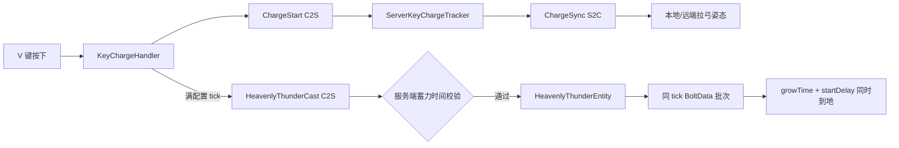

## 增量更新 — 飞剑透明渲染变量清理 / Fly sword transparent render state cleanup

- `src/main/java/com/z227/akatzumatool/item/FlySwordBakedModel.java`、`FlySwordHeldItemRenderer.java`、`render/finalRender/PostProcessing.java`、`FinalRender.java`、`bloomQueue/FlySwordHeldModelState.java`、`FlySwordHeldModelQueue.java`：删除后处理阶段没有读取的 `displayContext` 转发链路、renderer 中只写不读的上下文字段和 getter，以及旧版注释方法；物品渲染入口仍使用自身的显示上下文判断 GUI 和第三人称缩放。
- `src/main/java/com/z227/akatzumatool/render/renderType/FlySwordType/FlySwordHeldShader.java`、`src/main/resources/assets/akatzumatool/shaders/core/fly_sword/fly_sword_held.*`：`EffectParams` 缩减为时间与 Bloom 强度，`FresnelParams` 删除固定为零的最低值，两组渐变颜色删除未读取 alpha，顶点到片元阶段只传递 `vModelAlpha`；Java、Shader JSON、vsh 和 fsh 同步收窄声明。
- `src/main/java/com/z227/akatzumatool/render/renderType/FlySwordType/FlySwordHeldRenderType.java`、`bloomQueue/FlySwordHeldModelQueue.java`：删除自定义图集的重复占位绑定，采样器连续调整为 `Sampler0` 自定义图集和 `Sampler1` 场景颜色；修正 RenderType 注释为实际 `NO_CULL` 行为，不改变透明渲染参数和画面逻辑。
- `docs/0.0.6/2-2-1.md`、`飞剑透明渲染参数.md`：记录清理依据、保留项和当前连续纹理槽布局，并同步现行公式、Uniform 对照和验证清单。

## 增量更新 — 闪闪果实持续加速飞行 / Sparkling Fruit sustained boost flight

- `src/main/java/com/z227/akatzumatool/config/ConfigFile.java`：`setting.sparklingFruit` 新增 `flightBoostMaxSpeed = 5.0` 和 `flightBoostAccelerationTicks = 40`，分别控制 Ctrl 飞行最大方块/tick 速度和达到上限所需时间。
- `src/main/java/com/z227/akatzumatool/effect/sparkling/SparklingFruitFlightState.java`、`event/SparklingFruitEventHandler.java`：服务端首次进入 Buff 时把 `mayfly/flying/flyingSpeed` 同时保存到内存和玩家 Forge 持久数据并持续维持飞行；Ctrl 会话按服务端开始 tick 从当前前向速度线性增长到配置上限，每 tick 沿当前视线写入受限速度，满速时复用同步的 fall-flying 横飞姿态；自然结束、入水、死亡克隆、退出及服务器重启后统一恢复，切换维度结束本次加速但保留 Buff 能力快照。

- `src/main/java/com/z227/akatzumatool/network/SparklingFlightInputC2SPacket.java`、`SparklingFlightStateS2CPacket.java`、`NetworkRegister.java`：新增疾跑键按下/松开边沿 C2S 和追踪实体加速状态 S2C；客户端不上传速度、计时或方向，服务端负责校验并为后来开始追踪的玩家补发活动状态。
- `src/main/java/com/z227/akatzumatool/network/SparklingBoostC2SPacket.java`：Alt 安全瞬移保留原行为；若瞬移时仍在 Ctrl 加速，则保持服务端加速计时并向追踪客户端发送一次关闭/开启状态，重建历史起点而不连接瞬移前后轨迹。
- `src/main/java/com/z227/akatzumatool/event/client/SparklingFruitClientHandler.java`、`effect/sparkling/client/SparklingFruitFlightClientState.java`、`SparklingFruitFlightClientHandler.java`：使用原版 `keySprint` 映射处理默认 Ctrl，保留原 Alt 安全瞬移；客户端按实体 ID 保存有界历史位置，在高速移动段固定距离补点，对异常跳变和切换世界执行清理。
- `src/main/java/com/z227/akatzumatool/effect/sparkling/SparklingFruitFlightParticles.java`：历史补点通过现有 `ParticleEmitTask` 提交浅金、亮金、金黄和深金的短寿命 GPU 粒子；第一人称本地轨迹额外后移，远端玩家复用 S2C 活动状态显示多人拖尾。
- `docs/0.0.6/2-3-1.md`、`docUse/sparkling-fruit-usage.md`：记录飞行恢复边界、服务端加速公式、网络职责、多人轨迹、配置项和手动验证清单。

```mermaid
flowchart LR
    A[原版疾跑键按下] --> B[FlightInput C2S]
    B --> C[SparklingFruitFlightState]
    C --> D[服务端线性加速与速度上限]
    D --> E[满速 fall-flying 姿态]
    C --> F[FlightState S2C]
    F --> G[客户端历史位置补点]
    G --> H[金黄色 GPU 粒子]
```

## 增量更新 — 闪闪果实横向姿态与低频拖尾 / Sparkling Fruit horizontal pose and reduced trail

- `src/main/java/com/z227/akatzumatool/effect/sparkling/SparklingFruitFlightState.java`：满速姿态从会被无鞘翅校验清除的 `startFallFlying()` 改为 Forge `setForcedPose(Pose.FALL_FLYING)`；会话区分满速边沿、横向状态和本功能实际设置的姿态，只清理自身 forced pose，不启用原版鞘翅物理。
- `src/main/java/com/z227/akatzumatool/network/SparklingFlightStateS2CPacket.java`、`effect/sparkling/client/SparklingFruitFlightClientHandler.java`：状态包新增 `horizontalPose` 和服务端 `maxSpeed`，开始追踪、满速边沿、停止及 Alt 轨迹重置均同步准确姿态；客户端可延迟到实体生成后应用强制横向姿态，并按服务端速度计算合法连续移动阈值。
- `src/main/java/com/z227/akatzumatool/effect/sparkling/client/SparklingFruitFlightClientState.java`：粒子轨迹延迟一个 tick 消费已完成段，按实际运动方向后移且不采样最新端点；每两移动 tick、累计至少 `0.75` 格才发射，间距改为 `1.25` 格，单次最多 4 个任务，停止或切世界时先解除自身强制姿态再清空缓存。
- `src/main/java/com/z227/akatzumatool/effect/sparkling/SparklingFruitFlightParticles.java`：单个历史采样点的 GPU burst 从 2 至 4 粒降低为 1 至 2 粒，保留原金黄色调色板和短寿命零重力参数。
- `src/main/java/com/z227/akatzumatool/config/ConfigFile.java`：保留工作区已有参数调整，`flightBoostMaxSpeed` 默认值改为 `50.0` 且上限放宽到 `Double.MAX_VALUE`，`flightBoostAccelerationTicks` 默认值改为 `20`。
- `docs/0.0.6/2-3-2.md`、`docUse/sparkling-fruit-usage.md`：记录原版无鞘翅清理原因、强制姿态同步、历史段延迟、低频采样参数及验证清单。

## 增量更新 — 闪闪果实横飞动画定格与粒子增密 / Sparkling Fruit locked flight pose and denser trail

- `src/main/java/com/z227/akatzumatool/mixin/SparklingFruitPlayerModelMixin.java`、`src/main/resources/akatzumatool.mixins.json`：新增客户端 `PlayerModel.setupAnim` TAIL 注入，闪闪果实满速横飞时保留头部朝向并锁定身体、手臂和腿部旋转，避免原版高速移动动画表现为游泳式摆动。
- `src/main/java/com/z227/akatzumatool/effect/sparkling/client/SparklingFruitFlightClientState.java`：新增 `isHorizontalPoseActive(int)` 供模型 Mixin 查询横飞状态；飞行拖尾发射从每 2 tick 改为每 tick，单次采样上限从 4 提高到 8，采样间距从 `1.25` 降到 `0.75`，最低累计距离从 `0.75` 降到 `0.35`。
- `src/main/java/com/z227/akatzumatool/effect/sparkling/SparklingFruitFlightParticles.java`：单采样点 burst 从 1~2 粒提高到 2~4 粒，粒子尺寸提高到 `0.10~0.22`，寿命提高到 `0.90~1.60` 秒，保留金黄色调色板和历史路径后方发射逻辑。
- `docs/0.0.6/2-3-3.md`：记录横飞摆动原因、客户端动画定格方案、粒子增密推荐值和后续调参方法。

## 增量更新 — 天雷法阵独立伤害配置 / Heavenly Thunder independent damage config

- `src/main/java/com/z227/akatzumatool/config/TridentPlusConfig.java`：新增 `heavenlyThunderDamage` 和 `heavenlyThunderDamageIntervalTicks` 配置项，分别控制 V 键天雷法阵每跳持续伤害和伤害间隔，不再复用战戟落点 `splashDamage`。
- `src/main/java/com/z227/akatzumatool/entity/trident/HeavenlyThunderEntity.java`：服务端持续伤害改为读取 `TridentPlusConfig.heavenlyThunderDamage()` 与 `heavenlyThunderDamageIntervalTicks()`，保留法阵展开、持续时间、伤害范围和视觉逻辑不变。

## 增量更新 — 飞剑物品栏图标光照修复 / Fix fly sword inventory icon lighting

- `src/main/java/com/z227/akatzumatool/item/FlySwordBakedModel.java`：移除跨显示上下文保存 GUI/hand 模型的 `currentModel`；GUI 直接返回二维 baked model，并将光照、环境遮蔽、GUI 3D 标记、quads 与 overrides 稳定委托给 GUI 模型，避免物品栏在 `applyTransform(GUI)` 前读取到上一次非 GUI 三维模型的方块光照属性；非 GUI 路径继续应用三维 display transform 并进入透明后处理 renderer。
## 增量更新 — 后处理无实体任务队列收敛 / Post-render entityless task queue consolidation

- `src/main/java/com/z227/akatzumatool/render/finalRender/task/`：新增 `PostRenderTask`、`PostRenderQueueType`、`PostRenderTaskQueue`、`PostRenderTaskRenderContext`，并为闪电、冲击波、烟雾、手持天雷战戟局部闪电、手持飞剑透明模型建立 task 与 queue adapter。
- `src/main/java/com/z227/akatzumatool/render/finalRender/FinalRender.java`：新增无实体任务队列注册表和 `submit(PostRenderTask)`，旧闪电/冲击波/烟雾/手持飞剑入口改为构造 task 后统一分发；新增 `hasTaskQueuesByPhase(...)` 与 `renderTaskQueuesByPhase(...)`。
- `src/main/java/com/z227/akatzumatool/render/finalRender/PostProcessing.java`：新增统一 `submit(PostRenderTask)`；`buildBuffer(...)` 构造 `PostRenderTaskRenderContext`，并按 phase 渲染无实体 task queues，减少对具体无实体队列的逐个判断和渲染分支。

## 增量更新 — GPU 粒子材质纹理与多 Shader 批次 / GPU particle materials, textures and multi-shader pipelines

- `src/main/java/com/z227/akatzumatool/render/gpu/material/`：新增 `ParticleMaterialKey`、`ParticleMaterial`、`ParticleMaterialRegistry` 和 `ParticleRenderPipeline`，默认兼容 `DEFAULT_SDF`，并注册 `LIGHTNING_SPARK` 纹理噪声材质；材质表以 SSBO binding 2 上传 sprite UV、噪声参数、Bloom 参数和 pipeline id。
- `src/main/java/com/z227/akatzumatool/render/gpu/ParticleEmitTask.java`、`GPUParticleSystem.java`、`GPUShader.java`、`GPUParticleRenderShader.java`：`ParticleEmitTask.material(...)` 写入材质 ID，Compute Shader 把 `EmitJob.random.w` 复制到 `Particle.extra.w`；渲染阶段按 `SDF_BASIC` 与 `TEXTURED_NOISE` active pipeline 分批绑定 Shader / atlas 后执行 instanced draw。
- `src/main/resources/assets/akatzumatool/shaders/gpu/gpushader.comp`、`gpushader.vsh`、`particle_textured_noise.vsh`、`particle_textured_noise.fsh`：旧 SDF shader 增加材质 pipeline 过滤，新纹理噪声 shader 从 AkatZumaTool 自定义 atlas 采样主贴图与两张噪声并继续写 CA0/CA1 MRT。
- `src/main/java/com/z227/akatzumatool/render/texture/AtlasReloadListener.java`：atlas 上传后标记 GPU 粒子材质表 dirty，确保资源重载后重新上传 sprite UV。
- `src/main/java/com/z227/akatzumatool/effect/sparkling/SparklingFruitFlightParticles.java`：闪闪果实飞行拖尾示例切到 `ParticleMaterialKey.LIGHTNING_SPARK`，验证旧形状粒子与新纹理噪声粒子可通过材质系统共存。

## 增量更新 — GPU active index 压缩 / GPU active index compaction

- `src/main/java/com/z227/akatzumatool/render/gpu/GPUParticleSystem.java`：新增 ActiveIndex SSBO binding 3 和 ActiveCount SSBO binding 4；每帧 compute 前清零 activeCounts，compute 后 CPU readback 各 pipeline 活跃数量，并把 `glDrawArraysInstanced` 的 instanceCount 从 `MAX_PARTICLES` 改为实际 activeCount。
- `src/main/java/com/z227/akatzumatool/render/gpu/GPUShader.java`、`GPUParticleRenderShader.java`：新增 `uRenderPipelineCount` / `uMaxParticles` uniform 上传，支持 compute 按 pipeline 写 active index、render shader 按 pipeline 区间间接读取粒子。
- `src/main/resources/assets/akatzumatool/shaders/gpu/gpushader.comp`：绑定材质 SSBO，更新/发射粒子后按 `materialId -> pipelineId` 使用 `atomicAdd(activeCounts[pipelineId])` 写入 `activeIndices[pipelineId * uMaxParticles + writeIndex]`。
- `src/main/resources/assets/akatzumatool/shaders/gpu/gpushader.vsh`、`particle_textured_noise.vsh`：渲染阶段不再用 `gl_InstanceID` 直接索引 Particle SSBO，而是先读取当前 pipeline 的 active index，再保留生命值和 pipeline 兜底过滤。
- `docs/0.0.6/3-2-2.md`：记录 GPU active index 压缩概念、优势、CPU readback 调试版与后续 indirect draw 升级路线。

## 增量更新 — GPU active index indirect draw / GPU active index indirect draw

- `src/main/java/com/z227/akatzumatool/render/gpu/GPUParticleSystem.java`：新增 DrawArraysIndirectCommand Buffer，初始化每个 pipeline 的 `count=4/first=0/baseInstance=0`，每帧用 `glCopyBufferSubData` 将 `activeCounts[pipelineId]` 复制到 command 的 `instanceCount` 字段，移除 `glGetBufferSubData` CPU readback。
- `src/main/java/com/z227/akatzumatool/render/gpu/GPUParticleSystem.java`：`renderSdfPipeline` 和 `renderTexturedNoisePipeline` 改用 `drawPipelineIndirect(...)`，按 pipeline command offset 执行 `glDrawArraysIndirect(GL_TRIANGLE_STRIP, offset)`，保留不同 shader / sampler 的逐 pipeline 绑定。
- `docs/0.0.6/3-2-2.md`：补充第二阶段已落地为 GPU buffer copy + indirect draw，CPU 不再读取 activeCounts。

## 增量更新 — 金色三噪声螺旋光效 / Golden three-noise spiral effect

- `src/main/java/com/z227/akatzumatool/render/finalRender/bloomQueue/GoldenSpiralEffectQueue.java`：新增无实体金色螺旋光效队列，生成 96 段向上 camera-facing ribbon，使用金黄色、生命周期淡入淡出、圆形宽度 mask 和高度淡化。
- `src/main/java/com/z227/akatzumatool/render/renderType/GoldenSpiralType/`、`src/main/resources/assets/akatzumatool/shaders/core/golden_spiral/`：新增 Core Shader 和 RenderType；片元 shader 只复用飞剑透明渲染的三噪声扰动方法，Noise1=`t_fx_tile_0012`，Noise2 改为 `fx_noise015`，Noise3=`tile_0137_moon`，不使用菲尼尔或折射。
- `src/main/java/com/z227/akatzumatool/render/finalRender/task/GoldenSpiralEffectTask.java`、`GoldenSpiralEffectPostQueue.java`、`PostRenderQueueType.java`、`FinalRender.java`、`PostProcessing.java`：接入统一无实体后处理任务体系，新增 `addGoldenSpiralEffect(Vec3, long)` 提交入口。
- `src/main/java/com/z227/akatzumatool/event/render/RenderTypeEvent.java`：注册 `GoldenSpiralShader`，使 `golden_spiral` core shader 参与资源加载和热重载。
- `src/main/java/com/z227/akatzumatool/item/testitem/testitem.java`：右键方块客户端提交金色三噪声螺旋光效预览，方便观察 mask、fx_noise015 替换效果和 Bloom。
- `docs/0.0.6/3-3-1.md`、`docs/0.0.6/3-3-2.md`：记录飞剑透明三噪声使用方式和金色螺旋光效实现方案。

## 增量更新 — 金色螺旋连续 ribbon 与上升流动 / Golden spiral continuous ribbon and upward flow

- `src/main/java/com/z227/akatzumatool/render/finalRender/bloomQueue/GoldenSpiralEffectQueue.java`：`writeSpiralRibbon(...)` 改为先预计算 `SEGMENTS + 1` 个中心采样点，再为每个采样点生成唯一 `left/right` 边界，相邻 quad 共享公共边，修复螺旋 segment 之间的断层和细缝。
- `src/main/java/com/z227/akatzumatool/render/finalRender/bloomQueue/GoldenSpiralEffectQueue.java`：新增 `sampleTangent(Vec3[], int)`，中间点使用前后中心差分、首尾点使用单边差分，并通过 `previousSide` fallback 与反相检测稳定 camera-facing 宽度方向。
- `src/main/java/com/z227/akatzumatool/render/finalRender/bloomQueue/GoldenSpiralEffectQueue.java`：三张噪声的 V 方向流速改为负值，保持几何向上不变，让 `t_fx_tile_0012`、`fx_noise015` 和 `tile_0137_moon` 的纹理能量沿螺旋向上流动。
- `docs/0.0.6/3-3-3.md`：新增并标记金色螺旋断层与上升方向优化方案的实施状态。

## 增量更新 — 撤销金色多层螺旋测试 / Revert golden multilayer spiral preview

- `src/main/java/com/z227/akatzumatool/render/finalRender/bloomQueue/GoldenSpiralEffectQueue.java`：撤销上一轮多层螺旋测试代码，恢复为 3-3-3 后的单条连续向上螺旋参数与中心线逻辑。
- `docs/0.0.6/3-3-4.md`：保留视频拆解和后续方案，但将第一、第二阶段实施状态标记为已撤销。

## 增量更新 — 清理未使用战戟手持闪电 / Remove unused trident held lightning

- `src/main/java/com/z227/akatzumatool/render/finalRender/bloomQueue/`：删除未使用的手持战戟局部闪电状态与队列实现，避免后处理继续保留无调用方的矩阵缓存和局部 ribbon 绘制代码。
- `src/main/java/com/z227/akatzumatool/render/renderType/TridentPlusType/`、`src/main/resources/assets/akatzumatool/shaders/core/trident_plus/`：删除手持战戟局部闪电专用 RenderType、Shader、VertexFormat 和 `trident_plus_lightning.*` core shader 资源；保留仍可用的 `trident_plus_glow` 蓝光覆盖层。
- `src/main/java/com/z227/akatzumatool/render/finalRender/FinalRender.java`、`PostProcessing.java`、`event/render/RenderTypeEvent.java`：移除手持战戟局部闪电字段、提交入口、has/render 队列方法、cleanup 清理和 shader 注册。
- `src/main/java/com/z227/akatzumatool/item/TridentPlusItemRenderer.java`：删除已注释的 `submitHeldLightningMatrix(...)` 及相关 import，物品渲染只保留原版三叉戟模型和蓝光覆盖层逻辑。
- `docs/0.0.6/3-1-2.md`：在原方案中用红色标题标注第一次修改，把第二阶段从补 task adapter 调整为清理未使用链路。

## 增量更新 — 无实体任务 active list / Entityless task active list

- `src/main/java/com/z227/akatzumatool/render/finalRender/FinalRender.java`：新增 `activeTaskQueuesByPhase` 和 `activeTaskQueueSet`，无实体任务提交后主动标记 active，避免 `hasTaskQueuesByPhase(...)` 每帧遍历全部注册队列调用 `queue.hasActive()`。
- `src/main/java/com/z227/akatzumatool/render/finalRender/FinalRender.java`：`renderTaskQueuesByPhase(...)` 改为只遍历 active task queue，并在渲染后通过 `compactActiveTaskQueues(...)` 保留仍有跨帧内容的队列、移除已结束队列。
- `src/main/java/com/z227/akatzumatool/render/finalRender/FinalRender.java`：`cleanUp()` 同步清理无实体 active list 和去重 set，避免资源释放后残留 active 索引。
- `docs/0.0.6/3-1-2.md`：标记第二次修改，记录第一阶段 active list 已执行。

## 增量更新 — 无实体效果提交入口外移 / Move entityless effect submitter

- `src/main/java/com/z227/akatzumatool/render/finalRender/task/PostRenderTaskSubmitter.java`：新增无实体效果提交门面，集中保存闪电、冲击波、烟雾、天雷云环、蓄力闪电和金色螺旋的语义化 add 方法，内部统一转换为 `PostRenderTask` 并调用 `PostProcessing.submit(...)`。
- `src/main/java/com/z227/akatzumatool/render/finalRender/PostProcessing.java`：新增 `effects()` 返回 `PostRenderTaskSubmitter`，删除无实体效果 `addLightningPath(...)`、`addShockwave(...)`、`addSmokeCloudRing(...)` 等历史透传方法，保留 FBO / GL 状态 / task submit 职责。
- `src/main/java/com/z227/akatzumatool/render/finalRender/FinalRender.java`：删除无实体效果语义化 add 入口，`FinalRender` 只负责 task queue 注册、task 分发、active list 和 phase 渲染。
- `src/main/java/com/z227/akatzumatool/item/testitem/testitem.java`、`BeamCrossTestItem.java`、`event/RenderLevelEvent.java`、`entity/coin/CoinBeamClientEffects.java`、`entity/trident/*`：调用方迁移到 `AkatZumaTool.POST.effects().addXxx(...)`；GPU 粒子、实体 bloom 和描边入口保持原 `PostProcessing` 方法。
- `docs/0.0.6/3-1-2.md`：标记第三次修改，记录第三阶段调用方迁移和 add 入口外移已执行。

## 增量更新 — 清理 FinalRender 历史队列方法 / Clean FinalRender legacy queue methods

- `src/main/java/com/z227/akatzumatool/render/finalRender/FinalRender.java`：删除无引用的 `addToBloomBuffer(...)`、`hasXxxQueue(...)` 和 `renderXxxQueue(...)` 历史方法，避免后续绕过统一 task phase 调度。
- `src/main/java/com/z227/akatzumatool/render/finalRender/FinalRender.java`：`cleanUp()` 改为循环 `taskQueueRegistrations.values()` 清理无实体任务队列，并保留 `smokeParticleQueue.cleanUp()` 单独释放烟雾 GPU 资源。
- `docs/0.0.6/3-1-2.md`：标记第四次修改，记录第四阶段 FinalRender 历史方法和 cleanup 清理已执行。

## 增量更新 — 后处理阶段判断与注册保护 / Post-processing phase checks and registration guard

- `src/main/java/com/z227/akatzumatool/render/finalRender/PostProcessing.java`：`isRendering` 重命名为 `hasSubmittedThisFrame`，明确表示本帧收到提交请求；跨帧渲染继续由 GPU 粒子和 `FinalRender.hasActiveEffects()` 判断。
- `src/main/java/com/z227/akatzumatool/render/finalRender/PostProcessing.java`：新增 `hasPhaseQueues(PostRenderPhase)`，集中判断指定 phase 是否有实体队列或无实体 task queue，减少 `buildBuffer(...)` 中重复条件拼装。
- `src/main/java/com/z227/akatzumatool/render/finalRender/PostProcessing.java`：删除 MiaoOutline 阶段已注释掉的 `setDepthState(...)` 调试代码，保留实际 mask 清理、深度 mask 写入和径向描边流程。
- `src/main/java/com/z227/akatzumatool/render/finalRender/FinalRender.java`：`registerTaskQueue(...)` 增加重复 `PostRenderQueueType` 检查，重复注册时抛出 `IllegalStateException`，避免同类 task queue 静默覆盖。
- `docs/0.0.6/3-1-2.md`：标记第五次修改，记录 PostProcessing 附带优化和 FinalRender 注册保护已执行。
## 增量更新 — 真飞剑 C 键咖喱棒蓄力 / True Flying Sword C-key Excalibur charge

- `src/main/java/com/z227/akatzumatool/event/client/DimensionSlashKeyHandler.java`、`DimensionSlashKeyInputHandler.java`、`KeyChargeHandler.java`、`ClientExcaliburChargeRegistry.java`：新增 C 键咖喱棒蓄力输入链路；按下 C 开始、满 40 tick 后不自动释放、松键满蓄才发送释放包，最大蓄力 1200 tick，蓄力期间客户端移动输入置零并同步本地/远端拉弓姿态。
- `src/main/java/com/z227/akatzumatool/common/ServerExcaliburChargeTracker.java`、`event/HeavenlyThunderChargeServerEvent.java`：新增服务端咖喱棒可信蓄力表，记录开始 tick、手部、锚点和同步实体；每 tick 校验失效/超时并复用移动锁定把玩家固定在开始位置，追踪、登出、切维度和服务器停止时清理状态。
- `src/main/java/com/z227/akatzumatool/entity/sword/ExcaliburChargeEntity.java`、`ExcaliburChargeRenderer.java`、`event/EntityTypeRegister.java`、`event/ModEventClient.java`：新增咖喱棒蓄力同步实体和空渲染器；实体跟随玩家身体中心，强制可见并在释放后保留 10 tick 强化视觉，客户端 renderer 每帧提交玩家中心向上螺旋任务。
- `src/main/java/com/z227/akatzumatool/network/ExcaliburChargeStartC2SPacket.java`、`ExcaliburChargeStopC2SPacket.java`、`ExcaliburCastC2SPacket.java`、`ExcaliburChargeSyncS2CPacket.java`、`NetworkRegister.java`：新增咖喱棒开始、停止、释放和动作同步网络消息；服务端释放只信任 tracker 校验，不接受客户端进度。
- `src/main/java/com/z227/akatzumatool/render/finalRender/bloomQueue/ExcaliburSpiralQueue.java`、`render/finalRender/task/ExcaliburSpiralTask.java`、`ExcaliburSpiralPostQueue.java`、`PostRenderQueueType.java`、`FinalRender.java`：咖喱棒玩家中心金色螺旋后处理队列复用金色螺旋 shader 和三噪声材质；当前改为 `activeRibbons` 短生命周期随机螺旋池，蓄力期间每 4 tick 生成 2 条随机螺旋、最多保留 12 条，每条拥有独立高度、半径、圈数、宽度、秒单位速度、相位、圈距拉长强度、透明度和生命周期，使用 `pitchT` / `pitchAngleT` 让圈距逐渐拉长并避免 tick 高速乱飞。
- `src/main/java/com/z227/akatzumatool/item/FlySwordItem.java`、`FlySwordPlusItem.java`、`mixin/MagicBowMovementMixin.java`、`lang/zh_cn.json`、`lang/en_us.json`：真·飞剑新增手部检测、咖喱棒常量、拉弓 ArmPose、tooltip、技能名、按键名和实体名；移动 mixin 新增完全禁用移动输入分支。


## 增量更新 — GPU 粒子速度曲线与光效材质 / GPU particle speed curves and light effect material

- `src/main/java/com/z227/akatzumatool/render/gpu/ParticleEmitTask.java`：新增 `speed(start,end)`、`speedCurve(...)`、`reverseDirection(...)`、`midColor(...)` 和 `midColorTime(...)`，支持速度曲线与三段颜色控制；Bloom 改为 shader 内统一调参。
- `src/main/java/com/z227/akatzumatool/render/gpu/GPUParticleSystem.java`、`src/main/resources/assets/akatzumatool/shaders/gpu/gpushader.comp`：Particle / EmitJob 扩展为 44 floats，写入中间颜色、速度曲线和渲染参数。
- `src/main/java/com/z227/akatzumatool/render/gpu/material/`：新增 `ParticleMaterialKey.LIGHT_EFFECT` 与 `ParticleRenderPipeline.LIGHT_EFFECT`，材质注册复用 `t_fx_tile_0012`、`fx_noise015`、`tile_0137_moon` 三张噪声。
- `src/main/resources/assets/akatzumatool/shaders/gpu/gpushader.*`、`particle_textured_noise.*`、`particle_light_effect.*`：渲染 shader 支持三段颜色、核心 UV / bloom UV 分离，新光效 shader 只在 CA1 扩大光晕而不放大 CA0 本体。
- `src/main/java/com/z227/akatzumatool/item/testitem/testitem.java`：右键方块测试入口切换为新 GPU 粒子综合预览，提交三噪声 LIGHT_EFFECT 和反向速度光效粒子。
- `docs/GPU-Particle-System-Usage.md`：同步新增 API、光效粒子材质、shader Bloom 调参入口和 active index / indirect draw 当前状态。

## 增量更新 — GPU 粒子 Shader Bloom 调参 / GPU particle shader bloom tuning

- `src/main/java/com/z227/akatzumatool/render/gpu/ParticleEmitTask.java`：移除 `bloomQuadScale(...)` Builder 和 CPU 侧 bloom 顶点范围字段，调用点不再通过放大四边形扩大 Bloom。
- `src/main/java/com/z227/akatzumatool/render/gpu/GPUParticleSystem.java`、`src/main/resources/assets/akatzumatool/shaders/gpu/gpushader.comp`：保留 44 floats SSBO 布局，`renderParams.w` 改为预留位，避免破坏中间颜色和速度曲线已有布局。
- `src/main/resources/assets/akatzumatool/shaders/gpu/gpushader.vsh`、`particle_textured_noise.vsh`、`particle_light_effect.vsh`：移除 `renderParams.w` 驱动的顶点范围放大，粒子 billboard 回到实际 `size`。
- `src/main/resources/assets/akatzumatool/shaders/gpu/gpushader.fsh`：提高 SDF 粒子的核心 Bloom、外圈 Bloom、halo 半径和边缘柔化常量，Bloom 范围改为 shader 内统一控制。
- `src/main/java/com/z227/akatzumatool/render/gpu/material/ParticleMaterialRegistry.java`、`particle_textured_noise.fsh`、`particle_light_effect.fsh`：提高 `LIGHTNING_SPARK` / `LIGHT_EFFECT` 材质 Bloom 参数，并放宽噪声能量阈值。
- `src/main/java/com/z227/akatzumatool/render/bloom/BloomRender.java`：将默认屏幕空间 blur 半径从 `1.0F` 调为 `1.35F`，增强全局 Bloom 扩散但保持 3 次迭代。
- `src/main/java/com/z227/akatzumatool/entity/bow/MagicArrowEntity.java`、`src/main/java/com/z227/akatzumatool/event/EntityTypeRegister.java`：魔法箭设置 `noCulling`、覆盖渲染距离判断，并将追踪范围改为 `32`、更新间隔改为 `1`。

## 增量更新 — GPU 粒子方向平面随机 / GPU particle direction plane random

- `src/main/java/com/z227/akatzumatool/render/gpu/ParticleEmitTask.java`：新增 `MOTION_DIRECTION_PLANE_RANDOM` 和 `directionPlaneRandom(amplitude, frequency, speed)`，复用 `motion.yzw` 表示侧向随机幅度、频率和速度。
- `src/main/java/com/z227/akatzumatool/render/gpu/GPUParticleSystem.java`：`EmitJob.renderParams.yzw` 统一写入预留值，方向平面随机继续复用现有 44 floats SSBO 布局。
- `src/main/resources/assets/akatzumatool/shaders/gpu/gpushader.comp`：Compute 更新为主方向绝对位移 + 垂直平面连续随机偏移，新增垂直基底生成、连续值噪声和速度曲线积分。
- `src/main/resources/assets/akatzumatool/shaders/gpu/particle_light_effect.fsh`：LIGHT_EFFECT 新增最终圆形遮罩和 `LIGHT_EFFECT_NOISE1_TILE` / `LIGHT_EFFECT_NOISE2_TILE` shader 常量。
- `src/main/java/com/z227/akatzumatool/item/testitem/testitem.java`：GPU 粒子测试入口改为方向平面随机 LIGHT_EFFECT 预览，保留 SDF 和反向光效辅助测试方法。
- `docs/GPU-Particle-System-Usage.md`：同步方向平面随机 API、光效圆形遮罩、噪声平铺常量和 44 floats SSBO 现状。

## 增量更新 — testitem 随机运动粒子预览 / testitem random moving particle preview

- `src/main/java/com/z227/akatzumatool/item/testitem/testitem.java`：`addTestDirectionPlaneRandomSdfParticles(...)` 改为 `addTestRandomMovingParticles(Vec3)`，右键方块默认提交随机运动 SDF 粒子，主方向向上并在 XZ 平面持续随机游走。

## 增量更新 — GPU 粒子连续噪声随机运动 / GPU particle continuous noise random motion

- `src/main/resources/assets/akatzumatool/shaders/gpu/gpushader.comp`：`smoothPlaneRandom(...)` 从多频 `sin/cos` 改为两层一维连续值噪声，使用 `smootherstep01(...)`、`hash11(...)`、`hash21(...)`、`continuousNoise2(...)` 让侧向随机目标平滑过渡。
- `src/main/java/com/z227/akatzumatool/item/testitem/testitem.java`：`addTestRandomMovingParticles(...)` 测试参数降为 `.directionPlaneRandom(0.28F, 0.9F, 0.75F)`，避免高频参数把连续噪声推成碎抖。
- `docs/0.0.6/4-1-4.md`、`docs/GPU-Particle-System-Usage.md`：新增连续噪声随机运动方案和使用说明，记录共享流场阶段暂未执行。

## 增量更新 — 多尺度 Bloom 远景模糊 / Multi-scale far bloom blur

- `src/main/java/com/z227/akatzumatool/render/bloom/BloomRender.java`：新增 `DEFAULT_FAR_ITERATIONS`、`FAR_BLOOM_SCALE`、`DEFAULT_FAR_BLUR_RADIUS` 和 `farBlurFboA/B`，Bloom 流程改为 1/2 近景 blur 后生成 1/4 远景 blur，并将远景 Bloom 加法回叠到近景结果。
- `src/main/java/com/z227/akatzumatool/render/bloom/BloomDownsampleShader.java`、`src/main/resources/assets/akatzumatool/shaders/post/bloom_downsample.fsh`：将中心加权 5-tap 采样说明从单纯降采样扩展为 Bloom 重采样，明确可用于远景 Bloom 回叠。
- `docs/0.0.6/4-1-5.md`、`docs/GPU-Particle-System-Usage.md`：同步第一优先级执行记录和全局 Bloom 调参入口，说明本阶段未扩大粒子顶点、未恢复 `bloomQuadScale(...)`。

## 增量更新 — Bloom 中间清理减少 / Reduce intermediate bloom clears

- `src/main/java/com/z227/akatzumatool/render/bloom/BloomRender.java`：`render(...)` 开始处关闭 `GL_SCISSOR_TEST`，避免外部裁剪状态破坏 Bloom 全屏覆盖写入。
- `src/main/java/com/z227/akatzumatool/render/bloom/BloomRender.java`：`downsampleTo(...)` 和 `blurPasses(...)` 改用 `target.bindFrameBuffer(false)`，中间 Bloom 降采样与 Ping-Pong blur pass 不再触发颜色/深度 clear；`addTextureToNearBloom(...)` 继续保留 no-clear 加法回叠。
- `docs/0.0.6/4-1-7.md`：新增 Bloom 中间 `glClear` 优化方案和第一阶段执行记录。

## 增量更新 — GPU 粒子噪声流场上升 / GPU particle turbulent rise motion

- `src/main/java/com/z227/akatzumatool/render/gpu/ParticleEmitTask.java`：新增 `MOTION_TURBULENT_RISE` 和 `turbulentRise(...)` Builder，复用现有 44 floats 布局参数表达出生圆盘半径、curl 强度、噪声频率、径向扩散和噪声速度。
- `src/main/java/com/z227/akatzumatool/render/gpu/GPUParticleSystem.java`：`addEmitJob(...)` 为噪声流场上升模式写入 `physics.y/w` 和 `motion.y/z/w`，不扩大 Particle / EmitJob SSBO。
- `src/main/resources/assets/akatzumatool/shaders/gpu/gpushader.comp`：新增 `valueNoise3(...)`、`curlNoise2InPlane(...)` 和 `turbulentRiseVelocity(...)`，粒子从主方向垂直圆盘出生，并按上升速度、curl 噪声、低频风和生命周期径向扩散逐帧积分移动。
- `src/main/java/com/z227/akatzumatool/item/testitem/testitem.java`：新增 `addTestTurbulentRiseParticles(Vec3)`，右键测试入口额外提交蓝紫、粉色、青绿色三层随机上升 SDF 星形粒子。
- `docs/0.0.6/4-1-8.md`、`docs/GPU-Particle-System-Usage.md`：同步随机上升粒子方案、API 参数和执行记录。

## 增量更新 — 清理 LIGHTNING_SPARK 粒子 / Remove LIGHTNING_SPARK particles

- `src/main/java/com/z227/akatzumatool/effect/sparkling/SparklingFruitFlightParticles.java`：闪闪果实 Ctrl 加速飞行历史路径删除 `.material(ParticleMaterialKey.LIGHTNING_SPARK)`，回到默认 SDF 随机形状粒子。
- `src/main/java/com/z227/akatzumatool/render/gpu/material/ParticleMaterialKey.java`、`ParticleMaterialRegistry.java`、`ParticleRenderPipeline.java`：删除 `LIGHTNING_SPARK` 材质和 `TEXTURED_NOISE` pipeline，材质表保留 `DEFAULT_SDF_ID = 0` 与 `LIGHT_EFFECT_ID = 1`。
- `src/main/java/com/z227/akatzumatool/render/gpu/GPUParticleSystem.java`：删除 `texturedNoiseShader` 初始化、渲染和清理分支，当前只按 SDF 与 LIGHT_EFFECT 两个 pipeline 绘制。
- `src/main/resources/assets/akatzumatool/shaders/gpu/gpushader.comp`、`gpushader.vsh`、`particle_light_effect.vsh`：新增 `MATERIAL_COUNT = 2` 材质 ID 夹紧，避免旧粒子残留旧材质 ID 时越界读取材质 SSBO。
- `src/main/resources/assets/akatzumatool/shaders/gpu/particle_textured_noise.vsh`、`.fsh`：删除不再使用的贴图噪声粒子 shader。
- `docs/0.0.6/4-1-9.md`、`docs/GPU-Particle-System-Usage.md`：记录 `LIGHTNING_SPARK` 来源、SDF / 材质粒子切换规则和本次执行结果。

## 增量更新 — GPU 光效顶部消散遮罩 / GPU light effect top dissolve mask

- `src/main/java/com/z227/akatzumatool/render/texture/AkatZumaTextureAtlas.java`：新增按文件名命名的 `noise_092_128x` atlas 常量，`LIGHTNING_NOISE_TEXTURE_ALT` 改为兼容引用该常量。
- `src/main/java/com/z227/akatzumatool/render/gpu/material/ParticleMaterial.java`、`ParticleMaterialRegistry.java`：新增 `topDissolveTexture`，材质 SSBO 从 6 个 vec4 / 24 floats 扩展为 7 个 vec4 / 28 floats，LIGHT_EFFECT 第四张纹理使用 `AkatZumaTextureAtlas.noise_092_128x`。
- `src/main/resources/assets/akatzumatool/shaders/gpu/gpushader.comp`、`gpushader.vsh`、`particle_light_effect.vsh`、`particle_light_effect.fsh`：`ParticleMaterialGpu` 增加 `topDissolveSpriteUV`，保持 Java / GLSL 材质布局一致。
- `src/main/resources/assets/akatzumatool/shaders/gpu/particle_light_effect.fsh`：新增 `TOP_DISSOLVE_*` 常量和 `topDissolveMask(...)`，最终圆形遮罩改为 `circleMask * topDissolveMask`，让 `noise_092_128x` 只在顶部增强破碎消散并同步影响 CA0/CA1。
- `docs/0.0.6/4-2-1.md`、`docs/GPU-Particle-System-Usage.md`：同步执行记录、文件名命名规则、顶部消散调参入口和材质 SSBO 布局说明。

## 增量更新 — 咖喱棒蓄力双材质粒子 / Excalibur charge dual-material particles

- `src/main/java/com/z227/akatzumatool/entity/sword/ExcaliburChargeParticleEffects.java`：新增咖喱棒专用粒子参数与发射类；0～9 tick 每 tick 提交 18 个 SDF 和 8 个 LIGHT_EFFECT 噪声上升粒子，第 10 tick 额外爆发 140 个 SDF 和 56 个 LIGHT_EFFECT 径向粒子，之后持续档增强为每 tick 32 + 14 个。
- `src/main/java/com/z227/akatzumatool/entity/sword/ExcaliburChargeEntity.java`：新增客户端粒子 tick 防重和第 10 tick 爆发防重字段，不增加同步数据与存档字段。
- `src/main/java/com/z227/akatzumatool/entity/sword/ExcaliburChargeRenderer.java`：复用玩家身体中心锚点调用双材质粒子入口，原咖喱棒金色螺旋提交链路保持不变；释放阶段停止创建新粒子。
- `docs/0.0.6/4-2-2.md`：记录咖喱棒双材质持续发射、10 tick 爆发、增强参数、性能限制和执行结果。

## 增量更新 — 咖喱棒粒子倒锥与脚下爆发 / Excalibur particle cone and ground burst

- `src/main/java/com/z227/akatzumatool/entity/sword/ExcaliburChargeParticleEffects.java`：持续粒子生命周期延长到 `2.60～3.90` 秒，基础/增强阶段按 `8.65/12.15` 格目标高度反算线性速度；缩小出生圆盘并提高后段径向扩散，让 SDF 外层和 LIGHT_EFFECT 内层形成底窄顶宽的倒锥。
- `src/main/java/com/z227/akatzumatool/entity/sword/ExcaliburChargeParticleEffects.java`：第 10 tick 双材质爆发改用脚下锚点，SDF/光效起始速度提高到 `7.50/5.80`，降低垂直速度并延长生命周期，形成更大的贴地外圈和内圈。
- `src/main/java/com/z227/akatzumatool/entity/sword/ExcaliburChargeRenderer.java`：在身体中心锚点之外新增玩家脚下 `+0.08Y` 锚点并传给粒子入口，owner 暂不可用时使用中心 `-0.90Y` 兜底。
- `docs/0.0.6/4-2-2.md`、`4-2-3.md`：同步旧参数覆盖说明、目标高度反算、倒锥参数、脚下爆发范围和执行记录。

## 增量更新 — 咖喱棒多组 spread 持续扩散 / Excalibur multi-emitter spread diffusion

- `src/main/java/com/z227/akatzumatool/entity/sword/ExcaliburChargeParticleEffects.java`：持续蓄力粒子从每 tick 双材质 `turbulentRise + burst` 改为每 2 tick 刷新的 SDF/光效各内外两组 `MOTION_BALLISTIC` 短时发射器，使用 `rate + duration` 连续生成粒子，并用两档 `spread` 形成随高度扩大的倒锥。
- `src/main/java/com/z227/akatzumatool/entity/sword/ExcaliburChargeParticleEffects.java`：外层目标高度使用 `1.12` 倍补偿扩散，基础和增强阶段分别使用独立的发射率、扩散强度及生命周期；第 10 tick 玩家脚下双材质径向爆发保持不变。
- `docs/0.0.6/4-2-4.md`：记录当前发射问题、四组持续发射参数、调参说明和执行结果。

## 增量更新 — 咖喱棒粒子起点与分阶段速度 / Excalibur particle origin and staged speed

- `src/main/java/com/z227/akatzumatool/entity/sword/ExcaliburChargeParticleEffects.java`：SDF/光效持续发射起点分别上移到身体中心 `+0.18Y/+0.28Y`；基础 SDF 使用较低速度倍率和结束速度比例，增强 SDF 使用 `1.15` 加速倍率。
- `src/main/java/com/z227/akatzumatool/entity/sword/ExcaliburChargeParticleEffects.java`：基础 LIGHT_EFFECT 参考 `addTestLightEffectParticles(...)` 使用 `1.00 -> 0.00` 速度、`1.15` 曲线、最长 `10.55` 秒生命周期、纵向尺寸和低透明度金色渐变；增强光效使用 `1.18` 加速倍率，并收敛外层 spread 防止横飞。
- `src/main/java/com/z227/akatzumatool/entity/sword/ExcaliburChargeParticleEffects.java`：`calculateStartSpeed(...)` 新增结束速度比例参数，让基础/增强及两种材质使用独立速度策略；现有发射率、`0.32` 秒持续时间和第 10 tick 脚下爆发保持不变。
- `docs/0.0.6/4-2-5.md`：记录发射起点、测试光效参考参数、分阶段速度配置、调参顺序和执行结果。

## 增量更新 — 咖喱棒近身大型光效 / Excalibur large nearby light effects

- `src/main/java/com/z227/akatzumatool/entity/sword/ExcaliburChargeParticleEffects.java`：新增 `emitLargeLightAroundPlayer(...)`，随持续蓄力刷新提交固定 `0.50 x 2.40`、速度 `0`、生命周期 `1.20` 秒的 LIGHT_EFFECT，并用 `spread = 4.00` 分布在玩家身体中心周围。
- `src/main/java/com/z227/akatzumatool/entity/sword/ExcaliburChargeParticleEffects.java`：大型光效基础/增强发射率分别为 `4/7`，复用现有阶段颜色渐变，不影响向上倒锥和脚下径向爆发。
- `docs/0.0.6/4-2-5.md`：追加第 2 次修改参数和执行记录。

## 增量更新 — GPU 粒子固定旋转 / GPU particle fixed rotation

- `src/main/java/com/z227/akatzumatool/render/gpu/ParticleEmitTask.java`：新增 `randomRotation` 任务字段和 `fixedRotation(float)` Builder，默认继续随机旋转，调用后改用指定固定角度。
- `src/main/java/com/z227/akatzumatool/render/gpu/GPUParticleSystem.java`：复用 `EmitJob.renderParams.y` 上传随机旋转开关，不改变现有 44 floats SSBO 布局。
- `src/main/resources/assets/akatzumatool/shaders/gpu/gpushader.comp`：出生阶段根据 `renderParams.y` 决定是否叠加随机角度，固定模式只使用 `job.render.z`。
- `src/main/java/com/z227/akatzumatool/entity/sword/ExcaliburChargeParticleEffects.java`：玩家身边 `0.50 x 2.40` 大型 LIGHT_EFFECT 使用 `fixedRotation(0.0F)`，始终保持屏幕空间竖直朝上。
- `docs/0.0.6/4-2-5.md`：追加第 3 次修改和固定旋转执行记录。

## 增量更新 — 咖喱棒周围 SDF 氛围 / Excalibur surrounding SDF ambience

- `src/main/java/com/z227/akatzumatool/entity/sword/ExcaliburChargeParticleEffects.java`：新增 `emitAmbientSdfAroundPlayer(...)`，使用 `turbulentRise` 在玩家周围半径约 `10` 格的水平圆盘内持续生成 `0.03～0.07` 小型随机 SDF 粒子。
- `src/main/java/com/z227/akatzumatool/entity/sword/ExcaliburChargeParticleEffects.java`：氛围粒子以 `0.12 -> 0.04` 低速上升，使用 `6～9` 秒生命周期及低 curl/噪声速度，基础/增强发射率分别为 `12/18`。
- `docs/0.0.6/4-2-5.md`、`docs/GPU-Particle-System-Usage.md`：追加第 4 次修改记录及大范围低速噪声上升氛围示例。

## 增量更新 — 噪声上升粒子出生高度范围 / Turbulent particle spawn height range

- `src/main/java/com/z227/akatzumatool/render/gpu/ParticleEmitTask.java`：新增 `turbulentSpawnHeight(minOffset, maxOffset)` Builder 和默认 `-0.04～0.04` 高度范围配置，现有调用保持兼容。
- `src/main/java/com/z227/akatzumatool/render/gpu/GPUParticleSystem.java`：复用 `EmitJob.renderParams.z/w` 上传噪声上升出生高度最小/最大偏移，继续保持 44 floats 布局。
- `src/main/resources/assets/akatzumatool/shaders/gpu/gpushader.comp`：噪声上升出生位置改为在配置高度范围内随机插值，并沿归一化主方向应用偏移。
- `src/main/java/com/z227/akatzumatool/entity/sword/ExcaliburChargeParticleEffects.java`：咖喱棒周围 SDF 氛围新增 `-0.75～6.00` 相对玩家中心的出生高度配置，扩大垂直分布。
- `docs/0.0.6/4-2-5.md`、`docs/GPU-Particle-System-Usage.md`：追加第 5 次修改记录和高度范围 API 说明。

## 增量更新 — 基础能量法阵 GPU 粒子 / GPU basic energy magic-circle particle

- `src/main/java/com/z227/akatzumatool/render/texture/AkatZumaTextureAtlas.java`：新增按资源文件名命名的 `tex_pattern66` 与 `tex_pattern59` atlas 常量，不增加用途型纹理别名。
- `src/main/java/com/z227/akatzumatool/render/gpu/material/ParticleMaterialKey.java`、`ParticleMaterialRegistry.java`、`ParticleRenderPipeline.java`：新增 materialId/pipelineId 均为 `2` 的 `MAGIC_CIRCLE_ENERGY`，pipeline 数量扩展为 `3`；材质复用现有 7 vec4 布局，用 base/noise0 槽位保存两张法阵纹理。
- `src/main/java/com/z227/akatzumatool/render/gpu/GPUParticleSystem.java`：新增基础能量法阵 shader 初始化、独立 indirect pipeline 绘制和资源清理入口。
- `src/main/resources/assets/akatzumatool/shaders/gpu/particle_magic_circle_energy.vsh`：新增固定世界 `XZ` 平面的水平四边形顶点渲染，保留三段颜色和生命周期淡出。
- `src/main/resources/assets/akatzumatool/shaders/gpu/particle_magic_circle_energy.fsh`：新增 `(3,2)` 极坐标径向 UV、按时间向外扩散、`tex_pattern59.r * 0.5` 扰动后采样 `tex_pattern66`，最终圆形 mask 同步裁剪 CA0/CA1。
- `src/main/resources/assets/akatzumatool/shaders/gpu/gpushader.comp`、`gpushader.vsh`、`particle_light_effect.vsh`：材质数量夹紧从 `2` 同步调整为 `3`。
- `src/main/java/com/z227/akatzumatool/entity/sword/ExcaliburChargeParticleEffects.java`：蓄力期间从第 1 tick 起每 `14 tick` 在脚下生成一个 `5.50` 格、零速度、`1.25` 秒生命周期的基础能量法阵，同时最多存在两个；10 tick 后只增强颜色亮度。
- `docs/0.0.6/4-2-6.md`、`docs/0.0.6/基础能量法阵粒子.md`、`docs/GPU-Particle-System-Usage.md`：记录实施方案、完整参数位置、调参顺序、问题对照和第三种材质使用方式。

## 增量更新 — testitem 基础能量法阵预览 / testitem basic energy magic-circle preview

- `src/main/java/com/z227/akatzumatool/item/testitem/testitem.java`：右键方块时额外调用 `addTestMagicCircleEnergyParticle(...)`，在方块顶面生成单个零速度、直径 `5.50` 格、生命周期 `8` 秒的 `MAGIC_CIRCLE_ENERGY`，用于观察径向纹理、圆形遮罩和 Bloom。
- `REPOMAP/REPOMAP.md`：同步 testitem 右键预览职责和新测试方法。

## 增量更新 — 蓄力实体禁止保存与法阵直接透明度 / Unsaved charge entity and direct magic-circle opacity

- `src/main/java/com/z227/akatzumatool/entity/sword/ExcaliburChargeEntity.java`：覆盖 `shouldBeSaved()` 返回 `false`，阻止以后新创建的咖喱棒短生命周期蓄力同步实体写入世界存档；本次不增加 tracker 或 renderer 校验。
- `src/main/resources/assets/akatzumatool/shaders/gpu/particle_magic_circle_energy.fsh`：删除 `ENERGY_LOW/HIGH` 与 `HALO_LOW/HIGH`，最终 `tex_pattern66.r` 直接乘圆形 mask、粒子 Alpha 和材质 Alpha 生成唯一 opacity；CA0 与 CA1 均基于该 opacity。
- `docs/0.0.6/4-2-7.md`、`docs/0.0.6/基础能量法阵粒子.md`、`docs/GPU-Particle-System-Usage.md`：同步缩小后的实体修复范围、直接 R 通道透明公式、参数变化和执行记录。

## 增量更新 — 蓄力法阵增强阶段扩圈 / Enlarged enhanced charge magic circle

- `src/main/java/com/z227/akatzumatool/entity/sword/ExcaliburChargeParticleEffects.java`：脚下法阵尺寸拆分为基础 `7.50` 与增强 `10.50` 两个基准直径，发射时按蓄力阶段选择；保留 Compute Shader 当前随机尺寸倍率。
- `docs/0.0.6/4-2-8.md`、`docs/0.0.6/基础能量法阵粒子.md`、`docs/GPU-Particle-System-Usage.md`：记录法阵尺寸随机根因、扩散速度入口、执行时实际随机范围和增强阶段扩圈参数。

## 增量更新 — 增强阶段冲击波法阵 / Enhanced-stage shockwave magic circle

- `ParticleMaterialKey`、`ParticleMaterialRegistry`：新增 materialId `3` 的 `SHOCKWAVE_MAGIC_CIRCLE`，复用水平法阵 pipelineId `2`，使用 `trail_2.r + tex_pattern59.r`、`(7,6)` 平铺和 `6.0` 扩散速度。
- `gpushader.comp`、三个 GPU 顶点 Shader：材质数量同步为 `4`；pipeline 数量保持 `3`，不增加 Shader 文件或 draw pipeline。
- `AkatZumaTextureAtlas`、`ShockwaveQueue`：`trail_2` 资源常量改为文件名命名，现有独立冲击波引用同步迁移。
- `ExcaliburChargeParticleEffects`：基础阶段不生成冲击波法阵；初版增强阶段发射参数已由后续白金色独立参数更新替代。
- `docs/0.0.6/4-2-9.md`、`docs/GPU-Particle-System-Usage.md`：记录共用 Shader 设计、R 通道透明度、增强阶段调用和执行结果。

## 增量更新 — 白金色冲击波法阵独立参数与预览 / Platinum shockwave circle parameters and preview

- `ExcaliburChargeParticleEffects`：冲击波法阵改用独立 `10 tick` 间隔、`3.25` 秒生命周期、`14.00` 格基准直径、`0.02` 高度偏移和零速度；颜色改为白金色三段渐变，仅增强阶段调度。
- `testitem`：右键方块新增 `addTestShockwaveMagicCircleParticle(...)`，复用正式发射方法生成同参数冲击波法阵。
- `docs/0.0.6/4-2-9.md`、`docs/GPU-Particle-System-Usage.md`：同步独立参数、白金色、扩大范围和测试入口。

## 增量更新 — 通用法阵圆形采样与双面显示 / Shared circular magic-circle sampling and double-sided rendering

- `src/main/resources/assets/akatzumatool/shaders/gpu/particle_magic_circle_energy.fsh`：新增 `buildCircularSampleUv(...)` 通用方法，基础能量法阵与冲击波法阵统一使用角度单圈、径向时间推进和中心化噪声扰动；`noiseTileX` 只控制平面噪声密度，`noiseTileY` 只控制径向主纹理重复次数。
- `src/main/java/com/z227/akatzumatool/render/gpu/GPUParticleSystem.java`：`renderMagicCircleEnergyPipeline(...)` 在水平法阵 indirect draw 期间临时关闭 `GL_CULL_FACE`，并在 `finally` 中恢复原剔除状态，使单个法阵粒子支持上下双面观察。
- `docs/0.0.6/4-2-10.md`、`docs/GPU-Particle-System-Usage.md`：记录 UE 径向函数对照、统一采样参数语义、双面方案和执行结果。

## 增量更新 — 法阵独立线性采样器 / Dedicated linear sampler for magic circles

- `src/main/java/com/z227/akatzumatool/render/gpu/GPUParticleSystem.java`：新增水平法阵专用 OpenGL sampler，使用 `GL_LINEAR` 放大、`GL_LINEAR_MIPMAP_LINEAR` 缩小，并在扩展可用时启用最高 `4x` 各向异性；只在 `MAGIC_CIRCLE_ENERGY` indirect draw 期间绑定，结束后恢复 texture unit 0 原 sampler，清理阶段释放该对象。
- `REPOMAP/REPOMAP.md`：同步法阵 sampler 初始化、绘制状态隔离和资源生命周期职责。

## 增量更新 — 法阵 atlas 半 texel 内缩 / Magic-circle atlas half-texel inset

- `src/main/resources/assets/akatzumatool/shaders/gpu/particle_magic_circle_energy.fsh`：将 `atlasRepeat(...)` 改为 `atlasRepeatInset(...)`，按 atlas 尺寸把 sprite UV 两侧各内缩半个 texel；`tex_pattern59` 与两种法阵主纹理统一使用该映射，降低线性过滤读取 sprite 边界外 atlas texel 的风险，本阶段不增加双相位角度接缝混合。
- `docs/GPU-Particle-System-Usage.md`：补充半 texel 内缩的适用范围，明确其只隔离 atlas 边缘串色，不直接消除极坐标 `0/1` 内容接缝。
- `REPOMAP/REPOMAP.md`：同步法阵片元 Shader 的 atlas 采样职责。

## 增量更新 — 法阵双相位接缝混合 / Magic-circle dual-phase seam blending

- `src/main/resources/assets/akatzumatool/shaders/gpu/particle_magic_circle_energy.fsh`：新增 `sampleCircularBaseSeamless(...)`，同时采样原角度和错开半圈的主纹理，在极坐标 `0/1` 接缝两侧按 `ANGLE_SEAM_BLEND_WIDTH = 0.04` 混合；基础能量法阵与冲击波法阵共用该方法，本阶段不增加 `textureGrad`。
- `docs/GPU-Particle-System-Usage.md`：补充双相位采样的作用范围、混合宽度和两个法阵的共用关系。
- `REPOMAP/REPOMAP.md`：同步法阵片元 Shader 的角度接缝处理职责。

## 增量更新 — 法阵主纹理 UV 平铺修正 / Magic-circle main-texture UV tiling correction

- `src/main/resources/assets/akatzumatool/shaders/gpu/particle_magic_circle_energy.fsh`：移除 `tex_pattern59` 对 `noiseTileX/Y` 的平铺使用，改为不平铺采样 R 通道并乘 `noiseStrength`；新增主纹理 UV 构建方法，分别将 `noiseTileX`、`noiseTileY` 乘到主纹理 X/Y 分量；双相位接缝偏移移动到主纹理平铺之前。
- `docs/GPU-Particle-System-Usage.md`：同步 `tex_pattern59`、主纹理 X/Y 平铺和双相位接缝的参数语义。
- `REPOMAP/REPOMAP.md`：同步法阵片元 Shader 的主纹理 UV 平铺职责。

## 增量更新 — 法阵平铺周期接缝修正 / Magic-circle tiled-period seam correction

- `src/main/resources/assets/akatzumatool/shaders/gpu/particle_magic_circle_energy.fsh`：接缝权重改为检测平铺后的 `fract(primaryUv.x)`，双相位采样改为在主纹理局部 U 上增加 `0.5`；基础法阵的 2 个周期和冲击波法阵的 5 个周期都参与接缝混合，避免偶数平铺时半圈角度偏移退化为完整周期。
- `docs/GPU-Particle-System-Usage.md`：同步法阵平铺周期接缝和双相位采样语义。
- `REPOMAP/REPOMAP.md`：同步法阵 Shader 的周期接缝处理职责。

## 增量更新 — 蓄力持续粒子阶段速度统一 / Unified charge particle stage speeds

- `src/main/java/com/z227/akatzumatool/entity/sword/ExcaliburChargeParticleEffects.java`：移除持续 SDF/LIGHT_EFFECT 根据目标高度、生命周期和高度倍率反算速度的逻辑；四组持续粒子按基础阶段 `1.00 -> 0.70`、增强阶段 `2.20 -> 1.65` 共用固定速度，速度曲线统一为 `1.15`。
- `docs/GPU-Particle-System-Usage.md`：补充持续上升粒子的阶段速度参数、调节方式和氛围 SDF 独立速度说明。

## 增量更新 — AkatZumaTextureAtlas 全局线性采样 / Global linear filtering for AkatZumaTextureAtlas

- `src/main/java/com/z227/akatzumatool/render/texture/AkatZumaTextureAtlas.java`：扩展 `applyLinearFilter(true)`，在 atlas 上传后统一设置 Linear 放大、Trilinear mipmap 缩小、Repeat 包裹和最高 `4x` 各向异性过滤。
- `src/main/java/com/z227/akatzumatool/render/texture/AtlasReloadListener.java`：每次 atlas upload 完成后重新应用全局采样状态，保证资源重载后仍保持线性过滤。
- `src/main/java/com/z227/akatzumatool/render/gpu/GPUParticleSystem.java`：删除法阵专用 sampler 的创建、绑定、恢复和释放，仅保留法阵双面绘制所需的 cull 状态隔离。
- `docs/0.0.6/4-2-15.md`、`docs/GPU-Particle-System-Usage.md`：记录 4-2-11 第一阶段的迁移方式和全 atlas 采样影响范围。

## 增量更新 — 闪电主纹理半 texel 安全采样 / Lightning main-texture half-texel safe sampling

- `src/main/resources/assets/akatzumatool/shaders/core/coin_lightning.fsh`：按 `docs/0.0.6/4-3-1.md` 的 4.1 阶段新增 `atlasUVClampInset(...)`，主闪电 `LightningSpriteUV` 使用基于 `textureSize(Sampler0, 0)` 的半 texel 内缩采样，避免 CA0 可见层在线性过滤下采到 atlas padding 或相邻 texel；噪声 sprite 继续保持 repeat 采样。
- `REPOMAP/REPOMAP.md`：同步 `coin_lightning` shader 的主纹理安全采样职责；本次仅执行 4.1，暂不实施噪声对称扰动、扰动后局部 UV clamp 或 CA0 条带边缘保护。

## 增量更新 — EX 剑气 GPU 粒子 / EX sword-wave GPU particle

- `ParticleEmitTask`、`GPUParticleSystem`、`gpushader.comp` 与现有 GPU 粒子顶点 Shader：Particle/EmitJob 从 `44` 扩展为 `52 floats`，新增出生、mid、结束三段尺寸和独立 mid 时间点，旧 `.size(...)` 保持三段同尺寸兼容行为。
- `ParticleMaterialKey`、`ParticleMaterialRegistry`、`ParticleRenderPipeline`、`AkatZumaTextureAtlas`：新增 `EX_SWORD_WAVE` 材质和独立 pipeline，注册按文件名命名的 `ex_wave1`、`ex_wave2`、`noise_054`。
- `particle_ex_sword_wave.vsh/.fsh`：新增按粒子方向构造的世界竖直平面，固定手动旋转；黄橙两层主体纹理叠加，`noise_054.r * 0.1` 扰动主 UV，并使用每粒子稳定 seed 随机化中心为 `(-0.5, 0.5)` 的噪声流速。
- `testitem`：右键方块切换为单个 10 秒 EX 剑气预览，根据玩家水平朝向放置并展示三段尺寸变化。
- `docs/GPU-Particle-System-Usage.md`：补充三段尺寸接口、EX 剑气材质、世界朝向、纹理槽位和 Shader 调参说明。

## 增量更新 — EX 咖喱棒动态多路剑气 / EX Excalibur dynamic multi-lane sword wave

#### `config/ExExcaliburConfig.java`
**职责**：注册 `setting.exExcalibur` 独立配置段，保存 EX 剑气最大射程、最大单侧分叉距离、锥形单 tick 命中伤害、锥形上下高度、左右伤害额外扩展、满蓄力 tick、增强阶段 tick、服务端冷却 tick 和终点冲击波基础宽高。

| 符号 | 类型 | 签名 | 重要性 |
|------|------|------|--------|
| `register(ForgeConfigSpec.Builder)` | method | `void` | ⭐ 高 |
| `maxRange()` / `branchDistance()` / `damage()` / `damageHeightUp()` / `damageHeightDown()` / `damageSidePadding()` | method | `double / double / float / double / double / double` | ⭐ 高 |
| `fullChargeTicks()` / `enhancedStartTick()` / `cooldownTicks()` / `endShockwaveBaseWidth()` / `endShockwaveBaseHeight()` | method | `int/int/int/float/float` — 咖喱棒蓄力、增强、冷却和终点冲击波基础尺寸配置 getter | ⭐ 高 |

#### `entity/sword/ExcaliburSwordWaveEntity.java`
**职责**：满蓄力咖喱棒释放后的服务端控制实体；实体从玩家眼睛位置开始，前 `EX_WAVE_START_TICKS` 作为能量光柱劈落阶段，光柱落地后使用扣除劈落阶段的 `waveAge` 推进服务端 V 字锥形伤害体积和同范围连续方块清除；左右宽度由 `branchDistance` 随距离进度展开并叠加 `damageSidePadding` 覆盖视觉边缘，上下高度由 `damageHeightUp/down` 配置控制；普通剑气方块清除按已清理距离向前推进并多点采样擦边方块，终点星星消失后继续保活并对最外层冲击波半径内的圆柱范围执行持续伤害，终点方块清除使用 `ExcaliburEndShockwaveEffects.getBaseHeight()` 配置高度和 XZ 分片队列分 tick 处理，边缘用稳定坐标噪声保留残块形成破碎圆柱；实体强制渲染且不写入世界存档。

| 符号 | 类型 | 签名 | 重要性 |
|------|------|------|--------|
| `create(Player)` | method | `ExcaliburSwordWaveEntity` — 从玩家眼睛位置固定释放方向、侧轴和配置快照 | ⭐ 高 |
| `damageCurrentCone(int)` / `isInsideDamageCone(...)` / `isPointInsideDamageCone(...)` | method | `void/boolean/boolean` — 扣除开场光柱后的完整 V 字锥形体积伤害和目标代表点精筛 | ⭐ 高 |
| `damageEndShockwaveCylinder()` / `createEndShockwaveSearchBox(Vec3)` / `isInsideEndShockwaveCylinder(...)` / `isPointInsideEndShockwaveCylinder(...)` | method | `void/AABB/boolean/boolean` — 终点五层冲击波出现后按最外层半径加配置 padding 造成持续圆柱伤害 | ⭐ 高 |
| `destroyBlocksCurrentCone(int)` / `isBlockInsideDamageCone(...)` / `isPointInsideBlockDestroyCone(...)` | method | `void/boolean/boolean` — 普通剑气按 `lastDestroyedConeDistance` 连续向前清理，使用多点采样和独立方块破坏 padding 减少路径空隙，不扩大实体伤害范围 | ⭐ 高 |
| `destroyBlocksEndShockwaveCylinder()` / `enqueueEndShockwaveBlockDestroy()` / `processPendingEndShockwaveBlockDestroySlices()` / `destroyBlocksInEndShockwaveSlice(...)` | method | `void/void/void/void` — 终点冲击波方块破坏只入队一次，按 XZ 空间分片后每 tick 处理少量分片，高度使用 `getBaseHeight()` 配置值，降低大圆柱同 tick 清理卡顿 | ⭐ 高 |
| `destroyBlocksInBox(...)` / `canDestroyRange(...)` / `clearBlockOrFluid(...)` / `shouldSkipBlockClear(...)` | method | `void/boolean/void/boolean` — 清除前仅做 AABB 级 `BlockUtil.isPlaceBlock(...)` 粗筛，逐块阶段只做技能范围精筛；命中后跳过 `Blocks.BEDROCK`，其他方块/流体直接 `setBlock AIR` | ⭐ 高 |
| `isBlockInsideEndShockwaveDestroyCylinder(...)` / `shouldKeepEndShockwaveEdgeBlock(...)` / `stableBlockNoise(BlockPos)` | method | `boolean/boolean/double` — 终点冲击波方块清除精筛和破碎边缘保留逻辑，避免完整 AABB 方形破坏边界 | 普通 |
| `getLaneCountAtDistance(double)` | method | `int` — 至少 3、保持奇数、最多 31 路 | ⭐ 高 |
| `getLanePosition(double, int, int)` | method | `Vec3` — 均匀计算 V 字内指定路线位置 | ⭐ 高 |
| `getDamageDistanceAtTick(int)` / `getRetainedDamageStartDistance(int)` / `getDamageTravelTicks()` / `getDamagePathKeepTicks()` | method | `double/double/int/int` — 动态伤害距离、旧锥形路径起点和生命周期参数 | ⭐ 高 |
| `getDamageHalfWidth(double)` / `getDistanceAtTick(int)` / `getBranchOffset(double)` / `getWaveAge()` / `getDiscardTick()` | method | `double/double/double/int/int` — 实际伤害半宽、兼容距离、V 字分叉、扣除光柱劈落阶段后的剑气推进年龄和覆盖终点冲击波的回收时间 | 普通 |
| `shouldRender(...)` / `shouldRenderAtSqrDistance(...)` / `shouldBeSaved()` | method | `true / true / false` | ⭐ 高 |

#### `entity/sword/ExcaliburSwordWaveEffects.java`
**职责**：集中保存 EX 剑气推进、路线和客户端视觉参数；参数按基础推进、服务端锥形伤害、EX 视觉路线、EX 主粒子、起点补粒子、配套 LIGHT_EFFECT、后向 SDF、能量光柱、空气切痕和扇面 SDF 分段；开场阶段提交首尾一致、旋转角不同的 `DIRECTED_LIGHT_EFFECT + MOTION_ARC_DIRECTION` 同轴长光柱，并追加贴合主光柱边缘的淡 V 形空气切痕；光柱劈落阶段为整个弧面补充短寿命 SDF 火花；光柱落地后按视觉总时间和最终距离动态计算 EX 剑气视觉距离，在前沿路径逐点位生成 `EX_SWORD_WAVE` 主粒子、配套 billboard `LIGHT_EFFECT` 和后向 SDF 细节，起点段额外补同路径小粒子；视觉终点星星爆闪后转交 `ExcaliburEndShockwaveEffects` 触发二段冲击波。

| 符号 | 类型 | 签名 | 重要性 |
|------|------|------|--------|
| `emitWaveBatch(ExcaliburSwordWaveEntity, Consumer<ParticleEmitTask>)` | method | `void` — 按 tick 防重；开场第 1 tick 输出弧面方向同轴多面光柱，劈落阶段补扇面 SDF，光柱落地后触发逐点位 EX 剑气，视觉终点触发暗化/音效/星星爆闪，并在星星消失后触发终点冲击波 | ⭐ 高 |
| `emitEndEffectIfReady(...)` / `resolveEndStarPosition(...)` / `createEndStarParticle(...)` | method | `void/Vec3/ParticleEmitTask` — 视觉剑气到达终点后一次性提交屏幕暗化、`charging_1` 本地音效和超大 `STAR_TEXTURE` 星星粒子 | ⭐ 高 |
| `emitPointSwordWaveParticles(...)` / `emitStartFillSwordWaveParticles(...)` / `emitPathFillSwordWaveParticles(...)` / `resolveStartFillDistanceLimit(...)` / `resolveStartFillCount(...)` / `resolveStartFillDistance(...)` / `resolvePathFillCount(...)` / `resolvePathFillDistance(...)` / `resolveVisualDistance(...)` / `resolveVisualLanePosition(...)` | method | `void/void/void/double/int/double/int/double/double/Vec3` — 按提前值、视觉总时间和最终距离动态计算 EX 剑气距离，起点段和长射程中段按前后视觉前沿间距补同路径粒子，可独立修正视觉左右和路线间隔 | ⭐ 高 |
| `emitLightColumnFanSdfParticles(...)` / `createLightColumnFanSdfParticle(...)` | method | `void/ParticleEmitTask` — 在能量光柱劈落弧面内采样短寿命 DEFAULT_SDF 火花，覆盖整个劈砍扇面 | ⭐ 高 |
| `emitOpeningDirectedLightColumn(...)` / `emitOpeningAirCutLightColumns(...)` / `createArcDirectionLightColumnParticle(...)` | method | `void/void/ParticleEmitTask` — 提交同轴主光柱和贴合主光柱边缘的淡 V 形空气切痕，均使用 `MOTION_ARC_DIRECTION` 从 +Y 劈向目标方向 | ⭐ 高 |
| `createMainVisual(...)` | method | `SwordWaveParticleVisual` — 基于视觉种子、tick、路线和路径倍率生成逐点位主剑气稳定随机参数快照 | 普通 |
| `createLaneParticle(SwordWaveParticleVisual)` / `createLaneLightParticle(...)` | method | `ParticleEmitTask` — 从同一快照创建侧面 EX 主剑气和上移后的 billboard LIGHT_EFFECT，当前正式主流程调用 | 普通 |
| `emitBackwardSdfParticles(...)` / `createBackwardSdfParticle(...)` | method | `void / ParticleEmitTask` — 按概率生成向左右斜后方移动的三角/方形/星形 SDF 碎片 | ⭐ 高 |
| `resolveStableRandomYaw(int, int, int)` / `stableUnit(...)` / `stableRange(...)` | method | `float/double` — 生成侧面基准 `-12°～12°` 及其他稳定随机参数 | 普通 |
| `resolveBasePlaneNormal(Vec3, Vec3)` / `resolveLightColumnTargetDirection(Vec3, Vec3)` | method | `Vec3` — 优先使用水平 `side` 作为 EX 世界平面法线，并对光柱最终方向执行小角度保护与极端俯仰夹紧 | 普通 |
| `orbitPlaneAngles(Vec3, Vec3, Vec3)` / `smoothstep(float)` / `slerpVec3(Vec3, Vec3, float)` | method | `Vec3/float/Vec3` — 把 EX 水平朝向轨道基底转成圆形运动欧拉角，并保留光柱平滑工具 | 普通 |
| `SwordWaveParticleVisual` | class | 单个主剑气与配套 LIGHT_EFFECT 共用的位置、尺寸、生命周期、颜色和旋转快照 | ⭐ 高 |
| `FORWARD_SPEED` / `LANE_SPACING` / `MAX_LANE_COUNT` / `EX_WAVE_VISUAL_*` / `EX_WAVE_DAMAGE_*` / `EX_WAVE_START_FILL_*` / `LIGHT_COLUMN_*` | field | 兼容前沿速度、视觉路线间隔、视觉/伤害总时间动态距离、旧锥形保留、起点补粒子、光柱弧面采样和小角度保护参数 | 普通 |
| `EX_WAVE_END_DARKEN_*` / `EX_WAVE_END_STAR_*` | field | 终点场景暗化、星星尺寸/颜色/透明度/旋转和 `charging_1` 音量音高参数 | 普通 |
| `START_SIZE_*` / `MID_SIZE_*` / `END_SIZE_*` | field | 基准 `0.75x3 / 5x18 / 7x14`，CPU 侧独立稳定倍率随机 | 普通 |

#### `entity/sword/ExcaliburEndShockwaveEffects.java`
**职责**：保存咖喱棒终点星星未完全消失前提前触发的五层 `RISING_SHOCKWAVE` 圆台、下移起点、底部双法阵、底部雾化裙边、圆柱半高中心扩散圈、`ex_boom_1` 音效、独立时长动态范围持续屏幕抖动和服务端持续圆柱伤害时间参数。

| 符号 | 类型 | 签名 | 重要性 |
|------|------|------|--------|
| `emitAfterStarIfReady(ExcaliburSwordWaveEntity, Consumer<ParticleEmitTask>)` | method | `void` — 客户端按 `SHOCKWAVE_TRIGGER_ADVANCE_TICKS` 提前播放二段爆发音效、提交五层冲击波/法阵/附加粒子并启动持续抖动 | ⭐ 高 |
| `emitAfterStar(Vec3, Consumer<ParticleEmitTask>)` / `createLayerParticle(Vec3, ShockwaveLayer)` / `createMagicCircleParticle(Vec3)` / `createShockwaveMagicCircleParticle(Vec3)` | method | `void/ParticleEmitTask/ParticleEmitTask/ParticleEmitTask` — 创建终点五层上升冲击波、底部 `MAGIC_CIRCLE_ENERGY` 和更大 `SHOCKWAVE_MAGIC_CIRCLE` 法阵 | ⭐ 高 |
| `emitBottomSkirtParticles(...)` / `emitExpandRingParticles(...)` | method | `void` — 提交底部雾化裙边和圆柱半高中心扩散圈 | ⭐ 高 |
| `resolveShockwaveCenter(...)` / `resolveExpandRingCenter(Vec3)` | method | `Vec3/Vec3` — 计算下移后的冲击波统一中心和位于圆柱体高度一半的中心扩散圈出生位置 | ⭐ 高 |
| `submitShockwaveCameraShake(Vec3)` / `getShakeRadius()` | method | `void/float` — 提交独立总时长的持续范围屏幕抖动，半径按 `maxRange + 圆柱直径 + 30` 动态计算 | ⭐ 高 |
| `getTriggerDelayTicks()` / `getShockwaveStartTick()` / `getShockwaveVisualTicks()` / `getEntityDiscardTick()` | method | `int/int/int/int` — 按星星生命周期和提前值计算冲击波触发时间、视觉持续、伤害开始和实体保活结束时间 | ⭐ 高 |
| `isDamageActive(ExcaliburSwordWaveEntity)` / `shouldDamageThisTick(ExcaliburSwordWaveEntity)` | method | `boolean/boolean` — 服务端按冲击波伤害持续时间和伤害间隔控制终点圆柱持续伤害 | ⭐ 高 |
| `getBaseWidth()` / `getBaseHeight()` / `getMaxLayerWidth()` / `getMaxLayerHeight()` / `getMagicCircleSize()` / `getShockwaveMagicCircleSize()` / `getDamageRadius()` | method | `float/float/float/float/float/float/double` — 配置基础直径/高度、最外层圆台直径/高度、双法阵直径和配置 padding 后的伤害半径 | 普通 |
| `ShockwaveLayer` | class | 单层上升冲击波 UV 平铺、溶解、Fresnel power、范围增大、旋转、颜色、透明度和流速参数 | 普通 |
| `SHOCKWAVE_TRIGGER_ADVANCE_TICKS` / `SHOCKWAVE_ORIGIN_Y_OFFSET` / `LAYERS` / `EXPAND_RING_*` / `BOTTOM_SKIRT_*` / `SHOCKWAVE_MAGIC_CIRCLE_*` / `SHOCKWAVE_SHAKE_*` | field | 提前触发、起点下移、五层圆台、半高扩散圈、底部裙边、额外大法阵和独立时长持续抖动参数；基础宽高改由 `ExExcaliburConfig` 提供 | 普通 |

#### `entity/sword/ExcaliburSwordWaveRenderer.java`
**职责**：EX 剑气空 Renderer；跳过视锥裁剪，调用 `ExcaliburSwordWaveEffects.emitWaveBatch(...)` 并把任务提交到客户端后处理粒子系统。

- `ServerExcaliburChargeTracker.release(...)`：服务端满蓄力校验成功且 `ServerSkillCooldowns.EXCALIBUR` 未冷却时创建一个 `ExcaliburSwordWaveEntity`，成功释放后写入配置冷却并播放 `calibur`；冷却中拒绝释放并提示剩余秒数。
- `ConfigFile`：注册 `ExExcaliburConfig`；默认 `maxRange`、`branchDistance`、`damage`、`damageHeightUp`、`damageHeightDown`、`damageSidePadding`、`fullChargeTicks`、`enhancedStartTick`、`cooldownTicks` 和终点冲击波基础宽高。
- `EntityTypeRegister` / `ModEventClient`：注册 `excalibur_sword_wave` 控制实体和客户端空 Renderer，追踪范围 `96`、更新间隔 `1`。
- `docs/GPU-Particle-System-Usage.md`：补充正式 EX 剑气动态路数、最大尺寸、随机朝向和伤害职责边界。
- `ParticleEmitTask` / `GPUParticleSystem` / `gpushader.comp`：复用 `sizeControl.y` 预留位新增 `.fixedSizeScale()`，默认行为不变，正式 EX 剑气使用固定倍率 `1.0`。

## 增量更新 — EX 剑气纹理垂直翻转 / EX sword-wave texture vertical flip

- `src/main/resources/assets/akatzumatool/shaders/gpu/particle_ex_sword_wave.vsh`：EX 剑气纹理坐标改为 `vec2(aPos.x + 0.5, 0.5 - aPos.y)`，只翻转 V 轴修正上下颠倒；世界平面法线、粒子移动方向和左右朝向保持不变。

## 增量更新 — EX 剑气贴地与 GPU 粒子深度修复 / EX sword-wave grounding and particle depth fix

- `src/main/resources/assets/akatzumatool/shaders/gpu/particle_ex_sword_wave.vsh`：EX 四边形从中心 Pivot 改为底边中心 Pivot，三段尺寸只向上展开；现有纹理 V 轴翻转、世界平面法线和双面绘制保持不变。
- `src/main/java/com/z227/akatzumatool/entity/sword/ExcaliburSwordWaveEffects.java`：新增 `PARTICLE_BASE_Y_OFFSET=-1.45` 纯视觉参数，在客户端路线位置上降低粒子底边，不改变服务端伤害轨迹。
- `src/main/java/com/z227/akatzumatool/render/finalRender/PostRenderContext.java`：`setDepthState(...)` 不再依据可能被 RenderType 绕过的缓存跳过深度开关，每次调用都显式写入真实 `GL_DEPTH_TEST`、Depth Mask 和 Depth Func。
- `src/main/java/com/z227/akatzumatool/render/finalRender/PostProcessing.java`：GPU 粒子绘制前重新设置 `GL_DEPTH_TEST + GL_LEQUAL + depthMask(false)` 和 `CA0/CA1` Draw Buffers，避免前序 `RenderType.endBatch()` 清理后粒子穿墙。
- `docs/GPU-Particle-System-Usage.md`：补充底边 Pivot、视觉 Y 偏移和后处理深度状态契约。

## 增量更新 — LIGHT_EFFECT 发射器遮罩与 EX 剑气同色 / LIGHT_EFFECT emitter mask and EX sword-wave color alignment

- `src/main/java/com/z227/akatzumatool/render/gpu/ParticleEmitTask.java`：新增 `lightEffectMask(...)`、`lightEffectMaskRadius(...)` 和 `lightEffectMaskSoftness(...)` Builder，默认保持 `0.20 / 0.18`。
- `src/main/java/com/z227/akatzumatool/render/gpu/GPUParticleSystem.java`、`gpushader.comp`：复用 `sizeControl.z/w` 上传并保留 LIGHT_EFFECT 发射器级遮罩半径和柔边，不扩展现有 `52 floats` Particle/EmitJob SSBO。
- `particle_light_effect.vsh/.fsh`：顶点 Shader 以 flat varying 传递每粒子遮罩参数，片元 Shader 的最终圆形 mask 不再使用全局固定半径和柔边。
- `particle_ex_sword_wave.fsh`：发射器 RGB 改为剑气核心色，`ex_wave1` 按螺旋 CORE/EDGE 比例生成高亮层；透明度和噪声扰动流程保持不变。
- `ExcaliburSwordWaveEffects.java`、`testitem.java`：正式剑气和测试剑气核心色统一为 `0xFF9E1A`，对齐咖喱棒螺旋金色色调。
- `docs/GPU-Particle-System-Usage.md`：补充 LIGHT_EFFECT mask Builder、参数范围、SSBO 槽位和 EX 剑气发射器颜色语义。

## 增量更新 — EX 剑气侧面随机化与后向 SDF 光效 / EX sword-wave side orientation, randomization and backward SDF effects

- `src/main/java/com/z227/akatzumatool/entity/sword/ExcaliburSwordWaveEffects.java`：主剑气世界平面法线从水平 `forward` 改为水平 `side`，使四边形沿发射方向显示侧面；使用实体视觉种子、tick、路线下标和参数盐稳定随机位置、三段尺寸、生命周期、亮度、Alpha、水平偏转和底边 Pivot 旋转。
- `ExcaliburSwordWaveEffects.java`：新增 `SwordWaveParticleVisual` 快照，每个主 EX 剑气复用同一快照提交一个现有 `LIGHT_EFFECT` billboard；光效共享位置、尺寸、生命周期和旋转数值，保持现有中心 Pivot 与朝向相机行为，不新增材质、pipeline 或 Shader。
- `ExcaliburSwordWaveEffects.java`：每个主剑气按 `15%/60%/25%` 概率生成 `0/1/2` 个 `DEFAULT_SDF` 碎片，随机使用三角形、方形或星形，并沿水平后方、随机左右侧向和少量上方向飞散。
- `docs/GPU-Particle-System-Usage.md`：同步正式咖喱棒当前 `4.0` 格/tick、`5.8` 秒生命周期基准、三段尺寸顺序、侧面法线、稳定随机范围、现有 LIGHT_EFFECT 试放和后向 SDF 参数。
- 本次保持 `MAX_PARTICLES=100000`、`ParticleRenderPipeline.COUNT=4` 和 Particle/EmitJob `52 floats` 不变。

## 增量更新 — 咖喱棒满蓄力光柱与释放劈砍光效 / Excalibur full-charge light column and release slash effects

- `src/main/java/com/z227/akatzumatool/entity/sword/ExcaliburChargeParticleEffects.java`：新增 `FULL_CHARGE_COLUMN_*` 参数和 `emitFullChargeLightColumn(Vec3)`，满蓄力后持续提交固定尺寸倍率、固定旋转、世界 Y 轴方向平面随机的窄高 `LIGHT_EFFECT` 光柱。
- `ExcaliburChargeParticleEffects.java`：释放阶段不再直接跳过粒子提交，新增 `emitReleaseLightColumnSlash(...)`、`emitReleaseSlashSegment(...)` 和 `releaseForward(...)`，按玩家水平朝向叠加向下权重生成前下方 `LIGHT_EFFECT` 劈砍流与轨迹补点。
- `ExcaliburChargeParticleEffects.java`：本次只复用现有 `ParticleEmitTask`、`MOTION_DIRECTION_PLANE_RANDOM`、`MOTION_BALLISTIC` 和 `ParticleMaterialKey.LIGHT_EFFECT`，不新增 GPU pipeline、Shader、Particle/EmitJob 布局或服务端伤害逻辑。

## 增量更新 — 定向 LIGHT_EFFECT 与 EX 剑气前置光柱 / Directed LIGHT_EFFECT and EX sword-wave opening column

- `ParticleMaterialKey`、`ParticleMaterialRegistry`、`ParticleRenderPipeline`：新增 `DIRECTED_LIGHT_EFFECT` 材质和独立 pipeline；材质 ID 变为 `0..5`，普通/定向 LIGHT_EFFECT 复用同一组三噪声贴图参数；材质表保留按 ID 数组并新增 `EnumMap` 做 key 查找。
- `GPUParticleSystem.java`、`particle_directed_light_effect.vsh/.fsh`、现有 GPU 顶点/Compute Shader：接入第五个渲染批次，定向光效顶点 Shader 使用粒子 direction 作为世界平面法线并在平面内按 fixedRotation 旋转，片元 Shader 复用 LIGHT_EFFECT 三噪声、顶部消散、圆形遮罩和 Bloom 逻辑；所有 `MATERIAL_COUNT` 同步为 `6`。
- `ExcaliburChargeParticleEffects.java`：移除上次满蓄力高能光柱和释放阶段近似劈砍光柱，蓄力满后不再额外生成能量光柱，释放后由蓄力实体停止提交粒子。
- `ExcaliburSwordWaveEntity.java`：新增扣除 `LIGHT_COLUMN_SLASH_TICKS` 的 `getWaveAge()`，服务端在开场光柱阶段不结算 EX 剑气伤害，实体生命周期按光柱开场 + 剑气推进 + 尾迹延长。
- `ExcaliburSwordWaveEffects.java`：`emitWaveBatch(...)` 先按 V 形弧面采样提交短寿命 `DIRECTED_LIGHT_EFFECT` 光柱片，开场结束后再用 `waveAge` 生成原 EX 剑气、配套 billboard 光效和后向 SDF 细节；新增 `smoothstep(...)` 和 `slerpVec3(...)` 控制光柱从世界 Y 轴旋向玩家朝向下劈方向。
- `docs/GPU-Particle-System-Usage.md`：补充定向 LIGHT_EFFECT 材质语义、调用示例和“弧面由实体逐 tick 采样而非新增 GPU 运动模式”说明。

## 增量更新 — 同轴圆弧能量光柱 / Coaxial circular energy column

- ExcaliburSwordWaveEffects.java：开场能量光柱从多段 V 形短粒子采样改为 2 个首尾一致、旋转角不同的超长 `DIRECTED_LIGHT_EFFECT` 粒子；只在开场第 1 tick 发射一次，并使用 `MOTION_CIRCULAR`、`orbitPlane(...)`、`orbitPhase(0)` 沿玩家朝向圆弧劈下。
- `particle_directed_light_effect.vsh`：新增 `MOTION_CIRCULAR` 分支；圆形运动下 `velocity.xyz` 继续表示轨道欧拉角，Shader 从 `p.position - p.origin` 推导光柱长轴，并用 `render.z` 将补充面绕长轴旋转，解决普通定向光效和圆形运动对 `velocity.xyz` 的字段冲突。
- `docs/GPU-Particle-System-Usage.md`：补充定向 `LIGHT_EFFECT` 与 `MOTION_CIRCULAR` 组合时的字段语义和 EX 开场光柱实现方式。

## 增量更新 — 专用弧面光柱与玩家起点修正 / Dedicated arc column and player-origin fix

- `ParticleEmitTask.java`：新增 `MOTION_ARC_DIRECTION(6)` 和 `arcDirection(length, arc, hold, fade)` Builder，复用现有 `motion.yzw` 与 `speedParams.xyz` 表达光柱长度、劈落秒数、保留秒数和淡出秒数。
- `gpushader.comp`、`particle_directed_light_effect.vsh`：Compute 在弧面方向模式下固定光柱根部并保存目标方向；定向光效顶点 Shader 从世界 +Y 球面插值到目标方向，使用根部 Pivot 展开长光柱，到达后保留并淡出。
- `ExcaliburSwordWaveEffects.java`：开场光柱改为 2 个 `DIRECTED_LIGHT_EFFECT + MOTION_ARC_DIRECTION` 同轴长粒子，新增 `LIGHT_COLUMN_HOLD_TICKS`、`LIGHT_COLUMN_FADE_TICKS`、`LIGHT_COLUMN_OPENING_TICKS` 和目标方向 Y 夹紧。
- `ExcaliburSwordWaveEntity.java`：`SPAWN_FORWARD_OFFSET` 调为 `0.0D`，实体从玩家眼睛位置开始；`getWaveAge()` 和实体回收时间改为扣除 `LIGHT_COLUMN_OPENING_TICKS`。
- `docs/GPU-Particle-System-Usage.md`：补充 `MOTION_ARC_DIRECTION` 调用模板、字段语义和定向 LIGHT_EFFECT 的新组合方式。

## 增量更新 — 弧面光柱遮罩与 V 形氛围 / Arc column mask and V atmosphere

- `particle_directed_light_effect.vsh/.fsh`：弧面方向光柱传递 `vMotionType`，`MOTION_ARC_DIRECTION` 跳过通用生命周期淡出，改用 `arc + hold + fade` 时间轴；顶点 Shader 为根部端帽扩展几何，片元 Shader 对弧面光柱使用长轴椭圆/胶囊遮罩，修正玩家近端平直切面。
- `src/main/java/com/z227/akatzumatool/entity/sword/ExcaliburSwordWaveEffects.java`：`LIGHT_COLUMN_LIFE` 增加 `LIGHT_COLUMN_GRACE_TICKS` 缓冲，开场主光柱外额外提交 2 个更窄、更淡、向左右张开的 V 形氛围光柱。
- `docs/GPU-Particle-System-Usage.md`：补充弧面光柱端帽遮罩、生命周期 grace、V 形氛围光柱和 `lightEffectMask(...)` 在 `MOTION_ARC_DIRECTION` 下的长轴遮罩语义。

## 增量更新 — EX 剑气落地即逐点生成 / EX sword-wave point generation on column impact

- `ExcaliburSwordWaveEntity.java`：`getWaveAge()` 改为扣除 `EX_WAVE_START_TICKS`，光柱劈落结束后立即开始服务端扫掠伤害和实体回收计时，保留阶段内 EX 剑气已经向前推进。
- `ExcaliburSwordWaveEffects.java`：保留贴合主光柱边缘的空气切痕；正式主流程取消起点流式方案，恢复按当前动态 `laneCount` 在前沿路径逐点位生成 `EX_SWORD_WAVE` 主粒子、配套 `LIGHT_EFFECT` 和后向 SDF 细节。
- `particle_ex_sword_wave.vsh`：恢复把 `velocity.xyz` 作为世界竖直平面法线的静止逐点位朝向逻辑，不再为运动粒子推导侧面法线。
- `docs/GPU-Particle-System-Usage.md`：移除动态 lane 起点发射、每 lane burst 密度、流式尺寸曲线和运动 EX shader 朝向说明，改回逐点位生成参数与落地即触发时序。


## 增量更新 — EX 剑气动态视觉速度与光柱扇面 SDF / EX sword-wave dynamic visual speed and column fan SDF

- `ExcaliburSwordWaveEffects.java`：参数按粒子类型分段，新增 `EX_WAVE_VISUAL_ADVANCE_TICKS`、`EX_WAVE_VISUAL_TRAVEL_TICKS`、`EX_WAVE_VISUAL_DISTANCE_POWER`、`EX_WAVE_VISUAL_SIDE_SIGN`、`EX_WAVE_LIGHT_Y_OFFSET`、`EX_WAVE_PATH_*` 和 `LIGHT_COLUMN_FAN_SDF_*`。
- `ExcaliburSwordWaveEffects.java`：`emitWaveBatch(...)` 拆出 `emitPointSwordWaveParticles(...)`，客户端生成窗口和视觉距离支持 `EX_WAVE_VISUAL_ADVANCE_TICKS` 提前，距离改为 `maxRange * pow(clamp((visualWaveAge - 1) / travelTicks), distancePower)`，默认第一批粒子从玩家位置开始，视觉速度由最终距离和总时间动态反推。
- `ExcaliburSwordWaveEffects.java`：EX 剑气视觉侧轴通过 `EX_WAVE_VISUAL_SIDE_SIGN` 独立修正左右；主粒子按路径进度整体缩放，实现起点小、终点大；配套 `LIGHT_EFFECT` 通过 `EX_WAVE_LIGHT_Y_OFFSET` 独立上移。
- `ExcaliburSwordWaveEffects.java`：新增 `emitLightColumnFanSdfParticles(...)` / `createLightColumnFanSdfParticle(...)`，在能量光柱劈落阶段沿弧面补充短寿命 `DEFAULT_SDF` 火花。
- `ExcaliburSwordWaveEntity.java`：实体回收时间取服务端推进时间和客户端视觉总时间的较大值，避免动态视觉速度下粒子未到终点实体已被回收。
- `docs/GPU-Particle-System-Usage.md`：同步 EX 剑气动态视觉距离、视觉路线参数、路径尺寸倍率、配套光效上移和光柱扇面 SDF 参数说明。


## 增量更新 — EX 剑气锥形伤害与起点补粒子 / EX sword-wave cone damage and start fill particles

- `ExExcaliburConfig.java`：新增 `damageHeightUp` 和 `damageHeightDown` 配置，EX 剑气伤害从单路线线段伤害改为锥形体积伤害后，上下范围由配置控制。
- `ExcaliburSwordWaveEntity.java`：服务端伤害从 `damageCurrentStep(...)` 多路线扫掠切换为 `damageCurrentCone(...)`，按动态伤害距离和旧路径保留距离构造 V 字锥形体积，对目标中心、眼睛、脚底和顶部代表点做精筛。
- `ExcaliburSwordWaveEffects.java`：新增 `EX_WAVE_DAMAGE_*` 服务端动态伤害推进参数、`EX_WAVE_START_FILL_*` 起点补粒子参数和 `LIGHT_COLUMN_SMALL_ARC_*` 小角度光柱保护参数。
- `ExcaliburSwordWaveEffects.java`：`emitPointSwordWaveParticles(...)` 在起点段额外调用 `emitStartFillSwordWaveParticles(...)`，沿同一视觉路径向玩家方向回退补充小剑气粒子和配套光效，减少玩家身边间隔。
- `docs/GPU-Particle-System-Usage.md`：同步 EX 剑气视觉起点补粒子、服务端锥形伤害、配置化上下高度、旧锥形路径保留和光柱小角度保护说明。

## 增量更新 — EX 剑气起点补粒子间距与伤害扩边 / EX sword-wave start-fill spacing and damage padding

- `ExcaliburSwordWaveEffects.java`：起点补粒子从固定 `EX_WAVE_START_FILL_BACK_STEP` 回退改为根据当前视觉前沿和上一视觉前沿距离动态铺开；新增 `EX_WAVE_START_EXTRA_FILL_TICKS` 和 `EX_WAVE_START_EXTRA_FILL_COUNT`，让起点前三批剑气获得额外补粒子。`resolveStartFillDistanceLimit(...)` 让补粒子生效距离取固定下限和第一段视觉步长 `1.25x` 的较大值，避免大射程下第二批剑气跳出补粒子范围。
- `ExcaliburSwordWaveEntity.java`：新增 `getDamageHalfWidth(double)`，服务端锥形伤害左右半宽改为 `branchDistance * progress + damageSidePadding`，并同步扩大粗筛 AABB 的左右 padding。
- `ExExcaliburConfig.java`：新增 `damageSidePadding` 配置，用于单独扩大服务端左右伤害范围，不改变视觉 V 字展开宽度。
- `docs/GPU-Particle-System-Usage.md`：同步补粒子动态间距、起点额外补粒子参数和 `damageSidePadding` 左右伤害扩展语义。

## 增量更新 — EX 剑气长射程路径补点 / EX sword-wave long-range path fill

- `ExcaliburSwordWaveEffects.java`：新增 `EX_WAVE_PATH_FILL_*` 参数组，按上一批视觉距离到当前视觉距离之间的步长自动计算中段补点数量，最大数量受 `EX_WAVE_PATH_FILL_MAX_COUNT` 限制。
- `ExcaliburSwordWaveEffects.java`：新增 `emitPathFillSwordWaveParticles(...)`、`resolvePathFillCount(...)` 和 `resolvePathFillDistance(...)`，沿同一 lane 在前后视觉前沿之间均匀插入主剑气和配套 `LIGHT_EFFECT`，不额外生成后向 SDF，减少长 `maxRange` 下的前后空隙。
- `docs/GPU-Particle-System-Usage.md`：同步 EX 剑气起点补粒子和全路径补点职责边界，以及 `EX_WAVE_PATH_FILL_*` 对粒子数量和连续性的影响。

## 增量更新 — 星星贴图 GPU 粒子 / Star texture GPU particle

- `AkatZumaTextureAtlas.java`：新增 `AI_STAR_TEXTURE = atlases/ai_star`，使用现有 directory atlas 自动收录 `textures/atlases/ai_star.png`。
- `ParticleMaterialKey.java`、`ParticleMaterialRegistry.java`、`ParticleRenderPipeline.java`：追加 `STAR_TEXTURE` 材质和第 6 个渲染 pipeline，材质 ID 为 `6`，不改变旧材质 ID 语义。
- `ParticleEmitTask.java`、`GPUParticleSystem.java`：新增 `.rotationSpeed(float)`，普通非噪声上升任务通过 `renderParams.z` 上传自旋速度；`STAR_TEXTURE` shader 按 `fixedRotation + age * rotationSpeed` 做中心旋转。
- `particle_star_texture.vsh/.fsh`：新增始终面向相机的 ai_star 贴图粒子 shader，片元使用 `ai_star.r * lifecycleAlpha` 作为透明度，并把同形状结果写入 CA0 和 CA1。
- `testitem.java`：新增 `addTestStarTextureParticle(...)`，右键方块当前切换到星星贴图粒子预览，便于观察 R 通道遮罩、相机朝向和逆时针自旋。
- `docs/GPU-Particle-System-Usage.md`：补充 `STAR_TEXTURE` 使用示例、透明度规则和 `.rotationSpeed(...)` 槽位复用说明。

## 增量更新 — 发射任务写入整理 / Emit-job write cleanup

- `GPUParticleSystem.java`：`addEmitJob(...)` 保持原有 52 floats EmitJob 布局不变，拆分为 `writeEmitJobPositionVec4(...)`、`writeEmitJobDirectionVec4(...)`、`writeEmitJobPhysicsVec4(...)`、`writeEmitJobMotionVec4(...)`、`writeEmitJobRenderParamsVec4(...)` 等固定 vec4 helper，集中保留不同运动模式的字段复用语义。

## 增量更新 — 咖喱棒终点暗化与星星爆闪 / Excalibur end darkening and star burst

- `PostProcessing.java`：新增 `addScreenDarkening(...)` 通用入口；`doPostProcessing()` 在 `copyFBO` 后先让 `ScreenDarkeningEffect` 压暗场景纹理，再渲染 mainFBO 粒子、bloom 和其他特效，最终合成使用暗化后的 scene texture。
- `ScreenDarkeningEffect.java`、`ScreenDarkeningShader.java`、`screen_darken.vsh/.fsh`：新增通用屏幕暗化 pass；多个暗化请求同帧取最大强度，只执行一次全屏绘制，并使用临时 FBO 避免采样和写入同一纹理。
- `ExcaliburSwordWaveEntity.java`：新增客户端一次性标记 `clientEndEffectPlayed`，防止终点暗化、音效和星星粒子在尾迹保留阶段重复触发。
- `ExcaliburSwordWaveEffects.java`：新增 `EX_WAVE_END_DARKEN_*` 和 `EX_WAVE_END_STAR_*` 参数组；视觉剑气到达最终距离后提交场景暗化、播放 `charging_1` 本地音效，并在终点生成超大号金黄色 `STAR_TEXTURE` 星星粒子。
- `AkatZumaTool.java`、`sounds.json`、中英文 lang：注册 `charging_1` 音效和字幕；不改 `particle_star_texture.fsh`，星星仍使用发射器颜色和 ai_star R 通道透明度。

## 增量更新 — 上升冲击波圆台 GPU 粒子 / Rising shockwave cone GPU particle

- `AkatZumaTextureAtlas.java`：新增 `T_FX_TILE_0016_TEXTURE = atlases/t_fx_tile_0016`，供上升冲击波材质从自定义 atlas 采样主体纹理。
- `ParticleMaterialKey.java`、`ParticleMaterialRegistry.java`、`ParticleRenderPipeline.java`：追加 `RISING_SHOCKWAVE` 材质和第 7 个渲染 pipeline，材质 ID 为 `7`，旧材质 ID 保持不变。
- `ParticleEmitTask.java`、`GPUParticleSystem.java`：新增 `.risingShockwave(...)` 参数入口；不扩展 52 floats SSBO，复用 `renderParams.z/w`、`sizeControl.z/w` 和 `motion.y` 上传 UV 流速、1-Fresnel power、UV 平铺和溶解 power。
- `GPUParticleSystem.java`：indirect command 初始化支持每个 pipeline 独立顶点数；普通粒子继续 4 顶点 `GL_TRIANGLE_STRIP`，上升冲击波使用 32 分段、192 顶点 `GL_TRIANGLES` 程序化圆台。
- `particle_rising_shockwave.vsh/.fsh`：新增圆台侧面 shader，顶点阶段由 `gl_VertexID` 生成上窄下宽圆台和法线，片元阶段采样 `t_fx_tile_0016`，按发射器 UV 平铺/流速/溶解 power 与 `1 - Fresnel` 输出 CA0 和 CA1 bloom。
- `testitem.java`：新增 `addTestRisingShockwaveParticle(...)`，右键方块当前切换到上升冲击波预览，便于观察圆台体积、UV 上流和后段流动加速。

## 增量更新 — 上升冲击波 RGBA 材质链路对齐 / Rising shockwave RGBA material chain alignment

- `particle_rising_shockwave.fsh`：材质主链路改为 `pow(tex, vec4(vDissolvePower))` 后保持 RGBA vec4 继续参与计算，不再通过多层 `max(...)` 压成单个 `textureStrength` 标量。
- `particle_rising_shockwave.fsh`：保留 `pow(1 - fresnel, vEffectPower)` 指数语义，但去掉 `inverseFresnel` 和 `vEffectPower` 上的额外 `clamp/max` 保护，让发射器 power 与 UE 节点表现更一致。
- `particle_rising_shockwave.fsh`：CA0 使用 `shockwaveValue.rgb * vColor.rgb` 作为基础色并按 alpha 预乘输出，CA1 bloom 使用同一基础色，暂时移除旧的 halo 标量加成以便优先对齐 UE 主链路。

## 增量更新 — 上升冲击波纹理颜色混合 / Rising shockwave texture color mix

- `particle_rising_shockwave.fsh`：新增 `TEXTURE_COLOR_MIX = 0.25`，让 `shockwaveValue.rgb` 只按比例参与最终基础色，主体颜色更多由发射器 `vColor.rgb` 控制。
- `particle_rising_shockwave.fsh`：透明度仍沿用 `shockwaveValue.a * vColor.a * material.bloomParams.w`，保留纹理 alpha、溶解和遮罩形状，不降低透明链路强度。

## 增量更新 — 咖喱棒终点五层冲击波 / Excalibur end five-layer shockwave

- `src/main/java/com/z227/akatzumatool/entity/sword/ExcaliburEndShockwaveEffects.java`：新增终点二段爆发参数类，星星粒子生命周期结束后一次性提交 5 个 `RISING_SHOCKWAVE` 圆台粒子和 1 个更大范围的 `MAGIC_CIRCLE_ENERGY` 底部法阵，并播放 `ex_boom_1`。
- `ExcaliburSwordWaveEffects.java`：`emitWaveBatch(...)` 在终点暗化、`charging_1` 和星星粒子之后继续检查 `ExcaliburEndShockwaveEffects.emitAfterStarIfReady(...)`，保持 EX 剑气逐点生成路径不变。
- `ExcaliburSwordWaveEntity.java`：新增 `clientEndShockwavePlayed` 客户端防重标记；服务端生命周期改为覆盖普通剑气尾迹和终点冲击波阶段，冲击波出现后按最外层圆台半径 + `damageSidePadding`、上下使用 `damageHeightUp/down` 进行持续圆柱伤害。
- `AkatZumaTool.java`、`sounds.json`、中英文 lang：注册 `ex_boom_1.ogg` 音效和字幕；音效文件已存在并由 Git 跟踪。

## 增量更新 — 咖喱棒终点冲击波提前与附加粒子 / Excalibur end shockwave timing and extra particles

- `ExcaliburEndShockwaveEffects.java`：新增 `SHOCKWAVE_TRIGGER_ADVANCE_TICKS` 统一提前二段冲击波粒子、`ex_boom_1`、圆柱伤害和持续抖动；新增 `SHOCKWAVE_ORIGIN_Y_OFFSET`，所有终点冲击波视觉统一使用下移后的 `resolveShockwaveCenter(...)`。
- `ExcaliburEndShockwaveEffects.java`：新增底部 SDF/LIGHT_EFFECT 雾化裙边，遮挡空中圆台底部平直切面；新增中心扩散圈，使用 `MOTION_RADIAL_DIFFUSION`，出生位置为冲击波起点 + 圆柱体最大高度的 `50%`。
- `ExcaliburEndShockwaveEffects.java`：新增外围 SDF/LIGHT_EFFECT 螺旋粒子，复用 `MOTION_CIRCULAR` 围绕最外层冲击波半径持续旋转；实体保活现在覆盖冲击波视觉 tick 与伤害 tick 的较大值。
- `CameraShakeUtil.java`：新增 `addSustainedShake(...)` 和持续/淡出生命周期采样，支持冲击波出现到结束期间保持强烈屏幕抖动。
- `ExcaliburSwordWaveEntity.java`：终点冲击波圆柱伤害中心改用 `ExcaliburEndShockwaveEffects.resolveShockwaveCenter(...)`，与下移后的视觉中心保持一致。

## 增量更新 — 咖喱棒终点冲击波动态范围与边缘上升粒子 / Excalibur end shockwave dynamic radius and edge rise particles

- `ExcaliburEndShockwaveEffects.java`：`submitShockwaveCameraShake(...)` 不再使用固定 `SHOCKWAVE_SHAKE_RADIUS`，新增 `getShakeRadius()` 按 `ExExcaliburConfig.maxRange() + getMaxLayerWidth() + 30` 动态计算抖动覆盖范围。
- `ExcaliburEndShockwaveEffects.java`：移除外围螺旋粒子的参数、创建方法和提交入口，终点冲击波不再提交 `SPIRAL_*` SDF/LIGHT_EFFECT 任务。
- `ExcaliburEndShockwaveEffects.java`：在现有底部 `MAGIC_CIRCLE_ENERGY` 之外新增更大的 `SHOCKWAVE_MAGIC_CIRCLE` 法阵粒子，复用已有材质键和水平法阵渲染链路。
- `ExcaliburEndShockwaveEffects.java`：新增 `SDF_*` 橙红色参数，并将本类中的底部裙边、半高扩散圈和新边缘粒子的 `DEFAULT_SDF` 颜色调整为橙红系。
- `ExcaliburEndShockwaveEffects.java`：新增 `EDGE_RISE_*` 参数组和 `emitEdgeRiseParticles(...)`，围绕圆柱边缘分布多个噪声流场上升发射器，持续提交 SDF 与 `LIGHT_EFFECT` 粒子强化圆柱边界。

## 增量更新 — 终点冲击波边缘粒子与纹理形状调整 / End shockwave edge particle and texture shape tuning

- `ExcaliburEndShockwaveEffects.java`：取消圆柱冲击波边缘上升粒子，删除 `EDGE_RISE_*` 参数、`emitEdgeRiseParticles(...)`、边缘发射器位置计算和对应 SDF/LIGHT_EFFECT 创建方法。
- `ExcaliburEndShockwaveEffects.java`：新增 `SHOCKWAVE_SHAKE_TOTAL_TICKS`，`submitShockwaveCameraShake(...)` 使用独立抖动总时长，不再跟随 `SHOCKWAVE_LIFE` 的完整视觉生命周期。
- `ExcaliburEndShockwaveEffects.java`：删除本类新增的橙红 `SDF_*` 统一配色参数，底部裙边和半高扩散圈 SDF 恢复白金/金色/深金旧配色。
- `particle_rising_shockwave.fsh`：新增 `TEXTURE_SHAPE_STRENGTH`，最终颜色拆分为少量 `TEXTURE_COLOR_MIX` 色相叠加与纹理 R 通道 `shapeMask` 明暗/透明遮罩，降低纹理颜色参与时仍保留圆台纹理形状。

## 增量更新 — EX 剑气范围方块清除 / EX sword-wave range block clearing

- `ExcaliburSwordWaveEntity.java`：EX 剑气服务端新增同范围方块清除；普通剑气按 `BLOCK_DESTROY_SEGMENT_LENGTH` 将 V 字锥形路径切成距离段，伤害前沿跨段时补齐中间段，同一段只处理一次，避免每 tick 重复破坏同一区域。
- `ExcaliburSwordWaveEntity.java`：终点五层冲击波出现后按圆柱伤害范围执行一次方块清除，边缘区使用 `END_SHOCKWAVE_EDGE_*` 参数和 `stableBlockNoise(BlockPos)` 稳定保留部分残块，让边界呈破碎圆柱而不是完整 AABB 方形。
- `ExcaliburSwordWaveEntity.java`：方块清除入口统一先调用范围版 `BlockUtil.isPlaceBlock(...)` 做 AABB 粗筛；逐块阶段只保留技能范围精筛，不再读取原 `BlockState` / `FluidState`，命中后直接 `setBlock(pos, AIR, 2)` 清除普通方块、流体和含水方块。

## 增量更新 — EX 剑气方块连续性与分片冲击波破坏 / EX sword-wave continuous block clearing and sliced shockwave destruction

- `ExcaliburSwordWaveEntity.java`：普通 EX 剑气方块清除从单纯段编号去重改为 `lastDestroyedConeDistance` 连续推进，`BLOCK_DESTROY_SEGMENT_LENGTH` 下调为 `3.0D`，同一段内前沿继续推进时也会补清后续距离，减少方块间断层。
- `ExcaliburSwordWaveEntity.java`：新增 `BLOCK_DESTROY_SIDE_PADDING`、`BLOCK_DESTROY_HEIGHT_PADDING`、`isBlockInsideDamageCone(...)` 和 `isPointInsideBlockDestroyCone(...)`，对方块中心与六个面中心多点采样，覆盖擦边方块但不扩大实体伤害。
- `ExcaliburSwordWaveEntity.java`：终点冲击波方块破坏改为一次入队、分 tick 处理；使用 `EndShockwaveBlockDestroySlice` 按 XZ 16x16 空间分片，每 tick 处理 `END_SHOCKWAVE_DESTROY_SLICES_PER_TICK` 个分片，实体回收会等待分片队列清空。
- `ExcaliburSwordWaveEntity.java`：终点冲击波方块破坏向上高度改用 `ExcaliburEndShockwaveEffects.getBaseHeight()`，向下使用 `END_SHOCKWAVE_DESTROY_HEIGHT_DOWN`，分片内部先做 XZ 圆柱列过滤再遍历 Y，并保留边缘稳定噪声破碎。
- `testitem.java`：右键方块测试入口切换为 `addTestDirectedLightColumnParticle(...)`，在点击方块上方提交高 200、宽 10 的 `DIRECTED_LIGHT_EFFECT` 竖直长光柱，方便观察长粒子几何、端帽和遮罩。

## 增量更新 — EX 剑气直接空气替换清理 / EX sword-wave direct air replacement clearing

- `ExcaliburSwordWaveEntity.java`：普通剑气和终点冲击波方块清除在 AABB / 分片通过 `BlockUtil.isPlaceBlock(..., AIR)` 粗筛后，逐块阶段只保留技能几何范围精筛。
- `ExcaliburSwordWaveEntity.java`：删除逐块 `canDestroyBlock(...)` / `clearBlockWithoutDrops(...)` 路径，不再读取原 `BlockState`，命中位置统一调用 `clearBlockOrFluid(...)`。
- `ExcaliburSwordWaveEntity.java`：`clearBlockOrFluid(BlockPos)` 直接执行 `level().setBlock(pos, Blocks.AIR.defaultBlockState(), 2)`，普通方块、水、岩浆和含水方块都走同一条空气替换路径。

## 增量更新 — 上升冲击波水平菲尼尔 / Rising shockwave horizontal Fresnel

- `GPUParticleRenderShader.java`：新增可选 `uCameraPos` uniform 查询和 `loadCameraPosition(Vec3)`，未声明该 uniform 的粒子 shader 会跳过加载。
- `GPUParticleSystem.java`：`renderRisingShockwavePipeline(...)` 接收当前 `Camera` 并在绘制 RISING_SHOCKWAVE 前传入相机世界坐标，保留现有双面 cull 状态隔离。
- `particle_rising_shockwave.vsh/.fsh`：顶点阶段输出世界坐标和世界法线，片元阶段把相机视线和法线投影到 XZ 水平面计算 `1-Fresnel`，让圆台透明度主要沿圆周左右变化，不再随玩家高度造成上下局部显隐。

## 增量更新 — 冲击波顶部淡化与基岩保护 / Shockwave top fade and bedrock protection

- `particle_rising_shockwave.fsh`：新增 `TOP_FADE_*` 和 `TOP_COLOR_FADE_MIN` 参数，按 `vLocalUv.y` 对圆台顶部透明度和颜色做渐隐，缓解顶部硬切面过平的问题。
- `ExcaliburSwordWaveEntity.java`：`clearBlockOrFluid(BlockPos)` 在粗筛和技能几何精筛后读取目标 `BlockState`，命中 `Blocks.BEDROCK` 时跳过清理，其他方块、流体和含水方块继续直接 `setBlock AIR`。

## 增量更新 — 咖喱棒冷却音效与尺寸配置 / Excalibur cooldown audio and size config

- `ExExcaliburConfig.java`：新增 `fullChargeTicks`、`enhancedStartTick`、`cooldownTicks`、`endShockwaveBaseWidth` 和 `endShockwaveBaseHeight` 配置，满蓄力、增强阶段、服务端冷却和终点圆台基础尺寸不再硬编码。
- `ServerSkillCooldowns.java`、`ServerExcaliburChargeTracker.java`：新增并复用 `ServerSkillCooldowns.EXCALIBUR` 通用服务端冷却 key；释放成功后写入配置冷却，冷却中拒绝生成剑气并用 actionbar 提示剩余秒数。
- `AkatZumaTool.java`、`sounds.json`、中英文 lang、`ex.ogg`、`calibur.ogg`：注册咖喱棒增强阶段 `ex` 音效和成功发射 `calibur` 音效，并补充字幕与冷却提示文本。
- `FlySwordPlusItem.java`、`DimensionSlashKeyInputHandler.java`、`ExcaliburChargeEntity.java`：满蓄力 tick 统一改为 `FlySwordPlusItem.getExcaliburFullChargeTicks()`，客户端蓄力仍不做 EX 冷却判断。
- `ExcaliburChargeParticleEffects.java`：增强阶段判断改为读取 `ExExcaliburConfig.enhancedStartTick()`，首次进入增强阶段时通过同步实体字段防重播放 `ex` 本地音效。
- `ExcaliburEndShockwaveEffects.java`、`ExcaliburSwordWaveEntity.java`：终点冲击波基础宽高改由配置 getter 提供，视觉层宽高、伤害半径、法阵尺寸、抖动半径和方块破坏高度统一读取配置后的基础尺寸。
