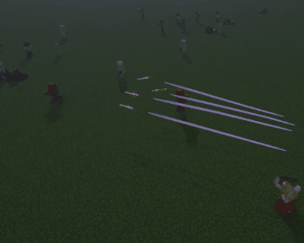
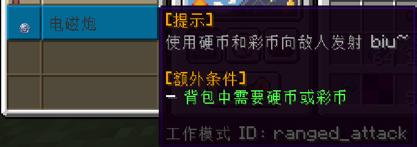
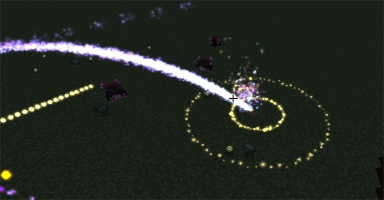
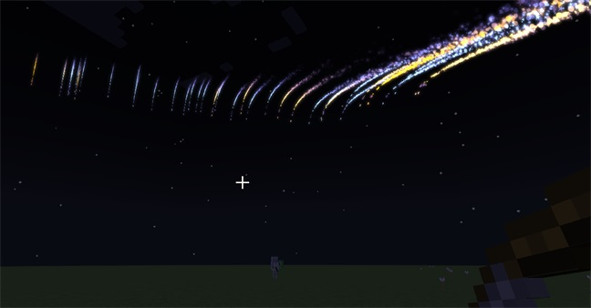

[toc]

## Items

### |  Flying Sword
---

* Left-click to fire **sword energy**.
* Press **B** to summon / dismiss **2 flying swords**.
* Right-click to summon; it automatically attacks monsters within 15 blocks of the player. Every 10 attacks, **1 point of saturation** is consumed.
* Damage scales with the player's attack power.

### |  True Flying Sword (v0.0.3)
---

* Left-click to fire **sword energy**.
* Right-click and hold to charge and unleash a **Iaido Slash** (consumes 2 saturation).
* Press **V** to unleash **Dimensional Slash** (consumes 2 saturation).
* Press **B** to summon / dismiss **5 flying swords** (consumes 2 saturation).

 

### |  Coin
---

* Right-click to use; consumes **1 coin** per use.
* Compatible with Touhou Little Maid — place it in the maid's inventory and switch her working mode to "Railgun".

 

### |  Colorful Coin
---

* Right-click to use; consumes **durability** instead of the item itself.
* Compatible with Touhou Little Maid.
* Can break terrain (configurable in the config file). Does **not** break claimed land from FTB Chunks.
* Enchantable:
  * **Quick Charge**: Reduces charge time by 20% per level.
  * **Power**: Increases damage by 25% per level.
  * **Unbreaking**: Reduces durability consumption.
  * **Mending**: Works as in vanilla Minecraft.

 

 

### |  Magic Bow (v0.0.2)
---

* Arrows shot from this bow have **particle trails**.
* 30% chance to **immobilize** the enemy on hit, rendering them unable to move.
* Enchantable:
  * **Quick Charge**: Reduces charge time by 20% per level.
  * **Auto-Fire**: Automatically shoots when fully charged.
  * **Auto-Tracking**: Locks onto an enemy while aiming; the arrow homes in on the locked target when fired.
  * **Star Judgment**: 5% chance on hit to summon a magic circle dealing AoE damage.
  * Others: Same as vanilla bow enchantments.
* Many parameters can be adjusted in the config file.

  

 

### |  Glittering Fruit (v0.0.4)
---

* Eating grants a **30-second buff**.
* Buff effects:
  * Immune to most damage.
  * Press **Alt** to teleport forward.
  * Hold **Ctrl** to fly faster.
  * Afraid of water — entering water **clears the buff**.

 

### |  Thunder Halberd (v0.0.5)
---

* Throwing the halberd **summons lightning**.
* Enchantable:
  * **Lightning Strike**: Deals continuous damage after throwing.
  * **Heaven's Thunder**: Hold **V** to summon area lightning.

 

## |  Configuration
---

* Path: `config/Akatzumatool/akatzumatool.toml`
* Modify damage values, enable/disable terrain destruction, configure damage whitelist, etc.
* Entity damage whitelist:
  * `whitelist = ["touhou_little_maid:maid", "minecraft:cat"]`
  * The maid is whitelisted by default and will **not** take damage from this mod's projectiles.
  * Use the CraftTweaker mod to look up entity registry names.
