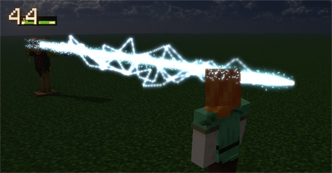
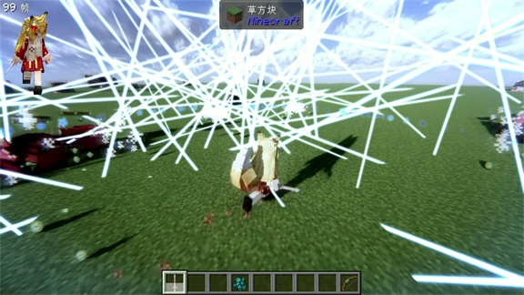
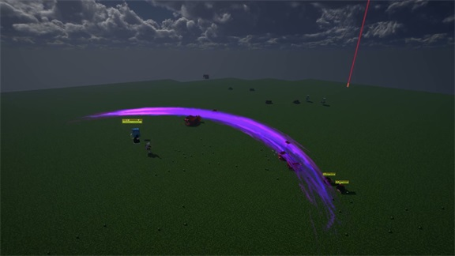

# AkatZumaTool Wiki

**本模组所代码使用AI生成**
**This mod's code is generated by AI**

作者：[5中生有](https://center.mcmod.cn/60332/) 、AkatZuma、[くじょう-アイ](https://center.mcmod.cn/131109/)

> 一个 Minecraft 魔法 模组。
> A magic mod for Minecraft.

---

## 语言 / Language

| 语言 | 入口 |
|------|------|
| 🇨🇳 **简体中文** | [中文文档](./zh_cn/zh_cn.md) |
| 🇺🇸 **English** | [English Docs](./en_us/en_us.md) |

---

 
 
 
 
---

---

### WIKI和建议反馈：[Github](https://github.com/misako227/AkatZumaToolWiki)

## License

本项目基于 **GPL-3.0** 协议开源，详见 [LICENSE.txt](LICENSE.txt)。

---

## 谢谢您的支持 / Thanks for your support!

✨[ifdian](https://ifdian.net/a/zzZ227)

